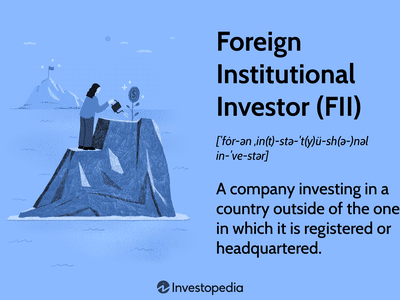

Foreign Institutional Investors (FIIs) are key players in the global financial markets, significantly influencing capital flows and market dynamics. FIIs encompass a variety of investment entities, including mutual funds, pension funds, insurance companies, and sovereign wealth funds, among others. They invest considerable amounts of capital into foreign markets, thus playing an integral role in the globalization of capital and the integration of international financial markets.

The significance of FIIs extends to their impact on emerging market economies. These economies often rely on foreign investment to supplement domestic capital formation, enhance liquidity, and foster economic growth. FII investments can lead to increased market efficiency, improved corporate governance, and greater access to international best practices in these markets. However, the flow of FII investments can also introduce volatility, as these investors tend to react swiftly to economic and political changes, thereby affecting local stock prices and market dynamics. For instance, sudden withdrawals by FIIs can result in capital flight, adversely impacting currency stability and financial market conditions. 

Driven by the quest for efficient trading and portfolio management, FIIs frequently employ algorithmic trading strategies. Algorithmic trading harnesses computer programs to execute orders at speeds and frequencies that are beyond human capabilities. This technique enables FIIs to manage trades with precision, reduce transaction costs, and capitalize on minute market inefficiencies. By utilizing predefined criteria and mathematical models, algorithmic trading assists FIIs in making swift and informed investment decisions, which can amplify their influence on market movements. Although beneficial, algorithmic trading also entails risks, such as the potential for increased market volatility and systemic risks stemming from technical glitches or errant algorithms.

In summary, Foreign Institutional Investors play a pivotal role in shaping global market landscapes, particularly in the context of emerging economies. Their use of sophisticated trading technologies like algorithmic trading further enhances their market influence, posing both opportunities and challenges for market stability and regulatory frameworks.

## Table of Contents

## Defining Foreign Institutional Investors (FIIs)

Foreign Institutional Investors (FIIs) are institutional investors that invest in the financial markets of a foreign country. They typically include entities such as mutual funds, insurance companies, pension funds, hedge funds, investment banks, and other financial institutions that pool substantial amounts of money to invest in assets across overseas markets. The primary functions of FIIs are to diversify investment portfolios and seek higher returns in foreign markets, which often present opportunities not available in domestic markets.

Examples of entities that qualify as FIIs encompass a broad range of financial organizations. Mutual funds, for instance, are investment vehicles that pool money from numerous investors to purchase securities. Pension funds, which manage retirement savings and aim to provide retirees a stable income, often seek international exposure to safeguard and grow their funds. Similarly, insurance companies, which manage large pools of premium-generated funds to cover future claims, often invest overseas for diversification and increased yield prospects.

Regulatory requirements for FIIs are critical to ensuring market stability and transparency. These investors are subject to specific guidelines that vary across different countries, designed to monitor their actions and limit any adverse effects on local financial systems. Taking India as an example, the Securities and Exchange Board of India (SEBI) regulates FIIs. SEBI mandates that FIIs register with the board to gain approval to invest in Indian securities, as detailed in the SEBI (Foreign Institutional Investors) Regulations, 1995. These regulations ensure FIIs adhere to prescribed investment limits for equity and debt securities, maintain transparency in transactions, and follow tax compliance norms.

In conclusion, FIIs play a significant role in global financial markets by channeling foreign capital into the host economy, which can facilitate development and economic growth. However, their activities and impact are closely monitored by regulatory bodies to maintain a balanced approach that supports market integrity while allowing the economy to benefit from foreign investments.

## Examples of FII Entities

Foreign Institutional Investors (FIIs) play a critical role in global financial markets by providing [liquidity](/wiki/liquidity-risk-premium) and facilitating capital flow across borders. Several well-known financial institutions serve as major FII entities, including Citigroup, HSBC, and Merrill Lynch. This section profiles these entities, discusses the sectors and regions they typically invest in, and highlights differences in their investment strategies.

### Major FII Entities

#### Citigroup
Citigroup is a leading global financial services corporation with operations in more than 160 countries. As an FII, Citigroup targets diverse sectors, including financial services, technology, and consumer goods. The institution's investment choices are often influenced by its objective to achieve geographical diversification and capitalize on emerging market growth. Citigroup's strategy generally leans towards leveraging its global presence to identify undervalued assets in emerging economies, especially in Asia and Latin America.

#### HSBC
HSBC Holdings plc stands as one of the largest banking and financial services organizations in the world. The bank primarily focuses on sectors such as finance, energy, and healthcare. HSBC's investments are often concentrated in regions where it has a significant operational presence, including Europe, Asia-Pacific, and the Middle East. The bank’s strategy typically emphasizes sustainable and long-term growth opportunities, often aligning with regional economic development plans and infrastructure projects.

#### Merrill Lynch
A subsidiary of Bank of America, Merrill Lynch is known for its substantial investments in both established and emerging markets. The institution shows a preference for technology, healthcare, and industrial sectors. Merrill Lynch employs a tactical investment strategy that often involves taking advantage of short- to medium-term market inefficiencies. This approach includes both speculative trading and long-term capital investments, balancing risks with potential rewards in various global contexts.

### Regional and Sectoral Preferences

These entities’ preferences for specific sectors and regions can be attributed to multiple factors, including economic growth prospects, regulatory environments, and market stability. For instance, technological advancements and a vast consumer base in Asia have made it a lucrative target for investment. Meanwhile, sectors like renewable energy and infrastructure in emerging markets attract investments due to their long-term growth potential and alignment with global sustainability trends.

### Differences in Investment Strategy

Investment strategies among these FIIs can vary significantly based on their corporate goals, risk tolerance, and market outlook. 

- **Citigroup** tends to pursue geographical and sectoral diversification, minimizing risk by spreading capital across various emerging markets.
- **HSBC** focuses on alignment with sustainable development goals, often channeling funds into projects that offer societal impacts alongside financial returns.
- **Merrill Lynch**, on the other hand, capitalizes on short-term market movements to maximize returns quickly, although it also maintains long-term positions in growth sectors.

Understanding the different strategies employed by FIIs like Citigroup, HSBC, and Merrill Lynch is crucial for market analysts and investors seeking to predict market trends and make informed investment decisions. It highlights the nuanced approaches each entity takes to navigate the complexities of international markets, driven by factors such as sector potential, economic conditions, and regulatory landscapes.

## The Role of Algorithmic Trading in FII Operations

Algorithmic trading, often termed algo trading, refers to the use of computer programs and algorithms to execute trades at speeds and frequencies that are impossible for a human trader. These algorithms make decisions about the timing, price, and quantity of orders based on predefined rules and market conditions. For Foreign Institutional Investors (FIIs), [algorithmic trading](/wiki/algorithmic-trading) provides a crucial tool in their investment strategies, enabling them to manage substantial capital flows with precision and efficiency.

FIIs utilize algorithmic trading to optimize their operations in several ways. Primarily, algorithms allow FIIs to process vast amounts of data rapidly and execute trades in milliseconds, which is considerably faster than manual execution. This speed advantage minimizes the market impact of large trades, as orders can be broken down into smaller chunks and executed over time to avoid significant price shifts. Additionally, algorithms enable FIIs to exploit short-lived market inefficiencies, thus enhancing their potential returns.

The advantages of algorithmic trading for FIIs are numerous. Besides speed and efficiency, algorithms offer increased accuracy in trade execution and the ability to back-test trading strategies over historical data. This can refine strategies and improve predictive accuracy. Moreover, algorithmic trading can operate continuously without fatigue, maintaining consistent performance across different market conditions and time zones.

However, algorithmic trading is not without its risks and challenges. One of the primary concerns is the potential for algorithms to act on erroneous data or malfunction, leading to large, unintended trades that can disrupt markets, as seen in past "flash crashes." Furthermore, the competitive environment among institutional investors has led to complex strategies that can sometimes result in unpredictable market behaviors. Regulatory challenges also persist, as markets and policymakers strive to keep up with rapid advancements in trading technology, balancing innovation with market integrity.

In summary, while algorithmic trading enhances the speed and efficiency of FII operations and offers significant advantages, it also carries inherent risks that require careful management and regulatory oversight.

## Impact of FII Investments on Stock Markets

Foreign Institutional Investors (FIIs) play a critical role in stock markets, particularly through their capacity to influence stock prices and market [volatility](/wiki/volatility-trading-strategies). Their investment activities can initiate changes in the financial landscape, affecting both developed and emerging markets.

### Influence on Stock Prices and Market Volatility

When FIIs inject capital into a stock market, it often leads to a rise in stock prices. This is primarily due to increased demand for the shares in which these investors invest. The law of supply and demand suggests that with increased demand and limited supply, prices are likely to rise. Conversely, when FIIs withdraw investments, it can trigger a decline in stock prices, as the decrease in demand may lead to selling pressure.

Market volatility is also affected by FII activities. Large-scale buying or selling by FIIs can lead to significant fluctuations in stock prices. This volatility is largely attributed to the substantial volumes of trades executed by these investors. For example, in emerging markets, where the trading volumes are generally lower than in developed markets, FII activities can cause pronounced swings in market indices.

### Examples of Market Reactions

In regions like India, FIIs have historically had a profound impact. FII inflows have been associated with bullish trends in the Indian stock market, such as the Sensex and Nifty indices, spurring growth in various sectors like financial services, information technology, and consumer goods. Conversely, periods of FII withdrawal have led to noticeable downturns. For instance, the global financial crisis of 2008 saw significant FII outflows from Indian equities, leading to sharp declines in stock prices and heightened volatility.

### Impact of Withdrawals on Local Stock Markets

FII withdrawals can have cascading effects on local stock markets. When FIIs pull out, there is often a liquidity crunch, as these investors typically handle large sums. This reduction in available capital can lead to lower trading volumes and higher volatility, making it challenging for local markets to maintain stability.

Moreover, significant FII withdrawals can erode investor confidence, leading to panic selling among local investors, further aggravating price declines. In some cases, sudden FII exits can trigger systemic risks, especially in markets that rely heavily on foreign investments for economic growth and stability.

### Conclusion

The impact of FII investments on stock markets is profound and multifaceted. By influencing stock prices and driving market volatility, FIIs play a crucial role in shaping the financial environments of the countries in which they invest. Understanding and tracking their investment patterns can provide valuable insights for investors aiming to navigate the complexities of the global financial markets.

## Economic Implications of FII Activity

Foreign Institutional Investors (FIIs) play a critical role in influencing the economic landscape of countries, particularly through their impacts on currency stability and capital flow. Their investment activities can have profound effects on a country's economy, impacting both short-term market dynamics and long-term economic development.

### Currency Stability and Capital Flow

FIIs are significant players in the global financial markets, and their investment decisions can lead to substantial inflows or outflows of capital in the countries they target. When FIIs invest heavily in a country's stock market, it often leads to an appreciation of the local currency due to increased demand. This is because FIIs must convert their foreign capital into local currency to invest. Conversely, a large withdrawal of FII funds can lead to a depreciation of the local currency as the demand for conversion back to the FIIs' original currency increases.

The impacts of these movements can be represented mathematically. For instance, the exchange rate $E$ between two currencies can be influenced by the flow of FII, represented as $F$. This relationship can be approximately modeled as:
$$
E_t = E_{t-1} + \alpha F_t
$$
where $\alpha$ is a coefficient representing sensitivity of the exchange rate to changes in FII flows, and $t$ is the time index.

Significant FII movements can contribute to currency volatility, affecting import and export dynamics, inflation rates, and the broader economic stability.

### Policy Implications

Governments often face a dichotomy between attracting FII for its benefits, such as increased liquidity and improved investment in infrastructure, versus managing the potential economic instability caused by volatile capital flows. Policies that attract FII include offering tax incentives, ensuring political stability, and maintaining transparent financial regulations. However, these must be balanced with measures to mitigate potential negative consequences, such as sudden capital withdrawal and resultant economic crises.

For instance, the Indian government has occasionally modified its tax structures and foreign investment caps to attract more FII, while also imposing certain restrictions or industries limitations to ensure stability.

### Regulatory Framework

Different countries have established regulations to manage the activities of FIIs to protect their economic interests. These regulations can include registration requirements, investment ceilings, and sector-specific restrictions. For example, in India, FIIs must register with the Securities and Exchange Board of India (SEBI) and are subject to sectoral caps on their investments. Additionally, liquidity and transparency requirements are often enforced to ensure that FII activities align with national economic policies.

In conclusion, while FIIs can contribute significantly to the development and growth of a host country's economy, their potential to cause economic instability necessitates a carefully balanced approach in attracting and regulating their activities. Countries must implement robust policy frameworks and regulatory measures to leverage the benefits of FII investments while safeguarding against possible risks.

## Tracking and Analyzing FII Trends

To effectively track and analyze Foreign Institutional Investor (FII) trends, several tools and techniques are essential for both individual and institutional investors. These methods enhance decision-making processes by providing valuable insights into FII activities in stock markets.

### Monitoring Tools and Techniques

1. **Financial News Platforms**: Platforms such as Bloomberg, Reuters, and CNBC offer real-time updates on FII activities. These services provide news alerts, market analysis, and expert commentary, which are crucial for understanding the implications of FII movements.

2. **Market Analytics Software**: Various software solutions offer detailed market analytics which include FII data. Tools like Bloomberg Terminal and Thomson Reuters Eikon provide comprehensive analytics, enabling investors to track inflow and outflow patterns, as well as sectoral investments attributed to FIIs.

3. **Stock Exchange Reports**: Stock exchanges often release periodic reports on FII activities. These reports include data on trading volumes, net investment figures, and market participation details, which are vital for identifying trends and shifts in FII strategies.

4. **Central Banks and Regulatory Bodies**: Many countries' central banks and regulatory commissions, such as the Securities and Exchange Board of India (SEBI), publish reports and data on FII activities. These documents provide insights into regulatory changes and official statistics on FII participation.

### Informing Investment Decisions

Individual and institutional investors can harness FII data to guide their investment strategies:

- **Trend Analysis**: By analyzing patterns in FII investments, investors can anticipate potential market movements. An increase in FII investments might signal confidence in a particular sector or region, prompting strategic positioning in anticipation of rising stock prices.

- **Risk Assessment**: Monitoring FII withdrawals can serve as an early warning signal for market downturns. Sudden or large-scale exits can lead to increased volatility, suggesting potential risks that investors should mitigate.

- **Portfolio Diversification**: Understanding which sectors are favored by FIIs can aid in diversifying portfolios. If FIIs are concentrating their investments in emerging technologies or sustainable energy, investors might consider these sectors for balance.

### Role of Technology and Online Platforms

Technological advancements and online platforms play a critical role in delivering real-time FII insights:

- **Algorithmic Analysis**: Modern algorithms can process vast amounts of financial data to detect investment patterns and predict trends. Python libraries such as Pandas and NumPy are extensively used for data manipulation and analysis.

- **Online Trading Platforms**: Platforms like E*TRADE, Interactive Brokers, and Robinhood provide users with access to FII data and tools for monitoring market trends. These platforms often feature alerts for significant FII activity, enabling timely investment decisions.

- **Data Visualization Tools**: Tools like Tableau and Power BI allow users to create dynamic visualizations of FII trends, enabling a clearer understanding of market data and faster decision-making processes.

By leveraging these tools and techniques, investors can gain a better understanding of FII activities, enhance their investment strategies, and adjust their portfolios in response to changes in the market landscape. Staying informed about FII movements is crucial for optimizing returns and minimizing risks in increasingly interconnected global markets.

## Conclusion

Foreign Institutional Investors (FIIs) play a crucial role in shaping global financial markets, especially in emerging economies. Their ability to mobilize large volumes of capital makes them influential in determining stock prices and market trends. As highlighted throughout this article, FIIs, by participating in markets like India, not only drive equity markets but also impact currency stability and capital flows.

Algorithmic trading, often employed by FIIs, enhances their operational efficiency and speed but also introduces risks that need careful management. The market reactions to FII movements can be significant, making it essential for both individual and institutional investors to monitor these activities closely. Staying informed about FII trends offers a strategic advantage, allowing for better prediction of market movements and informed investment decisions.

Understanding the regulatory landscape governing FIIs is equally important. Regulations can profoundly affect FII activities, influencing their investment strategies and economic implications. Thus, keeping abreast of policy changes in different countries allows investors to adapt and mitigate potential risks effectively.

In conclusion, FIIs are pivotal in markets worldwide, and their influence continually shapes economic trajectories. An informed approach, leveraging real-time data and understanding regulatory environments, will enable investors to navigate the complexities introduced by FII activities effectively. Regularly updating one's knowledge on FII policies and regulations is crucial for optimizing investment strategies and ensuring long-term economic stability.

## References & Further Reading

[1]: ["Foreign Institutional Investments in India: Market Trends and Impact"](https://www.researchgate.net/publication/310441926_A_STUDY_INTO_THE_TRENDS_IN_FOREIGN_INSTITUTIONAL_INVESTMENTS_FIIs_AND_ITS_IMPACT_ON_INDIAN_STOCK_MARKET_PRICES) - An article from Economic and Political Weekly discussing the trends and effects of FII in India.

[2]: Cheng, H., & Zhang, Z. (2009). ["The Role of Institutional Investors in Financial Markets."](https://www.sciencedirect.com/science/article/pii/S0929119920302777) In "Studies in Computational Intelligence," discusses the influence and strategies of institutional investors.

[3]: "Algorithmic Trading and DMA: An Introduction to Direct Access Trading Strategies" by Barry Johnson - A resource book providing insights into algorithmic trading practices.

[4]: Agarwal, S., Faircloth, S., Liu, C., & Ghon Rhee, S. (2009). ["Why Do Foreign Institutional Investors Underperform Domestic Investors in Trading Activities? Evidence from Indonesia."](https://papers.ssrn.com/sol3/papers.cfm?abstract_id=960370) - An academic paper on the performance of FIIs.

[5]: "The Alchemy of Finance" by George Soros - Although not directly about FIIs, this book provides useful context on investment strategies and market behaviors that are relevant for institutional investors.

[6]: "The Impact of Algorithmic Trading on Markets" - Reports from financial authorities such as the SEC or academic journals provide analysis and data on the role of algorithmic trading in financial markets.