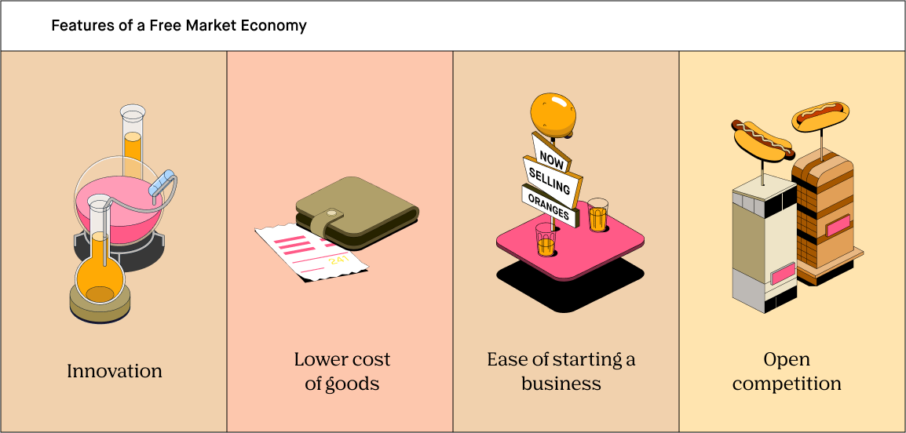

## Table of Contents

## What is a free market economy?

A free market economy is a type of economic system where the prices for goods and services are determined by the open market and its consumers. In this system, people and businesses can buy and sell freely, without much control from the government. The idea is that if people can choose what they want to buy and sell, it will lead to a fair and efficient economy. Supply and demand play a big role in deciding prices. If a lot of people want something, the price goes up. If not many people want it, the price goes down.

However, a free market economy is not completely free from government influence. Governments can set some rules to make sure businesses do not cheat or harm people. For example, they might make laws about safety or the environment. The goal is to balance freedom with fairness. While a free market can lead to growth and innovation, it can also cause problems like inequality and instability if not managed well. So, many countries use a mix of free market and government control to try and get the best of both worlds.

## What are the key characteristics of a free market economy?

In a free market economy, the main idea is that people and businesses can make their own choices about what to buy, sell, and produce. Prices for things like food, clothes, and services are set by how much people want them and how much is available. If lots of people want something, the price goes up. If not many people want it, the price goes down. This system encourages businesses to make things that people really want because they can make more money that way.

There's not much control from the government in a free market economy. The government might make some rules to keep things fair and safe, but they don't decide what should be made or how much it should cost. This freedom can lead to new ideas and inventions because businesses are always trying to come up with better ways to make money. However, it can also cause problems like big differences between rich and poor people, and sometimes the economy can become unstable if things are not watched carefully.

## Can you name some countries that are often cited as examples of free market economies?

Some countries that people often talk about when they discuss free market economies are the United States, Singapore, and Hong Kong. The United States has a big economy where businesses can start and grow with fewer rules than in many other places. This means people can buy and sell things more freely. Singapore and Hong Kong are small but very rich. They have rules that make it easy for businesses to work and for people to trade. These places are known for having strong free markets.

However, no country is a perfect example of a free market because governments everywhere make some rules. Even in these countries, the government steps in to make sure businesses follow certain laws, like ones about safety and the environment. So, while the United States, Singapore, and Hong Kong are often pointed to as good examples of free markets, they still have some government control to keep things balanced and fair.

## How does the United States exemplify a free market economy?

The United States is often seen as a good example of a free market economy because it lets businesses start and grow with fewer rules than many other places. People and companies can decide what they want to buy and sell without a lot of government control. This freedom helps businesses come up with new ideas and inventions because they are trying to make more money. The idea is that if people can choose what they want, it will lead to a fair and growing economy. For example, if a lot of people want to buy a new type of phone, the price might go up, but this also encourages other companies to make better phones to compete.

However, the U.S. government does step in to make sure things stay fair and safe. There are laws about things like safety, the environment, and making sure businesses don't cheat. These rules help balance the freedom of the market with the need to protect people and the planet. While the U.S. has a strong free market, it's not completely free because of these government rules. So, it's a mix where businesses have a lot of freedom, but the government makes sure the market doesn't get out of control.

## What role does Hong Kong play as a model of a free market economy?

Hong Kong is often used as an example of a free market economy because it has very few rules for businesses. This means companies can start and grow easily. People in Hong Kong can buy and sell things freely, which helps the economy grow. The government in Hong Kong doesn't tell businesses what to make or how much to charge. Instead, prices are decided by how much people want something and how much of it is available. This freedom has made Hong Kong a busy place for trade and business.

Even though Hong Kong is known for its free market, the government does have some rules to keep things fair and safe. For example, there are laws about safety and making sure businesses don't cheat. These rules help balance the freedom of the market with the need to protect people. So, while Hong Kong is a good example of a free market, it's not completely free because of these government controls. This mix helps Hong Kong stay a strong and stable place for business.

## How does Singapore's economy reflect free market principles?

Singapore's economy shows free market principles by letting businesses start and grow with fewer rules. The government in Singapore doesn't control what businesses should make or how much they should charge. Instead, prices go up or down based on what people want and how much is available. This freedom helps businesses come up with new ideas and inventions because they want to make more money. Singapore is known for being a good place for trade and business because of this.

However, the government in Singapore does make some rules to keep things fair and safe. There are laws about safety, the environment, and making sure businesses don't cheat. These rules help balance the freedom of the market with the need to protect people and the planet. So, while Singapore has a strong free market, it's not completely free because of these government controls. This mix helps Singapore stay a stable and prosperous place for business.

## What are the historical developments that led to the establishment of free market economies in these countries?

In the United States, the idea of a free market started to grow after the country became independent in 1776. People like Adam Smith, who wrote about the benefits of free markets, influenced early American thinkers. Over time, the U.S. government made laws that helped businesses grow without too many rules. Events like the Industrial Revolution in the 19th century made the economy grow fast because businesses could make things more easily and sell them to more people. Even though there were some big economic problems, like the Great Depression in the 1930s, the U.S. kept its focus on having a free market. Today, the U.S. is known for its strong free market, even though the government still makes some rules to keep things fair.

Hong Kong became a model of a free market after it was taken over by the British in the 19th century. The British set up a system with few rules for businesses, which helped Hong Kong grow into a busy place for trade. After World War II, Hong Kong's economy grew even more because it was a place where people could start businesses easily. When Hong Kong went back to China in 1997, it kept its free market system under the "one country, two systems" policy. This means Hong Kong still has its own rules and is known for being a free market economy.

Singapore's journey to a free market started after it became independent in 1965. The government, led by Lee Kuan Yew, wanted to make Singapore a place where businesses could grow easily. They made rules that helped trade and business, like low taxes and good infrastructure. Over the years, Singapore became known for being a good place to do business because of its free market system. Even though the government makes some rules to keep things fair and safe, Singapore's economy is still a strong example of a free market.

## What are the major criticisms of free market economies, using specific country examples?

One big problem people talk about with free market economies is that they can make the gap between rich and poor people bigger. In the United States, for example, some say that the free market lets rich people and big businesses get even richer while poor people stay poor. They argue that without enough rules from the government, companies can pay workers very little and charge high prices. This can make life hard for people who don't have a lot of money. Critics also say that in the U.S., healthcare and education can be very expensive because they are run like businesses, which can make it tough for regular people to get the help they need.

Another criticism is that free markets can sometimes cause big problems in the economy. In Hong Kong, for example, the free market system has led to very high housing prices because there are not enough rules to control how much people can charge for homes. This makes it hard for regular people to find a place to live. Critics say that without enough government control, the economy can become unstable, like what happened during the 2008 financial crisis in the U.S., where banks and businesses took big risks because they thought they could make a lot of money. When things went wrong, it caused a lot of problems for everyone.

In Singapore, while the free market has helped the economy grow a lot, some people worry that the government has too much power over the market. They say that the government's rules can favor certain businesses and make it hard for new companies to start. This can stop new ideas from coming up and keep the market from being as free as it could be. Critics also point out that in Singapore, the cost of living can be very high because of the free market, which can make life difficult for people who don't earn a lot of money.

## How do government regulations in free market economies like the U.S. affect market operations?

In the United States, government regulations play a big role in how the free market works. They help keep things fair and safe for everyone. For example, the government makes rules about how much pollution businesses can make to protect the environment. There are also laws that stop companies from cheating or treating workers badly. These rules can make it harder for businesses to do whatever they want, but they help make sure the market doesn't get out of control. Without these rules, big companies might take over and make life hard for regular people.

Even though the U.S. has a lot of freedom in its market, the government still steps in to fix problems. For instance, after the 2008 financial crisis, the government made new rules to stop banks from taking big risks that could hurt the whole economy. These rules can slow down how fast businesses grow, but they help keep the economy stable. So, while the U.S. is known for its free market, government regulations are important to balance freedom with fairness and safety.

## What are the impacts of free market economies on income inequality, with case studies from different countries?

Free market economies can make the difference between rich and poor people bigger. In the United States, for example, the free market lets businesses and rich people make a lot of money. But some people say this system doesn't help poor people as much. They argue that without enough rules from the government, companies can pay workers very little and charge high prices for things like healthcare and education. This makes life harder for people who don't have a lot of money. Studies show that in the U.S., the richest people have a lot more money than the poorest people, and this gap has been growing over time.

In Hong Kong, the free market has also led to more income inequality. The city is known for its high housing prices because there are not many rules to control how much people can charge for homes. This means that rich people can afford nice places to live, but poor people struggle to find a place. The free market has helped Hong Kong's economy grow, but it has also made life harder for people who don't earn a lot of money. The gap between rich and poor is very big, and many people feel that the free market system makes this problem worse.

In Singapore, the free market has helped the economy grow a lot, but it has also made income inequality bigger. The government has rules to help businesses grow, but some people say these rules can favor big companies and make it hard for new businesses to start. This can stop new ideas from coming up and keep the market from being as free as it could be. Also, the cost of living in Singapore is very high because of the free market, which can make life difficult for people who don't earn a lot of money. The gap between rich and poor is growing, and many people worry about this problem.

## How do free market economies adapt to global economic changes, using examples from recent economic crises?

Free market economies like the United States, Hong Kong, and Singapore have had to change a lot because of recent economic problems like the 2008 financial crisis and the economic effects of the COVID-19 pandemic. In the U.S., after the 2008 crisis, the government made new rules to stop banks from taking big risks that could hurt the whole economy. They also helped people and businesses that were struggling by giving them money. During the COVID-19 crisis, the U.S. government gave money to people who lost their jobs and helped businesses stay open. These actions showed that even in a free market, the government can step in to help when things get really bad.

Hong Kong and Singapore also had to adapt to these global changes. In Hong Kong, the government used money to help businesses and people during the 2008 crisis and the COVID-19 pandemic. They also tried to keep their economy open for trade, even when other countries were closing their borders. Singapore did something similar by giving money to people and businesses and making sure their economy stayed strong. Both places showed that while they believe in free markets, they can still use government help to deal with big economic problems.

## What advanced economic theories explain the successes and failures of free market economies in various countries?

One advanced economic theory that helps explain the successes and failures of free market economies is the theory of creative destruction, introduced by economist Joseph Schumpeter. This theory says that in a free market, old businesses and ways of doing things are always being replaced by new ones. This can lead to a lot of growth and new ideas because businesses are always trying to come up with better ways to make money. For example, in the United States, big tech companies like Apple and Google have changed the way we use technology, making the economy grow. But this theory also explains why free markets can fail. When old businesses go away, it can be hard for the people who worked there, and it can make the difference between rich and poor people bigger. This has been seen in the U.S., where some areas have been left behind as industries like manufacturing moved away.

Another theory is the concept of market failures, which explains why free markets don't always work perfectly. Sometimes, the market can't fix problems on its own, like pollution or not having enough competition. In these cases, the government needs to step in with rules to make things fair and safe. For example, in Singapore, the government makes rules to control pollution and help small businesses, which helps the free market work better. But if the government doesn't step in enough, like in Hong Kong with high housing prices, the market can fail and make life hard for people. These theories show that while free markets can lead to a lot of growth and new ideas, they also need some government help to make sure everyone benefits and the economy stays stable.

## References & Further Reading

[1]: The Heritage Foundation. ["Index of Economic Freedom."](https://www.heritage.org/index/)

[2]: Singapore Economic Development Board. ["Business Environment Overview."](https://www.edb.gov.sg/en/why-singapore/business-friendly-environment.html)

[3]: Switzerland Global Enterprise. ["Advanced Economies & Financial Systems."](https://report.s-ge.com/en)

[4]: Industrial Development Authority Ireland. ["IDA Ireland's Economic Performance."](https://www.idaireland.com/our-history)

[5]: Nordic Co-operation. ["Nordic Welfare Systems and Market Economies."](https://www.norden.org/en/information/social-policy-and-welfare)