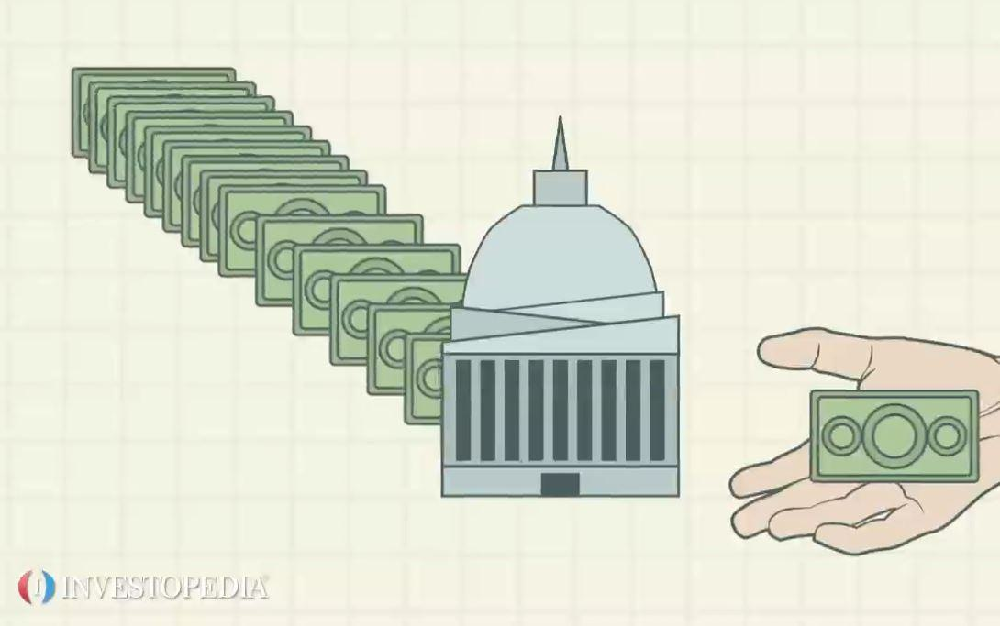

Understanding economic systems is crucial for grasping how countries manage and organize their resources. Among the diverse configurations that define global economies, a free market economy serves as a fundamental model characterized by minimal governmental intervention. In such a system, the forces of supply and demand predominantly dictate the production of goods and services, as well as labor market dynamics. This self-regulating nature fosters an environment where businesses and consumers can operate independently, making decisions based on individual preferences and market signals.

In this article, we explore the intricate nature of free market economies, investigating how they function within different national contexts. Countries like Singapore, Switzerland, and Ireland exemplify high economic freedom through their low taxation and regulatory frameworks. Additionally, the United States, despite being a mixed economy, displays significant traits of a free market through its robust private sector. Even nations with strong social systems, such as Sweden and Norway, demonstrate high degrees of economic freedom, highlighting the versatility and efficacy of free market principles.



An essential feature of free market economies is their capacity to promote entrepreneurial freedom and innovation. The protection of private property rights is fundamental in fostering business growth, as it provides individuals with the confidence to invest and innovate. Furthermore, minimal trade restrictions and fewer regulatory hurdles serve to encourage healthy competition, driving efficiency and consumer choice.

The advent of technology has further revolutionized free market systems, notably through the emergence of algorithmic trading (algo trading). This practice, which leverages complex algorithms to execute trades at tremendous speeds, underscores the sophisticated nature of advanced free market economies. Algorithmic trading not only enhances market liquidity and efficiency but also introduces challenges such as increased volatility and ethical considerations.

In exploring these facets, we aim to provide a comprehensive understanding of how free market economies operate and their impact on global economic development. We will also consider the role of governmental intervention in maintaining equitable competition and safety standards, ensuring that the benefits of economic freedom can be maximized while mitigating potential drawbacks.

## Table of Contents

## What is a Free Market Economy?

A free market economy is characterized by a self-regulating economic system where the forces of supply and demand dictate the production, distribution, and pricing of goods and services. In such an economy, competition operates as a central mechanism that ensures resources are allocated in the most efficient manner possible, with minimal government oversight. This approach facilitates innovation, efficiency, and consumer choice, as businesses vie to meet the needs and preferences of consumers to maximize profits.

The dynamics of supply and demand in a free market are essentially driven by the interactions between buyers and sellers. When the demand for a product increases, it typically leads to a rise in prices, incentivizing producers to increase supply. Conversely, when demand decreases, prices fall, prompting a reduction in supply. This ongoing interplay helps maintain market equilibrium, where the quantity of goods supplied matches the quantity demanded.

Despite the theoretical appeal of a completely uninhibited market, no nation operates on a purely free market economy. Instead, countries incorporate elements of free market principles within their mixed economies. For example, while the United States is often cited for its capitalist orientation, it encompasses various forms of government intervention, such as antitrust laws and regulatory agencies, to address market failures and protect public interests.

The concept of a free market economy highlights the importance of limited government intervention, emphasizing the role of competition and consumer choice in shaping economic outcomes. While the ideal of a wholly unregulated market is practically unattainable, the integration of free market elements within broader economic systems continues to influence how economies are structured and managed globally.

## Examples of Free Market Economies

Singapore, Switzerland, and Ireland are often cited as leading examples of free market economies, each exhibiting high levels of economic freedom characterized by low taxation and minimal regulatory obstacles. This framework fosters competitive environments conducive to business growth and innovation.

Singapore is recognized globally for its robust free market economy, ranking consistently at the top of economic freedom indices. The country maintains a pro-business climate through an efficient regulatory framework, open trade policies, and a favorable tax regime. These factors collectively support a dynamic entrepreneurial sector and high levels of foreign direct investment (FDI) [1]. Furthermore, the absence of currency restrictions and the country's strategic geographic location make it an attractive hub for international business operations.

Switzerland, another exemplar of free market principles, combines an advanced service sector, particularly in finance, with a strong manufacturing base. The nation's economic success is partly attributed to its political stability, transparent legal system, and limited government interference in business operations. With a reputation for protecting private property rights and advocating for competitive market policies, Switzerland encourages both domestic and foreign enterprises to thrive [2]. Moreover, its decentralized political system allows for localized economic decision-making, further contributing to its economic resilience.

Ireland has emerged as a prominent player among free market economies due to its business-friendly policies and open trade environment. Known for its low corporate tax rates, Ireland attracts substantial FDI, fostering a vibrant technology and pharmaceutical sectors. The country benefits from a highly skilled labor force and strong educational institutions, which underpin its economic competitiveness [3]. Ireland's integration into the European Union also provides access to broader markets, bolstering its free trade capacity.

The United States is an archetype of a mixed economy but displays significant free market traits, most notably the dominance of the private sector in economic activities. The U.S. economy thrives on entrepreneurial ventures, innovation, and a flexible labor market, which collectively drive its economic efficiency and global competitiveness. The U.S. government's regulatory stance generally favors competitive markets, although regulations exist to ensure consumer protection and fair competition [4].

Interestingly, even social welfare states like Sweden and Norway, known for comprehensive social systems, exhibit high levels of economic freedom. These countries successfully integrate free market principles with robust social policies. Sweden, for instance, leverages open trade, minimal regulatory barriers, and innovative industrial policies to maintain economic dynamism while ensuring a strong social safety net for its citizens. Norway's wealth is bolstered by its strategic management of natural resources alongside an agile private sector, allowing for economic wealth distribution without compromising on individual enterprise freedoms [5].

These nations illustrate that diverse economic systems can successfully incorporate free market principles, each adapting these ideologies to fit their unique political, cultural, and economic contexts.

References:
1. Singapore Economic Development Board. "Business Environment Overview." EDB.
2. Switzerland Global Enterprise. "Advanced Economies & Financial Systems."
3. Industrial Development Authority Ireland. "Ireland's Economic Performance."
4. U.S. Department of Commerce. "Economic Statistics and Analysis."
5. Nordic Co-operation. "Nordic Welfare Systems and Market Economies."

## Key Characteristics of Free Market Economies

A free market economy is characterized by several defining attributes that contribute to its efficiency and dynamism. Central to these characteristics is the promotion of entrepreneurial freedom and innovation, which serve as fundamental drivers of economic progress. In a free market system, individuals and businesses have the liberty to pursue new ideas, create products, and provide services without undue restraint. This environment of minimal interference encourages the emergence of entrepreneurs who are willing to take risks in search of potential rewards, thereby stimulating economic growth and technological advancement.

Private property rights represent another cornerstone of free market economies. In such systems, property rights are robustly protected, ensuring that individuals and corporations can securely own and utilize their assets. This assurance fosters an environment where businesses can invest in development and infrastructure with confidence, knowing that their rights to future profits and assets are safeguarded. The protection of private property rights thus acts as an incentive for investment, which in turn spurs economic development and innovation.

The existence of minimal trade restrictions and reduced regulatory hurdles also underpins the effectiveness of free market economies. By lowering barriers to entry and reducing bureaucratic red tape, these systems create a competitive marketplace where businesses can operate more freely and effectively. This competitive environment drives businesses to enhance their efficiency, reduce costs, and improve product quality to succeed in the marketplace. As a consequence, consumers benefit from a greater variety of choices and better goods and services at competitive prices.

A practical example of the dynamics of a free market can be illustrated using a simple Python simulation of supply and demand interaction:

```python
import matplotlib.pyplot as plt
import numpy as np

# Define price range
prices = np.linspace(0, 100, 200)

# Supply and demand functions
def supply(price):
    return price * 1.5

def demand(price):
    return 150 - price * 2

# Calculate quantities
supply_quantities = supply(prices)
demand_quantities = demand(prices)

# Plot
plt.plot(prices, supply_quantities, label='Supply')
plt.plot(prices, demand_quantities, label='Demand')
plt.xlabel('Price')
plt.ylabel('Quantity')
plt.title('Supply and Demand in a Free Market')
plt.axvline(color='gray', linestyle='--')  # Point of equilibrium
plt.axhline(color='gray', linestyle='--')  # Point of equilibrium
plt.legend()
plt.show()
```

This code generates a basic supply and demand graph typical of free market operations, showcasing the point of equilibrium where supply equals demand. This intersection is a fundamental concept illustrating how prices are determined in free market systems.

In summary, the key characteristics of free market economies—including entrepreneurial freedom, the protection of private property rights, and minimal trade restrictions—collectively support a framework that encourages economic activity, promotes innovation, and drives efficiency across industries.

## Algo Trading in Free Market Economies

Algorithmic trading, often referred to as algo trading, has emerged as a substantial component within free market economies, leveraging technology to optimize the execution of trades. Algo trading employs sophisticated algorithms to execute trades at speeds and volumes that transcend human capability. By analyzing market data in real time, these algorithms make decisions based on predefined criteria. This technological advancement enhances the [liquidity](/wiki/liquidity-risk-premium) and efficiency of financial markets, playing a critical role in their operational effectiveness.

### Liquidity and Efficiency in Financial Markets

Algo trading significantly contributes to market liquidity, which refers to the ease with which assets can be bought and sold without causing drastic price changes. The presence of algorithmic traders in the market ensures a higher number of available buy and sell orders, leading to tighter bid-ask spreads. This not only facilitates smoother transactions for all market participants but also contributes to price discovery—the process by which markets determine the price of an asset.

In terms of efficiency, [algorithmic trading](/wiki/algorithmic-trading) streamlines the execution process, reducing the time it takes to [carry](/wiki/carry-trading) out transactions and minimizing transaction costs. The use of algorithms allows for the execution of complex trading strategies that would be too intricate and time-consuming for manual execution. These strategies can include [arbitrage](/wiki/arbitrage), [trend following](/wiki/trend-following), and market-making.

### Challenges: Market Volatility and Ethical Concerns

Despite its benefits, algorithmic trading is not without challenges. One of the primary issues is market [volatility](/wiki/volatility-trading-strategies). The speed and [volume](/wiki/volume-trading-strategy) of trades executed by algorithms can amplify market movements. For instance, during periods of high market stress, algorithms might exacerbate price swings, leading to sharp fluctuations that deviate from the expected market behavior. The 2010 Flash Crash is an example where algo trading was implicated in the sudden and severe market downturn.

Ethical concerns also arise with the advent of algorithmic trading. One concern involves the fairness of markets. High-frequency trading ([HFT](/wiki/high-frequency-trading-strategies)), a subset of algo trading, is accessible primarily to large financial institutions with substantial resources. This creates an uneven playing field, where these institutions can exploit fleeting market opportunities that are unavailable to smaller investors. Additionally, the opacity of algorithmic decision-making processes poses a risk of market manipulation and raises questions about accountability.

Despite these challenges, algorithmic trading continues to be an integral part of free market economies. Its contributions to market liquidity and efficiency, while navigating ethical implications and volatile conditions, represent the complexities and the transformative impact of technology in modern financial markets.

## Economic Systems: Market Examples

Market economies emphasize the role of rational self-interest as a fundamental element driving economic growth. In such systems, individuals and businesses operate with the liberty to pursue their economic goals, which in turn spurs innovation, efficiency, and wealth creation. The idea of rational self-interest is founded on the principle that individuals tend to make decisions that maximize their utility, thereby contributing to overall economic progress.

One of the primary indicators used to assess a country's market freedom is the Heritage Foundation's Index of Economic Freedom. This comprehensive index evaluates economic freedom based on twelve quantitative and qualitative factors, grouped into four broad categories: rule of law, government size, regulatory efficiency, and open markets. By analyzing these factors, the index provides insights into the level of regulatory efficiency and openness of a nation's economy.

Countries that consistently rank high on the Index of Economic Freedom are noted for their robust business environments and minimal government interference. These top-ranking countries typically exhibit characteristics such as high business freedom, ease of starting and operating a business, and low levels of corruption. Singapore and Switzerland, for example, are known for their efficient legal frameworks, secure property rights, and transparent regulatory processes, contributing to their high market freedom scores.

In contrast, nations with lower scores often struggle with pervasive bureaucratic obstacles, restrictive policies, and higher corruption levels that impede economic growth. These impediments can result in inefficient markets where businesses face substantial barriers to entry and expansion.

The correlation between market freedom and economic prosperity underscores the importance of maintaining economic environments that promote entrepreneurial activity and protect individual liberties. In practice, this means implementing policies that streamline regulatory processes, enforce property rights, and ensure the rule of law, thus fostering an economic climate conducive to sustained growth and development.

Evaluating a country's economic system through the lens of market freedom helps policymakers and economists understand the impact of regulatory frameworks on economic performance. By prioritizing economic freedom, societies can create an environment where rational self-interest aligns with broader economic objectives, ultimately enhancing prosperity for all.

## The Role of Government in Free Market Economies

Governments play a pivotal role in ensuring that free market economies function effectively and fairly. One of their primary responsibilities is to uphold competition through the implementation of antitrust laws and regulations. These laws are designed to prevent monopolies and promote competition by prohibiting practices that restrain trade or abuse market dominance. By doing so, governments can prevent companies from exploiting their market power, ensuring that consumers have access to a variety of choices and that prices reflect competitive market conditions.

Moreover, governments set minimum safety standards and protect consumer rights, which are essential components of a healthy free market economy. Safety standards, particularly in industries such as food, pharmaceuticals, and manufacturing, ensure that products meet certain criteria before reaching consumers. These standards help prevent harm to consumers and maintain public trust in market offerings. Consumer protection laws, on the other hand, safeguard buyers from unfair business practices and ensure transparency in transactions. This involves protecting consumer data, preventing false advertising, and ensuring that products comply with safety regulations.

The challenge for governments in free market economies is to strike the right balance between regulation and economic freedom. Excessive regulation can stifle innovation, limit business expansion, and reduce the efficiency of markets. Conversely, too little regulation can lead to negative outcomes such as market failures, where resources are not efficiently allocated. This delicate balance is critical to maintaining market efficiency, as it allows businesses to thrive while ensuring that competition remains fair and consumers are protected.

Ultimately, the role of government in free market economies extends beyond mere regulation. It involves creating an environment where businesses can innovate and grow, while also ensuring that the principles of fairness and consumer protection are upheld. This balance is fundamental to the long-term success and sustainability of free market economies.

## Conclusion

Free market economies are pivotal to global economic dynamics, primarily because they promote innovation and efficiency through competitive markets. These systems are characterized by minimal government intervention, allowing the forces of supply and demand to dictate economic activities. This environment spurs businesses to innovate continuously to maintain or enhance their competitive edge, leading to overall economic growth.

Despite their advantages, free market economies face inherent challenges. One significant issue is economic inequality, as unfettered markets often result in wealth concentration within a small segment of the population. Market failures, such as externalities and public goods, also pose challenges, necessitating some level of government intervention to correct inefficiencies and ensure equitable outcomes.

Nevertheless, understanding the mechanics of free market economies, alongside the influence of algorithmic trading, is crucial for navigating the complexities of modern markets. Algorithmic trading, a hallmark of advanced economic systems, enhances liquidity and market efficiency by executing trades at lightning speed using sophisticated algorithms. However, this advancement also introduces concerns about market volatility and ethical considerations, highlighting the need for balanced regulation.

The ongoing interplay between innovation, market efficiency, and regulatory oversight underscores the importance of these economies as drivers of economic development. By fostering a climate where businesses can thrive and competition is fair, free market systems continue to shape the economic landscape, driving both local and global progress.

## References & Further Reading

[1]: The Heritage Foundation. ["Index of Economic Freedom."](https://www.heritage.org/index/)

[2]: Singapore Economic Development Board. ["Business Environment Overview."](https://www.edb.gov.sg/en/why-singapore/business-friendly-environment.html)

[3]: Switzerland Global Enterprise. ["Advanced Economies & Financial Systems."](https://report.s-ge.com/en)

[4]: Industrial Development Authority Ireland. ["IDA Ireland's Economic Performance."](https://www.idaireland.com/our-history)

[5]: Nordic Co-operation. ["Nordic Welfare Systems and Market Economies."](https://www.norden.org/en/information/social-policy-and-welfare)