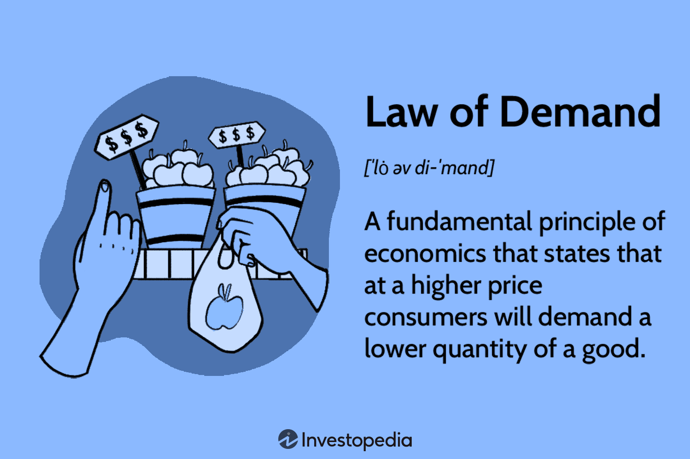

The theory of demand is a cornerstone of economic thought that outlines how consumer demand for goods and services fluctuates in response to changing prices. It provides insights into how consumers decide what to purchase, considering factors like their income, price levels, and individual preferences. Understanding these mechanisms is crucial for analyzing both market dynamics and consumer behavior, serving as a foundational tool for economists and business professionals alike. 

The demand theory is encapsulated by the demand curve, which typically exhibits a downward slope, indicating an inverse relationship between price and quantity demanded. This relationship is central to understanding market behaviors and is pivotal for setting prices in competitive markets. As prices increase, the quantity demanded typically decreases, which reflects rational consumer behavior aiming to maximize utility given budget constraints.



Algorithmic trading, which uses automated and pre-programmed trading instructions to execute trades, can significantly benefit from the principles of demand theory. By understanding how demand for assets or securities changes with price variations, algorithmic traders can develop more effective strategies. Such trading systems can incorporate demand signals to predict price movements and optimize trading paths, using sophisticated algorithms that adapt to market conditions. 

This article will explore the interplay between demand theory, the law of demand, and algorithmic trading. The discussion will commence with a detailed examination of the key elements of demand theory and the law of demand. These foundational concepts will set the stage for an analysis of their implications on algorithmic trading strategies, highlighting how knowledge of demand can be leveraged to enhance trading performance and profitability.

## Table of Contents

## Understanding Demand Theory

Demand theory is a critical component of economic analysis, elucidating how individuals allocate their financial resources towards purchasing goods and services. It centers on the premise that consumers' purchasing decisions are influenced by their income, the prices of goods, and personal preferences. These decisions ultimately shape the market demand for various products.

At the heart of demand theory is the demand curve, which is graphically represented as a downward-sloping line. This slope underscores the inverse relationship between the price of a good and the quantity demanded. Essentially, as the price of a good decreases, consumers are likely to purchase more of it. Conversely, when prices increase, the quantity demanded tends to drop. This relationship can be mathematically portrayed by the demand function, where quantity demanded ($QD$) is a function of price ($P$), and can be expressed as:

$$
QD = a - bP
$$

where $a$ and $b$ are constants with $b > 0$.

Several key factors can influence shifts in the demand curve:

1. **Consumer Income**: An increase in consumer income generally raises the demand for goods, particularly for normal goods. Conversely, it could decrease demand for inferior goods, as consumers might opt for more desirable substitutes.

2. **Prices of Related Goods**: The demand for a product can also be affected by changes in the price of related goods. For instance, an increase in the price of a substitute good can lead to a rise in demand for the considered good. Alternatively, if the price of a complementary good goes up, demand may decrease.

3. **Consumer Preferences**: Shifts in tastes and preferences, often influenced by cultural trends, advertising, or seasonal factors, can significantly impact demand. A favorable change typically boosts demand for a good, while an unfavorable change can reduce it.

4. **Expectations about Future Prices and Income**: If consumers anticipate higher prices or increased income in the future, they may alter their current purchasing behavior, increasing demand in the present.

Understanding these dynamics is essential for interpreting how market forces interact to determine the equilibrium price and quantity of goods. Demand theory remains a foundational tool for analyzing consumer behavior, assisting businesses and policymakers in making informed decisions.

## The Law of Demand

The law of demand is a fundamental principle in economics that asserts, ceteris paribus, or all else being equal, when the price of a good rises, the quantity demanded of that good falls, and conversely, when the price decreases, the quantity demanded increases. This inverse relationship between price and quantity demanded is visually represented by a downward-sloping demand curve on a graph where the x-axis represents quantity and the y-axis represents price.

This principle is grounded in the concept of diminishing marginal utility. According to this concept, as a consumer consumes more units of a good, the additional satisfaction or utility gained from each subsequent unit decreases. Consequently, consumers are only willing to purchase additional units at lower prices to equate their marginal benefit with the marginal cost.

A practical illustration of the law of demand is observed during sales events like Black Friday. During such sales, significant price reductions are offered, resulting in a substantial increase in quantity demanded as consumers take advantage of lower prices to enhance their consumption.

While the law of demand generally holds, there are notable exceptions. Giffen goods represent a category of goods where an increase in price leads to an increase in quantity demanded. This counterintuitive phenomenon occurs because Giffen goods are essential commodities with few or no close substitutes. When the price of a Giffen good rises, the effective income of consumers decreases, leading them to forego more expensive alternatives and purchase more of the now pricier staple, thus increasing demand. Another exception can be found in Veblen goods, luxury items whose demand increases as their price rises due to their status symbol appeal.

The mathematical representation of the demand function can be expressed as:

$$
Q_d = f(P, Y, P_r, T, E)
$$

Where:
- $Q_d$ is the quantity demanded,
- $P$ is the price of the good,
- $Y$ is consumer income,
- $P_r$ is the price of related goods,
- $T$ is taste or preference,
- $E$ is expectations about future prices.

Understanding these nuances enables economists and traders to better anticipate market dynamics and consumer behavior, providing valuable insights for pricing strategies and economic forecasting.

## Algorithmic Trading and Demand Theory

Algorithmic trading leverages computer algorithms to execute trades by adhering to predefined criteria, often with the objective of capitalizing on market efficiencies and reducing human error. A fundamental component that can enhance the efficacy of [algorithmic trading](/wiki/algorithmic-trading) strategies is a deep understanding of demand theory. By analyzing how price variations affect market demand, traders are able to construct algorithms that effectively predict consumer behavior.

Demand theory's pivotal concept, demand elasticity, plays a key role in refining these trading algorithms. Demand elasticity measures how the quantity demanded of a good or service responds to price changes. This insight allows traders to anticipate how minor price shifts might influence demand and consequently, the broader market dynamics.

For instance, consider an algorithm designed to execute trades on a particular stock. By factoring in demand elasticity, the algorithm can gauge how sensitive the stock's demand is to changes in its price. This can lead to more sophisticated strategies where the algorithm adjusts its buy and sell orders based on the predicted reaction of the market to price movements:

```python
def calculate_demand_elasticity(percentage_change_in_quantity, percentage_change_in_price):
    return percentage_change_in_quantity / percentage_change_in_price

# Example function to adjust trading strategy based on demand elasticity
def adjust_trading_strategy(price_change, base_quantity, elasticity):
    quantity_change = elasticity * price_change
    return base_quantity + quantity_change

# Sample data
price_change = 0.05  # 5% price increase
base_quantity = 100  # initial quantity to trade
elasticity = 1.5  # hypothetical elasticity value

adjusted_quantity = adjust_trading_strategy(price_change, base_quantity, elasticity)
print(f"Adjusted quantity to trade: {adjusted_quantity}")
```

By considering the elasticity of demand, algorithmic trading systems can dynamically adjust their parameters to better align with market fluctuations. This integration of demand insights into trading algorithms not only optimizes the timing and scale of trades but also empowers traders to make more informed decisions, thereby reducing risk and enhancing profitability.

Incorporating demand theory into algorithmic trading frameworks offers the potential for more nuanced and responsive trading strategies. As market conditions evolve, traders can continuously refine their algorithms to maintain a competitive edge, ensuring that their strategies remain robust in the face of fluctuating demand patterns.

## Applications and Examples

Algorithmic traders deploy demand theory to forecast market dynamics and modify strategies accordingly. This approach enables traders to anticipate shifts in consumer behavior and adapt quickly to changing market conditions. Automated pricing strategies are a noteworthy application of this concept, where algorithms modify prices in response to real-time demand data. For instance, an algorithm might employ a set of rules such as:

```python
def adjust_price(current_price, demand_signal):
    if demand_signal == "high":
        return current_price * 1.05  # Increase price by 5%
    elif demand_signal == "low":
        return current_price * 0.95  # Decrease price by 5%
    else:
        return current_price  # No change

# Example usage
current_price = 100
demand_signal = "high"
new_price = adjust_price(current_price, demand_signal)
print(new_price)  # Outputs 105.0
```

This code snippet illustrates a simple way to adjust pricing based on demand signals, a fundamental concept in algorithmic trading.

E-commerce platforms frequently exploit demand theory to dynamically set prices, using detailed consumer interaction data to gauge demand patterns. For example, online retailers may implement dynamic pricing algorithms to change prices based on the time of day, inventory levels, or web traffic, ensuring competitive pricing while maximizing revenues. These algorithms analyze variables like consumer purchasing history, browsing behavior, and competitor pricing to determine optimal pricing strategies.

Case studies from trading firms exemplify how demand insights can lead to significant profitability. Companies such as Renaissance Technologies have leveraged complex algorithms that [factor](/wiki/factor-investing) in demand elasticity to predict price movements with high accuracy, resulting in superior trading performance. By understanding how price changes affect demand, these firms can identify undervalued or overvalued assets, thereby optimizing their trading portfolios and reducing risk.

In summary, the application of demand theory in algorithmic trading not only enhances the precision of strategic decisions but also offers substantial competitive advantages in the fast-paced financial markets.

## Conclusion

Demand theory and the law of demand play indispensable roles in comprehending market dynamics and formulating robust algorithmic trading strategies. These foundational concepts illuminate how price variations influence consumer demand, offering key insights into market behavior. By integrating these insights, algorithmic traders can enhance trading performance and profitability. For instance, understanding demand elasticity allows traders to adjust their algorithms in response to price changes, optimizing trade execution and capital allocation.

Algorithmic trading systems benefit from interpreting real-time data to predict market shifts, leveraging demand theory to anticipate fluctuations. The capacity to model market demand accurately enhances the trader's strategic edge, enabling more precise market entry and [exit](/wiki/exit-strategy) points.

Looking ahead, technological advancements like [machine learning](/wiki/machine-learning) and data analytics hold the promise of further refining these strategies. Machine learning algorithms can process vast datasets to identify demand patterns and predict consumer behavior with increased accuracy. This capability facilitates the creation of more sophisticated algorithms that incorporate nuanced demand signals, leading to improved decision-making and trade execution. As these technologies evolve, they will likely deepen the application of demand theory in algorithmic trading, driving innovation and competitive advantage in financial markets.

## References & Further Reading

[1]: Lopez de Prado, M. (2018). ["Advances in Financial Machine Learning."](https://www.amazon.com/Advances-Financial-Machine-Learning-Marcos/dp/1119482089) Wiley.

[2]: Aronson, D. R. (2007). ["Evidence-Based Technical Analysis: Applying the Scientific Method and Statistical Inference to Trading Signals."](https://onlinelibrary.wiley.com/doi/book/10.1002/9781118268315) Wiley.

[3]: Jansen, S. (2020). ["Machine Learning for Algorithmic Trading: Predictive models to extract signals from market and alternative data for systematic trading strategies with Python."](https://github.com/stefan-jansen/machine-learning-for-trading) Packt Publishing.

[4]: Chan, E. P. (2009). ["Quantitative Trading: How to Build Your Own Algorithmic Trading Business."](https://github.com/ftvision/quant_trading_echan_book) Wiley Trading.

[5]: Bergstra, J., Bardenet, R., Bengio, Y., & Kégl, B. (2011). ["Algorithms for Hyper-Parameter Optimization."](https://proceedings.neurips.cc/paper/2011/file/86e8f7ab32cfd12577bc2619bc635690-Paper.pdf) Advances in Neural Information Processing Systems 24.

[6]: Varian, H. R. (2014). ["Intermediate Microeconomics: A Modern Approach."](https://www.semanticscholar.org/paper/Intermediate-Microeconomics%3A-A-Modern-Approach-Varian/ceec34aa58ed21436952a83e5674d8ed1bc96e09) W.W. Norton & Company.

[7]: Hull, J. C. (2018). ["Options, Futures, and Other Derivatives."](https://www.semanticscholar.org/paper/Options%2C-Futures%2C-and-Other-Derivatives-Hull/89bdee500c8623864fc9eb7a471546aa713acc44) Pearson. 

[8]: Kahneman, D., & Tversky, A. (1979). ["Prospect Theory: An Analysis of Decision under Risk,"](https://www.jstor.org/stable/1914185) Econometrica, 47(2), 263-292.