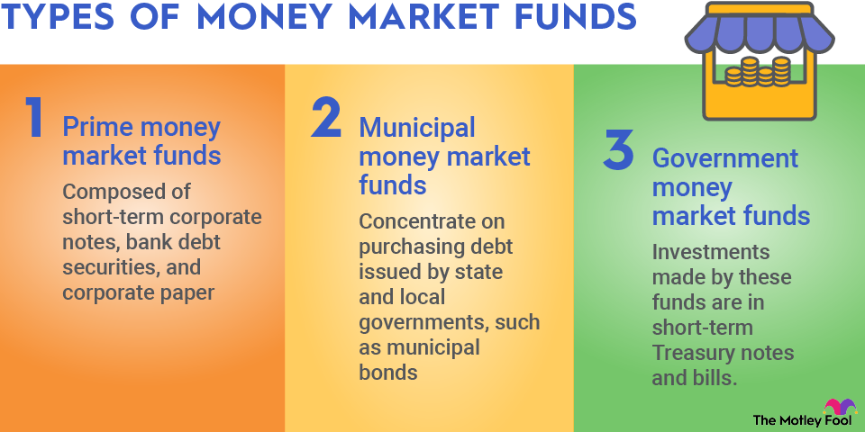

## Table of Contents

## What is a money market fund?

A money market fund is a type of investment where people put their money into a pool that invests in safe, short-term assets like government bonds or high-quality commercial paper. These funds aim to keep the value of each share at $1, which makes them a stable place to park money. They are popular because they are considered low risk and offer a bit more return than a regular savings account.

Money market funds are often used by people and businesses to manage their cash that they might need soon. For example, a company might use a money market fund to hold money it plans to use for payroll or other expenses. While the returns are usually not as high as stocks or long-term bonds, the safety and liquidity of money market funds make them a good choice for short-term savings.

## How do money market funds work?

Money market funds work by collecting money from many people and then using that money to buy safe, short-term investments. These investments can include things like government securities, certificates of deposit, and high-quality commercial paper. The goal is to keep the value of each share in the fund close to $1, which makes it a stable place to keep money. When you invest in a money market fund, you're buying shares in the fund, and the income from the investments is shared among all the shareholders.

The money market fund earns money mainly through the interest from the short-term securities it holds. This interest is then passed on to the investors in the form of dividends, usually on a monthly basis. Because these funds invest in very safe assets, they are considered low risk. However, the returns are typically lower than those from stocks or long-term bonds. People often use money market funds to save money they might need in the near future, because it's easy to take money out of the fund when you need it.

## What are the benefits of investing in money market funds?

Money market funds are a good choice for people who want to keep their money safe and easy to get to. They invest in things like government bonds and short-term loans to big companies, which are usually very safe. This means there's less chance of losing your money compared to other types of investments like stocks. Plus, it's easy to take your money out of a money market fund whenever you need it, which is great if you might need your money soon.

Another benefit is that money market funds often give you a bit more money back than a regular savings account. They pay out the interest they earn from their investments to you, usually every month. While you won't get rich quick with money market funds, they can be a good place to park your money if you want to earn a little more than a savings account but don't want to take big risks.

## What are the risks associated with money market funds?

Money market funds are usually seen as safe, but they can still have some risks. One risk is that the value of the investments in the fund might go down a little. Even though money market funds aim to keep each share worth $1, there's a chance it could drop below that. This is called "breaking the buck," and it's rare, but it has happened before.

Another risk is that the interest rates on money market funds can change. If interest rates go down, the fund might not earn as much money, and the dividends you get could be lower. Also, money market funds are not insured by the government like bank accounts are, so if the fund does really badly, you could lose some of your money. But overall, these risks are pretty small compared to other types of investments.

## Can you provide examples of popular money market funds?

Some well-known money market funds come from big companies like Vanguard and Fidelity. Vanguard's Federal Money Market Fund (VMFXX) is one popular choice. It invests mostly in U.S. government securities, which makes it very safe. People like it because it's stable and easy to get money out when they need it.

Another popular one is Fidelity's Government Money Market Fund (SPAXX). This fund also focuses on government securities, and it's known for its low fees and good returns compared to other money market funds. Many people use it to hold their cash that they might need soon, like for emergencies or short-term savings goals.

These funds are good examples of how money market funds work. They are safe places to put your money and offer a bit more interest than a regular savings account. They are popular because they are easy to use and help keep your money safe while still [earning](/wiki/earning-announcement) a little extra.

## How do money market funds differ from other types of mutual funds?

Money market funds are different from other types of mutual funds because they focus on short-term, safe investments. While other mutual funds might invest in stocks, bonds, or a mix of different assets, money market funds stick to things like government securities, certificates of deposit, and commercial paper. This makes them a lot less risky than other mutual funds, which can go up and down a lot more in value. People use money market funds to keep their money safe and easy to get to, while other mutual funds are often used to try to grow money over time.

Another big difference is that money market funds aim to keep the value of each share at $1. This is not true for other mutual funds, where the value of each share can change a lot depending on how the investments are doing. Because of this, money market funds are more stable and less likely to lose value. They are good for short-term savings or money you might need soon, while other mutual funds are better if you want to invest for the long term and are okay with more risk.

## What are the typical returns one can expect from money market funds?

Money market funds usually give you a small return, more than what you'd get from a regular savings account but less than what you might get from stocks or long-term bonds. The exact return can change because it depends on the interest rates of the short-term investments the fund holds. For example, if interest rates are high, the fund might give you a bit more money back. But if interest rates are low, the return will be smaller.

These returns are paid out to you as dividends, usually every month. Because money market funds invest in safe things like government bonds and high-quality commercial paper, the returns are steady but not very high. People often use money market funds to keep their money safe and earn a little extra while they wait to use it for something else soon.

## How are money market funds regulated?

Money market funds are watched closely by the government to make sure they are safe for people to invest in. In the United States, the main group that looks after them is called the Securities and Exchange Commission (SEC). The SEC has rules that money market funds have to follow, like only investing in safe, short-term things and keeping a good mix of investments. These rules help make sure the funds stay stable and don't lose money easily.

The SEC also makes sure that money market funds tell people clearly about any risks and what they are investing in. This way, people can make smart choices about where to put their money. If a money market fund does not follow these rules, the SEC can step in and make them fix it. This helps keep money market funds a safe place for people to park their money.

## What are the fees and expenses involved in money market funds?

Money market funds have fees and expenses that you need to know about. One common fee is the expense ratio, which is a small percentage of the money in the fund that is taken out each year to pay for running the fund. This can include things like paying the people who manage the fund, keeping records, and other costs. The expense ratio is usually very low for money market funds, often around 0.1% to 0.5%, but it can still affect how much money you get back.

There might also be other fees, like a fee for buying or selling shares in the fund. These are called transaction fees and can vary depending on the fund. Some funds might not charge these fees at all, while others might take a small amount each time you put money in or take it out. It's good to check the fund's details to see what fees you might have to pay, so you can understand how they might affect your returns.

## How can one invest in money market funds?

To invest in money market funds, you can start by choosing a fund that fits your needs. Many big companies like Vanguard, Fidelity, and Schwab offer money market funds. You can usually open an account with them online or through their customer service. Once you have an account, you can put money into the fund by buying shares. This can often be done with a few clicks on their website or by talking to a representative.

After you've put money into the fund, it will start earning interest from the short-term investments it holds. This interest is paid out to you as dividends, usually every month. If you need your money back, you can sell your shares in the fund and get your money out easily. Just remember to check the fees and expenses of the fund, as these can affect how much money you get back.

## What are the tax implications of investing in money market funds?

When you invest in money market funds, you need to think about taxes. The money you earn from these funds, called dividends, is usually taxed as regular income. This means you'll pay the same tax rate on this money as you would on your salary or wages. If you have a lot of money in money market funds, this could mean you owe more in taxes than if you invested in something that gets taxed less, like some types of bonds.

There's another thing to know about taxes and money market funds. Some funds invest in things that are not taxed at the federal level, like certain government securities. If you buy shares in these types of funds, the dividends you get might not be taxed by the federal government. But, you still might have to pay state or local taxes on this money. It's a good idea to talk to a tax advisor to understand exactly how your money market fund investments will be taxed.

## How do economic conditions affect the performance of money market funds?

Economic conditions can change how well money market funds do. When interest rates go up, money market funds usually do better because they can earn more money from the short-term investments they hold. But if interest rates go down, the returns from these funds can drop too. This means that if the economy is doing well and interest rates are high, you might see higher returns from your money market fund. On the other hand, if the economy is struggling and interest rates are low, the returns might not be as good.

Another way economic conditions can affect money market funds is through the overall stability of the market. If there's a lot of worry or uncertainty in the economy, people might pull their money out of riskier investments and put it into safer places like money market funds. This can make the funds more stable, but it doesn't change the returns much. However, if the economy is very unstable and even safe investments start to look risky, money market funds might face some challenges, though they are still considered safer than many other types of investments.

## References & Further Reading

[1]: ["The Basics of Money Market Funds"](https://www.investopedia.com/terms/m/money-marketfund.asp) by the U.S. Securities and Exchange Commission (SEC).

[2]: Moore, K. D., & Cohn, J. (2019). ["Money Market Funds in a Low-Interest Environment."](https://www.sciencedirect.com/science/article/pii/S0165176519303702) Federal Reserve Bank of San Francisco Economic Letter.

[3]: Treleaven, P., Galas, M., & Lalchand, V. (2013). ["Algorithmic Trading Review."](https://www.researchgate.net/publication/262239006_Algorithmic_Trading_Review) Artificial Intelligence Review, 39(4), 357-373.

[4]: Narang, R. K. (2009). ["Inside the Black Box: A Simple Guide to Quantitative and High-Frequency Trading"](https://onlinelibrary.wiley.com/doi/book/10.1002/9781118267738) by Wiley.

[5]: Aldridge, I. (2013). ["High-Frequency Trading: A Practical Guide to Algorithmic Strategies and Trading Systems"](https://books.google.com/books/about/High_Frequency_Trading.html?id=6l0DDQAAQBAJ) by Wiley.

[6]: Hasbrouck, J., & Saar, G. (2013). ["Low-latency trading."](https://www.sciencedirect.com/science/article/abs/pii/S1386418113000165) The Review of Financial Studies, 26(9), 2295-2336.

[7]: Lopez de Prado, M. (2018). ["Advances in Financial Machine Learning"](https://www.amazon.com/Advances-Financial-Machine-Learning-Marcos/dp/1119482089) by John Wiley & Sons.

[8]: Chan, E. P. (2009). ["Quantitative Trading: How to Build Your Own Algorithmic Trading Business"](https://github.com/ftvision/quant_trading_echan_book) by Wiley.