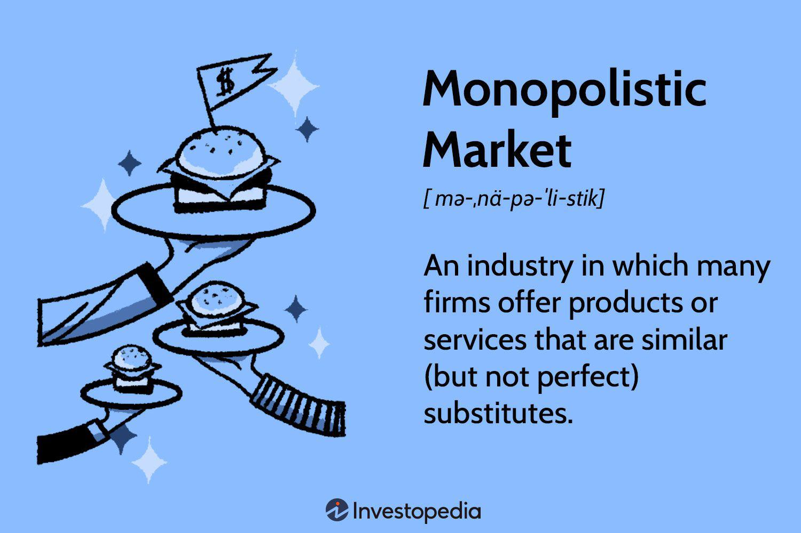

Understanding market structures is crucial for grasping how economies operate. The organization and behavior of markets deeply influence economic outcomes and consumer experiences. Among the various market structures, monopolistic markets and perfect competition represent two extremes. In a monopolistic market, a single seller dominates, wielding significant control over prices and production. This can result in higher prices and limited consumer choices, but can also allow for efficiencies under certain conditions, such as in public utilities. On the opposite end, perfect competition features numerous small firms, none of which can influence market prices individually. Here, prices are driven purely by supply and demand, ensuring optimal resource allocation and low consumer prices, albeit this scenario is more theoretical and rarely observed in its entirety in practice.

Adding further complexity, algorithmic trading has become a significant player in contemporary financial markets. By leveraging sophisticated algorithms, trades can be executed with extraordinary speed and precision, affecting both monopolistic and perfectly competitive markets. This technological advancement introduces new dynamics, influencing liquidity, pricing efficiency, and potentially contributing to market volatility.

Understanding these market structures and the role of algorithmic trading is essential for navigating and regulating modern economic systems. Additionally, the existence of these structures necessitates the implementation of antitrust laws and regulatory frameworks to safeguard fair competition and protect consumers' interests. These elements must continuously evolve to address the challenges presented by ongoing technological advancements and their implications for market integrity and competitiveness.

## Table of Contents

## Characteristics of Monopolistic Markets

Monopolistic markets are characterized by the presence of a single seller that exercises dominant control over a market. This control typically arises due to high barriers to entry, which can include substantial capital investment requirements, regulatory licenses, proprietary technology, or significant economies of scale. Regulatory advantages may also be granted by governments, either explicitly or implicitly, through policies that favor or protect certain firms. These barriers ensure that potential competitors find it difficult to enter the market, thus preserving the monopolist's dominant position.

Additionally, monopolistic markets may emerge when a firm offers a unique product with no close substitutes. This uniqueness could stem from innovation, brand reputation, or a patent, enabling the firm to differentiate its offerings and lock out competitors. The monopolist, hence, holds significant influence over price and production decisions, able to adjust supply to maximize profits without immediate concern for competition.

Public utilities such as water and electricity supply are classic examples of monopolistic markets. These industries often operate under natural monopoly conditions, where the costs of infrastructure creation and maintenance render competition inefficient. State-sponsored industries also fit this market structure where, for policy reasons, a government permits or establishes a monopoly to manage critical resources or services. Here, the expectation is that a single provider can achieve economies of scale, ensuring more efficient service delivery than if the market were fragmented among several competitors.

## Impact of Monopolistic Markets

Monopolistic markets, characterized by a single seller with significant control, can profoundly influence consumer choice and pricing levels. A key consequence of monopolistic market structures is the limitation it imposes on consumer choice. With a single entity dominating the market, alternatives are scarce, leading consumers to purchase from the monopolist, even if prices are higher or quality is compromised.

The pricing power held by monopolists often results in elevated prices compared to more competitive environments. In a monopolistic market, the firm maximizes profit where marginal cost (MC) equals marginal revenue (MR), rather than equating price (P) to MC as in perfectly competitive markets. This difference can lead to a divergence from optimal output and pricing levels seen in competitive markets, often resulting in a welfare loss known as deadweight loss.

To mitigate these adverse effects, antitrust laws have been developed to regulate monopolistic practices. These laws seek to prevent anti-competitive behaviors such as price fixing, market division, and collusion. For example, the Sherman Act in the United States is a fundamental legal framework designed to combat anti-competitive practices and maintain market competition.

However, monopolistic markets can offer efficiencies under certain conditions, particularly in industries with substantial infrastructure costs, such as utilities. These industries are often natural monopolies, where a single provider is more efficient due to economies of scale. For instance, it may not be economically feasible to have multiple companies laying down competing power lines across a city. In such cases, the monopolistic structure can reduce costs per unit, benefiting consumers through potentially lower prices.

Effective regulatory oversight is crucial for ensuring that monopolistic power does not negatively impact market dynamics. Regulators are tasked with maintaining a balance; they must allow firms the freedom to innovate and achieve efficiencies while protecting consumers and smaller businesses from potential abuses of power. Regulatory bodies may enforce price controls or public service obligations to safeguard consumer interests without stifling the innovation and efficiencies brought by monopolistic firms.

In conclusion, while monopolistic markets can lead to higher prices and limited choice, they are not without their benefits in specific scenarios. The role of antitrust laws and regulatory oversight is pivotal in ensuring that the power of monopolistic firms is checked, maintaining a balance between efficiency and fair competition.

## Perfect Competition Explained

Perfect competition represents an idealized market structure characterized by several small firms offering homogeneous products. In this environment, no single firm can influence the market, and all participants are "price takers." This means that the price of goods is determined solely by the overall demand and supply in the market, with individual firms unable to set or influence prices.

The primary assumption of perfect competition is that firms can enter and [exit](/wiki/exit-strategy) the market freely, and all participants have perfect knowledge of prices and technologies. This accessibility ensures optimal allocation of resources, leading to an efficient market where products are produced at the lowest possible cost, benefiting consumers through lower prices. Additionally, no firm earns supernormal profits in the long run, as the absence of entry barriers invites new competitors whenever profits exceed the normal levels.

Real-world examples of perfect competition are rare; however, certain markets exhibit some characteristics of this structure. Agricultural markets are a classical example where numerous farmers produce identical products such as wheat or corn. In such markets, the products are largely indistinguishable from one another, and prices are predominantly driven by the forces of supply and demand.

Similarly, the foreign exchange market bears similarities to perfect competition. It involves numerous participants engaged in the buying and selling of currencies, and prices fluctuate in response to supply and demand dynamics. The standardization of currency units and the global nature of this market mean that individual traders cannot control prices.

Despite its theoretical nature, perfect competition serves as an essential benchmark in economics. It highlights the benefits of competitive markets, such as efficient resource distribution and consumer welfare. However, actual markets often contain imperfections, such as information asymmetry and entry barriers. These deviations from the perfect competition model necessitate other market structures like monopolistic competition or oligopolies to better describe and analyze real-world economic scenarios.

## Algorithmic Trading in Market Structures

Algorithmic trading, often referred to as algo trading, involves the use of computer programs to execute trades at speeds and frequencies that are beyond human capability. This method leverages mathematical models and algorithms to make decisions about the timing, price, and quantity of trading orders.

In monopolistic markets, where a single or a few firms have significant control, [algorithmic trading](/wiki/algorithmic-trading) can be used to enhance profits through strategic pricing. By analyzing vast amounts of market data and predicting competitor behavior, algorithms can optimize pricing strategies effectively. For instance, monopoly players can use algorithms to set optimal prices that maximize profits while considering consumer demand elasticity and potential regulatory constraints. This strategic pricing is crucial in monopolistic markets where price and output decisions can significantly impact market outcomes.

Conversely, in markets characterized by perfect competition, algorithmic trading plays a vital role in improving [liquidity](/wiki/liquidity-risk-premium) and price efficiency. Given that perfect competition involves numerous small firms offering homogenous products, algorithms facilitate rapid trading which leads to tighter bid-ask spreads and, consequently, more efficient price discovery. An algorithm might be designed to assess real-time supply and demand conditions, adjusting prices slightly to ensure that enough liquidity is available to match buyers and sellers quickly.

Regulatory bodies face significant challenges in managing algorithmic trading activities, primarily due to concerns about market [volatility](/wiki/volatility-trading-strategies) and fairness. High-frequency trading, a subset of algorithmic trading, has been criticized for exacerbating market volatility through rapid execution of trades, which can lead to flash crashes. Additionally, the unfair advantage held by institutions with advanced algorithmic capabilities over retail investors requires regulatory oversight. Regulators must ensure that these trading practices do not lead to market manipulation or create systemic risks. Adequate measures, such as implementing circuit breakers and monitoring algorithmic strategies for potential market abuse, are necessary to uphold market integrity and protect all participants.

Overall, the integration of algorithmic trading into various market structures necessitates continuous adaptation by regulators to mitigate risks while harnessing the efficiencies that these technologies provide.

## Special Considerations

Technological advancements have increasingly blurred the lines between monopolistic and competitive market structures, reshaping traditional economic landscapes. One of the key examples of this evolution is seen in digital platforms like Amazon. These platforms leverage network effects, where the value of a product or service increases as more people use it. This phenomenon allows such platforms to simultaneously display characteristics of both monopolistic and competitive markets. Amazon, for instance, controls a significant portion of the e-commerce market, exhibiting monopolistic traits due to its scale and influence. However, it also operates in a highly competitive environment, with various sellers offering similar products on its platform.

Government regulations play a pivotal role in shaping these market structures by promoting fair competition and protecting consumer interests. Regulatory bodies, such as the Federal Trade Commission (FTC) in the United States, are essential in preventing anti-competitive practices and ensuring that no single entity can exert excessive control over a market. These regulations are crucial, especially in digital markets, where the pace of technological change can outstrip traditional regulatory responses.

The emergence of [artificial intelligence](/wiki/ai-artificial-intelligence) (AI) and blockchain technologies holds the potential to further redefine market dynamics. AI can lead to improved decision-making processes, optimize supply chains, and customize consumer experiences, potentially enhancing competitive advantages. Conversely, these technologies can also contribute to monopolistic practices if concentrated within a few dominant players who maintain proprietary technological advances.

Blockchain technology introduces transparent and decentralized systems, potentially reducing dependence on monolithic intermediaries. These systems can lead to more competitive markets by allowing new entrants to participate without facing significant barriers, a common trait of monopolistic markets. By enabling secure and transparent transactions, blockchain technology can democratize markets, making them accessible to a broader range of participants.

In summary, the intersection of technology, regulatory frameworks, and market structures presents both challenges and opportunities. As technological advancements continue to evolve, they necessitate agile regulatory approaches to ensure fair competition and protect consumers while fostering innovation and economic growth.

## Conclusion

Monopolistic markets and perfect competition represents two critical extremes in understanding market dynamics. Monopolistic markets, characterized by a single dominant seller, contrast sharply with the perfect competition model where numerous small firms operate without pricing power, thus providing a comprehensive perspective on economic interactions. Algorithmic trading, with its ability to execute trades at high speeds and with precision, adds another layer of complexity and opportunity in these market structures. In monopolistic environments, algorithmic trading can be leveraged to optimize pricing strategies, potentially enhancing firm profitability. Conversely, in highly competitive markets, such algorithms contribute significantly by improving liquidity and ensuring price efficiency. 

However, these benefits come with challenges. Rapid technological advancements necessitate regulatory frameworks that are agile and robust. Notably, the introduction of algorithms and AI-driven trading systems raises concerns of market volatility and fairness, pressing regulators to continuously refine policies to maintain market integrity and protect consumer interests. Understanding these market structures and their interactions with modern trading technologies is pivotal for informed economic analysis and investment decision-making. As markets evolve, the insights gained from studying monopolistic and perfect competition models remain invaluable for stakeholders aiming to navigate and thrive in an ever-changing economic landscape.

## FAQs

### What are the main differences between monopolistic markets and perfect competition?

The primary distinction between monopolistic markets and perfect competition lies in the number of sellers and the degree of market control. In a monopolistic market, a single seller dominates, wielding significant influence over prices and supply due to minimal competition. Factors such as high barriers to entry, regulatory advantages, or unique product offerings often facilitate this dominance. Examples include utilities or patented products. In contrast, perfect competition is characterized by numerous small firms offering identical products, where no single entity can influence the market price. Firms in perfect competition are price takers, meaning that prices are dictated solely by aggregate supply and demand. This structure ensures optimal resource allocation and typically results in lower prices for consumers.

### How does algorithmic trading affect market efficiency?

Algorithmic trading impacts market efficiency by executing trades at speeds and accuracies unattainable by human traders. In competitive markets, algorithmic trading enhances liquidity and narrows bid-ask spreads, contributing to more efficient price discovery. By swiftly processing and analyzing vast datasets, algorithms can identify and exploit [arbitrage](/wiki/arbitrage) opportunities, thus aligning prices more closely with the market's true value. However, algorithmic trading also poses challenges, such as increased market volatility during periods of instability. Regulators must balance these benefits and risks to ensure that markets remain fair and stable.

### Why is perfect competition considered a theoretical concept?

Perfect competition is largely viewed as a theoretical construct because its stringent conditions are rarely met in real-world markets. The assumptions underpinning perfect competition include a multitude of buyers and sellers, homogeneous products, perfect information, and no barriers to entry or exit. Such conditions foster an environment where firms cannot influence market prices independently. While certain markets, such as those for agricultural commodities or foreign exchange, exhibit some characteristics of perfect competition, the complete absence of differentiators and barriers rarely exists, making perfect competition more of a benchmark for economic analysis than a practical reality.

### What is the impact of government regulation on market structures?

Government regulation significantly influences market structures through the enforcement of laws and regulations designed to maintain competition and protect consumers. Antitrust laws, for instance, are implemented to prevent monopolistic practices that harm competitive processes and consumer welfare. In monopolistic markets, regulators may intervene to ensure fair pricing and curtail the monopolist's power. Conversely, in markets trending towards perfect competition, regulations may focus on preventing collusion or other practices that could undermine competitiveness. Technological innovations like AI and blockchain are reshaping market dynamics, prompting regulatory bodies to continuously adapt their frameworks to uphold market integrity in the face of evolving challenges.

## References & Further Reading

[1]: "The Antitrust Paradox" by Robert H. Bork - This book provides insights into antitrust laws, relevant to the discussion of regulating monopolistic markets.

[2]: ["Flash Boys: A Wall Street Revolt"](https://en.wikipedia.org/wiki/Flash_Boys) by Michael Lewis - This book explores the rise of high-frequency trading and its impact on financial markets.

[3]: ["Competition and Regulation in Network Industries"](https://journals.sagepub.com/home/crn) by Martijn A. Han and Aad F.M. Kleijweg, Erasmus Law Review - Discusses the balance between competition and regulation, relevant for monopolistic markets such as utilities.

[4]: ["Principles of Economics"](https://open.umn.edu/opentextbooks/textbooks/32) by N. Gregory Mankiw - Provides foundational knowledge on market structures including monopolistic and perfect competition.

[5]: ["Algorithmic Trading and DMA: An Introduction to Direct Access Trading Strategies"](https://www.semanticscholar.org/paper/Algorithmic-trading-%26-DMA-%3A-an-introduction-to-Johnson/aa5de1ab883d5e23b6651faa7c1807586d688e4b) by Barry Johnson - Offers an overview of algorithmic trading strategies pertinent to market structures.

[6]: ["The Wealth of Networks: How Social Production Transforms Markets and Freedom"](https://www.jstor.org/stable/j.ctt1njknw) by Yochai Benkler - Discusses the impact of digital platforms and network effects, relevant to the special considerations mentioned.