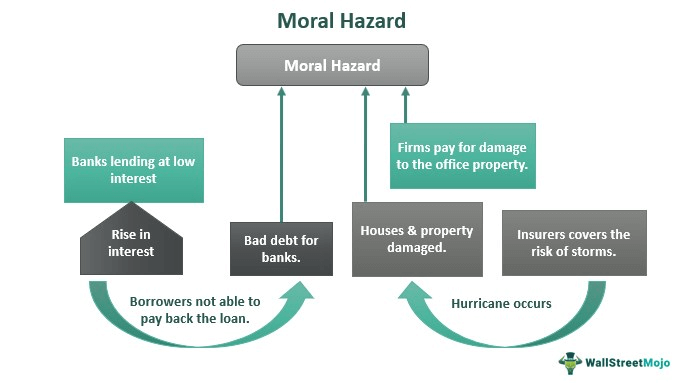

Moral hazard in financial markets and business operations refers to the situation where an entity has an incentive to take excessive risks because the negative consequences of these risks are partially borne by others. This scenario typically arises when one party in a transaction has more information about its intended actions or has different incentives than the other party, which can lead to irresponsible financial behavior. For instance, a fund manager might engage in risky investments because potential losses would be covered by the investors' capital, not impacting the manager directly.

Algorithmic trading, meanwhile, is a method of executing orders using automated and pre-programmed trading instructions. It incorporates variables like timing, price, and quantity, essentially using algorithms to make rapid trading decisions, often at speeds faster than human traders. Algorithmic trading has transformed modern financial markets by enhancing the speed and efficiency of transactions, contributing to liquidity, and facilitating large volumes of trades at reduced costs.



The intersection of moral hazard and algorithmic trading in business environments introduces unique challenges. The opacity of complex algorithms and the speed at which they operate can mask risky behavior or ethical lapses. For instance, high-frequency trading (HFT) algorithms might manipulate markets or exacerbate volatility, with the firms employing these algorithms reaping the benefits while shifting potential systemic risks onto the broader market or less informed investors.

Effective risk management strategies are crucial in mitigating moral hazard associated with algorithmic trading. These strategies must encompass robust compliance frameworks, transparency initiatives, and the integration of advanced technological tools to monitor and enforce ethical trading behavior. Moreover, corporate governance and regulatory oversight must evolve in conjunction with technological advancements to address and preempt potential risks effectively.

This article will explore detailed strategies and tools for managing moral hazards in algorithmic trading. By identifying key risk factors and employing strategic risk management, businesses can ensure sustainability and maintain market integrity.

## Table of Contents

## Understanding Moral Hazard in Business and Trading

Moral hazard is a concept in economics and finance that occurs when one party is incentivized to take excessive risks because the negative consequences of those risks are borne by another party. This phenomenon is particularly relevant in environments where information asymmetry exists, meaning that one party has more or better information compared to the other. In financial markets and business operations, moral hazard often arises when agents (such as traders or company executives) are insulated from the full repercussions of their actions, either due to mechanisms like insurance, guarantees, or simply due to the complexity of financial instruments.

In the context of [algorithmic trading](/wiki/algorithmic-trading), moral hazard presents distinct challenges. Algorithmic trading refers to the use of computer algorithms to automate trading decisions and execute orders at speeds and frequencies that are unattainable by human traders. While it enhances efficiency and [liquidity](/wiki/liquidity-risk-premium) in markets, it also introduces risks related to moral hazard. Traders might engage in high-risk strategies, knowing that their potential losses are limited owing to protective mechanisms within the financial system, or even due to the backing of the institutions they represent.

There have been several notable incidents where moral hazard played a pivotal role. The 2008 financial crisis, for instance, was exacerbated by numerous financial institutions engaging in risky investment strategies underpinned by complex financial instruments like mortgage-backed securities. The implicit belief that these institutions were 'too big to fail' emboldened risky behavior, illustrating a classic case of moral hazard. In more recent times, specific instances within high-frequency trading ([HFT](/wiki/high-frequency-trading-strategies)) have demonstrated similar risks. HFT firms might prioritize the rapid execution of trades to capitalize on minute price fluctuations, at times disregarding the potential market destabilization caused by such actions.

Algorithmic trading amplifies moral hazard because it depersonalizes trading decisions, distancing [agents](/wiki/agents) from the ramifications of high-risk strategies. The rapid development and deployment of trading algorithms can lead to situations where the creators of such systems are not fully accountable if things go wrong. This disconnection can result in aggressive tactics employed without sufficient regard for long-term impacts on market stability or investor trust.

Moral hazard is a significant threat to businesses engaged in algorithmic trading as it can lead to systemic risks and undermine the integrity of financial systems. If left unchecked, moral hazard can foster an environment where risk-taking behavior becomes normalized, eroding trust among investors and destabilizing markets. Businesses that fail to address these risks may face regulatory repercussions, financial losses, or damage to their reputation. Effective strategies and regulatory measures are thus crucial in managing the moral hazard associated with algorithmic trading, ensuring that the pursuit of high-speed, high-[volume](/wiki/volume-trading-strategy) trading does not come at the expense of market integrity and stability.

## The Role of Algorithmic Trading in Financial Markets

Algorithmic trading, often referred to as algo trading, involves the use of computer algorithms to automate trading decisions, execution, and strategies. This form of trading relies on pre-defined criteria and quantitative models to determine the optimal timing, price, and volume of orders, effectively eliminating human intervention in the trading process. The primary advantage of algorithmic trading lies in its ability to enhance market efficiency and liquidity.

By streamlining the trading process, algorithmic systems can execute orders at much faster speeds than human traders, often completing transactions in fractions of a second. This speed not only increases trading efficiency but also significantly reduces the market impact of large orders, thereby aiding liquidity provision. Additionally, algorithmic trading enables enhanced accuracy by minimizing human errors associated with manual trading.

One of the key benefits of algorithmic trading is cost reduction. Automated trading systems can lower transaction costs by optimizing the execution process and reducing the need for human resources. Moreover, algorithms can operate continuously and process large volumes of trades efficiently, contributing to overall cost-effectiveness.

However, algorithmic trading introduces potential vulnerabilities. These include risks associated with system failures, programming errors, and unintended trading behavior, which can lead to market disturbances. Additionally, moral hazard may arise if traders manipulate algorithms to produce favorable outcomes for themselves at the expense of investors or markets, thereby exploiting the opacity and complexity of these systems.

The use of high-frequency trading (HFT), a subset of algorithmic trading, can further exacerbate these risks. HFT involves executing a large number of orders at extremely high speeds, often capitalizing on small price differentials. While HFT can enhance market liquidity, it also poses risks of market manipulation and [volatility](/wiki/volatility-trading-strategies). For instance, strategies like quote stuffing—where traders place a large number of orders to distort stock prices—highlight how algorithmic trading can lead to moral hazards.

Conversely, algorithmic trading can also mitigate certain risks by ensuring disciplined adherence to trading strategies and removing emotional bias. Automated trading systems can consistently apply sophisticated risk management rules, enabling the continuous monitoring of positions and automatic adjustment to market changes. This capability helps market participants avoid impulsive decisions that can result from human emotions during volatile market conditions.

In summary, algorithmic trading plays a crucial role in modern financial markets by enhancing trading efficiency and liquidity while reducing operational costs. Nevertheless, the inherent vulnerabilities and potential for moral hazard necessitate robust oversight and risk management practices to safeguard against financial instability.

## Identifying Moral Hazard Risks in Algo Trading

Algorithmic trading, while offering numerous advantages such as increased trading speed, reliability, and efficiency, also introduces specific moral hazard risks. These dangers often originate from the inherent complexities and automation that define algorithmic trading systems, potentially leading to unintended financial outcomes. Understanding these risks is crucial for investors, traders, and regulators to manage and mitigate unforeseen negative impacts effectively.

### Typical Moral Hazard Risks in Algorithmic Trading

One primary risk associated with algorithmic trading is the potential for conflicts of interest between agents, typically traders or automated systems, and principals, such as investors or financial institutions. Agents may engage in behavior that benefits themselves at the expense of principals, capitalizing on their informational advantage. This discrepancy can occur because agents often possess detailed knowledge about trading algorithms and market conditions that are not readily available to principals.

In algorithmic trading, high-frequency trading (HFT) particularly heightens the risk of moral hazard. HFT involves the rapid execution of numerous trades within fractions of a second, exploiting small price discrepancies. While this can enhance market liquidity and price discovery, it also poses risks of market manipulation and instability. Traders might engage in tactics such as "quote stuffing" or "spoofing," where they place false orders to mislead the market, intending to create advantageous trading conditions for themselves at the detriment of others. These practices undermine market integrity and can lead to significant financial losses.

Market manipulation through algorithmic trading further exacerbates moral hazard risks. By leveraging algorithms, traders can manipulate market prices or perceptions, thereby creating an unfair trading environment. This behavior not only risks investor assets but can simultaneously destabilize markets, leading to broader economic implications.

### Case Studies and Lessons Learned

Numerous case studies underscore the moral hazard risks embedded within algorithmic trading. One notable example is the "Flash Crash" of May 6, 2010, where the U.S. stock market experienced a rapid and severe downturn, erasing nearly $1 trillion in market value within minutes before recovering. This event highlighted the vulnerabilities of trading algorithms triggering a cascade of sell orders, amplifying market volatility. The incident urged the adoption of more robust safeguards and monitoring systems to prevent similar occurrences.

Another example is the case of Knight Capital Group in 2012, where a faulty trading algorithm resulted in a $440 million loss within 45 minutes. The episode demonstrated the hazard of insufficient testing and oversight of trading algorithms, which can lead to catastrophic financial repercussions.

These cases illustrate the necessity for transparency, rigorous testing, and systematic risk management in algorithmic trading. Instituting comprehensive risk assessment measures and fostering an ethical trading environment can help mitigate the inherent moral hazard risks associated with these advanced trading technologies. The lessons learned encourage financial institutions to enhance regulatory compliance, improve algorithm robustness, and establish clear conflict of interest guidelines to safeguard market participants.

## Risk Management Strategies for Moral Hazard

Risk management is essential for mitigating moral hazard risks, particularly in fields like algorithmic trading where the stakes are high. Key principles include establishing a comprehensive understanding of potential risks, promoting accountability, and creating a culture that prioritizes ethical decision-making. These principles serve as the foundation for effective strategies to address moral hazard concerns.

### Compliance Frameworks and Transparency

A robust compliance framework is crucial for preventing moral hazard. This involves setting clear rules and expectations, monitoring compliance, and enforcing penalties for violations. Effective compliance frameworks often include regular audits, real-time monitoring of trading activities, and the separation of duties to reduce conflicts of interest. Transparency plays an important role by ensuring that all stakeholders have access to information regarding trading activities, which can discourage unethical behavior. Enhanced transparency can be achieved through detailed reporting standards and by sharing risk assessments with investors.

### Technological Solutions: AI and Machine Learning

Advanced technologies like AI and [machine learning](/wiki/machine-learning) are increasingly used to detect and prevent moral hazard. These technologies can analyze vast datasets to identify unusual patterns or potential conflicts of interest that might indicate unethical behavior. For instance, machine learning algorithms can be trained to recognize indicators of insider trading or market manipulation, providing alerts to compliance teams for further investigation. Python, a popular language in data science, can be used to implement machine learning models. Here's a simple example using Python's scikit-learn library to predict potential moral hazard risks based on trading data:

```python
from sklearn.ensemble import RandomForestClassifier
from sklearn.model_selection import train_test_split

# Example: Loading sample trading dataset
data = load_your_data()

# Features and target variable
X = data[['trade_volume', 'price_change', 'trade_frequency']]
y = data['moral_hazard_indicator']

# Splitting data into training and test sets
X_train, X_test, y_train, y_test = train_test_split(X, y, test_size=0.2, random_state=42)

# Instantiate and train the model
model = RandomForestClassifier()
model.fit(X_train, y_train)

# Predict potential moral hazard
predictions = model.predict(X_test)
```

### Regulatory Frameworks and Corporate Governance

The role of regulatory bodies and corporate governance is vital. Regulatory frameworks establish the legal boundaries within which trading activities must occur. These regulations are designed to protect the interests of all stakeholders, ensuring market stability and fairness. Compliance with these regulations is monitored through regular inspections and reporting requirements. Corporate governance, on the other hand, deals with internal policies and practices, such as board oversight and risk management committees. Strong governance practices ensure that companies are held accountable for their trading activities, reducing the likelihood of moral hazards.

In conclusion, managing moral hazard risks effectively requires a multifaceted approach that combines robust compliance frameworks, advanced technological solutions, and strong regulatory frameworks and corporate governance. By implementing these strategies, businesses can mitigate the impact of moral hazard, ensuring ethical trading practices and maintaining market integrity.

## Technological Tools for Risk Assessment

Technological tools play a crucial role in assessing and managing the risks associated with algorithmic trading. These tools are designed to analyze a vast amount of data quickly and accurately, providing insights that are vital for mitigating moral hazard.

Predictive analytics is a key component in monitoring trading activities. It involves using historical data, statistical algorithms, and machine learning techniques to identify potential future outcomes. Risk assessment software leverages predictive analytics to forecast market trends and detect irregular trading patterns that might indicate moral hazard. By analyzing trends and patterns, such software can alert traders and compliance officers to possible unethical or risky behaviors, enabling timely interventions.

Real-time monitoring systems are another essential tool. These systems continuously track market conditions and trading activities, allowing for the immediate detection of anomalies. They utilize advanced algorithms to compare real-time data against historical benchmarks, identifying deviations that could signal the presence of moral hazard. For instance, sudden and unexplained spikes in trade volume or price movements often warrant further investigation.

Blockchain and distributed ledger technologies have emerged as valuable tools in enhancing transparency and reducing risks in algorithmic trading. These technologies provide a decentralized and immutable record of all transactions, ensuring that all parties have access to the same data. This transparency minimizes information asymmetry, one of the key drivers of moral hazard, by making it difficult for any participant to manipulate or hide information. Additionally, the use of smart contracts within blockchain frameworks can automate compliance checks and ensure that all trading activities adhere to predetermined rules, further reducing the potential for unethical behavior.

In conclusion, the integration of predictive analytics, real-time monitoring systems, and blockchain technologies offers a robust framework for assessing and managing risks in algorithmic trading. These tools provide comprehensive insights into trading activities, enabling financial institutions to detect potential threats and address them proactively, thereby maintaining market integrity and reducing the incidence of moral hazard.

## Best Practices and Recommendations

In algorithmic trading, mitigating moral hazard is crucial for maintaining financial integrity and promoting sustainable business operations. To address these challenges, several strategies and best practices can be implemented.

Firstly, businesses should establish clear risk management frameworks. This involves developing robust compliance systems that enforce stringent trading protocols, regularly updating them to match evolving market conditions. Integrating risk assessments into everyday operations helps traders understand the potential impacts of their decisions before they execute trades. To this end, businesses should utilize predictive analytics tools to forecast potential risks and establish predefined risk limits to prevent excessive exposure.

Incorporating risk management in trading operations requires businesses to invest in technology that allows for real-time monitoring and transparency. Systems should allow for automatic logging and classification of trades within risk jurisdictions, enabling timely interventions when discrepancies arise. Furthermore, employing machine learning models can aid in identifying patterns that may suggest moral hazard situations, allowing for preemptive actions.

Promoting a culture of risk awareness and ethical trading is essential. Businesses should mandate regular training sessions to educate employees on the significance of risk management and encourage adherence to ethical standards. Implementing incentive structures that align traders' objectives with long-term business goals can also mitigate conflicts of interest, reducing moral hazard.

Continuous improvement and adaptation in risk management strategies are necessary given the dynamic nature of financial markets. Firms should encourage a feedback loop where insights from trading activities are analyzed to refine existing strategies. Regular audits and reviews ensure compliance with industry standards and help identify areas needing enhancement. Companies should remain adaptable, revising risk management frameworks in response to technological advancements and regulatory developments to ensure resilience against emerging threats.

By adhering to these best practices, businesses can effectively manage moral hazard in algorithmic trading, safeguarding both their operations and broader market integrity.

## Conclusion

Managing moral hazard risks in algorithmic trading is crucial for maintaining the integrity and stability of financial markets. Algorithmic trading, characterized by the use of sophisticated algorithms to execute trades at high speeds, offers numerous benefits, including increased efficiency and liquidity. However, it also presents unique challenges, particularly related to moral hazard. As traders or institutions may engage in riskier behaviors, the probability of adverse consequences rises, potentially leading to substantial financial losses and market disruptions.

Strategic risk management plays a pivotal role in ensuring business sustainability and safeguarding market integrity. By developing and implementing comprehensive risk management frameworks, organizations can identify, assess, and mitigate moral hazard risks effectively. Such frameworks should include robust compliance structures, enhanced transparency, and regular audits to ensure traders act in the best interests of their clients and the market as a whole.

Financial institutions are encouraged to integrate these risk management frameworks, adapting to evolving market conditions and technological advancements. Embracing tools like AI and machine learning can enable real-time monitoring and prediction of risk factors associated with algorithmic trading. Additionally, fostering a culture of ethical trading practices and risk awareness can further strengthen these efforts.

Looking ahead, the evolution of risk management in trading technologies is expected to be driven by continuous improvements in data analytics and [artificial intelligence](/wiki/ai-artificial-intelligence). These advancements have the potential to offer more sophisticated tools for assessing and mitigating risks, ensuring that financial institutions remain agile and responsive in an ever-changing market landscape. As technology continues to advance, maintaining a proactive approach to risk management will be essential for sustaining the health and credibility of financial markets worldwide.

## References & Further Reading

[1]: Stiglitz, J.E. (2010). ["Risk and Global Economic Architecture: Why Full Financial Integration May Be Undesirable"](https://business.columbia.edu/sites/default/files-efs/imce-uploads/Joseph_Stiglitz/2010_Risk_and_Global_Economic.pdf). National Bureau of Economic Research.

[2]: Kirilenko, A., Kyle, A.S., Samadi, M., & Tuzun, T. (2017). ["The Flash Crash: High-Frequency Trading in an Electronic Market"](https://www.jstor.org/stable/26652722). The Review of Financial Studies, 30(7), 2221-2229.

[3]: Lopez de Prado, M. (2018). ["Advances in Financial Machine Learning"](https://www.amazon.com/Advances-Financial-Machine-Learning-Marcos/dp/1119482089). Wiley.

[4]: Aldridge, I. (2013). ["High-Frequency Trading: A Practical Guide to Algorithmic Strategies and Trading Systems"](https://onlinelibrary.wiley.com/doi/pdf/10.1002/9781119203803.fmatter). Wiley.

[5]: Hasbrouck, J. & Saar, G. (2013). ["Low-Latency Trading"](https://pages.stern.nyu.edu/~jhasbrou/Research/lowLatencyTrading/lowLatencyTradingHasbrouckSaarJFM.pdf). The Review of Financial Studies, 26(9), 2256-2334.

[6]: Lin, T.C., & Chiang, J.C. (2006). ["Moral Hazard and the Financial Industry"](https://scholar.google.com/citations?user=r6qwGKUAAAAJ). Journal of Business Ethics, 67(4), 393-410.

[7]: Chan, E.P. (2009). ["Quantitative Trading: How to Build Your Own Algorithmic Trading Business"](https://github.com/ftvision/quant_trading_echan_book). Wiley.