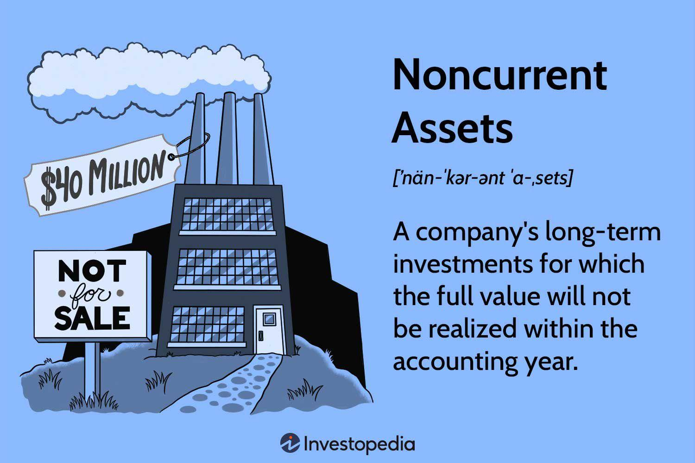

## Table of Contents

## What are noncurrent assets?

Noncurrent assets are things a company owns that are not expected to be turned into cash within a year. These assets are important for the long-term running of the business. Examples include buildings, machinery, and land. They are listed on the balance sheet and help show the company's overall value.

These assets are different from current assets, which can be quickly turned into cash. Noncurrent assets usually help the company make money over many years. For example, a factory building can be used to make products for a long time. Because they last a long time, noncurrent assets are often depreciated, which means their value is slowly reduced over time on the company's financial statements.

## How do noncurrent assets differ from current assets?

Noncurrent assets and current assets are both important for a company, but they are used in different ways. Current assets are things that a company can turn into cash quickly, usually within a year. This includes money in the bank, money that people owe the company, and things like inventory that can be sold. These assets help a company pay its short-term bills and keep the business running smoothly day to day.

On the other hand, noncurrent assets are things that a company plans to keep and use for more than a year. These include big things like buildings, land, and machinery. Noncurrent assets are important for the long-term success of the company because they help it make money over many years. Unlike current assets, noncurrent assets are not meant to be sold quickly but are used to support the company's operations over the long term.

## Can you list some common examples of noncurrent assets?

Noncurrent assets are things that a company owns and plans to use for a long time, usually more than a year. Some common examples are buildings and land. A company might own a factory building where it makes its products. The land the factory sits on is also a noncurrent asset. These are important because they help the company do its work over many years.

Another example of a noncurrent asset is machinery. This includes big machines used in factories to make things, like cars or computers. These machines are expensive and last a long time, so they are considered noncurrent assets. Also, things like patents and trademarks can be noncurrent assets. These are special rights that let a company be the only one to make or sell certain products, and they can last for many years.

Lastly, long-term investments are also noncurrent assets. These are things like stocks or bonds that a company buys and plans to keep for a long time. They are different from short-term investments, which a company might sell quickly. Long-term investments help the company grow its money over time.

## What is the significance of noncurrent assets in financial reporting?

Noncurrent assets are very important in financial reporting because they show what a company owns that will help it make money over a long time. These assets, like buildings, machinery, and land, are not meant to be sold quickly. Instead, they are used to keep the business running and growing. When a company makes its financial statements, it lists these noncurrent assets on the balance sheet. This helps people see the overall value of the company and understand how it plans to make money in the future.

Another important thing about noncurrent assets in financial reporting is how their value changes over time. Because these assets last for many years, their value slowly goes down. This is called depreciation. Companies need to show this depreciation on their financial statements. It helps give a true picture of how much the assets are worth now and how much they will help the company in the future. By showing noncurrent assets and their depreciation, financial reports give a clear view of the company's long-term health and plans.

## How are noncurrent assets valued on a company's balance sheet?

Noncurrent assets are shown on a company's balance sheet at their original cost minus any depreciation. This original cost is how much the company paid to buy or build the asset. Over time, noncurrent assets like buildings and machinery lose value because they get old or wear out. This loss of value is called depreciation. The company subtracts this depreciation from the original cost to find out what the asset is worth now. This way, the balance sheet shows a realistic value of the noncurrent assets.

Sometimes, noncurrent assets can be worth more than their original cost minus depreciation. For example, if the value of land goes up, the company might choose to show this higher value on the balance sheet. This is called revaluation. But, revaluation is not common for all noncurrent assets. Most of the time, companies stick to showing the original cost minus depreciation. This helps keep the financial reports clear and easy to understand.

## What is depreciation and how does it apply to noncurrent assets?

Depreciation is a way to show that noncurrent assets, like buildings and machinery, lose value over time. These assets get old and wear out, so they are not worth as much as when they were new. Companies use depreciation to spread out the cost of these assets over the years they use them. This helps show a more accurate picture of how much the assets are worth now and how much they will help the company in the future.

When a company buys a noncurrent asset, it records the original cost on its balance sheet. Over time, the company subtracts a bit of this cost each year as depreciation. This amount is based on how long the company thinks the asset will last and how it will be used. By doing this, the company can show the current value of the asset on its financial statements. Depreciation helps make sure the company's financial reports are honest and clear about the value of its long-term assets.

## How do companies account for the impairment of noncurrent assets?

When a noncurrent asset loses value suddenly and a lot, it's called impairment. This can happen if the asset gets damaged, or if the market changes and the asset is not worth as much anymore. Companies need to check their noncurrent assets often to see if they are impaired. If an asset is impaired, the company has to lower its value on the balance sheet to show what it is really worth now.

To account for impairment, a company first figures out how much the asset is worth now. They compare this to what the asset is listed for on the balance sheet. If the new value is lower, the company records an impairment loss. This loss is the difference between the old value and the new, lower value. The company shows this loss on its income statement, which makes the company's profits look lower for that period. By doing this, the financial reports stay honest and show the true value of the company's assets.

## What role do noncurrent assets play in long-term investment strategies?

Noncurrent assets are very important for a company's long-term investment strategies. These assets, like buildings, machinery, and land, help a company make money over many years. When a company decides to buy a noncurrent asset, it is making a big choice about how to grow and stay strong in the future. For example, buying a new factory can help the company make more products and earn more money over time. This kind of investment shows that the company is thinking about its future and wants to keep growing.

These assets also affect how a company plans its finances. Because noncurrent assets last a long time, the company can spread out the cost of these assets over many years through depreciation. This helps the company manage its money better and plan for the future. Also, by owning noncurrent assets, a company can borrow money more easily because these assets can be used as security for loans. This way, noncurrent assets help the company not just to grow, but also to stay financially stable in the long run.

## How can noncurrent assets impact a company's liquidity?

Noncurrent assets can affect a company's liquidity because they are not easy to turn into cash quickly. Liquidity means how fast a company can get cash to pay its bills. Noncurrent assets, like buildings and machinery, are not meant to be sold right away. So, if a company needs cash fast, it can't use these assets to help. This can make it harder for the company to pay for things it needs right now.

But, noncurrent assets can still help with liquidity in the long run. For example, a company might use a building to make products and earn money over many years. This can help the company have more cash in the future. Also, if a company really needs to, it can sell a noncurrent asset, but this might take time and could mean selling it for less than it's worth. So, while noncurrent assets don't help with immediate liquidity, they can be important for the company's financial health over time.

## What are the tax implications of owning noncurrent assets?

When a company owns noncurrent assets, it can affect how much tax it has to pay. One big way is through depreciation. When a company buys things like buildings or machinery, it can't take the whole cost as a tax deduction right away. Instead, it spreads out the cost over many years. This is called depreciation. By doing this, the company can lower its taxable income a little bit each year, which means it pays less tax over time.

Another tax implication is when a company sells a noncurrent asset. If the company sells the asset for more than it cost, it might have to pay capital gains tax on the profit. But if the company sells it for less than it cost, it might be able to claim a tax loss. This can help lower the company's tax bill. So, owning noncurrent assets can have both good and bad effects on a company's taxes, depending on how it handles depreciation and any sales of these assets.

## How do international accounting standards treat noncurrent assets?

International accounting standards, like those set by the International Accounting Standards Board (IASB), have rules for how companies should show noncurrent assets on their financial statements. These rules are meant to make sure that financial reports are clear and easy to understand, no matter where the company is from. Under these standards, noncurrent assets are things that a company owns and plans to use for more than a year. This includes things like buildings, machinery, and land. The main rule is that these assets should be shown on the balance sheet at their original cost minus any depreciation. This helps show how much the assets are worth now.

There are also special rules for when a noncurrent asset loses a lot of value suddenly, which is called impairment. If an asset gets damaged or the market changes and it's not worth as much anymore, the company has to lower its value on the balance sheet. This makes sure the financial reports show the true value of the company's assets. Another rule is about revaluation. Sometimes, noncurrent assets like land can go up in value. If a company chooses to, it can show this higher value on the balance sheet. But this is not common for all noncurrent assets. These rules help make sure that financial reports are honest and give a good picture of the company's long-term health.

## What advanced methods are used to analyze the performance of noncurrent assets?

To understand how well noncurrent assets are doing, companies use some advanced ways to look at them. One way is called the Return on Assets (ROA) method. This method helps see how much money the noncurrent assets are making for the company. To find the ROA, you take the company's net income and divide it by the total value of its assets. If the ROA is high, it means the noncurrent assets are helping the company make a lot of money. Another way is to use something called the Asset Turnover Ratio. This shows how well the company is using its assets to make sales. You find this by dividing the company's total sales by the total value of its assets. A high Asset Turnover Ratio means the company is using its noncurrent assets well to make money.

Another advanced method is called the Economic Value Added (EVA). This method looks at how much value the noncurrent assets are adding to the company after taking away the cost of the money used to buy them. To find the EVA, you take the company's net operating profit after taxes and subtract the cost of the capital used to buy the assets. If the EVA is positive, it means the noncurrent assets are adding value to the company. Companies also use something called the Cash Flow Return on Investment (CFROI). This method looks at how much cash the noncurrent assets are bringing in compared to how much they cost. You find the CFROI by dividing the cash flow from the assets by the money spent on them. A high CFROI means the noncurrent assets are doing a good job of bringing in cash for the company.

## What is the valuation and depreciation of noncurrent assets?

Noncurrent assets, also known as long-term assets, represent investments made by a business that are not intended to be liquidated or converted into cash within a short period, typically exceeding one year. The valuation and depreciation of these assets are crucial for maintaining accurate financial statements and making informed asset management decisions.

### Depreciation of Noncurrent Assets

Depreciation is the accounting method used to allocate the cost of tangible noncurrent assets over their useful lives. This gradual reduction in asset value accounts for wear and tear, age, and obsolescence. The goal is to match the expense of using the asset with the revenue it generates, adhering to the matching principle in accounting.

Several depreciation methods are commonly used:

1. **Straight-Line Depreciation**: This is the most straightforward method, which evenly spreads the cost of an asset over its useful life. The formula is:
$$
   \text{Annual Depreciation Expense} = \frac{\text{Cost of Asset} - \text{Residual Value}}{\text{Useful Life of Asset}}

$$

2. **Declining Balance Depreciation**: This accelerated method results in higher depreciation expenses in the earlier years of an asset's life. The double declining balance method, a common variant, can be calculated as:
$$
   \text{Annual Depreciation Expense} = 2 \times \text{Straight-Line Depreciation Rate} \times \text{Book Value at Beginning of Year}

$$

3. **Units of Production Depreciation**: This method bases depreciation on actual usage or production levels, making it suitable for assets heavily influenced by usage patterns. The formula is:
$$
   \text{Depreciation Expense} = \frac{\text{Cost of Asset} - \text{Residual Value}}{\text{Total Estimated Production}} \times \text{Actual Production for the Year}

$$

### Valuation Methods

Valuing noncurrent assets accurately is essential for balance sheet integrity. Two primary approaches are employed:

1. **Historical Cost Approach**: This method records the asset at its original purchase cost, including any additional expenses incurred to make the asset operational. Historical cost provides a reliable, objective figure but may not reflect the asset's current market value.

2. **Fair Value Approach**: Under this approach, assets are reported at their current market value, which could be higher or lower than the historical cost. This method requires regular revaluation and can provide a more accurate depiction of an asset's worth, but it introduces subjectivity and market volatility into financial statements.

### Importance of Accurate Valuation and Depreciation

Understanding and applying adequate depreciation and valuation methods ensures that a company's financial statements reflect true operational costs and asset value. Accurate reporting aids in decision-making, impacts tax liabilities, and influences investor perceptions of company health. Choosing the appropriate method depends on various factors, including the nature of the asset, industry standards, and specific business needs.

Overall, mastering depreciation techniques and valuation approaches is fundamental for robust asset management and financial reporting, enabling businesses to align their asset strategies with broader financial objectives.

## How do financial statements reflect the impact on company health?

Noncurrent assets, often classified as long-term investments, play a crucial role in shaping a company's balance sheet and overall financial statements. These assets, which include property, machinery, equipment, and intangible assets such as patents, are not only pivotal for long-term growth but also significantly affect a company's financial health indicators.

Starting with the balance sheet, noncurrent assets are listed under the assets section, providing a clear image of the company's long-term investment strategy. This segment of the assets extends beyond cash equivalents, emphasizing the importance of sustainable growth and strategic planning. The presentation and valuation of these assets directly impact solvency and [liquidity](/wiki/liquidity-risk-premium) ratios, essential measures of financial health.

The solvency ratio, which indicates a company’s ability to meet its long-term obligations, is influenced by the management of noncurrent assets. Adequate valuation and depreciation of these assets will reflect realistic net worth and solvency. A high solvency ratio suggests robust financial health and an ability to sustain operations and growth, while a low ratio might signal potential financial distress.

$$
\text{Solvency Ratio} = \frac{\text{Net Income} + \text{Depreciation}}{\text{Total Liabilities}}
$$

Liquidity ratios, such as the current ratio and quick ratio, typically focus on short-term assets but are indirectly influenced by noncurrent asset management. For instance, a company efficiently utilizing its long-term assets may experience improved cash flow and operational efficiency, indirectly bolstering liquidity positions.

$$
\text{Current Ratio} = \frac{\text{Current Assets}}{\text{Current Liabilities}}
$$

Investors and stakeholders closely analyze these metrics to assess the company’s financial stability and growth potential. Accurate and transparent reporting of noncurrent assets provides them with reliable data to evaluate investment risks and business prospects. Companies with well-managed and correctly reported noncurrent assets are often perceived as less risky and more attractive for investment, as they demonstrate competent asset utilization and strategic long-term planning.

Furthermore, proper depreciation methods applied to noncurrent assets ensure that financial statements depict a realistic asset valuation over time. If assets are overvalued due to inadequate depreciation, reported earnings could be misleading, affecting the perceived profitability and financial health of the organization.

In summary, the impact of noncurrent assets on financial statements and company health is multifaceted. Clear, accurate management and reporting of these assets are paramount for sustaining positive solvency and liquidity ratios, ultimately ensuring investor confidence and depicting a company's true financial standing. These aspects highlight the integral role noncurrent assets play not only in immediate financial reporting but also in the broader context of strategic financial management.

## References & Further Reading

[1]: ["Advances in Financial Machine Learning"](https://www.amazon.com/Advances-Financial-Machine-Learning-Marcos/dp/1119482089) by Marcos Lopez de Prado

[2]: ["Machine Learning for Algorithmic Trading"](https://github.com/stefan-jansen/machine-learning-for-trading) by Stefan Jansen

[3]: ["Quantitative Trading: How to Build Your Own Algorithmic Trading Business"](https://www.amazon.com/Quantitative-Trading-Build-Algorithmic-Business/dp/1119800064) by Ernest P. Chan

[4]: ["Accounting for Noncurrent Assets"](https://corporatefinanceinstitute.com/resources/accounting/non-current-assets/) - International Financial Reporting Standards (IFRS) on IAS 16 Property, Plant and Equipment

[5]: ["Guide to the Balance Sheet: Components, Format, and Analysis"](https://www.highradius.com/resources/Blog/guide-to-balance-sheet-with-examples/) on Investopedia