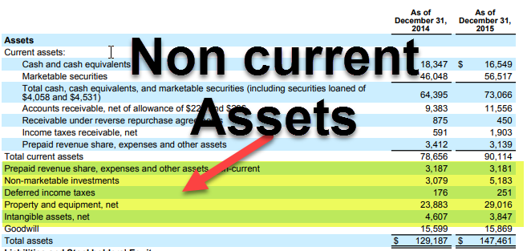

In today's dynamic financial environment, the relationship between noncurrent assets, long-term assets, and algorithmic trading has become increasingly important. Noncurrent assets, which include significant investments that are not easily liquidated, play a crucial role in a company's financial stability and growth. Understanding how these assets are reported on balance sheets is vital, as they influence strategic decisions significantly, particularly in businesses that rely on algorithmic trading for optimizing investment strategies.

Algorithmic trading, a method leveraging advanced algorithms for executing trades at high speeds and precision, integrates well with the management of noncurrent and long-term assets. Emphasizing the importance of these financial metrics, this article will explore how organizations can effectively utilize them to achieve robust asset management and enhance their trading strategies.



Businesses can gain substantial competitive advantages by aligning their asset management practices with the strategic use of algorithmic trading. As companies continue to adapt to evolving financial markets, harnessing these financial concepts is crucial for sustainable growth and increased profitability. The insights provided aim to help businesses leverage these elements to improve their decision-making processes and asset management strategies.

## Table of Contents

## Understanding Noncurrent and Long-Term Assets

Noncurrent assets constitute a crucial component of a business's balance sheet, representing long-term investments that are not readily converted to cash within a year. These assets, characterized by their extended useful life, play a pivotal role in underpinning a company's future growth and operational capabilities. Common examples include tangible assets such as property, machinery, and equipment, as well as intangible assets like patents and goodwill. These assets require strategic management to optimize their value and contribution to a company's financial health.

**Property, Machinery, and Equipment (PP&E):** These are tangible, physical assets used in the production of goods and services. They are vital as they form the backbone of the organization's operational capacity. For example, a manufacturing company heavily relies on its machinery and equipment to produce its products. Proper management, including maintenance and upgrades, is essential to ensure these assets operate efficiently and do not depreciate too rapidly.

**Patents and Intangible Assets:** Intangible assets, such as patents, trademarks, and copyrights, are nonphysical in nature but can be significant revenue generators. For instance, a patent provides legal protection for a unique invention, potentially giving the company a competitive edge in the market. The valuation and renewal of these assets are crucial aspects of management to maintain their legal and economic benefits.

**Investments in Other Companies:** Long-term investments may include stakes in other businesses, ranging from equity investments to joint ventures. These can provide strategic opportunities for growth and diversification, offering potential revenue streams or technological synergies. The management of such investments involves continuous evaluation to align them with the company's strategic objectives and market conditions.

The strategic handling of noncurrent assets is fundamental to achieving sustainable growth. Businesses must devise robust management plans to ensure these assets contribute effectively to long-term objectives, optimize their performance, and minimize obsolescence or impairment risks. This involves both financial understanding and technical expertise to balance investment, depreciation, and potential returns.

## Valuation and Depreciation of Noncurrent Assets

Noncurrent assets, also known as long-term assets, represent investments made by a business that are not intended to be liquidated or converted into cash within a short period, typically exceeding one year. The valuation and depreciation of these assets are crucial for maintaining accurate financial statements and making informed asset management decisions.

### Depreciation of Noncurrent Assets

Depreciation is the accounting method used to allocate the cost of tangible noncurrent assets over their useful lives. This gradual reduction in asset value accounts for wear and tear, age, and obsolescence. The goal is to match the expense of using the asset with the revenue it generates, adhering to the matching principle in accounting.

Several depreciation methods are commonly used:

1. **Straight-Line Depreciation**: This is the most straightforward method, which evenly spreads the cost of an asset over its useful life. The formula is:
$$
   \text{Annual Depreciation Expense} = \frac{\text{Cost of Asset} - \text{Residual Value}}{\text{Useful Life of Asset}}

$$

2. **Declining Balance Depreciation**: This accelerated method results in higher depreciation expenses in the earlier years of an asset's life. The double declining balance method, a common variant, can be calculated as:
$$
   \text{Annual Depreciation Expense} = 2 \times \text{Straight-Line Depreciation Rate} \times \text{Book Value at Beginning of Year}

$$

3. **Units of Production Depreciation**: This method bases depreciation on actual usage or production levels, making it suitable for assets heavily influenced by usage patterns. The formula is:
$$
   \text{Depreciation Expense} = \frac{\text{Cost of Asset} - \text{Residual Value}}{\text{Total Estimated Production}} \times \text{Actual Production for the Year}

$$

### Valuation Methods

Valuing noncurrent assets accurately is essential for balance sheet integrity. Two primary approaches are employed:

1. **Historical Cost Approach**: This method records the asset at its original purchase cost, including any additional expenses incurred to make the asset operational. Historical cost provides a reliable, objective figure but may not reflect the asset's current market value.

2. **Fair Value Approach**: Under this approach, assets are reported at their current market value, which could be higher or lower than the historical cost. This method requires regular revaluation and can provide a more accurate depiction of an asset's worth, but it introduces subjectivity and market volatility into financial statements.

### Importance of Accurate Valuation and Depreciation

Understanding and applying adequate depreciation and valuation methods ensures that a company's financial statements reflect true operational costs and asset value. Accurate reporting aids in decision-making, impacts tax liabilities, and influences investor perceptions of company health. Choosing the appropriate method depends on various factors, including the nature of the asset, industry standards, and specific business needs.

Overall, mastering depreciation techniques and valuation approaches is fundamental for robust asset management and financial reporting, enabling businesses to align their asset strategies with broader financial objectives.

## The Integration of Algorithmic Trading in Asset Management

Algorithmic trading represents a significant advancement in financial management, utilizing sophisticated algorithms to execute trades with unmatched speed and precision. These algorithms analyze vast datasets to identify trading opportunities and manage investment portfolios more effectively than traditional methods. By leveraging predictive analytics, businesses can enhance their decision-making regarding noncurrent assets and optimize their investment strategies for greater profitability.

The integration of [algorithmic trading](/wiki/algorithmic-trading) into asset management involves several key components. Predictive analytics, which uses historical data to forecast future trends, allows traders to make informed decisions about asset allocation. Machine learning models, such as linear regression, support vector machines, and neural networks, are employed to detect patterns and predict asset performance. For instance, a Python-based algorithm using libraries such as pandas, NumPy, and scikit-learn can be developed to process financial data, identify trends, and automate trading decisions.

Here is an example of a basic algorithmic trading strategy leveraging [machine learning](/wiki/machine-learning) in Python:

```python
import pandas as pd
from sklearn.model_selection import train_test_split
from sklearn.ensemble import RandomForestClassifier
from sklearn.metrics import accuracy_score

# Load historical financial data
data = pd.read_csv('financial_data.csv')

# Preprocess the data
feature_columns = ['feature1', 'feature2', 'feature3'] # example features
X = data[feature_columns]
y = data['target'] # target variable, e.g., stock price direction

# Split data into training and testing sets
X_train, X_test, y_train, y_test = train_test_split(X, y, test_size=0.2, random_state=42)

# Train a Random Forest model
model = RandomForestClassifier(n_estimators=100, random_state=42)
model.fit(X_train, y_train)

# Make predictions
predictions = model.predict(X_test)

# Evaluate model accuracy
accuracy = accuracy_score(y_test, predictions)
print(f'Accuracy: {accuracy:.2f}')
```

The predictive models assist in optimizing the management of noncurrent assets by providing insights into future asset values, enabling better timing for asset acquisitions or dispositions. These models also allow companies to maintain agility in their financial strategies, adjusting their positions based on market conditions and asset performance forecasts.

Moreover, algorithmic trading systems can manage and mitigate risk more efficiently. By continuously analyzing market data, they can adjust strategies swiftly in response to market [volatility](/wiki/volatility-trading-strategies), thus protecting asset value and ensuring consistent portfolio performance. As companies aim to align their asset management strategies with broader financial objectives, algorithmic trading offers a powerful tool to enhance strategic planning and achieve business goals.

In summary, businesses can integrate algorithmic trading into their financial strategies by using advanced analytics and machine learning to improve decision-making related to noncurrent assets. This integration supports more responsive asset management and positions organizations to navigate the complexities of the financial landscape effectively.

## Impact on Financial Statements and Company Health

Noncurrent assets, often classified as long-term investments, play a crucial role in shaping a company's balance sheet and overall financial statements. These assets, which include property, machinery, equipment, and intangible assets such as patents, are not only pivotal for long-term growth but also significantly affect a company's financial health indicators.

Starting with the balance sheet, noncurrent assets are listed under the assets section, providing a clear image of the company's long-term investment strategy. This segment of the assets extends beyond cash equivalents, emphasizing the importance of sustainable growth and strategic planning. The presentation and valuation of these assets directly impact solvency and [liquidity](/wiki/liquidity-risk-premium) ratios, essential measures of financial health.

The solvency ratio, which indicates a company’s ability to meet its long-term obligations, is influenced by the management of noncurrent assets. Adequate valuation and depreciation of these assets will reflect realistic net worth and solvency. A high solvency ratio suggests robust financial health and an ability to sustain operations and growth, while a low ratio might signal potential financial distress.

$$
\text{Solvency Ratio} = \frac{\text{Net Income} + \text{Depreciation}}{\text{Total Liabilities}}
$$

Liquidity ratios, such as the current ratio and quick ratio, typically focus on short-term assets but are indirectly influenced by noncurrent asset management. For instance, a company efficiently utilizing its long-term assets may experience improved cash flow and operational efficiency, indirectly bolstering liquidity positions.

$$
\text{Current Ratio} = \frac{\text{Current Assets}}{\text{Current Liabilities}}
$$

Investors and stakeholders closely analyze these metrics to assess the company’s financial stability and growth potential. Accurate and transparent reporting of noncurrent assets provides them with reliable data to evaluate investment risks and business prospects. Companies with well-managed and correctly reported noncurrent assets are often perceived as less risky and more attractive for investment, as they demonstrate competent asset utilization and strategic long-term planning.

Furthermore, proper depreciation methods applied to noncurrent assets ensure that financial statements depict a realistic asset valuation over time. If assets are overvalued due to inadequate depreciation, reported earnings could be misleading, affecting the perceived profitability and financial health of the organization.

In summary, the impact of noncurrent assets on financial statements and company health is multifaceted. Clear, accurate management and reporting of these assets are paramount for sustaining positive solvency and liquidity ratios, ultimately ensuring investor confidence and depicting a company's true financial standing. These aspects highlight the integral role noncurrent assets play not only in immediate financial reporting but also in the broader context of strategic financial management.

## Strategic Financial Management and Planning

Effective financial management is crucial for aligning noncurrent asset management with long-term business goals. This alignment necessitates a thoughtful approach to both resource allocation and risk assessment, ensuring that a company's asset base supports its strategic objectives. Noncurrent assets, such as property, equipment, and investments, represent significant investments in a company's future capacity and market positioning. Proper management of these assets is essential for sustained competitive advantage and profitability.

Algorithmic trading is increasingly utilized as a powerful tool for enhancing strategic financial planning and risk management. By employing advanced algorithms and predictive analytics, businesses can analyze vast amounts of financial data more swiftly and accurately than traditional methods allow. This capability is particularly valuable for optimizing the management of noncurrent assets and financial portfolios. Algorithms can assess market trends, forecast asset depreciation, and evaluate investment risks, providing real-time insights that inform dynamic decision-making.

To integrate algorithmic trading into asset management strategies effectively, companies can adopt several approaches:

1. **Data-Driven Decision Making**: Using algorithmic trading to process financial and market data enables companies to make informed decisions regarding the timing and nature of investments in noncurrent assets. This includes assessing potential returns on investment and forecasting depreciation rates to optimize resource allocation.

2. **Risk Management**: Algorithmic trading systems can evaluate a wide array of risk factors associated with noncurrent assets, from market volatility to interest rate changes. By continuously monitoring these variables, algorithms can recommend strategies to mitigate potential risks, such as diversifying asset holdings or adjusting hedging strategies.

3. **Strategic Investment Planning**: With the analytical power of algorithmic trading, companies can better align their investment strategies with long-term business objectives. By forecasting economic conditions and market trends, algorithms aid in identifying investment opportunities that align with strategic goals, such as entering new markets or expanding production capabilities.

4. **Portfolio Optimization**: Algorithms can optimize the composition of investment portfolios by assessing the performance and risk profile of individual assets. This optimization ensures that the portfolio aligns with a company's risk tolerance and strategic vision, maximizing expected returns while minimizing exposure to potential losses.

Incorporating algorithmic trading into strategic financial management allows companies to enhance their responsiveness to market conditions and improve the accuracy of their financial projections. These capabilities are essential for maintaining financial stability and achieving long-term growth objectives. By leveraging data-driven strategies, businesses can ensure that their noncurrent assets not only support immediate operational needs but also contribute to broader corporate success.

## Conclusion

Mastering balance sheet management, noncurrent asset valuation, and algorithmic trading equips companies with a significant competitive edge. Effective integration of these financial disciplines into operations can lead to sustainable growth and increased profitability. This integration requires not only understanding the individual components but also recognizing their interconnected impacts on a company's financial health.

Balance sheet management involves maintaining optimal levels of assets and liabilities to support business operations and achieve strategic objectives. Noncurrent asset valuation, through methods such as historical cost, fair value, or depreciation, ensures accurate financial representation and helps in assessing a company's true economic position.

Algorithmic trading employs data-driven algorithms to execute trades at speeds beyond human capacity, analyzing market conditions and optimizing trading strategies. By leveraging these algorithms, companies can enhance their investment portfolios, manage risks more effectively, and respond efficiently to market fluctuations.

Sustainable growth hinges on the continuous alignment of these strategies with evolving business goals and market conditions. Businesses must stay informed about advancements in financial technologies and methodologies to adapt their practices accordingly. A proactive approach to education—through training, workshops, or collaboration with financial experts—ensures that companies remain adept at harnessing these complex financial tools.

As the financial landscape continues to shift, ongoing adaptation and education in balance sheet management, noncurrent asset valuation, and algorithmic trading will be crucial. Those who remain flexible and informed will not only survive but thrive in a competitive economic environment.

## References & Further Reading

[1]: ["Advances in Financial Machine Learning"](https://www.amazon.com/Advances-Financial-Machine-Learning-Marcos/dp/1119482089) by Marcos Lopez de Prado

[2]: ["Machine Learning for Algorithmic Trading"](https://github.com/stefan-jansen/machine-learning-for-trading) by Stefan Jansen

[3]: ["Quantitative Trading: How to Build Your Own Algorithmic Trading Business"](https://www.amazon.com/Quantitative-Trading-Build-Algorithmic-Business/dp/1119800064) by Ernest P. Chan

[4]: ["Accounting for Noncurrent Assets"](https://corporatefinanceinstitute.com/resources/accounting/non-current-assets/) - International Financial Reporting Standards (IFRS) on IAS 16 Property, Plant and Equipment

[5]: ["Guide to the Balance Sheet: Components, Format, and Analysis"](https://www.highradius.com/resources/Blog/guide-to-balance-sheet-with-examples/) on Investopedia