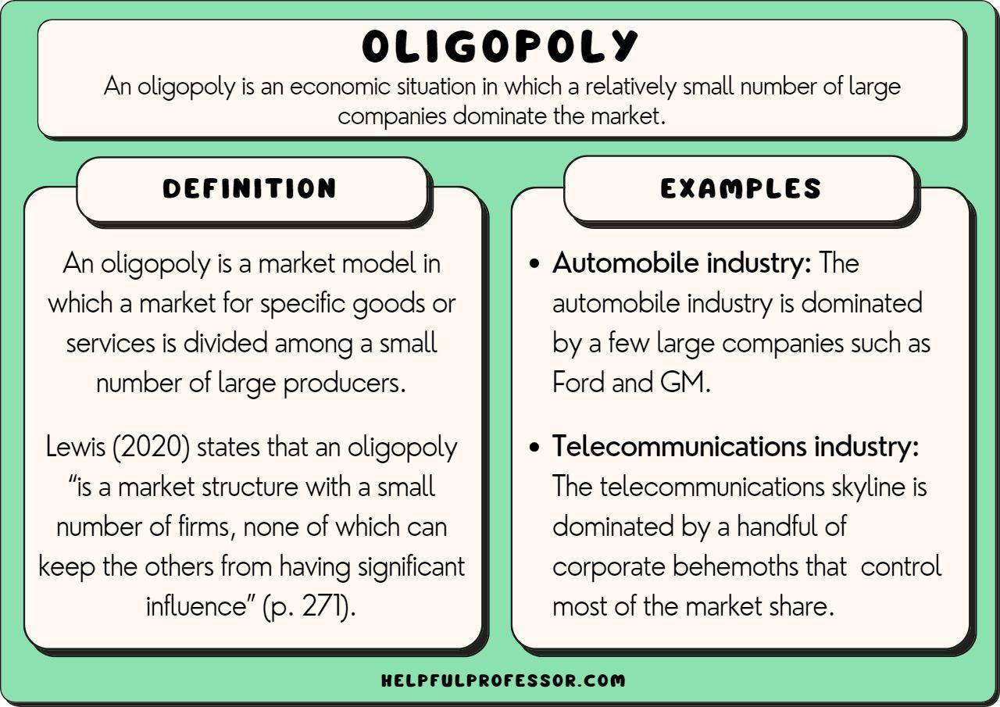

In today's complex economy, oligopoly stands as a prevalent market structure where a select few large firms maintain substantial control over an industry. This article examines the intricacies of oligopoly market structures with a focus on algorithmic trading. Numerous industries operate under oligopolistic conditions, with enterprises like telecommunications and aviation predominantly controlled by a small number of players. These firms exhibit significant interdependence, where the actions of one influence the strategies and economic positions of others—and this dynamic is a hallmark of oligopolies. Understanding how companies operate and compete within these tightly controlled markets informs the decisions of financial analysts, investors, and corporations looking to navigate or thrive in such environments.

Algorithmic trading, a system reliant on advanced technological systems and quantitative models, plays a pivotal role in oligopolistic markets. These automated systems facilitate market transactions based on meticulously programmed strategies. In markets where few firms hold sway, algorithmic trading can leverage price patterns and market anomalies with precision, driving efficiencies like increased liquidity and reduced bid-ask spreads. While these technologies introduce opportunities, they also pose challenges, including potential market distortions or vulnerabilities to high-frequency trading dynamics.



Investors and analysts seeking to engage with oligopolistic markets benefit from comprehending the strategic behaviors unique to these structures. Knowledge of principal industry players and insights into how algorithmic trading interfaces with oligopolies provide a competitive edge. Staying informed about regulatory changes is equally vital, as oversight aims to maintain competitive balance and protect consumers within these complex systems. Understanding these dynamics not only supports informed decision-making but is essential for those aiming to succeed in such influential market environments.

## Table of Contents

## What is an Oligopoly?

An oligopoly is a distinct market structure that features a limited number of firms whose actions are highly interdependent. This interdependence means that the decisions made by one firm can significantly impact the others, leading to strategic behaviors to maintain competitive advantage. These firms wield considerable market power, enabling them to influence both product prices and the overall market output.

Unlike monopolies, which are dominated by a single company, oligopolies comprise a few dominant firms, each holding substantial shares of the market. The presence of multiple powerful firms results in a competitive yet controlled environment where price wars are usually avoided in favor of stability and profitability. This characteristic allows firms within an oligopoly to engage in strategies like non-price competition, including product differentiation and marketing efforts, to attract and retain customers without directly altering prices.

Industries that commonly exhibit oligopoly structures include the automotive, telecommunications, and airline sectors. In the automotive industry, major players such as Toyota, Ford, and Volkswagen dominate the global market, dictating trends and innovations. The telecommunications sector in the United States is controlled by a few key companies like AT&T, Verizon, and T-Mobile, each competing within a highly regulated market to provide service and technological advancements. Similarly, the airline industry is characterized by a few major airlines like American, Delta, and United, which collectively transport a significant majority of domestic passengers.

These oligopolistic markets often present high barriers to entry, deterring new competitors from penetrating the market and challenging established firms. Such barriers can include high initial capital investment, economies of scale, and significant brand loyalty. Consequently, oligopolies sustain a stable market structure over time, where the small number of dominant firms can exert influence and drive industry standards.

In summary, an oligopoly is defined by the dominance of a few firms with interdependent actions, high market control, and substantial barriers to entry, significantly shaping the competitive landscape of several key industries.

## Examples of Oligopolistic Markets

Oligopolistic markets are characterized by the dominance of a few major corporations, which exert significant control over their respective industries. The automotive industry is a prime example, where companies like Toyota, Ford, and Volkswagen lead the market. These manufacturers not only shape consumer preferences but also benefit from economies of scale, allowing them to influence pricing and innovation across the sector. For instance, these firms routinely invest in advanced technologies such as electric vehicles and automation, setting industry standards and challenging smaller competitors.

In the telecommunications sector within the United States, the market is predominantly controlled by a triad of companies: AT&T, Verizon, and T-Mobile. These players command substantial market power, which they leverage to set competitive pricing and service standards. The scale and influence of these companies often lead to limited choices for consumers, making market entry challenging for new firms due to high infrastructure costs and regulatory constraints.

The airline industry similarly exhibits oligopolistic traits, particularly in the United States, where American Airlines, Delta Air Lines, and United Airlines occupy a leading position. These airlines manage the majority of domestic passenger flights, which enables them to coordinate flight schedules, manage capacity, and control pricing effectively. Their dominance is reinforced by substantial barriers to entry for new airlines, such as limited airport slots and regulatory requirements.

Additionally, the mass media and technology sectors demonstrate oligopolistic characteristics. A few large corporations govern substantial market shares, influencing content, distribution, and technological advancements. Companies like Alphabet (Google), Meta Platforms (Facebook), and Apple, through their control of essential platforms and services, guide the direction of both industries. Their expansive reach and financial capabilities allow them to invest heavily in research and development, further solidifying their market position and creating significant barriers for emerging competitors.

These examples of oligopolistic markets underscore the substantial power and influence a handful of companies can wield, impacting economic landscapes and consumer choices.

## Characteristics and Behavior of Oligopolies

Oligopolies are characterized by the presence of a few large firms that dominate the market, creating a unique landscape where market dynamics are heavily influenced by the interactions between these dominant players. A key feature of oligopolistic markets is the significant interdependence among the companies. This interdependence means that the actions of one firm can have substantial repercussions on the others. For instance, if one company reduces its prices, competitors may feel compelled to follow suit to maintain their market share, leading to potential price wars or shifts in strategic positioning.

The presence of high barriers to entry is another defining characteristic of oligopolies. These barriers may stem from several factors including substantial capital requirements, stringent regulatory frameworks, or complex technological demands. As a result, new entrants face considerable challenges when trying to penetrate the market, thereby protecting the established firms and often leading to a stable market structure over time.

Oligopolistic firms may also engage in collusion, whether explicitly through formal agreements or implicitly through tacit understanding, with the aim of controlling prices or output levels. Explicit collusion is typically realized through cartels, where firms agree on quantities to produce or prices to charge, though such practices are illegal in many jurisdictions due to their anti-competitive nature. Implicit collusion, however, can occur without direct communication, as firms may simply follow a dominant price leader or observe the patterns of their competitors to align their strategies accordingly.

These characteristics not only delineate oligopolies from other market structures but also contribute to the strategic complexity faced by firms operating within these markets. Understanding these elements is crucial for stakeholders, as the behavior of oligopolistic firms can significantly impact market outcomes and consumer welfare.

## Algorithmic Trading in Oligopolistic Markets

Algorithmic trading, often referred to as 'algo trading,' involves the use of automated systems that execute trades based on pre-set criteria and strategies. These systems leverage advanced mathematical models and computational power to analyze market data and make transactions at speeds and frequencies that are impossible for human traders. In oligopolistic markets, where a few large firms dominate, [algorithmic trading](/wiki/algorithmic-trading) can have significant impacts.

One major advantage of algorithmic trading in oligopolistic environments is its ability to identify and exploit price patterns and market anomalies before they are detected by other market players. These patterns often emerge due to the concentration of market power among a few firms, whose interdependent actions can lead to predictable price movements. Algorithms programmed to recognize these patterns can execute trades rapidly, thereby gaining an advantage over traditional trading methods.

Additionally, algorithmic trading contributes to market efficiency by increasing [liquidity](/wiki/liquidity-risk-premium). The presence of algorithms capable of executing trades swiftly reduces the time and price [volatility](/wiki/volatility-trading-strategies) between buy and sell offers, thereby narrowing bid-ask spreads. This increased liquidity benefits all market participants, including smaller investors, by facilitating smoother price discovery and reducing transaction costs.

The effects of algorithmic trading in oligopolistic markets can be profound, influencing both pricing and market dynamics. For instance, the rapid execution of large volumes of trades can lead to substantial short-term price movements. This can impact market stability, especially in markets with limited competition where fewer players have a substantial influence on prices.

To capture these effects using a simple mathematical model, consider an algorithm designed to detect a specific price trend and execute trades when certain conditions are met. If $P_t$ is the price at time $t$, an algorithm may execute a buy order if $P_t < \min(P_{t-1}, P_{t-2}, \ldots, P_{t-n})$ (a local minimum over $n$ time periods), expecting a rebound based on historical data.

In Python, a simplistic algorithm for detecting such a condition and executing trades might look like this:

```python
import numpy as np

def algo_trade(prices, window_size):
    trades = []
    for i in range(window_size, len(prices)):
        if prices[i] < np.min(prices[i-window_size:i]):
            trades.append((i, 'buy', prices[i]))
    return trades

prices = [100, 98, 95, 97, 96, 99, 102]
window_size = 3
trades = algo_trade(prices, window_size)
print(trades)
```

This script identifies points where the price is at a local minimum within a specified window, simulating a simple algo trading strategy.

Algorithmic trading in oligopolistic markets thus serves as both a tool for enhancing market operations and a source of potential volatility. Understanding these dynamics is essential for stakeholders looking to harness the benefits of algo trading while mitigating its risks. This complex interplay underlines the importance of regulatory oversight to ensure competitive practices continue to protect market integrity and consumer interests.

## Implications for Investors

Investors in oligopolistic markets can gain a strategic edge by deeply understanding the behavior of dominant firms and the overall market dynamics. Acknowledging the presence of key industry players, such as major corporations in the automotive, telecommunications, and airline sectors, can provide valuable insights into market strategies and competitive actions. Such knowledge enables investors to predict potential market shifts and make informed decisions tailored to exploit these dynamics.

To fully leverage opportunities in oligopolistic markets, investors must embrace algorithmic trading, which offers a methodical and data-driven approach to executing trades. Algorithmic trading in these markets requires proficiency in advanced quantitative techniques and robust technology systems to analyze large datasets swiftly and accurately. This may include implementing [machine learning](/wiki/machine-learning) models, statistical [arbitrage](/wiki/arbitrage), or high-frequency trading algorithms designed to identify and capitalize on pricing inefficiencies.

For instance, Python might be employed in developing an algorithmic trading strategy. An illustrative example of such a strategy involves using moving averages to detect trends. Consider the following Python snippet for computing a simple moving average:

```python
import pandas as pd

# Assuming 'data' is a pandas DataFrame containing historical stock prices
window_size = 20
data['SMA'] = data['Close'].rolling(window=window_size).mean()

# Signal generation (buy when price crosses above SMA, sell when below)
data['Signal'] = 0
data.loc[data['Close'] > data['SMA'], 'Signal'] = 1
data.loc[data['Close'] < data['SMA'], 'Signal'] = -1
```

This code computes a 20-day simple moving average (SMA) and generates buy/sell signals based on the relationship between current prices and the SMA. Similar strategies can be applied to identify market patterns specific to oligopolistic scenarios.

Another critical consideration for investors is the regulatory landscape. Oligopolistic markets are subject to significant regulatory scrutiny aimed at preventing anti-competitive practices such as price fixing or collusion. Changes in regulations can have profound implications on market operations and company strategies. Hence, remaining informed about legal developments and adapting investment strategies accordingly is essential to mitigate risks associated with compliance failures.

Ultimately, a nuanced understanding of oligopolistic market structures, combined with cutting-edge trading technology and awareness of regulatory environments, enables investors to craft sophisticated investment strategies that capitalize on the unique characteristics of these markets.

## Conclusion

Oligopolies significantly influence major industries by enabling a few dominant players to exert control over market trends. This market structure, characterized by limited competition, creates both opportunities and challenges, especially when algorithmic trading enters the mix. Algorithmic trading, through automated systems and intricate strategies, allows for the rapid execution of transactions, potentially exploiting inefficiencies in these oligopolistic markets.

The interplay between algorithmic trading and oligopolistic markets requires careful analysis. On one hand, algorithmic trading can enhance market efficiency by increasing liquidity and narrowing bid-ask spreads. On the other hand, it can also introduce complexities that might not be present in more competitive markets. For investors, recognizing these market dynamics is key to creating strategies that leverage the strengths of algorithmic trading while being mindful of its inherent risks.

Regulatory oversight remains essential in maintaining a fair balance within oligopolistic markets. By instituting regulations that prevent anti-competitive practices, authorities can safeguard both marketplace integrity and consumer interests. Continuous monitoring and updating of these regulations are necessary to address the evolving nature of these markets and ensure that competition persists, preventing dominant players from engaging in unfair practices.

For investors and businesses, an in-depth understanding of oligopolies and their interaction with algorithmic trading is invaluable. By acknowledging and anticipating the potential impacts of regulation, these stakeholders can make more informed decisions that align with both market conditions and regulatory landscapes. This awareness is crucial in navigating the complex dynamics of oligopolistic markets while striving for profitability and compliance.

## References & Further Reading

[1]: ["Oligopoly"](https://www.investopedia.com/terms/o/oligopoly.asp) on Investopedia

[2]: Lopez de Prado, M. (2018). ["Advances in Financial Machine Learning"](https://www.amazon.com/Advances-Financial-Machine-Learning-Marcos/dp/1119482089). Wiley.

[3]: Aronson, D. R. (2006). ["Evidence-Based Technical Analysis: Applying the Scientific Method and Statistical Inference to Trading Signals"](https://www.amazon.com/Evidence-Based-Technical-Analysis-Scientific-Statistical/dp/0470008741). Wiley.

[4]: Jansen, S. (2020). ["Machine Learning for Algorithmic Trading: Predictive models to extract signals from market and alternative data for systematic trading strategies with Python"](https://www.amazon.com/Machine-Learning-Algorithmic-Trading-alternative/dp/1839217715). Packt Publishing.

[5]: Chan, E. P. (2009). ["Quantitative Trading: How to Build Your Own Algorithmic Trading Business"](https://github.com/ftvision/quant_trading_echan_book). Wiley.