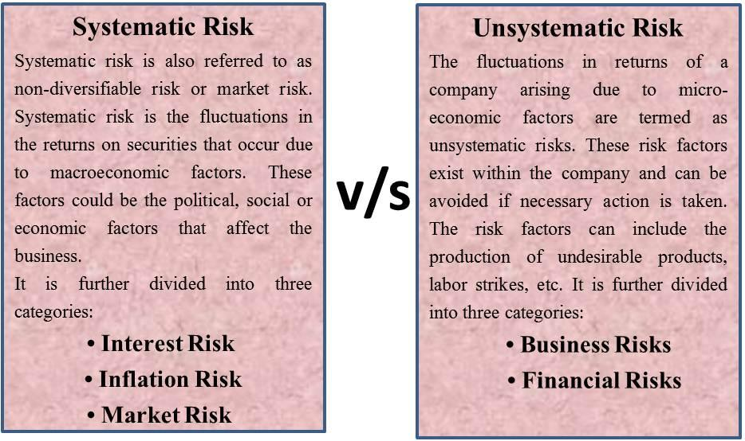

## Table of Contents

## What is unsystematic risk?

Unsystematic risk is the risk that comes from a specific company or industry. It's also called "specific risk" or "diversifiable risk." This kind of risk can be reduced by spreading your investments across different companies and industries. For example, if you only invest in one company and that company does poorly, you could lose a lot of money. But if you invest in many different companies, the poor performance of one company won't hurt your overall investment as much.

On the other hand, unsystematic risk is different from systematic risk, which affects the whole market or economy. Things like interest rates, inflation, and recessions are examples of systematic risk. You can't get rid of systematic risk by diversifying your investments. But you can manage unsystematic risk by not putting all your eggs in one basket. By investing in a variety of companies and industries, you can lower the impact of any single company's problems on your investment portfolio.

## How does unsystematic risk differ from systematic risk?

Unsystematic risk is the risk that comes from a specific company or industry. It's like when one company has problems, like bad management or a product that doesn't sell well. This risk can be reduced by spreading your money across different companies and industries. If you only invest in one company and it does badly, you could lose a lot. But if you invest in many different companies, the poor performance of one won't hurt your overall investment as much.

Systematic risk, on the other hand, affects the whole market or economy. It's like when something big happens that impacts everyone, like a change in interest rates, inflation, or a recession. You can't avoid this kind of risk by diversifying your investments because it affects everything. So, while you can manage unsystematic risk by not putting all your eggs in one basket, systematic risk is something you just have to live with when you invest.

## Can you provide a simple example of unsystematic risk?

Imagine you have all your money invested in a company that makes smartphones. One day, the company's new phone model has a big problem - the battery keeps catching fire. This makes a lot of customers angry and they stop buying the phones. The company's stock price goes down a lot because of this issue. This is an example of unsystematic risk because it's a problem that only affects this one company.

If you had invested your money in many different companies, like some in smartphones, some in cars, and some in food, the problem with the smartphone company wouldn't hurt your overall investment as much. By spreading your money around, you can lower the impact of unsystematic risk.

## What are common sources of unsystematic risk in a business?

Unsystematic risk in a business can come from many places. One common source is the company's management. If the people running the company make bad decisions, like launching a product that nobody wants or spending too much money, it can hurt the company's profits and stock price. Another source can be the company's operations. If something goes wrong, like a factory breaking down or a key supplier going out of business, it can stop the company from making its products and cause big problems.

Another source of unsystematic risk is competition. If a new company comes along and starts taking away customers, it can hurt the original company's sales and profits. Legal issues can also be a big source of unsystematic risk. If a company gets sued for something like a faulty product or breaking the law, it can cost a lot of money and damage the company's reputation. All these things are specific to the company and can be managed by spreading investments across different companies and industries.

## How can unsystematic risk affect individual investments?

Unsystematic risk can really shake up individual investments. Imagine you put all your money into one company's stock. If that company runs into trouble, like a big lawsuit or a failed product launch, the value of your investment could drop a lot. This kind of risk is all about problems that hit just one company or industry. If the company you invested in does poorly because of these issues, you could lose a big chunk of your money.

But there's a way to soften the blow of unsystematic risk. By spreading your money across different companies and industries, you can protect yourself better. If one company has a bad year, the others might do well and balance things out. This is called diversification. It's like not putting all your eggs in one basket. By doing this, you can lower the impact of any single company's problems on your overall investment.

## What are some industry-specific examples of unsystematic risk?

In the tech industry, unsystematic risk can come from things like a company's new product not working right. Imagine a tech company spends a lot of money to make a new phone, but when it comes out, the phone's battery keeps catching fire. This makes customers mad and they stop buying the phone. The company's stock price goes down a lot because of this problem. This is an example of unsystematic risk because it only affects this one company and not the whole tech industry.

In the car industry, unsystematic risk can happen if a car company has to recall a lot of cars because they are not safe. Let's say a car company finds out that some of their cars have a problem with the brakes. They have to call back all those cars to fix them, which costs a lot of money and makes customers not trust the company. The company's stock price goes down because of this issue. This is another example of unsystematic risk because it's a problem that only affects this one car company and not the whole car industry.

## How can a company mitigate unsystematic risk?

A company can mitigate unsystematic risk by making sure they have good management. This means having leaders who make smart decisions, like not spending too much money on things that won't help the company. They should also keep an eye on what's going on in the company, like making sure their factories are working well and their suppliers are reliable. If something goes wrong, like a factory breaking down, they should have a plan to fix it quickly so it doesn't hurt the company too much.

Another way a company can lower unsystematic risk is by keeping an eye on the competition. If they see a new company coming in and taking away customers, they can come up with new ideas or better products to keep their customers happy. Also, they should try to avoid legal problems, like making sure their products are safe and they follow the law. If they get sued for something, it can cost a lot of money and make customers not trust them. By being careful about these things, a company can reduce the chance of unsystematic risk hurting their business.

## What role does diversification play in managing unsystematic risk?

Diversification is like a superhero when it comes to fighting unsystematic risk. Imagine you have all your money in one company's stock. If that company has a bad year because of a problem only they face, like a lawsuit or a product that flops, your investment could lose a lot of value. But if you spread your money across different companies and industries, the trouble of one company won't hurt your whole investment as much. This is because while one company might be doing badly, others might be doing well and can help balance things out.

By diversifying, you're not putting all your eggs in one basket. You can invest in tech, cars, food, and more. If the tech company you invested in has a problem, like a faulty phone, the car and food companies might still be doing okay. This way, the ups and downs of any single company or industry won't shake up your entire investment. Diversification is a smart way to lower the impact of unsystematic risk and keep your investments safer.

## Can you explain a case study where unsystematic risk significantly impacted a company?

Let's talk about a real example of unsystematic risk with the company Enron. Enron was a big energy company that seemed to be doing really well. But in 2001, it came out that the company's leaders were hiding how bad the company was doing. They were lying about the company's money and making it look like they were making more than they really were. When people found out, Enron's stock price dropped a lot, and the company went bankrupt. This was a huge problem for people who had invested in Enron because they lost a lot of money. This was an example of unsystematic risk because it was a problem that only affected Enron and not the whole energy industry.

If someone had all their money in Enron's stock, they would have been in big trouble. But if they had spread their money across different companies, the problems at Enron wouldn't have hurt their whole investment as much. This shows how important it is to diversify your investments. By not putting all your eggs in one basket, you can protect yourself from the kind of risk that can come from one company's problems. Enron's story is a big lesson in how unsystematic risk can really shake things up for a company and its investors.

## How do financial analysts assess and quantify unsystematic risk?

Financial analysts assess and quantify unsystematic risk by looking at things that can go wrong with a specific company. They check the company's management to see if they make good decisions or if they might mess things up. They also look at the company's operations, like if their factories work well or if they have good suppliers. Analysts might use numbers like the standard deviation of the company's stock returns to see how much the stock price jumps around. A bigger jump means more unsystematic risk. They can also look at the company's financial reports to see if they have any big debts or if they're spending too much money on things that won't help the company.

Another way analysts quantify unsystematic risk is by using something called beta. Beta measures how much a company's stock moves compared to the whole market. But to find unsystematic risk, they use a different number called alpha. Alpha shows how much a company's stock goes up or down because of things that only affect that company, not the whole market. A big alpha means the company has a lot of unsystematic risk. By using these numbers and looking closely at the company, analysts can figure out how much unsystematic risk there is and help investors decide if it's worth the risk to invest in that company.

## What advanced strategies can investors use to hedge against unsystematic risk?

Investors can use advanced strategies like options and futures to hedge against unsystematic risk. Options give investors the right, but not the obligation, to buy or sell a stock at a certain price. If an investor thinks a company might have a problem that could make its stock go down, they can buy a put option. This lets them sell the stock at a set price even if the stock's value drops a lot. Futures are another tool that lets investors agree to buy or sell something at a future date for a set price. By using these tools, investors can protect themselves from big drops in a company's stock price caused by unsystematic risk.

Another strategy is to use stop-loss orders. A stop-loss order is like a safety net that automatically sells a stock if it drops to a certain price. This can limit how much money an investor loses if a company they invested in runs into trouble. Investors can also use portfolio insurance, which is a way to protect their whole investment by buying options or other financial products that go up in value when the market goes down. By using these advanced strategies, investors can better manage the risks that come from problems specific to one company or industry.

## How does unsystematic risk influence portfolio management and asset allocation decisions?

Unsystematic risk plays a big role in how people manage their investments and decide where to put their money. When someone is building their investment portfolio, they want to make sure they don't put all their money into just one company or industry. This is because if that one company or industry has a problem, like a lawsuit or a product that doesn't sell, it can make their investment lose a lot of value. By spreading their money across different companies and industries, they can lower the chance of losing a lot because of one company's troubles. This way of spreading out investments is called diversification, and it's a key part of managing unsystematic risk.

When it comes to deciding how much money to put into different kinds of investments, like stocks, bonds, or real estate, unsystematic risk also matters. If someone knows a certain company has a lot of unsystematic risk, they might decide to put less money into that company's stock. Instead, they might put more money into other companies or different kinds of investments that they think are safer. By thinking about unsystematic risk, investors can make smarter choices about how to split up their money to keep their investments safer and more balanced.

## What is the role of Financial Analysis in Risk Management?

Financial analysis is integral to managing unsystematic risk by employing quantitative metrics such as standard deviation, beta, and alpha. These metrics provide valuable insights into the [volatility](/wiki/volatility-trading-strategies) and performance of individual securities or portfolios, aiding investors in making informed decisions.

Standard deviation is a statistical measure that indicates the extent of variation or [dispersion](/wiki/dispersion-trading) of a set of values. In finance, it is used to gauge the volatility of a security or portfolio, where a higher standard deviation signifies greater risk due to a larger variability in returns. For an asset with return $R_i$ over a period, and expected return $\mu$, the standard deviation $\sigma$ is calculated as:

$$
\sigma = \sqrt{\frac{1}{N}\sum_{i=1}^{N}(R_i - \mu)^2}
$$

Beta, another crucial metric, measures the sensitivity of a security's returns to the overall market returns. A beta greater than one indicates that the security is more volatile than the market, while a beta less than one suggests it is less volatile. This metric helps investors understand how market movements may impact the security, allowing them to adjust their risk management strategies accordingly. In a regression model, beta is the coefficient that correlates the returns of the asset with the returns of the market.

Alpha represents the excess return of a security or portfolio relative to the return of a benchmark index. It reflects the value that a portfolio manager adds or subtracts from a portfolio's return through active management. Positive alpha indicates outperformance relative to the benchmark, suggesting effective management and mitigation of risks, while a negative alpha implies underperformance.

Advanced techniques, such as multivariate regression, extend these analyses by examining the impact of multiple risk factors on asset returns. This approach enables investors to account for various variables and correlations, offering a comprehensive view of potential risks. For instance, a multivariate regression model can be represented as:

$$
R_i = \alpha + \beta_1 F_1 + \beta_2 F_2 + \ldots + \beta_n F_n + \epsilon
$$

In this equation, $R_i$ is the return of asset $i$, $\alpha$ is the intercept, $\beta_n$ are the coefficients for each [factor](/wiki/factor-investing) $F_n$, and $\epsilon$ is the error term. By analyzing how these factors influence returns, investors can effectively manage unsystematic risks specific to their investments.

These financial analysis tools and techniques form the backbone of a robust risk management strategy. By providing a quantifiable understanding of risk, they enable informed decision-making, helping investors mitigate unsystematic risks and enhance portfolio performance.

## References & Further Reading

1. **Marcos López de Prado**
   - López de Prado, M. (2018). *Advances in Financial Machine Learning*. Wiley. This book investigates into machine learning applications in finance, exploring methodologies that are essential for managing and understanding risks, including unsystematic risk in algorithmic trading.
   - López de Prado, M. (2013). *The Mathematics of Pairs Trading: Applications to Statistical Arbitrage*. This paper discusses statistical techniques used to mitigate risks in pairs trading, a strategy used in algorithmic trading.

2. **Ernest P. Chan**
   - Chan, E. P. (2009). *Quantitative Trading: How to Build Your Own Algorithmic Trading Business*. Wiley. This book provides a practical approach to developing algorithmic trading strategies, emphasizing risk management techniques, including those addressing unsystematic risk.
   - Chan, E. P. (2013). *Algorithmic Trading: Winning Strategies and Their Rationale*. Wiley. Here, Chan explores various algorithmic strategies, highlighting the importance of managing various risks for successful algorithmic trading.

3. **John C. Hull**
   - Hull, J. C. (2018). *Options, Futures, and Other Derivatives*. Pearson. This textbook is a comprehensive resource on derivatives markets, offering insight into hedging strategies that can be employed to manage unsystematic risks.

4. **Nassim Nicholas Taleb**
   - Taleb, N. N. (2007). *The Black Swan: The Impact of the Highly Improbable*. Random House. This book discusses unexpected events and their financial impact, providing a contextual understanding of risk, which is relevant when managing unsystematic risk.

5. **Financial Analysis and Risk Management Techniques**
   - Bodie, Z., Kane, A., & Marcus, A. J. (2014). *Investments*. McGraw-Hill Education. This comprehensive guide covers investment principles, including risk management methods integral to both systematic and unsystematic risks.
   - Elton, E. J., & Gruber, M. J. (2011). *Modern Portfolio Theory and Investment Analysis*. Wiley. Discusses advanced portfolio management techniques for mitigating risks.

6. **Research Papers and Articles**
   - Fama, E. F., & French, K. R. (1993). *Common Risk Factors in the Returns on Stocks and Bonds*. Journal of Financial Economics, 33(1), 3–56. This influential paper analyzes risk factors, offering insights into diversifying investment portfolios to reduce unsystematic risk.
   - Carhart, M. M. (1997). *On Persistence in Mutual Fund Performance*. Journal of Finance, 52(1), 57-82. This paper evaluates mutual fund risk and performance, contributing to the understanding of risk management strategies.

These works collectively provide a detailed insight into understanding and managing unsystematic risks, especially within the context of algorithmic and [quantitative trading](/wiki/quantitative-trading) strategies.

