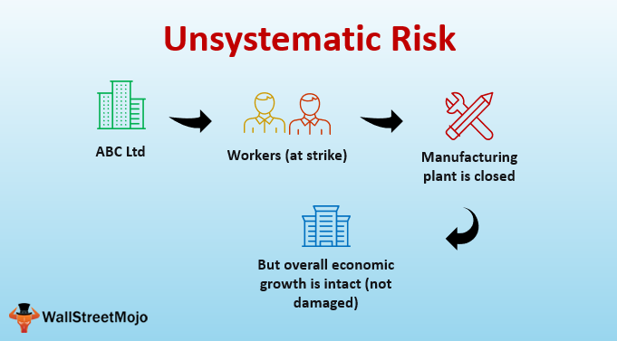

In the dynamic world of finance, understanding different types of risks is crucial for investors and traders, especially when employing algorithmic trading strategies. Unsystematic risk, also referred to as specific or idiosyncratic risk, impacts individual investments and companies. It arises from factors unique to a particular business or industry, such as management decisions or market position. Unlike systematic risk, which influences the entire market and cannot be avoided, unsystematic risk can be mitigated through strategic diversification. By distributing investments across various sectors and assets, investors can reduce the impact of any single asset's poor performance on their portfolio.

This article examines the complexities of unsystematic risk, paying particular attention to business and financial risks in the context of investment and trading strategies. We will explore how algorithmic trading, with its reliance on automated systems and data-driven decision-making, can affect these types of risks. Algorithmic trading can quickly assess and react to market conditions, but it also introduces unique challenges in risk management. Ensuring that these systems are equipped with robust risk management frameworks is essential for minimizing unsystematic risks effectively.



By analyzing and effectively managing unsystematic risks, investors can enhance the resilience of their portfolios and optimize returns. Through informed diversification and continuous monitoring, it is possible to anticipate potential issues and adjust strategies accordingly, thereby maximizing potential gains and maintaining stability even amidst uncertainty.

## Table of Contents

## Understanding Unsystematic Risk

Unsystematic risk, or specific risk, refers to potential threats that are unique to a particular company or industry. Unlike systematic risk, which encompasses market-wide threats and affects the entire market, unsystematic risk is confined to specific entities and can be effectively mitigated through strategic diversification. This form of risk arises from various sources, including management decisions, financial practices, operational efficiencies, and regulatory changes, each contributing to the overall risk profile of an individual investment.

Management decisions play a crucial role in shaping the trajectory of a company. These decisions can encompass strategic planning, business expansion, and operational reorganization, all of which can influence a company's stability and profitability. Ineffective or misguided management choices can lead to operational inefficiencies or financial distress, thereby increasing the company's specific risk.

Financial practices involve the management of a company's capital structure, including its funding and leverage strategies. High levels of debt or poor financial management can expose a company to increased financial risk, affecting its ability to withstand economic fluctuations and lowering its creditworthiness. By optimizing their capital structures, companies can reduce their exposure to specific financial threats.

Operational efficiencies are pivotal in driving a company's productivity and competitiveness. Breakdowns in operational processes, such as supply chain disruptions or technological failures, can lead to increased costs and lost revenue, heightening the unsystematic risk faced by a company. Employing robust operational strategies can mitigate these risks, enhancing overall performance.

Regulatory changes introduce an external source of risk, as companies must adapt to new laws and compliance standards. Changes in regulations can impact operational costs and market accessibility, affecting a company's strategic positioning. Keeping abreast of regulatory developments and ensuring compliance can help companies manage this aspect of unsystematic risk.

By identifying and understanding these key sources of unsystematic risk, investors can make more informed decisions. Diversification remains a fundamental strategy for mitigating specific risks, as investing across various sectors reduces the potential impact of any single company's or industry's adversity on the overall portfolio. By doing so, investors can better manage their portfolios, enhancing resilience and optimizing returns.

## Types of Unsystematic Risk

Unsystematic risk is a type of investment risk that is inherent to a specific company or industry. It can be categorized into several distinct types: business, financial, operational, strategic, and legal risks. Each of these risk categories has unique implications for the affected entities.

**Business Risk**  
Business risk refers to the potential for a company to experience financial losses due to its operational choices and market positioning. Factors influencing business risk include product demand, competition, and fixed costs. For example, a company heavily reliant on a single product may face substantial business risk if market demand shifts or competitors introduce superior alternatives. Managing business risk involves careful analysis and adaptation to market trends, which inherently varies across industries.

**Financial Risk**  
Financial risk is associated with a company's capital structure and its ability to manage debt and leverage effectively. It arises from borrowing activities and the obligations to meet the costs of debt financing, such as interest payments. A highly leveraged company, i.e., one with a high debt-to-equity ratio, is more susceptible to financial risk as economic downturns or [interest rate](/wiki/interest-rate-trading-strategies) increases can impact its ability to meet financial obligations, possibly leading to insolvency. Assessing financial risk involves analyzing financial ratios such as the debt-to-equity ratio and interest coverage ratio.

**Operational Risk**  
Operational risk arises from failures in internal processes, systems, or policies that can disrupt company operations and lead to financial losses. This risk category includes issues like process inefficiencies, technology failures, human errors, or external events. Companies can manage operational risk through strong internal controls, robust infrastructure, and regular audits to ensure compliance and operational efficiency. 

**Strategic Risk**  
Strategic risk is connected to decisions that affect the long-term direction and performance of a company. This includes decisions related to new market entries, product launches, and other significant business initiatives. Poor strategic decisions can lead to loss of competitive advantage or market share. Monitoring strategic risk involves continuous environmental scanning and strategic planning to align with changing market dynamics and consumer preferences.

**Legal Risk**  
Legal risk stems from the potential for legal actions and regulatory changes which can impact a company's operations. It encompasses the risks related to legal compliance, such as employment laws, environmental regulations, and intellectual property rights. Non-compliance with applicable laws and regulations can result in legal penalties, fines, or reputational damage. To manage legal risks, businesses must ensure they have up-to-date knowledge of all relevant laws and maintain comprehensive compliance programs.

By identifying and managing these types of unsystematic risks, companies can mitigate potential losses and enhance stability. Effective risk management strategies are crucial for maintaining competitive edges and safeguarding financial health in the ever-evolving market landscape.

## Unsystematic Risk in Algo Trading

Algorithmic trading utilizes computer algorithms to automate trading decisions with high speed and efficiency. While this technological advancement offers numerous benefits, it also brings unique challenges related to the management of unsystematic risks. These specific risks are not market-wide but pertain to individual investments and companies, posing potential threats if not adequately managed within the trading algorithms.

To effectively mitigate unsystematic risks, it is essential to embed robust risk management frameworks within the trading algorithms. This involves the development and implementation of strategies that can dynamically adjust to changes in market conditions. Such frameworks help in identifying potential risks associated with specific assets or companies, enabling traders to take preemptive measures to safeguard their portfolios.

Scenario analysis and [backtesting](/wiki/backtesting) are vital tools in evaluating how trading algorithms react to different market situations. Scenario analysis involves simulating various market conditions to observe potential impacts on investment strategies. This helps traders anticipate possible outcomes and design strategies that minimize adverse effects. Backtesting, on the other hand, involves applying trading algorithms to historical data to assess their performance and risk levels in past scenarios. This process provides valuable insights into the effectiveness of the algorithm under various conditions and highlights areas for improvement.

Through a thorough understanding of specific risks, algorithmic traders can optimize their investment strategies. By modeling different scenarios and testing their strategies with historical data, traders can refine their algorithms, ensuring they are better equipped to handle unforeseen events. This proactive approach helps mitigate unsystematic risks, ultimately enhancing the resilience and profitability of trading strategies.

In summary, [algorithmic trading](/wiki/algorithmic-trading) presents a unique set of challenges concerning unsystematic risks, requiring nuanced and advanced risk management techniques. By leveraging scenario analysis and backtesting, traders can develop resilient strategies that protect investments against specific risks, thereby improving overall trading performance.

## Risk Management Strategies

Diversification is a fundamental strategy for mitigating unsystematic risk. By allocating investments across various sectors or asset classes, investors can reduce the impact of adverse events affecting a specific company or industry. This principle is grounded in the idea that different sectors often respond differently to economic events; thus, poor performance in one area can be offset by stability or growth in another.

Hedging with financial instruments like options and futures provides an additional layer of protection against adverse price movements. Options contracts give investors the right, but not the obligation, to buy or sell an asset at a predetermined price, offering a form of insurance against market fluctuations. Futures contracts, on the other hand, obligate the parties to transact at a specific price and date in the future, allowing traders to lock in prices and hedge against future price [volatility](/wiki/volatility-trading-strategies). These instruments are crucial in managing unsystematic risks as they allow investors to protect specific positions in their portfolios.

Continuous monitoring of financial metrics is essential for real-time strategy adjustments and risk management. By keeping track of key indicators such as volatility, market trends, and company performance, investors can make informed decisions swiftly. Today, thanks to advancements in technology, algorithmic trading systems often incorporate real-time data feeds that allow for instantaneous analysis and decision-making. This continuous monitoring is vital for recognizing early signs of unsystematic risks and reacting accordingly before they escalate.

Stress testing is another important tool in the arsenal of risk management strategies. It involves simulating extreme market conditions to evaluate how a portfolio might perform during such scenarios. By conducting stress tests, investors can identify vulnerabilities within their portfolios and take preemptive measures to enhance resilience. This proactive approach is especially important in unpredictable markets where sudden shifts can have significant impacts.

In summary, effective risk management involves a combination of diversification, hedging, continuous monitoring, and stress testing. These strategies allow investors to anticipate and mitigate unsystematic risks, thereby safeguarding their portfolios against potential losses. Such a comprehensive approach not only enhances portfolio resilience but also maximizes potential returns by ensuring that specific risks are well-managed and controlled.

## Financial Analysis in Risk Management

Financial analysis is integral to managing unsystematic risk by employing quantitative metrics such as standard deviation, beta, and alpha. These metrics provide valuable insights into the volatility and performance of individual securities or portfolios, aiding investors in making informed decisions.

Standard deviation is a statistical measure that indicates the extent of variation or [dispersion](/wiki/dispersion-trading) of a set of values. In finance, it is used to gauge the volatility of a security or portfolio, where a higher standard deviation signifies greater risk due to a larger variability in returns. For an asset with return $R_i$ over a period, and expected return $\mu$, the standard deviation $\sigma$ is calculated as:

$$
\sigma = \sqrt{\frac{1}{N}\sum_{i=1}^{N}(R_i - \mu)^2}
$$

Beta, another crucial metric, measures the sensitivity of a security's returns to the overall market returns. A beta greater than one indicates that the security is more volatile than the market, while a beta less than one suggests it is less volatile. This metric helps investors understand how market movements may impact the security, allowing them to adjust their risk management strategies accordingly. In a regression model, beta is the coefficient that correlates the returns of the asset with the returns of the market.

Alpha represents the excess return of a security or portfolio relative to the return of a benchmark index. It reflects the value that a portfolio manager adds or subtracts from a portfolio's return through active management. Positive alpha indicates outperformance relative to the benchmark, suggesting effective management and mitigation of risks, while a negative alpha implies underperformance.

Advanced techniques, such as multivariate regression, extend these analyses by examining the impact of multiple risk factors on asset returns. This approach enables investors to account for various variables and correlations, offering a comprehensive view of potential risks. For instance, a multivariate regression model can be represented as:

$$
R_i = \alpha + \beta_1 F_1 + \beta_2 F_2 + \ldots + \beta_n F_n + \epsilon
$$

In this equation, $R_i$ is the return of asset $i$, $\alpha$ is the intercept, $\beta_n$ are the coefficients for each [factor](/wiki/factor-investing) $F_n$, and $\epsilon$ is the error term. By analyzing how these factors influence returns, investors can effectively manage unsystematic risks specific to their investments.

These financial analysis tools and techniques form the backbone of a robust risk management strategy. By providing a quantifiable understanding of risk, they enable informed decision-making, helping investors mitigate unsystematic risks and enhance portfolio performance.

## Case Studies and Examples

The 1995 collapse of Barings Bank serves as a stark example of the consequences of inadequate unsystematic risk management. Barings Bank, once a prestigious financial institution, fell victim to the reckless actions of a single trader, Nick Leeson, whose unauthorized speculative trades in the derivatives market resulted in catastrophic losses.[^1] Leeson's actions exploited weaknesses in the bank's internal controls, highlighting the impact that individual and operational risks can have on an organization. This incident underscores the importance of robust risk management frameworks to monitor and control specific risks inherent in a company's operations.

In contrast, companies within the technology sector have become adept at using diversification strategies to manage unsystematic risks effectively. For instance, large tech firms such as Google and Apple have strategically diversified their product lines and service offerings, thereby reducing dependencies on single revenue streams.[^2] This approach mitigates the effect of a downturn in any one segment, thereby enhancing overall portfolio resilience. By balancing investments across multiple innovative products and markets, these companies are better positioned to absorb potential disruptions specific to any single line of business.

Algorithmic trading platforms have evolved to incorporate real-time data analysis and continuous strategy adjustments to address unsystematic risks. Modern trading systems use advanced algorithms that can rapidly process vast amounts of market data to identify and respond to emerging threats specific to individual securities or market sectors. For example, algorithmic trading systems employ scenario analysis and backtesting to understand how portfolio components react under various market conditions, adjusting algorithms dynamically to mitigate risks as they arise. By embedding these sophisticated risk management features into their trading algorithms, firms are better equipped to protect their portfolios from losses that may result from idiosyncratic market developments.

The adoption of [machine learning](/wiki/machine-learning) models within some of these platforms has further enhanced their ability to predict and respond to unique risks. Techniques such as regression analysis and anomaly detection are used to identify unusual patterns that may indicate emerging risks. Here is a simple Python code snippet that illustrates a basic anomaly detection using Z-score in a time series of stock prices:

```python
import numpy as np

def detect_anomalies(data):
    threshold = 3  # Z-score threshold
    mean = np.mean(data)
    std = np.std(data)
    anomalies = []

    for i in range(len(data)):
        z_score = (data[i] - mean) / std
        if np.abs(z_score) > threshold:
            anomalies.append((i, data[i]))

    return anomalies

# Example data: hypothetical stock prices
stock_prices = [110, 108, 109, 111, 112, 115, 116, 130, 113, 114]
anom = detect_anomalies(stock_prices)
print("Anomalies detected at indices:", anom)
```

This code checks each data point in a hypothetical list of stock prices, identifies anomalies based on the Z-score method, and prints out any detected anomalies that exceed the defined threshold.

By leveraging such cutting-edge analytical techniques, algorithmic trading platforms not only safeguard investments against specific risks but also enhance the overall efficacy of their trading strategies, leading to optimized performance and returns.

[^1]: "The Collapse of Barings Bank: A Detailed Analysis", Harvard Business Review.
[^2]: "Tech Giants' Diversification Strategies and Risk Management", Journal of Strategic Management Studies.

## Conclusion

Effectively managing unsystematic risk is a cornerstone of successful investment and trading strategies. Unlike systemic risk, which impacts the entire market, unsystematic risk is specific to individual companies or industries. Consequently, its management through strategic approaches is essential for investors seeking to optimize portfolio performance and ensure long-term resilience.

Diversification is a fundamental strategy for mitigating unsystematic risk. By allocating investments across a variety of sectors and asset classes, investors can reduce the impact of adverse events affecting a single entity or sector. This approach leverages the principle that negative performance in one area can be offset by positive outcomes in another, thereby stabilizing overall returns.

Continuous monitoring is another critical tactic. Investors and traders must regularly assess financial metrics and market conditions to identify potential threats and adapt investment strategies accordingly. This involves not only static evaluations using historical data but also dynamic monitoring of real-time changes that could signal risk exposures. Automation tools and algorithms can enhance this process, providing timely insights and recommendations.

Adaptive strategies play a critical role in maintaining agility in the face of unsystematic risk. As market environments evolve, so too must the strategies employed to manage investments. This requires a readiness to alter asset allocations, reevaluate risk profiles, and update trading algorithms based on new data or emerging trends. Employing machine learning techniques for predictive analysis can provide a sophisticated edge, enabling proactive adjustments in anticipation of market shifts.

As algorithmic trading becomes increasingly prevalent, the integration of robust risk management techniques is indispensable. Algorithms can process vast amounts of data at high speeds, making them well-suited to identify and react to specific risks. However, they must be equipped with comprehensive risk assessment frameworks to avoid amplifying vulnerabilities. Techniques such as scenario testing and backtesting allow for thorough evaluation of algorithmic performance under varied conditions, assuring that trading strategies are both sound and adaptable.

In conclusion, unsystematic risk management requires a multifaceted approach combining diversification, vigilant monitoring, and the readiness to adapt strategies to evolving markets. With the rise of algorithmic trading, incorporating sophisticated risk management within trading systems is vital. By doing so, investors are better positioned to protect their portfolios, achieve stability, and maximize potential returns.

## References & Further Reading

1. **Marcos López de Prado**
   - López de Prado, M. (2018). *Advances in Financial Machine Learning*. Wiley. This book investigates into machine learning applications in finance, exploring methodologies that are essential for managing and understanding risks, including unsystematic risk in algorithmic trading.
   - López de Prado, M. (2013). *The Mathematics of Pairs Trading: Applications to Statistical Arbitrage*. This paper discusses statistical techniques used to mitigate risks in pairs trading, a strategy used in algorithmic trading.

2. **Ernest P. Chan**
   - Chan, E. P. (2009). *Quantitative Trading: How to Build Your Own Algorithmic Trading Business*. Wiley. This book provides a practical approach to developing algorithmic trading strategies, emphasizing risk management techniques, including those addressing unsystematic risk.
   - Chan, E. P. (2013). *Algorithmic Trading: Winning Strategies and Their Rationale*. Wiley. Here, Chan explores various algorithmic strategies, highlighting the importance of managing various risks for successful algorithmic trading.

3. **John C. Hull**
   - Hull, J. C. (2018). *Options, Futures, and Other Derivatives*. Pearson. This textbook is a comprehensive resource on derivatives markets, offering insight into hedging strategies that can be employed to manage unsystematic risks.

4. **Nassim Nicholas Taleb**
   - Taleb, N. N. (2007). *The Black Swan: The Impact of the Highly Improbable*. Random House. This book discusses unexpected events and their financial impact, providing a contextual understanding of risk, which is relevant when managing unsystematic risk.

5. **Financial Analysis and Risk Management Techniques**
   - Bodie, Z., Kane, A., & Marcus, A. J. (2014). *Investments*. McGraw-Hill Education. This comprehensive guide covers investment principles, including risk management methods integral to both systematic and unsystematic risks.
   - Elton, E. J., & Gruber, M. J. (2011). *Modern Portfolio Theory and Investment Analysis*. Wiley. Discusses advanced portfolio management techniques for mitigating risks.

6. **Research Papers and Articles**
   - Fama, E. F., & French, K. R. (1993). *Common Risk Factors in the Returns on Stocks and Bonds*. Journal of Financial Economics, 33(1), 3–56. This influential paper analyzes risk factors, offering insights into diversifying investment portfolios to reduce unsystematic risk.
   - Carhart, M. M. (1997). *On Persistence in Mutual Fund Performance*. Journal of Finance, 52(1), 57-82. This paper evaluates mutual fund risk and performance, contributing to the understanding of risk management strategies.

These works collectively provide a detailed insight into understanding and managing unsystematic risks, especially within the context of algorithmic and [quantitative trading](/wiki/quantitative-trading) strategies.

