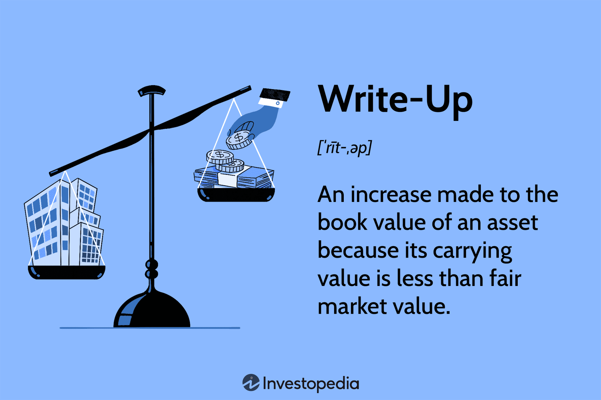

## Table of Contents

## What is a write-up in accounting?

A write-up in accounting is when a company increases the value of an asset on its balance sheet. This happens when the asset's market value goes up or when it becomes more valuable to the company. For example, if a company owns a piece of land and the land's value increases, the company might do a write-up to show the new, higher value on its financial statements.

Write-ups are not very common because accounting rules are strict about when you can increase an asset's value. Usually, companies can only do write-ups for certain types of assets, like property or investments. It's important for companies to follow these rules so their financial statements are accurate and fair. If a company does a write-up, it needs to explain it clearly in its financial reports so everyone understands why the asset's value changed.

## Why are write-ups important in accounting?

Write-ups are important in accounting because they help show the true value of a company's assets. When the value of an asset goes up, a write-up makes sure the company's financial statements reflect this increase. This is important for investors and other people who look at the company's financial health. They want to see an accurate picture of what the company owns and how much those things are worth.

Doing write-ups the right way also helps keep the company honest. Accounting rules are strict about when and how a company can increase an asset's value. By following these rules, a company shows that it is being fair and open about its finances. This builds trust with investors and others who rely on the company's financial statements to make decisions.

## Can you provide a basic example of a write-up for a small business?

Imagine a small business called "Green Thumb Nursery" that owns a piece of land where they grow plants. Over the past few years, the area around the nursery has become more popular, and the value of the land has gone up. The owner of Green Thumb Nursery decides to do a write-up to show the new, higher value of the land on their balance sheet. They hire an appraiser who says the land is now worth $200,000, up from the original $150,000 they paid for it.

The owner updates the balance sheet to reflect this new value. They increase the value of the land from $150,000 to $200,000. This write-up shows that Green Thumb Nursery's assets are now worth more, which makes the business look healthier on paper. It's important for the owner to explain this change clearly in their financial statements, so everyone knows why the value of the land went up.

## How do write-ups differ from write-downs in accounting?

Write-ups and write-downs are two ways a company can change the value of its assets on its financial statements. A write-up is when a company increases the value of an asset because it's worth more now. This can happen when the market value of the asset goes up or if the asset becomes more valuable to the company. For example, if a company owns a piece of land and the land's value increases, they might do a write-up to show the new, higher value.

On the other hand, a write-down is when a company decreases the value of an asset because it's worth less now. This can happen when the market value of the asset goes down or if the asset is damaged or becomes less useful to the company. For example, if a company has a machine that breaks and can't be fixed, they might do a write-down to show the lower value of the machine. Both write-ups and write-downs are important because they help make sure a company's financial statements show the true value of its assets.

## What are the key components that should be included in an accounting write-up?

An accounting write-up should start with a clear description of the asset that's being revalued. This means saying what the asset is, like a piece of land or a building, and why its value has changed. It's important to explain if the value went up because the market changed or if something else happened to make the asset worth more. This part helps people understand the reason behind the write-up.

The next part of the write-up should show the old value of the asset and the new value after the write-up. This means writing down how much the asset was worth before and how much it's worth now. It's also important to say how the new value was figured out, like if an appraiser was used or if the company did its own research. This part makes sure the write-up is clear and shows that the new value is based on good information.

Lastly, the write-up should include any rules or guidelines that the company followed to do the write-up. This means mentioning any accounting standards or laws that say when and how a company can change the value of its assets. By including this, the write-up shows that the company did things the right way and followed the rules. This helps keep the write-up honest and fair.

## How does the process of preparing a write-up vary for different types of businesses?

The process of preparing a write-up can vary for different types of businesses depending on the nature of their assets and the industry they operate in. For a small retail business, a write-up might involve revaluing inventory if its market value increases. This could happen if a popular item becomes more valuable due to high demand. The business owner would need to document the old and new values of the inventory, explain the reason for the increase, and ensure they follow any relevant accounting standards. This process might be simpler because the assets are more straightforward and easier to value.

For a larger manufacturing company, the process could be more complex. They might need to revalue heavy machinery or specialized equipment, which requires a detailed appraisal to determine the new value. This could involve hiring an external appraiser and documenting their findings. The company would need to explain the reasons for the write-up, such as technological advancements that increase the equipment's value, and ensure compliance with industry-specific accounting rules. The write-up would need to be thorough and well-documented to reflect the complexity of the assets involved.

In contrast, a real estate business might focus on revaluing properties. The process would involve obtaining updated property appraisals, which can be influenced by local market conditions. The business would need to record the original purchase price, the new appraised value, and the rationale for the increase, such as improvements in the neighborhood or increased demand. Compliance with real estate accounting standards is crucial, and the write-up should clearly explain these factors to provide a transparent view of the asset's value.

## What are some common mistakes to avoid when creating accounting write-ups?

When creating accounting write-ups, one common mistake to avoid is not providing enough detail about why the value of the asset changed. It's important to clearly explain the reasons for the write-up, like if the market value went up or if the asset became more useful to the business. Without this explanation, people might not understand the write-up, which can make the financial statements confusing and less trustworthy. Another mistake is not following the right accounting rules. There are strict guidelines about when and how a company can increase an asset's value. If these rules aren't followed, the write-up might not be accurate, and it could cause problems with audits or regulators.

Another common error is not documenting the old and new values of the asset correctly. The write-up should show the original value of the asset and the new value after the write-up, along with how the new value was figured out. If this information is missing or incorrect, it can make the write-up less clear and harder to verify. It's also important to avoid making write-ups too often or for small changes in value. Frequent write-ups can make financial statements look unstable and might raise questions about the company's accounting practices. By avoiding these mistakes, a company can create write-ups that are clear, accurate, and trustworthy.

## How can software tools assist in creating and managing accounting write-ups?

Software tools can make it easier to create and manage accounting write-ups by keeping everything organized and accurate. These tools often have templates that guide you through the process of making a write-up. They help you enter the old and new values of the asset, explain why the value changed, and make sure you follow the right accounting rules. The software can also keep track of all your write-ups in one place, so you can look back at them whenever you need to. This helps make sure that all the information is correct and easy to find.

Using software also helps with teamwork and keeping things up to date. Many accounting programs let different people work on the same write-up at the same time, so everyone can add their input and make sure the write-up is right. The software can also send reminders or alerts if there are any changes in the asset's value or if it's time to do another write-up. This way, the company can keep its financial statements accurate and up to date without missing important updates.

## What advanced techniques can be used to enhance the accuracy of accounting write-ups?

One advanced technique to enhance the accuracy of accounting write-ups is to use professional appraisals. When the value of an asset changes, it's important to get an expert to look at it and give an official value. This helps make sure the write-up is based on a fair and accurate assessment, not just a guess. For example, if a company owns a building and wants to do a write-up, they could hire a real estate appraiser to find out how much the building is worth now. This makes the write-up more reliable because it's based on a professional's opinion.

Another technique is to use advanced financial modeling and analysis tools. These tools can help predict how the value of an asset might change in the future based on different factors, like market trends or economic conditions. By using these tools, a company can make more informed decisions about when to do a write-up and how much to increase the value of the asset. This makes the write-up more accurate because it takes into account more information and data. Plus, these tools can help check the write-up against different scenarios to make sure it's as accurate as possible.

## How do regulatory requirements impact the content and format of accounting write-ups?

Regulatory requirements have a big impact on how accounting write-ups are done. These rules tell companies when they can change the value of their assets and how they need to show it in their financial statements. For example, some rules might say that a company can only do a write-up for certain types of assets, like land or buildings. Other rules might say that the company has to explain the write-up in a certain way, like by showing the old and new values of the asset and the reason for the change. If a company doesn't follow these rules, their write-up might not be seen as accurate or fair, and they could get in trouble with regulators.

Because of these rules, companies have to be very careful when they do a write-up. They need to make sure their write-ups follow all the guidelines and standards set by the regulators. This means they might need to use certain formats or include specific information in their financial statements. For example, they might need to use a standard template for their write-ups or include a detailed explanation of why the asset's value changed. By following these rules, companies can make sure their write-ups are clear, accurate, and trustworthy.

## Can you explain a complex example of a write-up involving multiple subsidiaries?

Imagine a big company called "Global Enterprises" that owns several smaller companies, or subsidiaries, around the world. One of these subsidiaries, "Tech Innovations," owns a valuable piece of technology that has become more important because of new developments in the industry. At the same time, another subsidiary, "Real Estate Holdings," owns a building in a city where property values have gone up a lot. Global Enterprises decides to do write-ups for both of these assets to show their new, higher values on the company's financial statements.

To do this, Global Enterprises has to work with both subsidiaries to gather all the information they need. For Tech Innovations, they hire a technology expert to appraise the value of the new technology and explain why it's worth more now. For Real Estate Holdings, they get a real estate appraiser to look at the building and tell them its new value. Global Enterprises then puts all this information together in a write-up that shows the old and new values of both assets, explains why the values went up, and makes sure they follow all the accounting rules. This helps everyone see that Global Enterprises' assets are now worth more, making the company look healthier on paper.

## What are the latest trends in accounting write-ups and how are they affecting traditional practices?

The latest trends in accounting write-ups are focusing more on using technology and data to make them more accurate and clear. Companies are using software that can help them keep track of all their write-ups and make sure they follow the rules. This software can also use data to predict how the value of an asset might change in the future, which helps companies decide when to do a write-up. Another trend is that companies are being more open about their write-ups. They are explaining them in more detail in their financial statements so everyone can understand why the value of an asset changed. This helps build trust with investors and others who look at the company's financial health.

These trends are changing how companies do traditional write-ups. Instead of just writing down the old and new values of an asset, companies are now using more information and data to support their write-ups. This makes the write-ups more reliable because they are based on facts and expert opinions. Also, being more open about write-ups means companies have to explain their decisions better, which can make the process more complicated but also more trustworthy. Overall, these changes are making accounting write-ups more accurate and clear, which helps everyone understand the true value of a company's assets.

## References & Further Reading

[1]: Bergstra, J., Bardenet, R., Bengio, Y., & Kégl, B. (2011). ["Algorithms for Hyper-Parameter Optimization."](https://dl.acm.org/doi/10.5555/2986459.2986743) Advances in Neural Information Processing Systems 24.

[2]: ["Advances in Financial Machine Learning"](https://www.amazon.com/Advances-Financial-Machine-Learning-Marcos/dp/1119482089) by Marcos Lopez de Prado

[3]: ["Evidence-Based Technical Analysis: Applying the Scientific Method and Statistical Inference to Trading Signals"](https://www.amazon.com/Evidence-Based-Technical-Analysis-Scientific-Statistical/dp/0470008741) by David Aronson

[4]: ["Machine Learning for Algorithmic Trading"](https://github.com/stefan-jansen/machine-learning-for-trading) by Stefan Jansen

[5]: ["Quantitative Trading: How to Build Your Own Algorithmic Trading Business"](https://www.amazon.com/Quantitative-Trading-Build-Algorithmic-Business/dp/1119800064) by Ernest P. Chan