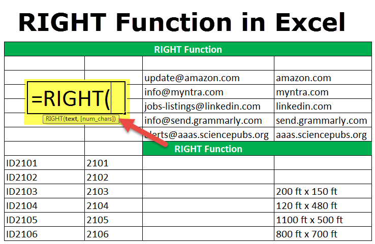

## Table of Contents

## What is Microsoft Excel and what is it used for?

Microsoft Excel is a computer program that helps you work with numbers and data. It is part of the Microsoft Office suite of programs. Excel uses a grid of rows and columns to organize information, which makes it easy to see and change data. You can use it on different devices like computers, tablets, and smartphones.

People use Excel for many things. It is very helpful for making lists, doing math, and keeping track of information. For example, businesses use it to manage budgets, create schedules, and analyze sales data. Students and teachers use it for school projects and to organize grades. It's also good for making charts and graphs to show data in a clear way.

## How do you open and save a workbook in Excel?

To open a workbook in Excel, start by opening the Excel program on your computer. Once Excel is open, you can open an existing workbook by clicking on "File" in the top left corner, then selecting "Open." A window will appear where you can browse your computer's files to find the workbook you want. Click on the file and then click "Open" to view it in Excel. If you want to start a new workbook, instead of clicking "Open," you can click on "New" and then choose "Blank workbook" to begin working on a new file.

To save a workbook in Excel, click on "File" in the top left corner and then select "Save" if you are saving it for the first time or "Save As" if you want to save it with a new name or in a different location. A window will pop up where you can choose where to save the file on your computer. Type in a name for your workbook in the "File name" box and then click "Save." If you have already saved the workbook before, you can quickly save any changes by clicking the "Save" icon (which looks like a small floppy disk) or by pressing Ctrl+S on your keyboard.

## What are the basic components of the Excel interface?

When you open Excel, you'll see a big grid called a worksheet. This grid is made up of rows and columns. Rows go across and are labeled with numbers, while columns go up and down and are labeled with letters. Where a row and a column meet is called a cell. Each cell has its own address, like A1 or B2. You can click on any cell to type in numbers, words, or formulas. At the top of the worksheet, there's a bar called the formula bar where you can see and edit what's in the cell you're working on.

Above the worksheet, you'll find the Ribbon. The Ribbon is like a toolbar with different tabs like "Home," "Insert," and "Data." Each tab has buttons and options for different tasks. For example, the "Home" tab has buttons for copying and pasting, changing the look of text, and doing simple math. On the left side of the Ribbon, there's a button called the "File" tab. Clicking it opens a menu where you can save, open, or print your workbook. At the bottom of the Excel window, there are tabs for different sheets in your workbook. You can click these tabs to switch between sheets.

## How do you enter and edit data in Excel cells?

To enter data in Excel, click on the cell where you want to put your information. Start typing, and the data will appear in the cell and also in the formula bar at the top. You can enter numbers, words, or formulas. If you make a mistake, just use the backspace or delete key to fix it. When you're done, press Enter or click on another cell to move on. If you want to move to a different cell before you finish, use the arrow keys on your keyboard.

To edit data that's already in a cell, double-click the cell or click once and then press F2. This lets you change what's inside the cell directly. You can also click in the formula bar to edit the data there. If you need to change just a small part, move the cursor to that spot and make your changes. Once you're happy with your edits, press Enter or click away from the cell to save them. If you decide you don't want the changes, press Esc to go back to how it was before.

## What are formulas and functions in Excel, and how do you use them?

Formulas and functions in Excel help you do math and work with data easily. A formula is a way to tell Excel to do something with the numbers or words in your cells. For example, if you want to add up numbers in cells A1 and A2, you can type "=A1+A2" in another cell. This is a simple formula. Excel will show the answer in that cell and update it if you change the numbers in A1 or A2. You can use formulas to do all kinds of math, like adding, subtracting, multiplying, and dividing.

Functions are special formulas that are built into Excel. They do more complex tasks, but you don't have to remember how to write them because Excel already knows them. For example, the SUM function adds up a bunch of numbers for you. You can type "=SUM(A1:A10)" to add up all the numbers from A1 to A10. There are lots of different functions for different jobs, like AVERAGE to find the average of numbers, or COUNT to count how many cells have numbers in them. To use a function, start by typing "=" and then the name of the function, followed by the cells or numbers you want it to work with in parentheses.

## How can you format cells and data in Excel?

In Excel, you can make your data look better and easier to understand by changing how cells and the information inside them look. To do this, click on a cell or select a group of cells. Then, go to the "Home" tab on the Ribbon. Here, you can change the font, size, and color of the text. You can also make the text bold, italic, or underlined. If you want to change how numbers look, you can choose from different formats like currency, percentage, or date. You can also add borders around cells and fill them with colors to make them stand out.

Besides changing the look of text and numbers, you can also adjust the size of cells. To make a column wider or narrower, move your cursor to the line between the column letters until it turns into a double arrow, then click and drag. You can do the same for rows by moving the cursor between the row numbers. If you want to make all your data fit better, you can use the "AutoFit" option. Just double-click the line between the column letters or row numbers, and Excel will automatically adjust the size to fit the content. This makes your spreadsheet neater and easier to read.

## What are the different types of charts and graphs you can create in Excel?

In Excel, you can make many different types of charts and graphs to show your data in a clear way. Some common types are column charts, which use vertical bars to compare different groups of data. Bar charts are similar but use horizontal bars. Line charts are good for showing changes over time, like how sales go up or down. Pie charts are used to show parts of a whole, like how much of your budget goes to different things. There are also area charts, which are like line charts but filled in, and scatter plots, which show how two sets of data relate to each other.

Other types of charts you can use in Excel include histograms, which show how often data falls into certain ranges. You can also make doughnut charts, which are like pie charts but with a hole in the middle and can show more than one set of data. For more complex data, you might use a surface chart to show three-dimensional data or a radar chart to compare multiple variables. Excel also lets you make combo charts, where you mix different types of charts together, like a column chart and a line chart on the same graph. This can help show different kinds of information at the same time.

## How do you use conditional formatting in Excel?

Conditional formatting in Excel helps you make your data stand out by changing how cells look based on rules you set. To use it, first pick the cells you want to change. Then, go to the "Home" tab and click on "Conditional Formatting." You can choose from different rules, like making cells a different color if they are above or below a certain number, or if they have certain words in them. For example, you could make all cells with numbers over 100 turn green. This makes it easy to see important information quickly.

You can also make more complex rules with conditional formatting. For instance, you can use data bars to show how big each number is with a bar inside the cell, or color scales to change the color of cells based on how they compare to others. To do this, after clicking "Conditional Formatting," choose "Data Bars," "Color Scales," or "Icon Sets." These options help you see patterns and trends in your data at a glance. Experiment with different rules to find what works best for your needs.

## What are pivot tables and how do you create them?

Pivot tables in Excel are a powerful tool that help you summarize and analyze big sets of data. They let you quickly organize and rearrange your information to see it in different ways. For example, if you have a list of sales data, a pivot table can help you see how much was sold by different people, in different months, or in different areas, all without changing the original data.

To create a pivot table, start by selecting the data you want to use. Then, go to the "Insert" tab on the Ribbon and click on "PivotTable." A window will pop up asking where you want to put the pivot table. You can choose a new worksheet or a place in the current one. After you click "OK," a new area will appear with boxes to drag your data into. Drag the fields you want to analyze into the "Rows," "Columns," "Values," and "Filters" areas. For example, if you want to see sales by month, drag the "Month" field to the "Rows" area and the "Sales" field to the "Values" area. Excel will then show you a summary of your data, which you can change by moving fields around until you get the view you need.

## How can you use macros to automate tasks in Excel?

Macros in Excel help you do the same tasks over and over again without having to do them by hand each time. They are like little programs that you can make to do things like filling out forms, sorting data, or making charts. To start using macros, go to the "Developer" tab on the Ribbon. If you don't see it, you can add it by going to "File," then "Options," and then choosing "Customize Ribbon" and checking "Developer." Once you're in the "Developer" tab, click "Record Macro" to start making your macro. Do the steps you want to save, and then click "Stop Recording." Now, whenever you run that macro, Excel will do those steps for you automatically.

To use a macro you've made, go back to the "Developer" tab and click "Macros." Choose the macro you want and click "Run." You can also add a button to your worksheet that runs the macro when you click it. To do this, click "Insert" in the "Developer" tab, choose "Button," and then pick the macro you want the button to run. This makes it easy to use your macros without having to go through menus each time. Macros can save you a lot of time, especially if you do the same things in Excel a lot.

## What are VLOOKUP and HLOOKUP functions and how do you use them?

VLOOKUP and HLOOKUP are functions in Excel that help you find and use information from a big table of data. VLOOKUP stands for "Vertical Lookup." It looks for a certain value in the first column of a table and then gives you information from another column in the same row. For example, if you have a list of people's names and their phone numbers, you can use VLOOKUP to find a phone number by typing in a name. The formula looks like this: `=VLOOKUP(lookup_value, table_array, col_index_num, [range_lookup])`. The `lookup_value` is what you're looking for, `table_array` is the table where you're looking, `col_index_num` is the column number where the information you want is, and `range_lookup` is usually set to FALSE to find an exact match.

HLOOKUP, or "Horizontal Lookup," works the same way but looks across rows instead of down columns. It's useful when your data is organized horizontally. The formula for HLOOKUP is similar: `=HLOOKUP(lookup_value, table_array, row_index_num, [range_lookup])`. Here, `lookup_value` is what you're searching for, `table_array` is the table, `row_index_num` is the row number where the information you need is, and `range_lookup` is again usually set to FALSE for an exact match. Both functions save you time by letting you quickly find and use data without having to search through the whole table by hand.

## How do you protect and share Excel workbooks securely?

To protect your Excel workbook, you can add a password to stop others from opening or changing it. Go to "File," then "Info," and click "Protect Workbook." You can choose to encrypt the workbook with a password, which means people need the password to open it. You can also set a password just to stop people from making changes, but they can still see the data. Another way to protect your workbook is by using "Protect Sheet" or "Protect Workbook" options, which let you control what others can do, like adding or deleting rows and columns. This is good if you want to share your workbook but keep some control over it.

Sharing Excel workbooks securely can be done in different ways. You can save your workbook to a place like OneDrive or SharePoint, which lets you share it with others easily. You can set who can see or change the workbook by using sharing settings. When you share it, you can also add a password or use other security options to keep it safe. If you need to send the workbook by email, make sure to use a secure way to send it, like encrypting the file or using a service that protects emails. This helps keep your data safe when you share it with others.

## How do you get started with Excel for algo trading?

Excel offers a practical entry point for traders eager to explore [algorithmic trading](/wiki/algorithmic-trading), primarily due to its user-friendly interface and widespread accessibility. Excel's built-in functions and flexibility make it an ideal choice for prototyping trading strategies, [backtesting](/wiki/backtesting), and analyzing trade performance.

### Backtesting with Excel

Backtesting is a critical step in evaluating the viability of a trading strategy. It involves applying a trading strategy to historical data to assess its performance. Excel allows users to backtest strategies by leveraging features like charts, conditional formatting, and built-in formulas.

To begin backtesting in Excel, traders typically follow these steps:

1. **Data Importation**: Traders import historical price data of the asset they intend to trade. This can be done manually through file uploads or automatically using Excel's data query features linked to financial databases or websites.

2. **Calculating Indicators**: Indicators are mathematical tools used to identify trends and potential entry or exit points in a market. Excel provides numerous functions for calculating common indicators, such as moving averages and relative strength index (RSI).

   For example, a simple moving average (SMA) is calculated using the formula:
$$
   \text{SMA}_n = \frac{P_1 + P_2 + \cdots + P_n}{n}

$$
   where $P_1, P_2, \cdots, P_n$ are the prices in the given period $n$.

3. **Generating Trading Signals**: Based on calculated indicators, trading signals are generated. These signals inform buy or sell decisions. Traders can use Excel’s logical functions (e.g., IF statements) to automate signal generation. 

   For instance, a simple trading rule might be: 
   - **Buy Signal**: When the short-term SMA crosses above the long-term SMA.
   - **Sell Signal**: When the short-term SMA crosses below the long-term SMA.

4. **Performance Analysis**: After applying the strategy, performance metrics such as total returns, win/loss ratio, and maximum drawdown are calculated to evaluate the strategy's effectiveness. Excel's statistical functions and data visualization tools are instrumental in this process, allowing traders to graphically represent strategy performance over time.

### Practical Example

Suppose we want to implement a basic moving average crossover strategy. You start by importing daily closing prices into Excel. Next, compute two moving averages: a short-term (e.g., 10-day) and a long-term (e.g., 50-day). Use Excel's `AVERAGE()` function over rolling windows of these periods.

Create a new column for trading signals using an `IF` formula:
- `=IF(SHORT_TERM_MA[t] > LONG_TERM_MA[t], "Buy", IF(SHORT_TERM_MA[t] < LONG_TERM_MA[t], "Sell", "Hold"))`

Finally, assess the strategy by calculating cumulative returns and visualizing them with Excel’s charting tools to determine the periods of profitability.

### Limitations and Considerations

While Excel is a powerful tool for prototyping trading strategies, it has limitations concerning computational performance and scalability, particularly with larger datasets. As such, traders using Excel are encouraged to validate their strategies under realistic market conditions and consider transitioning to more advanced platforms as their needs evolve in algorithmic trading.

## References & Further Reading

[1]: Bergstra, J., Bardenet, R., Bengio, Y., & Kégl, B. (2011). ["Algorithms for Hyper-Parameter Optimization."](https://papers.nips.cc/paper/4443-algorithms-for-hyper-parameter-optimization) Advances in Neural Information Processing Systems 24.

[2]: ["Advances in Financial Machine Learning"](https://www.amazon.com/Advances-Financial-Machine-Learning-Marcos/dp/1119482089) by Marcos Lopez de Prado

[3]: ["Evidence-Based Technical Analysis: Applying the Scientific Method and Statistical Inference to Trading Signals"](https://www.amazon.com/Evidence-Based-Technical-Analysis-Scientific-Statistical/dp/0470008741) by David Aronson

[4]: ["Machine Learning for Algorithmic Trading"](https://github.com/stefan-jansen/machine-learning-for-trading) by Stefan Jansen

[5]: ["Quantitative Trading: How to Build Your Own Algorithmic Trading Business"](https://books.google.com/books/about/Quantitative_Trading.html?id=j70yEAAAQBAJ) by Ernest P. Chan