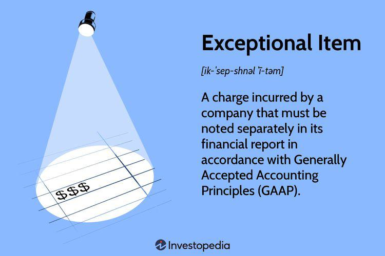

## Table of Contents

## What are exceptional items in financial reporting?

Exceptional items in financial reporting are unusual or one-off events that affect a company's financial statements. These items are significant enough to be reported separately from the company's regular business operations, so they don't distort the overall view of the company's performance. Examples of exceptional items include profits or losses from selling a major asset, costs from restructuring the business, or expenses from natural disasters.

By separating these items, it helps investors and analysts get a clearer picture of the company's ongoing performance. If these exceptional items were mixed in with regular income and expenses, it might make the company's financial health look better or worse than it really is. For instance, if a company reports a large profit from selling a factory, showing this as an exceptional item helps everyone understand that this profit isn't something that happens every year.

## How are exceptional items different from regular operating expenses?

Exceptional items are different from regular operating expenses because they are unusual events that don't happen every day in a company's business. Regular operating expenses are the normal costs a company has to pay to keep running, like rent, salaries, and supplies. These expenses happen all the time and are part of the day-to-day operations. Exceptional items, on the other hand, are big, one-time events that stand out, like selling a major piece of property or dealing with a natural disaster.

When a company reports its finances, it's important to keep these exceptional items separate from regular operating expenses. This helps everyone see the true, ongoing performance of the business. If exceptional items were mixed in with regular expenses, it could make the company's financial health look very different. For example, if a company makes a lot of money from selling a factory, showing this as an exceptional item helps people understand that this isn't something that happens every year.

## Can you provide examples of exceptional items?

Exceptional items are special events that happen once in a while and can affect a company's money reports. For example, if a company decides to sell a big building they own, the money they get from that sale is an exceptional item. This is because selling a building is not something the company does every day, and it's a big event that stands out.

Another example of an exceptional item is when a company has to pay a lot of money because of a natural disaster, like a flood or a hurricane. These costs are not normal business expenses and they happen suddenly, so they are reported separately. This helps everyone see the real, everyday performance of the company without these unusual events getting in the way.

Lastly, if a company decides to change how it works, like closing some stores or laying off workers, the costs of doing this are also exceptional items. These costs are called restructuring costs, and they are one-time events that don't happen as part of the regular business operations. By keeping them separate, it's easier to understand the company's normal financial health.

## Why is it important to separate exceptional items in financial statements?

It's important to separate exceptional items in financial statements because it helps everyone see the real, everyday performance of a company. When a company has a big event that doesn't happen often, like selling a building or dealing with a natural disaster, these events can make the company's money reports look very different. If these events were mixed in with the regular money coming in and going out, it might be hard to understand how well the company is doing on a normal day.

By keeping exceptional items separate, people can get a clearer picture of the company's ongoing business. For example, if a company makes a lot of money from selling a factory, showing this as an exceptional item helps everyone know that this profit isn't something that happens every year. This way, investors and others can make better decisions about the company based on its regular performance, not just one big event.

## How do exceptional items affect a company's financial performance?

Exceptional items can make a big difference in how a company's financial performance looks. These are special events that don't happen every day, like selling a big building or dealing with a natural disaster. When these events happen, they can add a lot of money or take a lot of money away from the company's reports. For example, if a company sells a factory, the money they get can make their profits look much bigger than usual. But this money doesn't come from their regular business, so it's important to know it's an exceptional item.

By separating these exceptional items, we can see the company's real, everyday performance more clearly. If these big events were mixed in with the regular money coming in and going out, it might be hard to understand how well the company is doing on a normal day. For instance, if a company has to pay a lot because of a flood, showing this as an exceptional item helps everyone know that this cost isn't something that happens every year. This way, people can make better decisions about the company based on its regular performance, not just one big event.

## What are the accounting standards for reporting exceptional items?

When it comes to reporting exceptional items, companies follow specific accounting rules to make sure everyone understands their financial reports clearly. These rules are set by groups like the International Accounting Standards Board (IASB), which makes the International Financial Reporting Standards (IFRS), and the Financial Accounting Standards Board (FASB), which makes the Generally Accepted Accounting Principles (GAAP) in the United States. Both IFRS and GAAP say that exceptional items should be shown separately from regular business activities so that people can see the company's everyday performance clearly.

Under IFRS, exceptional items are often called "unusual items" or "non-recurring items." They need to be clearly explained in the notes to the financial statements so that anyone reading the reports knows what these items are and why they are important. GAAP also requires companies to report these items separately, often in a section called "discontinued operations" or "extraordinary items." The main goal is to make sure that these one-time events don't hide the true financial health of the company, helping investors and others make better decisions.

## How do companies decide which items to classify as exceptional?

Companies decide which items to call exceptional by looking at whether the event is unusual and doesn't happen every day. They ask if the item is big enough to affect how people see the company's financial health. For example, if a company sells a big factory, that's not something they do all the time, so it might be an exceptional item. They also think about if the item is important enough to explain to people reading the financial reports, so everyone understands why it's separate from the regular business stuff.

To make this decision, companies follow rules set by accounting groups like the International Accounting Standards Board (IASB) or the Financial Accounting Standards Board (FASB). These rules help companies know what counts as an exceptional item. The main idea is to keep the company's everyday performance clear, so people can see how well the business is doing without big, one-time events getting in the way. By doing this, companies help investors and others make better choices based on the true, regular performance of the business.

## What impact do exceptional items have on financial ratios and analysis?

Exceptional items can really change how a company's financial ratios and analysis look. These are big, one-time events that don't happen every day, like selling a factory or dealing with a natural disaster. When these events happen, they can make the company's profits or losses look very different from what they usually are. For example, if a company sells a big building, the money they get can make their profit look much bigger than usual. This can make financial ratios like the profit margin or return on assets look better than they really are if you just look at the regular business.

By separating exceptional items from the regular business numbers, analysts and investors can get a clearer picture of the company's everyday performance. If these big events were mixed in with the regular money coming in and going out, it might be hard to understand how well the company is doing on a normal day. For instance, if a company has to pay a lot because of a flood, showing this as an exceptional item helps everyone know that this cost isn't something that happens every year. This way, people can make better decisions about the company based on its regular performance, not just one big event.

## How should investors interpret exceptional items when analyzing a company's financial health?

When investors look at a company's financial health, they need to pay attention to exceptional items. These are big, one-time events that don't happen every day, like selling a factory or dealing with a natural disaster. If a company makes a lot of money from selling a building, it can make their profits look much bigger than usual. But this money doesn't come from their regular business, so investors should know it's an exceptional item. By understanding this, investors can see the company's real, everyday performance more clearly.

Exceptional items can make financial ratios and other numbers look different from what they usually are. For example, if a company has to pay a lot because of a flood, showing this as an exceptional item helps everyone know that this cost isn't something that happens every year. This way, investors can make better decisions about the company based on its regular performance, not just one big event. By keeping these items separate, investors get a truer picture of how well the company is doing on a normal day.

## What are the potential manipulations or abuses related to exceptional items?

Sometimes, companies might try to trick people by playing around with exceptional items. They might call something an exceptional item when it's not really that unusual, just to make their regular profits look better. For example, a company might say that the cost of fixing up a store is an exceptional item, even though they do this kind of thing every few years. By doing this, they can make their everyday business look more profitable than it really is, which can fool investors into thinking the company is doing better than it actually is.

Another way companies might misuse exceptional items is by hiding bad news. If a company is having a bad year, they might lump a lot of their regular expenses into exceptional items to make it look like their core business is doing okay. This can make it hard for investors to see the real financial health of the company. It's important for investors to be careful and look closely at what the company is calling exceptional to make sure they're not being tricked.

## How have the treatments and disclosures of exceptional items evolved over time?

Over time, how companies handle and talk about exceptional items in their financial reports has changed a lot. In the past, companies used to call a lot of things exceptional items, even if they happened pretty often. This made it hard for people to see the real performance of the company because these items could hide the true financial health. But as time went on, accounting rules got stricter. Groups like the International Accounting Standards Board (IASB) and the Financial Accounting Standards Board (FASB) started to say that exceptional items should only be used for really unusual events that don't happen every day. This change helped make financial reports clearer and more honest.

Now, companies have to explain exceptional items a lot more than they used to. They need to write down in their financial reports what these items are and why they are important. This way, anyone reading the reports can understand why these big, one-time events are separate from the regular business stuff. The goal is to help investors and others see the company's everyday performance without these unusual events getting in the way. By doing this, people can make better decisions about the company based on its true, regular performance.

## What are the international variations in the treatment of exceptional items in financial reporting?

The way companies handle exceptional items in their financial reports can be different around the world. In some countries, they follow the International Financial Reporting Standards (IFRS), which say that exceptional items should be called "unusual items" or "non-recurring items." These rules want companies to explain these items clearly in their reports so everyone can understand why they are important. On the other hand, in the United States, companies follow the Generally Accepted Accounting Principles (GAAP), which used to have a category called "extraordinary items." But a few years ago, GAAP changed the rules and got rid of this category, saying that companies should just report these big, one-time events in a different way.

Even though the rules are different, the main idea is the same everywhere: exceptional items should be shown separately from the regular business stuff. This helps people see the true, everyday performance of a company without these unusual events getting in the way. By doing this, investors and others can make better decisions about the company based on its regular performance, not just one big event. So, no matter where a company is from, the goal is to keep the financial reports clear and honest.

## What is the impact on investors and market perception?

Exceptional items play a pivotal role in shaping financial metrics that are crucial for investor analysis and market perception. These items, usually disclosed separately in financial statements, are significant in determining metrics such as earnings per share (EPS). They are necessary for investors to assess the underlying operational performance of a company.

### Importance of Adjusting Financial Metrics

Investors aiming for a true reflection of a company's financial health should adjust key metrics like EPS for the presence of exceptional or nonrecurring items. For instance, EPS can be skewed by large, one-time costs or gains, providing a misleading depiction of a company's profitability. Adjusting EPS involves recalculating it by excluding these nonrecurring items, hence providing a clearer picture of ongoing business profitability.

#### Formula for Adjusted EPS:

$$
\text{Adjusted EPS} = \frac{\text{Net Income} - \text{Exceptional Items}}{\text{Average Outstanding Shares}}
$$

This formula demonstrates the need to exclude exceptional items from net income to assess the company's regular earnings capacity.

### Impact on Investor Decision-Making

The transparency, or lack thereof, in reporting exceptional items impacts investors’ decision-making processes. Exceptional items, if not clearly disclosed, can lead to misinterpretation of a company’s financial position. Investors unaware of these adjustments might base their decisions on distorted financial metrics, potentially leading to suboptimal investment choices.

### Market Valuation and Perception

Exceptional items influence how market participants perceive the value of a company. For instance, a significant one-time gain might temporarily inflate earnings, affecting market valuation metrics such as the price-to-earnings (P/E) ratio. Investors often adjust such ratios to exclude the effect of nonrecurring items, thereby focusing solely on sustainable earnings. 

#### Example of Adjusted P/E Ratio:

$$
\text{Adjusted P/E Ratio} = \frac{\text{Current Stock Price}}{\text{Adjusted EPS}}
$$

Failure to make these adjustments can result in misplaced confidence in a company’s growth prospects or stability, thereby affecting market dynamics.

In summary, careful analysis and adjustment for exceptional items are critical for investors to accurately assess a company's operational performance and make informed decisions, thus facilitating more accurate market valuations. Enhanced transparency and clear disclosure are essential in preventing misinterpretation, thereby supporting informed investment strategies and stable market conditions.

## References & Further Reading

[1]: ["International Financial Reporting Standards (IFRS) and Generally Accepted Accounting Principles (GAAP)"](https://www.investopedia.com/ask/answers/011315/what-difference-between-gaap-and-ifrs.asp), IFRS Foundation.

[2]: ["Advances in Financial Machine Learning"](https://www.amazon.com/Advances-Financial-Machine-Learning-Marcos/dp/1119482089) by Marcos Lopez de Prado

[3]: ["Financial Reporting and Analysis: Using Financial Accounting Information"](https://www.amazon.com/Financial-Reporting-Analysis-Accounting-Information/dp/1133188796) by Charles H. Gibson

[4]: ["Machine Learning for Algorithmic Trading"](https://github.com/stefan-jansen/machine-learning-for-trading) by Stefan Jansen

[5]: ["Quantitative Trading: How to Build Your Own Algorithmic Trading Business"](https://www.amazon.com/Quantitative-Trading-Build-Algorithmic-Business/dp/1119800064) by Ernest P. Chan

[6]: Fama, E. F., & French, K. R. (1993). ["Common risk factors in the returns on stocks and bonds."](https://www.sciencedirect.com/science/article/pii/0304405X93900235) Journal of Financial Economics, 33(1), 3-56.

[7]: ["Accounting for Restructuring and Unusual Events"](https://kpmg.com/us/en/articles/2023/restructuring-understanding-ifrs-requirements.html) by CFA Institute.