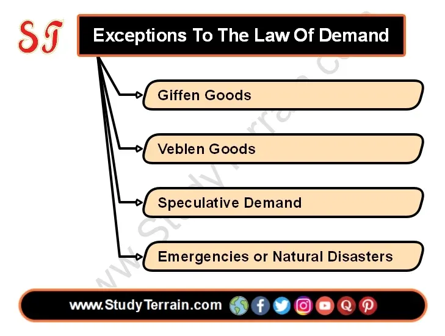

## Table of Contents

## What is the Law of Demand in economics?

The Law of Demand is a basic principle in economics that says when the price of something goes up, people usually want to buy less of it. On the other hand, if the price goes down, people tend to want to buy more. This happens because as things get more expensive, they become less affordable or people feel they are not worth the extra cost. For example, if the price of apples increases, you might decide to buy fewer apples or switch to a cheaper fruit.

This law helps explain how markets work. When prices change, it affects how much people are willing to buy, which in turn can affect the overall demand for a product. Businesses use this information to set prices that will attract customers while still making a profit. Understanding the Law of Demand is important for anyone involved in buying or selling goods and services, as it helps predict how changes in price might influence consumer behavior.

## What are exceptions to the Law of Demand?

Sometimes, the Law of Demand doesn't work the way we expect. One exception is with things called "Giffen goods." These are special kinds of products where if the price goes up, people actually buy more of them, not less. This happens because Giffen goods are basic things that poor people need, like cheap food. If the price of this food goes up, they might not be able to afford better food, so they end up buying more of the cheaper stuff even though it costs more.

Another exception is with "Veblen goods." These are fancy things that people buy to show off how rich they are, like expensive watches or designer clothes. When the price of these items goes up, some people want them even more because they think it makes them look cooler or more important. So, instead of buying less when the price goes up, they might buy more to show off their wealth.

There's also something called the "bandwagon effect." This happens when people start buying something just because everyone else is buying it. If a product becomes popular and the price goes up, people might still want to buy it to fit in with the trend. So, even though the price is higher, demand can still go up because people don't want to be left out.

## Can you explain the concept of Giffen Goods?

Giffen goods are a special type of product that doesn't follow the usual rules of demand. Normally, when the price of something goes up, people buy less of it. But with Giffen goods, if the price goes up, people actually buy more of them. This happens because Giffen goods are basic things that poor people need, like cheap bread or rice. When the price of these goods goes up, poor people can't afford to switch to more expensive options, so they end up buying more of the cheaper stuff even though it costs more.

For example, imagine a poor family that usually buys cheap bread. If the price of this bread goes up, they might not have enough money to buy more expensive food like meat or vegetables. So, they have to keep buying the bread, even though it's more expensive now. This means they end up buying more bread than before, even though the price went up. Giffen goods are rare and hard to find in real life, but they show us that sometimes, the way people buy things can be different from what we expect.

## How do Veblen Goods contradict the Law of Demand?

Veblen goods are fancy things that people buy to show off how rich they are. Things like expensive watches or designer clothes are Veblen goods. Normally, when the price of something goes up, people buy less of it because it costs more. But with Veblen goods, if the price goes up, some people actually want to buy more of them. This is because a higher price makes the item seem more special and shows that the buyer has a lot of money.

For example, if a luxury watch brand raises its prices, some people might think the watch is even cooler because it's more expensive. They want to show off their wealth, so they are willing to pay more for it. This goes against the Law of Demand, which says that when prices go up, people usually buy less. With Veblen goods, the opposite can happen because people value the status and prestige that comes with owning something expensive.

## What role does consumer expectation play in exceptions to the Law of Demand?

Consumer expectations can make people act differently from what the Law of Demand says. If people think the price of something will go up in the future, they might buy more of it now, even if the price is already high. This is like when people rush to buy gas if they hear there might be a shortage soon. They want to get it before it gets even more expensive. So, even though the price is going up, demand goes up too because of what people expect to happen later.

Another way consumer expectations affect demand is with things like new technology or trendy products. If people expect a new phone or a popular toy to be hard to get later, they might buy it right away, even if it's expensive. They don't want to miss out on having the latest thing. This means that even if the price is high, people might still buy a lot of it because they think it will be harder to get later. So, what people think will happen in the future can make them buy more now, which goes against the usual Law of Demand.

## How does the quality or perceived value of a product affect demand?

The quality or how good people think a product is can really change how much they want to buy it. If people think a product is really good or special, they might be willing to pay more for it. For example, if a new phone comes out and everyone says it's the best one ever, people might rush to buy it even if it's expensive. They think it's worth the high price because it's so good. On the other hand, if people think a product is not very good, they might not want to buy it even if it's cheap. They don't think it's worth their money.

Sometimes, the way people see a product can be more important than how much it costs. If a product is seen as fancy or cool, like a designer bag, people might want it more even if the price goes up. They think having that bag makes them look good or important. This is different from normal things where people usually buy less when the price goes up. So, how people feel about a product's quality or how special it is can make them want it more or less, no matter what the price is.

## Can you discuss the impact of necessity on the Law of Demand?

When something is a necessity, like food or medicine, the Law of Demand can work differently. People need these things to live, so even if the price goes up, they might still buy them. For example, if the price of bread goes up, people might not be able to stop buying it because they need it to eat. This is why some things, like Giffen goods, can see more demand even when they get more expensive. People can't just stop buying what they need, so they keep buying it even if it costs more.

But not all necessities work the same way. If there are cheaper options for a necessity, people might switch to those when prices go up. For example, if the price of one brand of medicine goes up, people might buy a cheaper brand instead. This still follows the Law of Demand because people are buying less of the more expensive option. So, while necessities can sometimes go against the Law of Demand, it depends on whether people have other choices they can switch to.

## What are some historical examples where the Law of Demand did not hold?

During the Great Irish Famine in the 1840s, potatoes were a basic food for many poor people in Ireland. When the price of potatoes went up because of the famine, people couldn't afford to buy other foods. So, they bought more potatoes even though they were more expensive. This is an example of a Giffen good, where the demand for potatoes went up even though the price increased. People needed potatoes to survive, so they kept buying them no matter the cost.

Another example happened in the early 2000s with the launch of the iPhone. When Apple first released the iPhone, it was very expensive, but people still wanted to buy it. They thought it was the coolest new technology and didn't want to miss out. Even though the price was high, demand for the iPhone was strong because people saw it as a status symbol and a must-have gadget. This shows how Veblen goods can go against the Law of Demand, where higher prices can lead to higher demand because of the product's perceived value.

## How do market conditions and economic factors lead to exceptions in the Law of Demand?

Market conditions and economic factors can make the Law of Demand not work the way we expect. When there's a lot of competition in the market, companies might lower their prices to attract more customers. But if one company has something special that people really want, they might not lower the price even if it means fewer people can buy it. This can happen with new technology or trendy products. If people think they need to have the latest thing, they might still buy it even if it's expensive. So, the way the market is set up and how companies compete can change how much people want to buy things.

Economic factors like inflation or a recession can also make the Law of Demand act differently. During inflation, when prices are going up all the time, people might rush to buy things before they get even more expensive. This can make demand go up even though prices are high. In a recession, when people don't have a lot of money, they might still buy necessities like food or medicine even if the prices go up. They need these things to live, so they keep buying them. So, big changes in the economy can make people buy more or less of something, no matter what the price is.

## What are the theoretical implications of exceptions to the Law of Demand for economic models?

Exceptions to the Law of Demand, like Giffen goods and Veblen goods, show us that sometimes people don't act the way economic models expect. These exceptions mean that economists need to think more carefully about how they make their models. They can't just assume that if the price goes up, people will always buy less. Instead, they need to consider things like how much people need a product, how fancy it is, and what people expect to happen in the future. This makes economic models more complicated but also more realistic because they can better explain how people actually behave.

Understanding these exceptions helps economists make better predictions about how markets will work. If they know that some products might see more demand when prices go up, they can adjust their models to account for this. This can help businesses decide on prices and help governments make policies that work better for everyone. By including these exceptions in their models, economists can create a fuller picture of how the economy works, which is important for making good decisions about money and resources.

## How can understanding exceptions to the Law of Demand benefit economic policy-making?

Understanding exceptions to the Law of Demand can help people who make economic policies make better choices. If they know that some things, like basic foods for poor people, might be bought more even when prices go up, they can plan better. For example, during a food crisis, the government might need to control prices or give out food to make sure people can still afford to eat. By knowing about these exceptions, policymakers can make rules that help keep important things affordable for everyone, especially when prices are going up.

Also, understanding how fancy or trendy items can become more popular when they get more expensive can help with tax policies. If the government knows that raising taxes on luxury goods might not make people buy less, they can use this to their advantage. They can raise more money through taxes on these items without worrying too much about people buying less. This can help fund other important programs, like schools or hospitals. So, knowing about these exceptions can lead to smarter economic policies that work better for everyone.

## What are the current research trends regarding exceptions to the Law of Demand?

Researchers are looking into how people's feelings and thoughts can make them buy more of something even if it gets more expensive. They want to know more about why people might want to show off with fancy things or why they buy more of something they really need, even if it costs more. This can help explain why the usual rule about buying less when prices go up doesn't always work. Scientists are using new ways to study this, like looking at what people do online or using surveys to ask them about their choices.

Another big area of research is about how people expect prices to change in the future. If people think a product will be harder to get or more expensive later, they might buy more of it now, even if it's already pricey. This is important because it can change how much people want something, no matter what the price is right now. Researchers are trying to find out how these expectations affect what people buy and how businesses can use this information to set their prices better.

## What is Understanding Demand Theory?

Demand theory forms the cornerstone of economic analysis by describing how the quantity of a good demanded by consumers responds to changes in price. This relationship is pivotal for understanding market dynamics and consumer behavior.

At its core, demand theory posits an inverse relationship between price and the quantity demanded, encapsulated in the demand curve. This fundamental principle implies that, all else being equal, as the price of a good decreases, the quantity demanded increases, and vice versa. The crucial condition here is "ceteris paribus," a Latin term meaning "all other factors being constant." This assumption isolates the effect of price changes by holding other factors, such as income levels and preferences, constant.

The demand curve graphically represents this relationship and is usually depicted as a downward-sloping line on a graph where the x-axis represents quantity demanded, and the y-axis represents price. The negative slope of the demand curve illustrates the inverse relationship: 

$$
Q_d = f(P)
$$

where $Q_d$ represents quantity demanded and $P$ represents price. This formula underscores the fundamental premise that price changes directly influence consumer demand.

Understanding this concept is critical for analyzing shifts in the market and predicting consumer purchasing behavior. When external factors such as consumer income, tastes, or prices of related goods remain stable, the demand curve remains unchanged. However, any alteration in these factors can shift the demand curve itself, indicating a change in quantity demanded at every price point.

Demand theory is integral not only to classical economic theory but also to practical applications, such as setting pricing strategies, forecasting sales, and creating economic policies. By examining how consumers respond to price variations, businesses and economists can better anticipate market behaviors and design strategies that optimize sales and profits.

## References & Further Reading

[1]: Bergstra, J., Bardenet, R., Bengio, Y., & Kégl, B. (2011). ["Algorithms for Hyper-Parameter Optimization."](https://dl.acm.org/doi/10.5555/2986459.2986743) Advances in Neural Information Processing Systems 24.

[2]: ["Advances in Financial Machine Learning"](https://www.amazon.com/Advances-Financial-Machine-Learning-Marcos/dp/1119482089) by Marcos Lopez de Prado

[3]: ["Evidence-Based Technical Analysis: Applying the Scientific Method and Statistical Inference to Trading Signals"](https://www.amazon.com/Evidence-Based-Technical-Analysis-Scientific-Statistical/dp/0470008741) by David Aronson

[4]: ["Machine Learning for Algorithmic Trading"](https://github.com/stefan-jansen/machine-learning-for-trading) by Stefan Jansen

[5]: ["Quantitative Trading: How to Build Your Own Algorithmic Trading Business"](https://github.com/LucindaYa/quant-resources/blob/master/Quantitative%20Trading%20How%20to%20Build%20Your%20Own%20Algorithmic%20Trading%20Business.pdf) by Ernest P. Chan