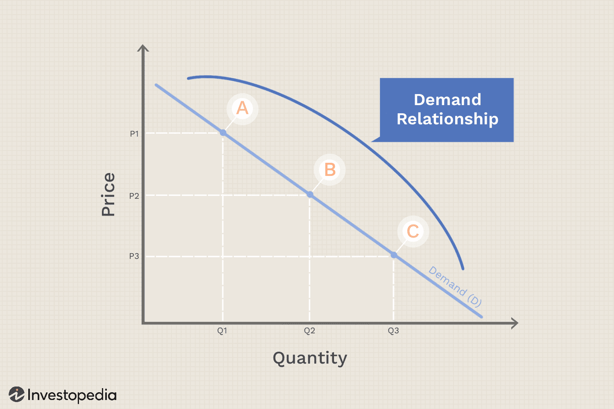

This article explores the intricate interplay between demand theory, the law of demand, and its exceptions within the context of economics. These concepts are fundamental to understanding how consumers react to price changes, which in turn affect market dynamics and business strategies. The law of demand, a cornerstone of economic theory, illustrates the inverse relationship between the price of a good and the quantity consumers are willing to purchase. However, this relationship is not always straightforward due to various exceptions such as Giffen and Veblen goods.

In recent years, the principles of demand theory have found extensive applications in algorithmic trading, a burgeoning trend in financial markets. Algorithmic trading involves using automated systems to execute trades based on pre-set criteria, often involving complex mathematical models. By incorporating demand theory, traders can better anticipate market movements and enhance strategic decision-making processes. This integration of economic principles into advanced trading algorithms allows for the recognition and exploitation of market inefficiencies, potentially yielding significant competitive advantages.



Understanding the nuances of demand theory not only provides valuable insights into consumer behavior but also plays a crucial role in developing more sophisticated trading algorithms. As financial markets continue to evolve, the ability to apply these economic concepts effectively will be key to maintaining and improving trading strategies. This article aims to provide a comprehensive understanding of how demand theory, the law of demand, and their exceptions influence both economic analysis and the practical applications in algorithmic trading.

## Table of Contents

## Understanding Demand Theory

Demand theory forms the cornerstone of economic analysis by describing how the quantity of a good demanded by consumers responds to changes in price. This relationship is pivotal for understanding market dynamics and consumer behavior.

At its core, demand theory posits an inverse relationship between price and the quantity demanded, encapsulated in the demand curve. This fundamental principle implies that, all else being equal, as the price of a good decreases, the quantity demanded increases, and vice versa. The crucial condition here is "ceteris paribus," a Latin term meaning "all other factors being constant." This assumption isolates the effect of price changes by holding other factors, such as income levels and preferences, constant.

The demand curve graphically represents this relationship and is usually depicted as a downward-sloping line on a graph where the x-axis represents quantity demanded, and the y-axis represents price. The negative slope of the demand curve illustrates the inverse relationship: 

$$
Q_d = f(P)
$$

where $Q_d$ represents quantity demanded and $P$ represents price. This formula underscores the fundamental premise that price changes directly influence consumer demand.

Understanding this concept is critical for analyzing shifts in the market and predicting consumer purchasing behavior. When external factors such as consumer income, tastes, or prices of related goods remain stable, the demand curve remains unchanged. However, any alteration in these factors can shift the demand curve itself, indicating a change in quantity demanded at every price point.

Demand theory is integral not only to classical economic theory but also to practical applications, such as setting pricing strategies, forecasting sales, and creating economic policies. By examining how consumers respond to price variations, businesses and economists can better anticipate market behaviors and design strategies that optimize sales and profits.

## The Law of Demand

The law of demand is a fundamental tenet in economics stating that, ceteris paribus, the quantity demanded of a good or service decreases as its price increases and increases as its price decreases. This principle is pivotal in economic analysis, providing the underpinnings for understanding consumer behavior and predicting market dynamics.

The inverse relationship between price and quantity demanded is commonly represented using a downward-sloping demand curve on a graph where the y-axis denotes price and the x-axis represents quantity. Mathematically, this relationship can be captured by the equation $Q_d = a - bP$, where $Q_d$ is the quantity demanded, $P$ is the price, $a$ is the intercept on the quantity axis, and $b$ is the slope of the demand curve.

This principle aids businesses and economists in making informed decisions by anticipating consumer behavior. For companies, understanding the law of demand allows for better pricing strategies, inventory management, and sales forecasting. For economists, it assists in modeling consumer choices and predicting how various factors, such as income changes or substitute availability, might shift demand.

Moreover, the law of demand is instrumental in market predictions. By assessing how changes in external variables (e.g., price changes of related goods, consumer income) impact demand, businesses can adjust their supply strategies accordingly. It also serves as a foundational concept for evaluating the effects of market interventions such as taxes or subsidies.

In practice, numerous factors like consumer preferences, market trends, and external economic conditions can influence demand elasticity. Thus, while the law of demand provides a essential framework for analyzing market behavior, its application often requires contextual adjustments to account for real-world complexities.

## Exceptions to the Law of Demand

Not all goods adhere strictly to the law of demand, which states that quantity demanded decreases as prices increase. Notable exceptions include Giffen goods and Veblen goods, each presenting unique cases where the conventional inverse relationship between price and demand does not hold.

Giffen goods are an interesting anomaly in economic theory. Named after the Scottish economist Sir Robert Giffen, these goods are considered inferior goods for which demand increases as their prices rise. The Giffen paradox is typically associated with staple products in low-income settings, where such goods constitute a significant portion of the consumer's budget. Due to this substantial allocation, a rise in the price of a Giffen good can lead to a decrease in real income. Consequently, consumers buy more of the higher-priced Giffen good because they can afford less of the more expensive alternatives or substitutes. An example often cited is that of bread or rice in impoverished areas; when prices rise, people may buy more because they have to sacrifice more expensive food options, which shows an upward-sloping demand curve under certain conditions.

In contrast, Veblen goods are characterized by their status symbol nature. Named after economist Thorstein Veblen, these goods see increased demand as their prices rise due to the perceived prestige and exclusivity associated with them. Veblen goods represent luxury items like designer handbags, high-end cars, or prestigious jewelry brands. The consumption of these goods is driven by the desire for social elevation and the signaling of wealth and status. The demand curve for Veblen goods can be illustrated by a positive correlation between price and demand, as higher prices reinforce their desirability as a status symbol.

These exceptions emphasize the importance of analyzing consumer behavior beyond simplistic models, considering how socio-economic and psychological factors influence purchasing decisions. Understanding these complexities allows for a more comprehensive understanding of market dynamics and can offer strategic advantages in fields such as marketing and [algorithmic trading](/wiki/algorithmic-trading).

## Algorithmic Trading and Demand Theory

Algorithmic trading utilizes complex automated systems to make decisions in financial markets, often leveraging insights from demand theory. At its core, demand theory provides information on how consumers might react to changes in pricing. Algorithmic trading systems employ mathematical models built on these principles to anticipate market trends and responses. The law of demand, which posits that the quantity demanded of a good typically decreases as its price increases, serves as a foundational element in these models.

These automated systems execute trades at high speed and precision, analyzing vast datasets that would be impossible for a human to process in the same timeframe. By incorporating the law of demand, algorithms can estimate likely future price movements by considering how consumer demand might fluctuate with price changes.

Furthermore, understanding exceptions to the law of demand, such as Giffen or Veblen goods, is critical. Algorithms can be programmed to identify these exceptions and adjust their trading strategies accordingly. A price increase in a Giffen good, for instance, might paradoxically trigger a higher demand, which a sophisticated algorithm can exploit for advantageous trading positions.

Another key advantage of algorithmic trading is its ability to capitalize on market inefficiencies, especially those highlighted by atypical demand curves. For instance, statistical [arbitrage](/wiki/arbitrage) strategies can use deviations from expected demand patterns to forecast short-term price movements. This insight enables traders to execute early and benefit from correcting market mispricings.

Python, a prevalent language in financial technology, often underpins these algorithms. A typical trading algorithm might begin by importing essential libraries such as NumPy for numerical operations and pandas for data handling. Here's a basic Python snippet illustrating how demand curves might be modeled:

```python
import numpy as np
import pandas as pd

# Hypothetical price and demand data
prices = np.array([50, 45, 40, 35, 30])
demand = np.array([100, 120, 150, 180, 220])

# Simulating a demand curve using a linear regression model
from sklearn.linear_model import LinearRegression

model = LinearRegression()
prices_reshaped = prices.reshape(-1, 1)
model.fit(prices_reshaped, demand)

# Predicting demand for a new price point
new_price = np.array([[25]])
predicted_demand = model.predict(new_price)
print(f"Predicted demand for price {new_price[0][0]}: {predicted_demand[0]}")
```

This simulation can be expanded and refined by incorporating additional variables, including consumer sentiment, external economic factors, and exceptions to demand laws. The flexibility and power of algorithmic trading stem from its capacity to integrate intricate economic theories with advanced computational techniques, thereby providing traders a significant edge in financial markets.

## Conclusion

The integration of demand theory and algorithmic trading illustrates the practical applications of economic principles in modern finance. Demand theory, with its foundational insights into consumer behavior and price correlation, provides essential frameworks for automatic trading systems in financial markets. By comprehensively integrating these economic principles, algorithmic traders can improve accuracy in predicting market movements and consumer trends, thereby enhancing decision-making processes.

Recognizing exceptions to the law of demand, such as Giffen and Veblen goods, grants traders unique insights into unusual market behaviors. These exceptions can be strategically significant; for instance, understanding Veblen goods' behavior can allow traders to anticipate and exploit trends driven by consumer desires for prestige. Such knowledge can be harnessed in algorithms designed to detect and leverage anomalies, providing competitive advantages.

The continued study and application of demand theory principles and their exceptions are critical for developing and refining trading algorithms. As technological capabilities advance, so too must the complexity and representation of economic theories within these systems. Algorithm developers and traders should remain vigilant in updating models to incorporate evolving economic insights. This ensures they maintain a strategic edge, capitalizing on market inefficiencies with precision. Sustainable success in algorithmic trading thus relies on a nuanced understanding of demand variations and adaptive algorithm development.

## References & Further Reading

[1]: Bergstra, J., Bardenet, R., Bengio, Y., & Kégl, B. (2011). ["Algorithms for Hyper-Parameter Optimization."](https://dl.acm.org/doi/10.5555/2986459.2986743) Advances in Neural Information Processing Systems 24.

[2]: ["Advances in Financial Machine Learning"](https://www.amazon.com/Advances-Financial-Machine-Learning-Marcos/dp/1119482089) by Marcos Lopez de Prado

[3]: ["Evidence-Based Technical Analysis: Applying the Scientific Method and Statistical Inference to Trading Signals"](https://www.amazon.com/Evidence-Based-Technical-Analysis-Scientific-Statistical/dp/0470008741) by David Aronson

[4]: ["Machine Learning for Algorithmic Trading"](https://github.com/stefan-jansen/machine-learning-for-trading) by Stefan Jansen

[5]: ["Quantitative Trading: How to Build Your Own Algorithmic Trading Business"](https://github.com/LucindaYa/quant-resources/blob/master/Quantitative%20Trading%20How%20to%20Build%20Your%20Own%20Algorithmic%20Trading%20Business.pdf) by Ernest P. Chan