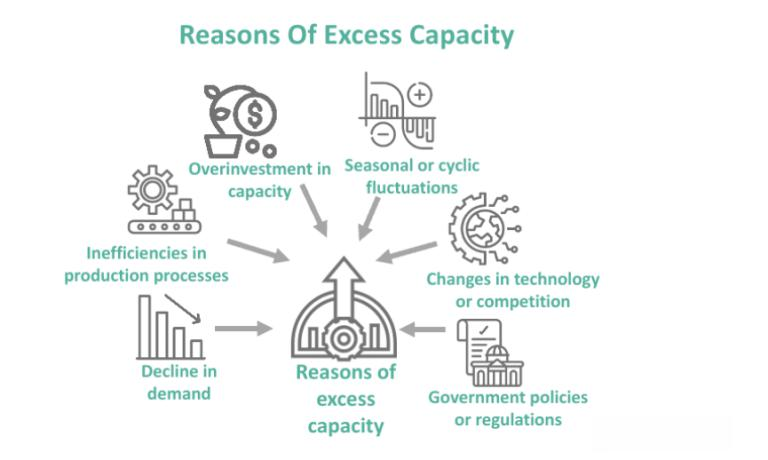

In today's dynamic economic landscape, businesses constantly strive to optimize operations to ensure profitability and sustainability. A critical aspect of this endeavor is navigating the challenges of excess capacity, a condition where a company's production capabilities surpass market demand. This scenario often leads to underutilized resources, which can strain financial performance and efficiency. However, excess capacity also presents distinct advantages, particularly in strategic contexts such as algorithmic trading, where it can be leveraged for competitive gain.

Excess capacity poses both challenges and opportunities for businesses. On the one hand, it can lead to inefficiencies and increased operational costs as companies are unable to use their full production potential. On the other hand, it provides a buffer for businesses to meet unexpected surges in demand without the need for immediate additional investments in capacity. Furthermore, in the field of algorithmic trading, excess capacity can be harnessed strategically. By utilizing sophisticated algorithms, businesses can maximize resource utilization and potentially offset the costs associated with unused capacity.



Understanding the interplay between economic impact, business management, excess capacity, and algorithmic trading is crucial for modern enterprises aiming to thrive in today's competitive markets. Effective management of excess capacity requires a combination of strategic planning, technological innovation, and data-driven decision-making. By exploring these dimensions, businesses can transform the potential drawbacks of excess capacity into opportunities for growth and increased profitability. The rising prominence of data analytics and algorithmic decision-making processes underscores the importance of integrating these technologies into business operations to maintain competitiveness and adaptability in an ever-evolving market landscape.

## Table of Contents

## Understanding Excess Capacity

Excess capacity refers to a scenario where a company's production abilities outstrip the current market demand, leading to idle resources and underutilized potential. This situation is most commonly observed in manufacturing industries, where the mismatch between production capabilities and market demand can be pronounced. For example, a factory may have the ability to produce 10,000 units of a product per month, but if the market demand is only 7,000 units, there exists an excess capacity equivalent to 3,000 units.

In recent years, this phenomenon has gained relevance in the service sector as well. Service industries, such as hospitality or telecommunications, often face similar challenges when they expand operations based on anticipated demand that fails to materialize. In such cases, assets like hotel rooms or bandwidth may go unutilized, impacting profitability.

Several factors contribute to the development of excess capacity. Overinvestment is one key cause, where companies invest heavily in new technologies, facilities, or labor force without aligning these investments with realistic demand projections. Another significant [factor](/wiki/factor-investing) is misprediction of demand, often resulting from inadequate market analysis or overly optimistic growth forecasts. These factors can lead to a situation where the production or service capacity exceeds what the market requires. 

To manage and mitigate the risks associated with excess capacity, businesses need to carefully plan their resource allocation and market strategies. This involves conducting thorough market research to understand demand trends, investing in scalable technologies that allow for flexible production adjustments, and possibly diversifying product or service offerings to meet varying market needs. By understanding and addressing the root causes of excess capacity, businesses can better align their operations with market requirements and reduce unnecessary expenditures.

## Economic Implications of Excess Capacity

Excess capacity occurs when a company's production capabilities exceed the current market demand, presenting both opportunities and challenges. In certain contexts, such as during unexpected increases in demand, excess capacity can serve as a strategic asset that allows businesses to respond swiftly without the need for additional investment. This flexibility can be critical for maintaining customer satisfaction and capturing temporary market opportunities that arise from demand surges. 

However, the persistent presence of excess capacity can have detrimental economic implications. Prolonged periods of underutilization can erode profitability as fixed costs continue without the offsetting revenues that full production would provide. This inefficiency can lead to an increased cost per unit, as the burden of overhead and maintenance is spread over a smaller quantity of output, adversely affecting profit margins.

Economic recessions can intensify the issues associated with excess capacity. During downturns, demand often decreases, exacerbating the gap between production capabilities and market needs. Companies striving to maintain operations may face increased competition, reduced pricing power, and wasted resources, as more firms attempt to leverage their excess capacity to stay afloat. The resultant impact on productivity can ripple through the economy, leading to lower GDP growth and higher unemployment rates as industries find themselves overstaffed and underutilized.

To manage excess capacity, businesses can adopt several strategies. One approach is to increase operational efficiencies, which might involve streamlining processes, reducing waste, or adopting new technologies that allow for more flexible production runs. Additionally, companies can explore new market opportunities, either by diversifying their product offerings or entering new geographic regions. This approach not only helps in using up excess capacity but can also open new revenue streams. Data analytics and market research are invaluable tools in this endeavor, enabling businesses to identify and respond to emerging trends and demands effectively. 

Overall, while excess capacity presents complex challenges, it also provides an impetus for innovation and strategic adaptation. By effectively managing excess capacity, companies can position themselves to not only survive adverse economic conditions but also to emerge stronger and more competitive in the global market landscape.

## Business Management Strategies

Effective management of excess capacity necessitates sound strategic planning and resource allocation, ensuring businesses can quickly adapt to fluctuations in market demands. To leverage excess capacity, companies often employ strategies such as diversifying product lines or entering new markets. By expanding the range of products or services offered, firms can tap into different customer segments, thereby reducing reliance on a single market and utilizing idle production capabilities. For example, a manufacturing company with excess production capacity might introduce a new product variant to appeal to a different demographic, thereby increasing its market share and optimizing resource use.

In addition to diversification, technological upgrades and process improvements serve as pivotal strategies for aligning capacity with market demands. Implementing advanced technologies such as automation and [artificial intelligence](/wiki/ai-artificial-intelligence) can enhance production efficiency, reducing operational costs and enabling more responsive adjustments to demand changes. For instance, adopting predictive analytics can help businesses anticipate market trends and adjust production schedules accordingly, minimizing the time and resources spent on unprofitable activities.

Optimizing resource allocation through process improvements involves refining operational workflows to eliminate inefficiencies. Techniques such as Lean Manufacturing and Six Sigma can streamline production processes, ensuring that resources are used more effectively. These methodologies focus on waste reduction and continuous improvement, allowing businesses to produce more with the same or fewer resources, thus maximizing the utilization of excess capacity.

Moreover, leveraging digital tools for supply chain management can significantly impact how businesses manage excess capacity. Integrated digital platforms enable better coordination among different departments and improve communication with suppliers and customers. By having real-time visibility into supply chain activities, companies can adjust procurement and inventory levels more precisely, aligning production with actual demand and reducing excess capacity.

In conclusion, business management strategies for effectively handling excess capacity revolve around strategic diversification, investment in technological advancements, and making process improvements. These approaches not only help in maximizing resource utilization but also position companies to quickly adapt to market shifts, maintaining profitability and competitive advantage.

## Role of Algorithmic Trading in Managing Excess Capacity

Algorithmic trading leverages automation and sophisticated data analytics to streamline and enhance the efficiency of financial transactions. This approach allows businesses to harness excess capacity by utilizing computational resources and idle data in strategic trading operations. By analyzing complex data patterns, [algorithmic trading](/wiki/algorithmic-trading) facilitates informed decision-making, enabling companies to deploy underutilized resources effectively in trading activities. This nuanced use of resources can assist in offsetting the costs associated with maintaining excess capacity.

Algorithmic trading systems analyze vast datasets to identify profitable trading opportunities. Machine learning algorithms, for instance, can be deployed to predict price movements, assess risk factors, and execute trades based on pre-defined criteria. By applying statistical models and algorithms, these systems can adapt to changing market conditions rapidly, offering a level of agility that traditional trading methodologies may lack.

Risk management is another critical aspect where algorithmic trading provides valuable insights. By continuously processing real-time data, these trading systems can detect trends and monitor demand fluctuations with precision. This capability allows businesses to dynamically adjust their trading strategies in response to market trends, thus mitigating risks associated with volatile markets. For example, a predictive model could use regression analysis to forecast financial metrics. In Python, a simple linear regression model might be implemented as follows:

```python
from sklearn.linear_model import LinearRegression
import numpy as np

# Sample data
X = np.array([[1], [2], [3], [4], [5]])  # Independent variable (e.g., time)
y = np.array([2, 4, 5, 4, 5])            # Dependent variable (e.g., stock prices)

# Creating and training the model
model = LinearRegression().fit(X, y)

# Predicting new values
future_time_points = np.array([[6], [7], [8]])
predictions = model.predict(future_time_points)

print("Predicted values:", predictions)
```

This script illustrates how businesses can employ simple linear regression to predict future market conditions, hence making informed adjustments to their trading strategies.

Additionally, algorithmic trading facilitates the effective allocation of financial resources towards investment opportunities during periods of excess production capacity. By redeploying capital into trading systems that have a proven track record of success, firms can potentially unlock hidden value and enhance their return on investment. This strategy not only ensures optimal resource utilization but can also provide a hedge against the financial impact of excess capacity.

Ultimately, the integration of algorithmic trading into resource management strategies allows businesses to transform capacity-related challenges into strategic advantages. By deploying cutting-edge technologies and advanced analytical methods, firms can increase operational efficiencies, thereby positioning themselves for sustained growth and improved financial performance.

## Case Studies and Real-World Examples

The phenomenon of excess capacity presents both challenges and opportunities across various industries. A notable example is the Chinese automobile industry, which has grappled with significant excess capacity issues due to over-investment and government intervention. In recent years, China has become one of the largest automobile producers globally, driven by economic policies aimed at stimulating growth and employment. However, this aggressive expansion has led to a situation where production capacity far exceeds domestic and international demand. Government policies encouraging local automobile manufacturing intensified the situation, resulting in numerous factories operating below optimal levels, thereby leading to inefficiencies and financial strain on manufacturers [1].

Externally, the hospitality industry showcases the impact of excess capacity, emphasizing the seasonal nature of demand fluctuations. Businesses like hotels and resorts experience peak and off-peak periods, leading to variable room occupancy rates throughout the year. This characteristic adds complexity to managing resources effectively. During low-demand periods, resources such as staffing, utilities, and amenities may be underutilized, impacting profitability. To address this, some hospitality companies adopt flexible resource management practices, such as dynamic pricing models and seasonal staffing adjustments, ensuring that resources are aligned with fluctuating demand patterns and improving overall efficiency [2].

Industries that have embraced algorithmic trading demonstrate its potential to manage excess capacity effectively. Algorithmic trading leverages advanced data analytics and automation to optimize financial transactions, enabling companies to convert idle resources into productive assets. By harnessing patterns in market data, businesses can make informed decisions, such as when to deploy additional capacity or when to scale back operations. This approach not only offsets costs associated with excess capacity but also enhances operational efficiencies. Firms implementing algorithmic trading strategies report greater adaptability to market conditions, reduced waste of resources, and improved management of production and financial assets [3].

In conclusion, these case studies highlight the diverse challenges associated with excess capacity across industries and illustrate how strategic approaches and technological advancements like algorithmic trading offer pathways to optimize resource utilization and maintain economic viability.

---

**References:**

[1] Sturgeon, T. J., Biesebroeck, J. V., & Gereffi, G. (2008). Value Chains, Networks and Clusters: Reframing the Global Automotive Industry. *Journal of Economic Geography*.

[2] Zhang, D., Guillet, B. D., & Gao, W. (2012). What determines the seasonal pattern of online hotel prices? *International Journal of Hospitality Management*.

[3] Hendershott, T., Jones, C. M., & Menkveld, A. J. (2011). Does Algorithmic Trading Improve Liquidity? *The Journal of Finance*.

## Conclusion

Excess capacity represents both a significant challenge and a promising opportunity for businesses striving to maintain competitiveness and expand their market presence. This condition occurs when a company's production capacity exceeds the market demand, leading to underutilization of resources. While this can initially appear detrimental by increasing operational costs and reducing profitability, it offers potential advantages if managed strategically.

Strategic management plays a crucial role in harnessing the potential of excess capacity. Businesses can optimize resources, align production more closely with actual market demand, and ensure operational efficiency. This often involves diversifying product lines, exploring new markets, and leveraging technological advancements. Investing in technological upgrades not only aids in better capacity management but also enhances production processes, thus turning underutilized capacity into a growth opportunity.

Algorithmic trading, an innovative technology, exemplifies how businesses can transform excess capacity into tangible benefits. By utilizing algorithms and data analytics, companies can automate trading processes, analyze vast amounts of market data, and make informed decisions regarding resource allocation. This approach not only offsets some of the costs associated with excess capacity but also aids in effective risk management by providing insights into market trends and demand fluctuations.

As businesses evolve in increasingly dynamic economic environments, the reliance on data-driven solutions to manage capacity will only grow. Technologies like algorithmic trading will become integral to addressing the complexities of capacity management, allowing companies to convert potential inefficiencies into avenues for growth and profitability. In this vein, future business landscapes will likely feature a strengthened emphasis on integrating innovative strategies and technologies to enable more effective and sustainable capacity management.

## References & Further Reading

[1]: Bergstra, J., Bardenet, R., Bengio, Y., & Kégl, B. (2011). ["Algorithms for Hyper-Parameter Optimization."](https://dl.acm.org/doi/10.5555/2986459.2986743) Advances in Neural Information Processing Systems 24.

[2]: ["Advances in Financial Machine Learning"](https://www.amazon.com/Advances-Financial-Machine-Learning-Marcos/dp/1119482089) by Marcos Lopez de Prado

[3]: ["Evidence-Based Technical Analysis: Applying the Scientific Method and Statistical Inference to Trading Signals"](https://www.amazon.com/Evidence-Based-Technical-Analysis-Scientific-Statistical/dp/0470008741) by David Aronson

[4]: ["Machine Learning for Algorithmic Trading"](https://github.com/stefan-jansen/machine-learning-for-trading) by Stefan Jansen

[5]: ["Quantitative Trading: How to Build Your Own Algorithmic Trading Business"](https://www.amazon.com/Quantitative-Trading-Build-Algorithmic-Business/dp/1119800064) by Ernest P. Chan

[6]: Sturgeon, T. J., Biesebroeck, J. V., & Gereffi, G. (2008). "Value Chains, Networks and Clusters: Reframing the Global Automotive Industry." *Journal of Economic Geography*.

[7]: Zhang, D., Guillet, B. D., & Gao, W. (2012). "What determines the seasonal pattern of online hotel prices?" *International Journal of Hospitality Management*.

[8]: Hendershott, T., Jones, C. M., & Menkveld, A. J. (2011). "Does Algorithmic Trading Improve Liquidity?" *The Journal of Finance*.