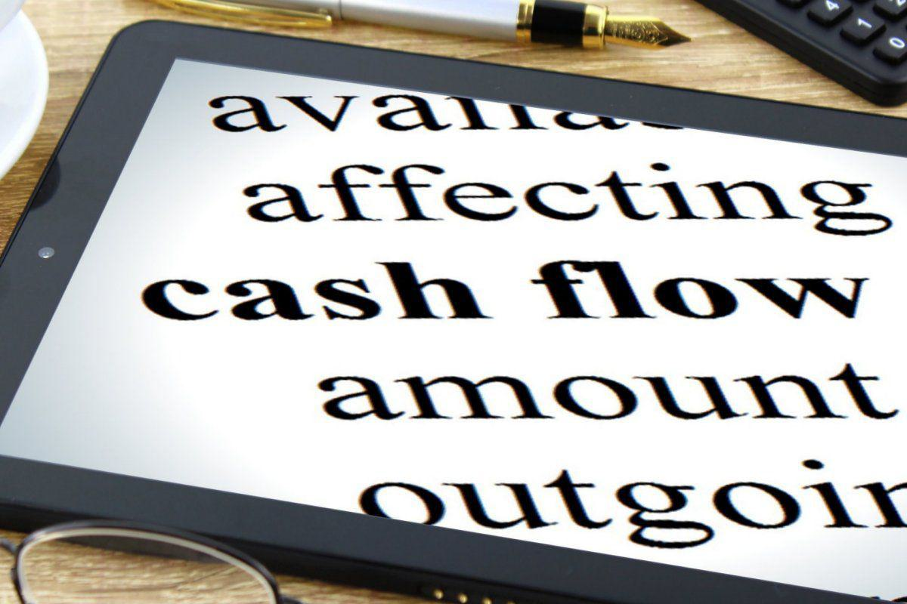

Understanding cash flow and its management is vital for both businesses and investors. Cash flow, the lifeblood of any business, indicates the financial health of a company by showing how effectively it generates cash to fund its operating expenses, service debts, and enable growth through investments. This article discusses key concepts such as excess cash flow and cash flow calculation, with a specific emphasis on algorithmic trading, a modern and efficient approach to investment.

Excess cash flow is the surplus of cash generated after a company fulfills all its operating expenses and fixed financial obligations. Essentially, it is a measure of a company's ability to generate more cash than it immediately needs, thus enabling reinvestment, debt reduction, or distribution to shareholders. The role of excess cash flow in determining a company's operational success and its appeal to investors cannot be overstated.



We will cover the methodologies involved in calculating cash flow by examining financial statements and essential metrics. Specifically, we will look at operating cash flow and capital expenditures, components that are integral to computing excess cash flow. Clear examples and formulas will offer a practical understanding of these calculations.

Algorithmic trading, an automated strategy employing pre-programmed trading instructions, is an important facet of modern finance. This strategy can significantly affect cash flow calculations and the broader financial planning process by optimizing investment decisions. Companies can leverage algorithmic trading to enhance cash flow management, tying it into broader economic responses and market trends.

This article aims to provide readers with a robust understanding of the impact and significance of excess cash flow. Readers will also learn how algorithmic trading intersects with these financial metrics to refine investment strategies. Understanding these concepts equips businesses and investors with the tools and knowledge required to navigate the financial markets successfully, ultimately boosting their competitiveness in increasingly complex markets.

## Table of Contents

## Understanding Excess Cash Flow

Excess cash flow refers to the remaining funds a company retains after covering all its operating expenses, interest payments, taxes, and necessary capital expenditures. It provides insight into a company's financial health by indicating its capability to reinvest in growth opportunities, pay off debts, or distribute dividends to shareholders. 

In financial terms, excess cash flow can be represented by the following formula:

$$
\text{Excess Cash Flow} = \text{Operating Cash Flow} - \text{Capital Expenditures} - \text{Debt Service} - \text{Other Fixed Financial Obligations}
$$

This metric is of exceptional importance in assessing a company's performance and its potential for sustainable growth. A consistent and growing excess cash flow suggests that the company may have ample resources to support expansion initiatives, enhance operational efficiency, or improve shareholder value through dividends or share buybacks.

In loan agreements, excess cash flow is typically defined with precision, comprising a specific measure that lenders use to gauge the borrower's financial stability and capacity to meet debt obligations. Such agreements may include covenants that require a borrower to use a portion of its excess cash flow for debt reduction, thereby minimizing the lender's risk exposure. For instance, a loan agreement might stipulate that a certain percentage of excess cash flow must be directed toward prepaying principal debt, thus acting as a protective financial mechanism for lenders.

The impact of excess cash flow extends to a company’s operations and investor relations. With significant excess cash flow, a firm is better equipped to handle unforeseen expenses or economic downturns, fostering an image of reliability and resilience. Additionally, investors often regard excess cash flow as an indicator of a company’s strength and strategic flexibility, further influencing their investment decisions. 

Therefore, effective management and strategic utilization of excess cash flow not only aid in stabilizing a company’s financial standing but also play a critical role in enhancing shareholder value and encouraging investor confidence.

## Calculation of Cash Flow

Calculating cash flow is a fundamental aspect of understanding a company's financial situation. It requires a detailed analysis of financial statements and metrics, focusing on key components such as operating cash flow and capital expenditures.

Operating cash flow is the money a company generates from its core business operations, excluding costs related to capital investments. It can be calculated by adjusting net income for changes in working capital, non-cash expenses, and other operating activities. The basic formula is:

$$
\text{Operating Cash Flow} = \text{Net Income} + \text{Non-Cash Expenses} + \text{Changes in Working Capital}
$$

Non-cash expenses typically include depreciation and amortization, while changes in working capital account for variations in current assets and liabilities.

Capital expenditures (CapEx), on the other hand, refer to funds used by a company to acquire or upgrade physical assets such as property, industrial buildings, or equipment. These expenditures are essential for maintaining or improving the operational capacity of a business. Calculating capital expenditures involves analyzing the company's financial statements to determine the investments made in long-term assets.

Excess cash flow is determined by subtracting capital expenditures from operating cash flow. This figure represents the surplus funds available for purposes such as debt repayment, reinvestment, or distribution to shareholders. The formula for calculating excess cash flow is:

$$
\text{Excess Cash Flow} = \text{Operating Cash Flow} - \text{Capital Expenditures}
$$

To illustrate this with a practical example, consider a company with a net income of $500,000. Suppose the depreciation and amortization expenses are $100,000, and changes in working capital result in a $50,000 increase in cash flow. The operating cash flow would be calculated as:

$$
\$500,000 + \$100,000 + \$50,000 = \$650,000
$$

Assuming the company has capital expenditures of $150,000, the excess cash flow would be:

$$
\$650,000 - \$150,000 = \$500,000
$$

This example demonstrates the process by which companies can ascertain the availability of cash flows that exceed their immediate operational and investment needs. These calculations are critical for strategic decision-making, allowing businesses to allocate resources efficiently and optimize financial performance.

## Financial Examples Featuring Excess Cash Flow

In exploring the concept of excess cash flow, consider the hypothetical case study of a manufacturing company, XYZ Corp, which consistently generates excess cash flow beyond its operating needs and financial obligations. This positions XYZ Corp to make strategic financial decisions that can profoundly affect its business trajectory.

XYZ Corp’s calculation of excess cash flow begins with the operating cash flow derived from its core business operations. Assume XYZ Corp's net profit is $5 million after taxes and its depreciation and amortization expenses amount to $2 million. The change in working capital, reflecting the difference between current assets and liabilities, is a decrease of $0.5 million, indicating a positive cash inflow. Therefore, the operating cash flow can be calculated as follows:

$$
\text{Operating Cash Flow} = \text{Net Profit} + \text{Depreciation and Amortization} - \text{Change in Working Capital}
$$

$$
\text{Operating Cash Flow} = \$5,000,000 + \$2,000,000 + \$500,000 = \$7,500,000
$$

With $3 million allocated for capital expenditures to maintain and expand its production facilities, XYZ Corp's excess cash flow can be calculated by subtracting capital expenditures and mandatory debt repayments (assuming $1 million) from the operating cash flow:

$$
\text{Excess Cash Flow} = \text{Operating Cash Flow} - \text{Capital Expenditures} - \text{Debt Repayments}
$$

$$
\text{Excess Cash Flow} = \$7,500,000 - \$3,000,000 - \$1,000,000 = \$3,500,000
$$

Having identified $3.5 million as excess cash flow, XYZ Corp has several strategic options. One potential decision is to reinvest these funds into research and development, thereby fostering innovation and potentially leading to the introduction of new products. Alternatively, the company could focus on expansion by acquiring a competitor or entering new markets, thereby increasing its market share.

In another scenario, XYZ Corp could prioritize debt reduction to improve its balance sheet's health. By repaying more than the required debt installments, XYZ Corp can save on interest expenses and achieve a more favorable credit rating, lowering its future borrowing costs. This strategic use of excess cash flow might be particularly attractive if the company anticipates volatile market conditions that necessitate a stronger financial base.

Increasing shareholder returns through dividends or share buybacks is another viable option. Distributing a portion of excess cash flow as dividends can enhance investor satisfaction and potentially improve the company’s stock valuation. Conversely, share buybacks reduce the number of outstanding shares, often resulting in an appreciation of stock prices due to increased earnings per share.

Through this example, it becomes evident how excess cash flow serves as a critical financial lever, enabling businesses to make informed strategic decisions that can lead to sustained growth and stability. Understanding how to harness this financial resource effectively allows companies like XYZ Corp to navigate both opportunities and challenges in their path to success.

 to Algorithmic Trading

Algorithmic trading, often referred to as algo trading, is a method that utilizes advanced mathematical models and complex algorithms to facilitate automated trading. These systems can execute orders at high speeds, enabling traders to leverage market opportunities that might be missed by human traders. By automating trading decisions, firms can manage assets more effectively, thereby optimizing cash flow.

The primary advantage of algo trading lies in its ability to process vast amounts of market data quickly, allowing for informed investment decisions without the delay associated with manual intervention. This is particularly beneficial for managing excess cash flow, as algorithms can efficiently allocate surplus funds to investment opportunities or utilize them for strategic financial operations like stock buybacks or acquiring portfolios.

One key element of [algorithmic trading](/wiki/algorithmic-trading) is the set of pre-programmed trading instructions based on variables like timing, price, and [volume](/wiki/volume-trading-strategy). By integrating these variables into automated trading strategies, companies can precisely control the deployment of excess cash flow. This ensures that capital is allocated when and where it can achieve maximum returns, enhancing overall financial performance.

In terms of implementation, an algorithm might be designed to buy stock only when a specific condition is met, such as when a stock's 50-day moving average crosses its 200-day moving average. This technique, known as a moving average crossover strategy, is a simple example of how algo trading can help optimize investments without the need for constant human oversight.

Python, a programming language known for its simplicity and readability, is often used to develop such algorithms. Here's a basic example of a moving average crossover strategy using Python and the Pandas library:

```python
import pandas as pd

# Assuming 'data' is a DataFrame with a DateTime index and a 'Close' column
def moving_average_crossover(data):
    short_window = 50
    long_window = 200

    # Calculate moving averages
    data['MA50'] = data['Close'].rolling(window=short_window, min_periods=1).mean()
    data['MA200'] = data['Close'].rolling(window=long_window, min_periods=1).mean()

    # Create signals
    data['Signal'] = 0
    data['Signal'][short_window:] = np.where(data['MA50'][short_window:] > data['MA200'][short_window:], 1, 0)

    # Generate trading orders
    data['Position'] = data['Signal'].diff()

    return data

# Sample usage
# data = pd.read_csv('historical_stock_data.csv', index_col='Date', parse_dates=True)
# strategy_output = moving_average_crossover(data)
```

This script demonstrates a simple approach to implementing a trading strategy using moving averages. The algorithm generates signals based on the crossover condition, helping traders decide when to buy or sell. 

Moreover, algo trading supports cash flow management by providing granular insights into portfolio performance. It facilitates rapid adjustments to market conditions, ensuring investments are aligned with current financial goals. As algorithmic trading continues to grow, its integration with cash flow management strategies will likely become a standard practice in optimizing financial resources across various sectors.

## Impact of Algo Trading on Cash Flow Calculations

Algorithmic trading, or algo trading, plays a significant role in influencing a company’s cash flow and financial planning. By employing complex algorithms and [artificial intelligence](/wiki/ai-artificial-intelligence), traders can make swift decisions regarding investment opportunities, optimizing both the timing and execution of trades. This capacity to make real-time adjustments based on market conditions enables businesses to manage their cash flow more effectively.

One of the primary advantages of algo trading is its ability to determine the best times to buy or sell assets. These trading strategies employ historical data, price variations, and market trends to make informed predictions about future price movements. For instance, algorithms can be designed to execute trades automatically when a stock's price reaches a predetermined level, maximizing the chances of achieving desired financial outcomes.

Algo trading also enhances cash flow management by anticipating and swiftly reacting to market changes. This is particularly beneficial in volatile markets where prices can fluctuate rapidly. Through the use of statistical models and [machine learning](/wiki/machine-learning), algorithms can predict market trends and execute trades faster than human traders. As a result, businesses can increase their operational efficiency by securing profits and minimizing losses, thus ensuring a more stable cash flow.

Furthermore, algorithmic strategies can help companies optimize their short-term and long-term financial planning. By analyzing patterns and providing insights on market conditions, these strategies assist in identifying periods of financial surplus or deficit. This foresight allows financial planners to make strategic decisions such as reinvesting excess cash flow into high-yield investments or retaining funds for periods of uncertainty.

In practice, the implementation of algorithmic trading might involve scripting in Python:

```python
import numpy as np

def simple_moving_average(prices, window=5):
    weights = np.ones(window) / window
    return np.convolve(prices, weights, mode='valid')

# Market prices
prices = [110, 115, 120, 125, 130, 135, 140, 145]

# Calculate simple moving average
sma = simple_moving_average(prices)

# Assuming a strategy triggers on crossing above/below SMA
for i in range(1, len(sma)):
    if prices[i + window - 1] > sma[i - 1]:
        print(f"Buy signal at price {prices[i + window - 1]}")
    elif prices[i + window - 1] < sma[i - 1]:
        print(f"Sell signal at price {prices[i + window - 1]}")
```

In this simplified example, a moving average strategy generates buy and sell signals based on the crossing of price and moving-average values. Such strategies, when implemented on a larger scale and with more complexity, enable businesses to manage their cash flow by optimizing trade execution and capitalizing on market opportunities.

In conclusion, algorithmic trading significantly optimizes cash flow by determining optimal trade timings and swiftly responding to market changes. Incorporating these advanced strategies into financial planning provides businesses with the tools necessary to sustain financial stability and capitalize on profitable opportunities.

## Conclusion

Excess cash flow is a key indicator of a business's financial health, offering numerous opportunities for capital growth, strategic investments, and efficient debt management. By effectively analyzing and managing these cash reserves, companies can navigate economic pressures with enhanced agility and foresight. One innovative approach is the application of algorithmic trading strategies. These advanced tools allow businesses to analyze large datasets, identify optimal times for transactions, and execute trades at high speeds, thereby optimizing their cash flow performance.

Incorporating algorithmic trading into financial management practices equips businesses to adapt swiftly to market dynamics, offering a competitive advantage. As global markets increase in complexity, having a proficient algorithmic system in place is becoming critical for firms looking to maximize financial outcomes. These systems allow for enhanced decision-making capabilities, enabling firms to not only meet immediate financial obligations but also to strategically position themselves for future growth opportunities.

The intersection of excess cash flow management and algorithmic trading provides a robust framework for businesses seeking to enhance their financial strategies. By combining these two elements, companies can better anticipate market shifts, allocate resources more effectively, and achieve sustained financial success in an increasingly competitive environment.

## Further Reading and Resources

For those looking to expand their understanding of financial management and algorithmic trading, several resources provide in-depth knowledge and practical insights.

### Books
1. **"The Intelligent Investor" by Benjamin Graham**  
   This classic text offers foundational insights into value investing and financial analysis, which are crucial for managing cash flows effectively.

2. **"Financial Intelligence" by Karen Berman and Joe Knight**  
   This book breaks down complex financial concepts, making them accessible and applicable for daily business operations, including the management of excess cash flow.

3. **"Algorithmic Trading" by Ernie Chan**  
   Ernie Chan provides practical guidance on implementing algorithmic trading strategies, emphasizing quantitative analysis and financial mathematics.

4. **"Valuation: Measuring and Managing the Value of Companies" by McKinsey & Company Inc.**  
   A comprehensive guide to company valuation, this book helps understand how excess cash flow influences company value and strategic financial decisions.

### Articles
1. **"The Role of Cash Flow Statements in Predicting Financial Distress" published in academic journals**  
   An exploration of how cash flow analysis can predict and mitigate financial risks.

2. **"Algorithmic and High-Frequency Trading" from CFA Institute**  
   This article provides a detailed look at how algo trading strategies are developed and their impact on financial markets.

3. **"Analyzing and Mitigating Risks in Cash Flow Management" from Harvard Business Review**  
   This offers insights into modern techniques for efficient cash flow management.

### Online Courses
1. **Coursera: "Financial Management" by the University of Illinois**  
   A [course](/wiki/best-algorithmic-trading-courses) covering key principles of financial management, including cash flow management and investment strategies.

2. **edX: "Algorithmic Thinking" by Rice University**  
   Though focused broadly on algorithms, this course provides the basis for understanding how algorithms can be applied in trading strategies.

3. **Udemy: "Algorithmic Trading Using Python"**  
   A hands-on course guiding students through the development and implementation of algorithmic trading systems using Python.

These resources offer a robust foundation for anyone interested in mastering financial management and algorithmic trading. Whether through classical literature or cutting-edge online courses, the knowledge gained can be pivotal in refining investment strategies and optimizing cash flows.

## References & Further Reading

[1]: Graham, B. (2006). ["The Intelligent Investor: The Definitive Book on Value Investing."](https://www.amazon.com/Intelligent-Investor-Definitive-Investing-Essentials/dp/0060555661) HarperBusiness.

[2]: Berman, K., & Knight, J. (2008). ["Financial Intelligence: A Manager's Guide to Knowing What the Numbers Really Mean."](https://www.amazon.com/Financial-Intelligence-Revised-Managers-Knowing/dp/1422144119) Harvard Business Review Press.

[3]: Chan, E. P. (2013). ["Algorithmic Trading: Winning Strategies and Their Rationale."](https://github.com/ftvision/quant_trading_echan_book) Wiley.

[4]: Koller, T., Goedhart, M., & Wessels, D. (2010). ["Valuation: Measuring and Managing the Value of Companies."](https://www.wiley.com/en-us/Valuation%3A+Measuring+and+Managing+the+Value+of+Companies%2C+7th+Edition-p-9781119610885) Wiley.

[5]: Aronson, D. R. (2006). ["Evidence-Based Technical Analysis: Applying the Scientific Method and Statistical Inference to Trading Signals."](https://www.amazon.com/Evidence-Based-Technical-Analysis-Scientific-Statistical/dp/0470008741) Wiley.

[6]: Lopez de Prado, M. (2018). ["Advances in Financial Machine Learning."](https://www.amazon.com/Advances-Financial-Machine-Learning-Marcos/dp/1119482089) Wiley.

[7]: Jansen, S. (2018). ["Machine Learning for Algorithmic Trading."](https://github.com/stefan-jansen/machine-learning-for-trading) Packt Publishing.

[8]: Chan, E. P. (2008). ["Quantitative Trading: How to Build Your Own Algorithmic Trading Business."](https://github.com/ftvision/quant_trading_echan_book) Wiley.