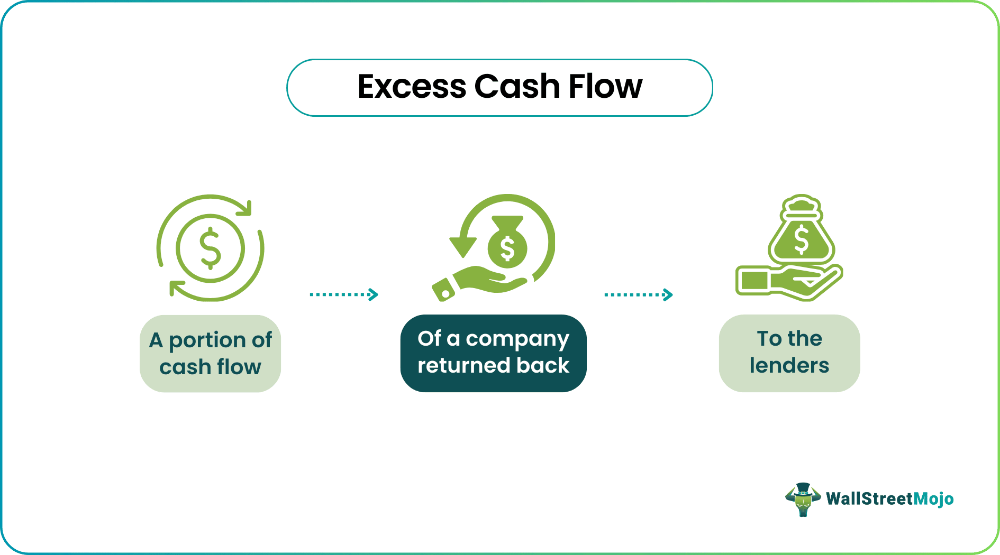

## Table of Contents

## What is excess cash flow?

Excess cash flow is the money a business has left over after it has paid for all its expenses and investments. It's what remains when a company has covered its costs like salaries, rent, utilities, and any money it needs to spend on new equipment or projects. This extra cash can be used in different ways, such as paying down debts, saving for future expenses, or giving money back to shareholders.

Having excess cash flow is a good sign that a business is doing well financially. It shows that the company is making more money than it needs to spend, which can help it grow and stay strong, even during tough times. Companies often aim to have a healthy amount of excess cash flow so they can be ready for unexpected costs or take advantage of new opportunities.

## Why is excess cash flow important for businesses?

Excess cash flow is important for businesses because it shows that they are making more money than they need to spend. This extra money can help a business in many ways. For example, it can be used to pay off debts faster, which means the business will have less to pay in interest. It can also be saved for future expenses, like buying new equipment or expanding the business. Having extra cash also means a business can handle unexpected costs, like repairs or emergencies, without having to borrow money.

Another reason excess cash flow is important is that it gives a business the freedom to take advantage of new opportunities. If a good chance comes up, like buying another company or starting a new project, having extra cash means the business can move quickly without needing to find money from somewhere else. This can help the business grow and stay ahead of competitors. Plus, when a business has excess cash flow, it can also give money back to its owners or shareholders, which can make them happy and keep them supporting the business.

## How do you calculate excess cash flow?

To calculate excess cash flow, you start with the money a business makes, which is called revenue. Then, you subtract all the costs the business has to pay, like salaries, rent, and utilities. These are called operating expenses. After that, you also need to subtract any money the business spends on investments, like buying new equipment or starting new projects. What's left after you've subtracted all these costs from the revenue is the excess cash flow.

For example, if a business makes $100,000 in revenue and has $70,000 in operating expenses and $10,000 in investments, you would calculate the excess cash flow like this: $100,000 (revenue) - $70,000 (operating expenses) - $10,000 (investments) = $20,000. This $20,000 is the excess cash flow, which the business can use for things like paying off debts, saving for future expenses, or giving money back to shareholders.

## What are the components of excess cash flow?

Excess cash flow is made up of three main parts: revenue, operating expenses, and investments. Revenue is the money a business makes from selling its products or services. This is the starting point for figuring out excess cash flow. Operating expenses are all the costs a business has to pay to keep running, like salaries, rent, and utilities. These costs are taken away from the revenue.

The last part of excess cash flow is investments. Investments are the money a business spends on things like new equipment or starting new projects. After you take away the operating expenses and investments from the revenue, what's left is the excess cash flow. This extra money can be used for things like paying off debts, saving for future expenses, or giving money back to shareholders.

## Can you provide a simple example of excess cash flow calculation?

Let's say a small bakery makes $5,000 in a month from selling cakes and cookies. That's their revenue. To keep the bakery running, they have to pay $3,000 for things like rent, electricity, and the baker's salary. These are their operating expenses. The bakery also decides to spend $500 on a new oven, which is an investment.

To find out the excess cash flow, we take the revenue and subtract the operating expenses and the investment. So, it looks like this: $5,000 (revenue) - $3,000 (operating expenses) - $500 (investment) = $1,500. That $1,500 is the excess cash flow. The bakery can use this extra money to pay off any loans, save for future expenses, or maybe even give some back to the owners.

## How does excess cash flow differ from free cash flow?

Excess cash flow and free cash flow are similar, but they are not exactly the same. Excess cash flow is the money a business has left over after paying for all its costs and investments. It's what remains when you take away operating expenses and investments from the total revenue. This extra money can be used for things like paying off debts, saving for the future, or giving money back to the owners or shareholders.

Free cash flow, on the other hand, focuses more on the cash a business generates after it has paid for its operating expenses and capital expenditures. Capital expenditures are similar to investments but specifically refer to money spent on physical assets like buildings or equipment. Free cash flow is often used to see how much cash a business can use for other things, like expanding the business, paying dividends, or reducing debt. While both terms deal with leftover cash, excess cash flow is a broader term that can include any type of investment, not just capital expenditures.

## What are common uses of excess cash flow?

Businesses often use excess cash flow to pay off debts. When a company has extra money, it can pay back loans faster. This means they will have less interest to pay later, which is good for their finances. Another common use is saving for the future. Companies might put the extra cash into a savings account or invest it in safe places. This helps them be ready for unexpected costs or to buy new things they might need later.

Excess cash flow can also be used to grow the business. Companies might spend the extra money on new projects or buying other businesses. This can help them get bigger and make more money in the future. Sometimes, businesses use excess cash flow to give money back to their owners or shareholders. They might pay dividends, which are like little bonuses, or buy back their own shares, which can make the shares more valuable.

## How can excess cash flow impact a company's financial strategy?

Excess cash flow can really change how a company plans its money moves. When a business has extra cash, it can choose to pay off debts faster. This means they will pay less interest over time, which is good for their wallet. The company might also decide to save this extra money for future needs. Having a savings cushion helps them be ready for surprises, like fixing broken things or buying new stuff they might need later. This can make the business feel more secure and ready for anything that comes their way.

Another big way excess cash flow can affect a company's money plan is by helping it grow. The business might use the extra cash to start new projects or buy other companies. This can help them get bigger and make more money down the road. Plus, having extra cash can let the company give some money back to its owners or shareholders. They could pay dividends, which are like little bonuses, or buy back their own shares, making the shares more valuable. All these choices help the company think about the best way to use their money to do well in the future.

## What are the potential risks associated with managing excess cash flow?

Managing excess cash flow can be tricky because there are risks involved. One big risk is that a company might keep too much cash on hand without using it wisely. If the money just sits in a bank account and doesn't earn much interest, it could lose value over time because of inflation. This means the money won't be worth as much in the future as it is now. Another risk is that the company might make bad investments with the extra cash. If they spend the money on projects or other businesses that don't do well, they could lose it all.

Another risk is that having a lot of excess cash might make a company a target for takeovers. Other businesses might see the extra cash and want to buy the company to get their hands on it. This can put the company in a tough spot, especially if they don't want to be bought out. Also, if the company decides to give the excess cash back to shareholders through dividends or share buybacks, they might not have enough money left for future needs or emergencies. Balancing how to use excess cash flow is important to avoid these risks and keep the business strong.

## How can excess cash flow be used to assess a company's financial health?

Excess cash flow is a good way to check how healthy a company's money situation is. When a business has more money coming in than it needs to spend on things like bills and buying new stuff, it shows that the company is doing well. This extra money, called excess cash flow, means the business can pay off debts, save for the future, or even give some money back to the people who own the company. If a company keeps having excess cash flow, it's a sign that it's making good money and managing its costs well.

Looking at how much excess cash flow a company has can also tell you if it's ready for tough times. If there's a lot of extra cash, the business can handle surprises like having to fix something that breaks or dealing with less money coming in because of a slow season. It also means the company can take advantage of new chances to grow, like starting a new project or buying another business. So, a healthy amount of excess cash flow is a good sign that a company is strong and ready for whatever comes next.

## What advanced methods exist for optimizing the use of excess cash flow?

One advanced way to use excess cash flow is through strategic investments. Companies can put their extra money into things like stocks, bonds, or even other businesses that could grow and make more money over time. This is a smart move because it can help the company earn more than just keeping the money in a regular bank account. But it's important to pick the right investments because if they don't do well, the company could lose money. To make good choices, businesses often work with financial experts who can help them find the best places to invest their extra cash.

Another method is using excess cash flow to pay down debts more quickly. Instead of just making the regular payments, a company can use the extra money to pay off loans faster. This saves them money on interest and can make their financial situation stronger. But it's not always the best choice to pay off all debts right away. Sometimes, keeping some debt can be good if the [interest rate](/wiki/interest-rate-trading-strategies) is low and the company can use the extra cash for investments that will make more money. Balancing these choices is key to using excess cash flow in the smartest way possible.

## How do industry-specific factors influence the management of excess cash flow?

Different industries have different needs and challenges, which can change how a company uses its extra money. For example, in the tech industry, companies might use their excess cash flow to invest in research and development. This is because new technology is always coming out, and they need to stay ahead. On the other hand, in the retail industry, a company might use the extra money to open new stores or improve the ones they already have. This helps them reach more customers and make more sales.

Another thing to think about is how stable the industry is. In industries like utilities, where the business is pretty steady, companies might save their excess cash flow for emergencies or future projects. But in industries like fashion, where trends change quickly, companies might use the extra money to quickly start new projects or buy new inventory to keep up with what's popular. Understanding these industry-specific factors helps companies decide the best way to use their excess cash flow to stay strong and grow.

## What is Understanding Excess Cash Flow?

Excess cash flow refers to the remaining funds a company retains after covering all its operating expenses, interest payments, taxes, and necessary capital expenditures. It provides insight into a company's financial health by indicating its capability to reinvest in growth opportunities, pay off debts, or distribute dividends to shareholders. 

In financial terms, excess cash flow can be represented by the following formula:

$$
\text{Excess Cash Flow} = \text{Operating Cash Flow} - \text{Capital Expenditures} - \text{Debt Service} - \text{Other Fixed Financial Obligations}
$$

This metric is of exceptional importance in assessing a company's performance and its potential for sustainable growth. A consistent and growing excess cash flow suggests that the company may have ample resources to support expansion initiatives, enhance operational efficiency, or improve shareholder value through dividends or share buybacks.

In loan agreements, excess cash flow is typically defined with precision, comprising a specific measure that lenders use to gauge the borrower's financial stability and capacity to meet debt obligations. Such agreements may include covenants that require a borrower to use a portion of its excess cash flow for debt reduction, thereby minimizing the lender's risk exposure. For instance, a loan agreement might stipulate that a certain percentage of excess cash flow must be directed toward prepaying principal debt, thus acting as a protective financial mechanism for lenders.

The impact of excess cash flow extends to a company’s operations and investor relations. With significant excess cash flow, a firm is better equipped to handle unforeseen expenses or economic downturns, fostering an image of reliability and resilience. Additionally, investors often regard excess cash flow as an indicator of a company’s strength and strategic flexibility, further influencing their investment decisions. 

Therefore, effective management and strategic utilization of excess cash flow not only aid in stabilizing a company’s financial standing but also play a critical role in enhancing shareholder value and encouraging investor confidence.

## How do you calculate cash flow?

Calculating cash flow is a fundamental aspect of understanding a company's financial situation. It requires a detailed analysis of financial statements and metrics, focusing on key components such as operating cash flow and capital expenditures.

Operating cash flow is the money a company generates from its core business operations, excluding costs related to capital investments. It can be calculated by adjusting net income for changes in working capital, non-cash expenses, and other operating activities. The basic formula is:

$$
\text{Operating Cash Flow} = \text{Net Income} + \text{Non-Cash Expenses} + \text{Changes in Working Capital}
$$

Non-cash expenses typically include depreciation and amortization, while changes in working capital account for variations in current assets and liabilities.

Capital expenditures (CapEx), on the other hand, refer to funds used by a company to acquire or upgrade physical assets such as property, industrial buildings, or equipment. These expenditures are essential for maintaining or improving the operational capacity of a business. Calculating capital expenditures involves analyzing the company's financial statements to determine the investments made in long-term assets.

Excess cash flow is determined by subtracting capital expenditures from operating cash flow. This figure represents the surplus funds available for purposes such as debt repayment, reinvestment, or distribution to shareholders. The formula for calculating excess cash flow is:

$$
\text{Excess Cash Flow} = \text{Operating Cash Flow} - \text{Capital Expenditures}
$$

To illustrate this with a practical example, consider a company with a net income of $500,000. Suppose the depreciation and amortization expenses are $100,000, and changes in working capital result in a $50,000 increase in cash flow. The operating cash flow would be calculated as:

$$
\$500,000 + \$100,000 + \$50,000 = \$650,000
$$

Assuming the company has capital expenditures of $150,000, the excess cash flow would be:

$$
\$650,000 - \$150,000 = \$500,000
$$

This example demonstrates the process by which companies can ascertain the availability of cash flows that exceed their immediate operational and investment needs. These calculations are critical for strategic decision-making, allowing businesses to allocate resources efficiently and optimize financial performance.

## What are some financial examples featuring excess cash flow?

In exploring the concept of excess cash flow, consider the hypothetical case study of a manufacturing company, XYZ Corp, which consistently generates excess cash flow beyond its operating needs and financial obligations. This positions XYZ Corp to make strategic financial decisions that can profoundly affect its business trajectory.

XYZ Corp’s calculation of excess cash flow begins with the operating cash flow derived from its core business operations. Assume XYZ Corp's net profit is $5 million after taxes and its depreciation and amortization expenses amount to $2 million. The change in working capital, reflecting the difference between current assets and liabilities, is a decrease of $0.5 million, indicating a positive cash inflow. Therefore, the operating cash flow can be calculated as follows:

$$
\text{Operating Cash Flow} = \text{Net Profit} + \text{Depreciation and Amortization} - \text{Change in Working Capital}
$$

$$
\text{Operating Cash Flow} = \$5,000,000 + \$2,000,000 + \$500,000 = \$7,500,000
$$

With $3 million allocated for capital expenditures to maintain and expand its production facilities, XYZ Corp's excess cash flow can be calculated by subtracting capital expenditures and mandatory debt repayments (assuming $1 million) from the operating cash flow:

$$
\text{Excess Cash Flow} = \text{Operating Cash Flow} - \text{Capital Expenditures} - \text{Debt Repayments}
$$

$$
\text{Excess Cash Flow} = \$7,500,000 - \$3,000,000 - \$1,000,000 = \$3,500,000
$$

Having identified $3.5 million as excess cash flow, XYZ Corp has several strategic options. One potential decision is to reinvest these funds into research and development, thereby fostering innovation and potentially leading to the introduction of new products. Alternatively, the company could focus on expansion by acquiring a competitor or entering new markets, thereby increasing its market share.

In another scenario, XYZ Corp could prioritize debt reduction to improve its balance sheet's health. By repaying more than the required debt installments, XYZ Corp can save on interest expenses and achieve a more favorable credit rating, lowering its future borrowing costs. This strategic use of excess cash flow might be particularly attractive if the company anticipates volatile market conditions that necessitate a stronger financial base.

Increasing shareholder returns through dividends or share buybacks is another viable option. Distributing a portion of excess cash flow as dividends can enhance investor satisfaction and potentially improve the company’s stock valuation. Conversely, share buybacks reduce the number of outstanding shares, often resulting in an appreciation of stock prices due to increased earnings per share.

Through this example, it becomes evident how excess cash flow serves as a critical financial lever, enabling businesses to make informed strategic decisions that can lead to sustained growth and stability. Understanding how to harness this financial resource effectively allows companies like XYZ Corp to navigate both opportunities and challenges in their path to success.

 to Algorithmic Trading

Algorithmic trading, often referred to as algo trading, is a method that utilizes advanced mathematical models and complex algorithms to facilitate automated trading. These systems can execute orders at high speeds, enabling traders to leverage market opportunities that might be missed by human traders. By automating trading decisions, firms can manage assets more effectively, thereby optimizing cash flow.

The primary advantage of algo trading lies in its ability to process vast amounts of market data quickly, allowing for informed investment decisions without the delay associated with manual intervention. This is particularly beneficial for managing excess cash flow, as algorithms can efficiently allocate surplus funds to investment opportunities or utilize them for strategic financial operations like stock buybacks or acquiring portfolios.

One key element of [algorithmic trading](/wiki/algorithmic-trading) is the set of pre-programmed trading instructions based on variables like timing, price, and [volume](/wiki/volume-trading-strategy). By integrating these variables into automated trading strategies, companies can precisely control the deployment of excess cash flow. This ensures that capital is allocated when and where it can achieve maximum returns, enhancing overall financial performance.

In terms of implementation, an algorithm might be designed to buy stock only when a specific condition is met, such as when a stock's 50-day moving average crosses its 200-day moving average. This technique, known as a moving average crossover strategy, is a simple example of how algo trading can help optimize investments without the need for constant human oversight.

Python, a programming language known for its simplicity and readability, is often used to develop such algorithms. Here's a basic example of a moving average crossover strategy using Python and the Pandas library:

```python
import pandas as pd

# Assuming 'data' is a DataFrame with a DateTime index and a 'Close' column
def moving_average_crossover(data):
    short_window = 50
    long_window = 200

    # Calculate moving averages
    data['MA50'] = data['Close'].rolling(window=short_window, min_periods=1).mean()
    data['MA200'] = data['Close'].rolling(window=long_window, min_periods=1).mean()

    # Create signals
    data['Signal'] = 0
    data['Signal'][short_window:] = np.where(data['MA50'][short_window:] > data['MA200'][short_window:], 1, 0)

    # Generate trading orders
    data['Position'] = data['Signal'].diff()

    return data

# Sample usage
# data = pd.read_csv('historical_stock_data.csv', index_col='Date', parse_dates=True)
# strategy_output = moving_average_crossover(data)
```

This script demonstrates a simple approach to implementing a trading strategy using moving averages. The algorithm generates signals based on the crossover condition, helping traders decide when to buy or sell. 

Moreover, algo trading supports cash flow management by providing granular insights into portfolio performance. It facilitates rapid adjustments to market conditions, ensuring investments are aligned with current financial goals. As algorithmic trading continues to grow, its integration with cash flow management strategies will likely become a standard practice in optimizing financial resources across various sectors.

## References & Further Reading

[1]: Graham, B. (2006). ["The Intelligent Investor: The Definitive Book on Value Investing."](https://www.amazon.com/Intelligent-Investor-Definitive-Investing-Essentials/dp/0060555661) HarperBusiness.

[2]: Berman, K., & Knight, J. (2008). ["Financial Intelligence: A Manager's Guide to Knowing What the Numbers Really Mean."](https://www.amazon.com/Financial-Intelligence-Revised-Managers-Knowing/dp/1422144119) Harvard Business Review Press.

[3]: Chan, E. P. (2013). ["Algorithmic Trading: Winning Strategies and Their Rationale."](https://github.com/ftvision/quant_trading_echan_book) Wiley.

[4]: Koller, T., Goedhart, M., & Wessels, D. (2010). ["Valuation: Measuring and Managing the Value of Companies."](https://www.wiley.com/en-us/Valuation%3A+Measuring+and+Managing+the+Value+of+Companies%2C+7th+Edition-p-9781119610885) Wiley.

[5]: Aronson, D. R. (2006). ["Evidence-Based Technical Analysis: Applying the Scientific Method and Statistical Inference to Trading Signals."](https://www.amazon.com/Evidence-Based-Technical-Analysis-Scientific-Statistical/dp/0470008741) Wiley.

[6]: Lopez de Prado, M. (2018). ["Advances in Financial Machine Learning."](https://www.amazon.com/Advances-Financial-Machine-Learning-Marcos/dp/1119482089) Wiley.

[7]: Jansen, S. (2018). ["Machine Learning for Algorithmic Trading."](https://github.com/stefan-jansen/machine-learning-for-trading) Packt Publishing.

[8]: Chan, E. P. (2008). ["Quantitative Trading: How to Build Your Own Algorithmic Trading Business."](https://github.com/ftvision/quant_trading_echan_book) Wiley.