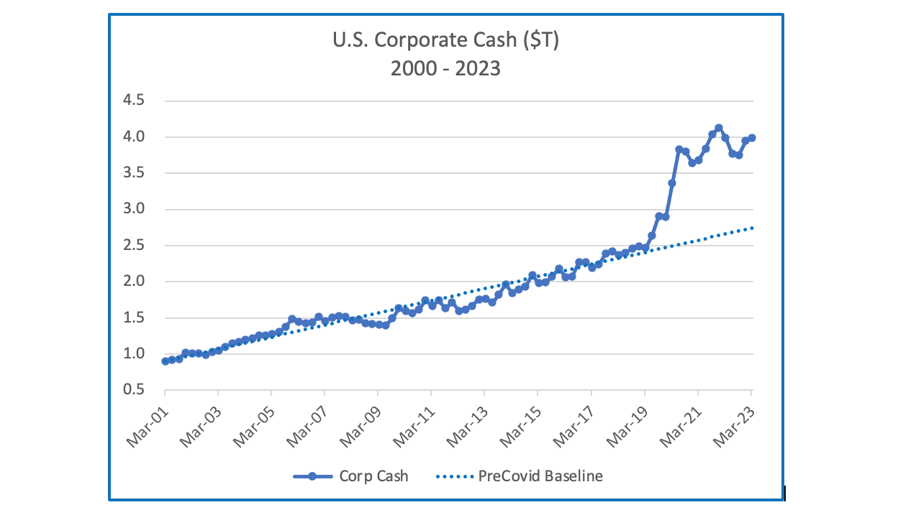

## Table of Contents

## What are excess corporate cash holdings?

Excess corporate cash holdings refer to the amount of money a company has that is more than what it needs for its regular operations and planned investments. Companies keep some cash on hand to pay for daily expenses, like salaries and bills, and to be ready for unexpected costs or opportunities. However, when a company has much more cash than it needs for these purposes, it is considered to have excess cash.

Having too much cash can be a sign that a company is not using its money effectively. Instead of letting the cash sit idle, the company could invest it in new projects, pay down debts, or return it to shareholders through dividends or stock buybacks. On the other hand, holding excess cash can also be a strategic choice. Some companies keep extra cash to be prepared for economic downturns or to take advantage of sudden business opportunities. It's a balance between being ready for the future and making the best use of available resources.

## Why do companies hold excess cash?

Companies hold excess cash for several reasons. One main reason is to be ready for emergencies. Just like people keep some extra money for unexpected bills or repairs, companies do the same. If the economy goes down or if there's a sudden problem, having extra cash can help a company keep going without needing to borrow money quickly, which can be expensive.

Another reason is to take advantage of new opportunities. Sometimes, a good chance to buy another company or invest in a new project comes up suddenly. If a company has extra cash, it can move fast and grab these opportunities before others. This can help the company grow and make more money in the future.

However, holding too much cash can also be a problem. If the cash is just sitting in a bank account, it's not being used to make more money. Some people think that if a company has a lot of extra cash, it should give it back to the shareholders through dividends or buy back its own stock. This way, the shareholders can decide what to do with the money themselves.

## How is excess cash typically measured in a company?

Excess cash in a company is usually measured by looking at how much money the company has after it pays for everything it needs to run its business and after it sets aside money for planned investments. This includes money in the bank, short-term investments, and other liquid assets that can be quickly turned into cash. To find out if a company has excess cash, you subtract the money needed for daily operations and future plans from the total cash the company has.

For example, if a company needs $100 million to run its business and has another $50 million set aside for a new factory, but it has $200 million in total cash, then it has $50 million in excess cash. Companies often use financial ratios like the cash-to-assets ratio or the current ratio to help measure this. These ratios compare the company's cash to its total assets or its current liabilities, giving a clearer picture of whether the cash on hand is more than what's needed.

## What are the benefits of holding excess cash for a company?

Holding excess cash can help a company in many ways. One big benefit is that it gives the company a safety net. If something unexpected happens, like a big drop in sales or a sudden need to fix something important, the company can use its extra cash to keep going without needing to borrow money quickly. This can save the company from getting into debt or having to sell things off in a hurry, which might not be good for business.

Another benefit is that having extra cash lets a company take advantage of new opportunities. Sometimes, a chance to buy another company or start a new project comes up suddenly. If the company has extra cash, it can move fast and grab these opportunities before others. This can help the company grow and make more money in the future. So, having extra cash can be like having a secret weapon that helps the company stay strong and ready for anything.

## What are the potential drawbacks of holding too much cash?

Holding too much cash can be a problem for a company. When cash just sits in a bank account, it's not being used to make more money. Instead of letting the cash sit idle, the company could invest it in new projects, pay down debts, or return it to shareholders through dividends or stock buybacks. If the company doesn't use the cash wisely, it might miss out on chances to grow and make more money.

Another issue is that shareholders might not like it if a company holds too much cash. Shareholders want the company to use their money to make the business better or give it back to them. If a company has a lot of extra cash and doesn't do anything with it, shareholders might think the company isn't being smart with their money. This can make the company's stock price go down, which isn't good for anyone.

## How does excess cash impact a company's financial statements?

Excess cash shows up on a company's balance sheet as part of its current assets. The balance sheet lists everything a company owns and owes, and cash is one of the things it owns. If a company has more cash than it needs for daily operations and planned investments, this extra cash is called excess cash. On the balance sheet, you'll see this as a big number in the cash and cash equivalents section. This can make the company look financially strong because it has a lot of money on hand, but it also means the company might not be using its money in the best way.

Excess cash also affects the company's income statement, but in a more indirect way. The income statement shows how much money the company makes and spends over a period of time. If the company is holding onto a lot of cash instead of investing it or paying down debts, it might not be [earning](/wiki/earning-announcement) as much money as it could. This can lead to lower profits on the income statement. Also, if shareholders think the company is not using its cash well, they might sell their shares, which could lower the company's stock price and affect its overall financial health.

## What are some common strategies companies use to manage excess cash?

Companies often use different strategies to manage their extra cash. One common way is to invest the cash in new projects or buy other companies. This can help the company grow and make more money in the future. Another strategy is to pay down debts. By using the extra cash to pay off loans, the company can save money on interest and improve its financial health.

Another approach is to give the cash back to shareholders. Companies can do this by paying dividends, which are like regular payments to shareholders, or by buying back their own stock. When a company buys back its stock, it can make the remaining shares more valuable. Some companies also choose to keep the cash as a safety net for emergencies or to take advantage of new opportunities when they come up. It's all about finding the right balance between using the cash to grow the business and keeping some on hand for future needs.

## How do investors view companies with high levels of excess cash?

Investors often have mixed feelings about companies that have a lot of extra cash. On one hand, they might see it as a good thing because it shows the company is financially strong and can handle emergencies without borrowing money. It also means the company can quickly take advantage of new opportunities, like buying another business or starting a new project. This can make investors feel more secure about the company's future.

On the other hand, some investors might worry that the company is not using its money wisely. If the cash is just sitting in a bank account, it's not being used to grow the business or make more money. Investors might think the company should invest the cash in new projects, pay down debts, or give it back to shareholders through dividends or stock buybacks. If the company doesn't do this, investors might sell their shares, which could lower the company's stock price.

## Can excess cash holdings affect a company's stock price?

Excess cash can affect a company's stock price in different ways. If investors think the company is holding too much cash and not using it to grow or make more money, they might sell their shares. This can make the stock price go down because there are more people selling than buying. Investors want the company to use the cash wisely, like investing in new projects or paying dividends, so if they don't see this happening, they might lose confidence in the company.

On the other hand, having a lot of extra cash can also be a good thing for the stock price. It shows that the company is financially strong and can handle emergencies without needing to borrow money quickly. This can make investors feel more secure about the company's future, which might make them want to buy more shares. If more people want to buy the stock, the price can go up. So, whether excess cash helps or hurts the stock price depends on what investors think the company will do with the money.

## What are the tax implications of holding excess cash?

Holding excess cash can have some tax effects for a company. When a company keeps a lot of money in a bank account, it might earn some interest. This interest is usually seen as income by the tax authorities, so the company has to pay taxes on it. The tax rate depends on the country's laws, but it means the company has to give some of that interest money to the government instead of keeping it all.

Another tax issue can come up if the company decides to use its excess cash in certain ways. For example, if the company pays dividends to its shareholders, those dividends might be taxed. The tax rate on dividends can be different from the tax rate on other kinds of income, and it depends on the country's rules. Also, if the company uses the cash to buy back its own stock, there might be some tax effects for the shareholders who sell their shares back to the company. So, the way a company manages its excess cash can affect how much tax it and its shareholders have to pay.

## How do different industries approach excess cash management differently?

Different industries have different ways of managing excess cash because their needs and opportunities are not the same. For example, tech companies often have a lot of cash because they are always looking for new ways to grow and innovate. They might use their extra cash to invest in research and development or to buy other tech companies that can help them stay ahead. On the other hand, industries like manufacturing might keep more cash on hand to be ready for big investments in new equipment or to handle changes in the economy that can affect their business.

In the energy sector, companies might hold onto excess cash to be ready for big swings in oil and gas prices. They need to be able to keep going even if prices drop suddenly, so having extra cash can help them survive tough times. Retail companies, however, might use their excess cash to open new stores or improve their online shopping platforms. They want to keep up with changing consumer habits, so they might be more likely to spend their extra cash on things that help them stay competitive. Each industry has its own reasons for how it manages excess cash, based on what's most important for their business.

## What are advanced financial models used to optimize excess cash holdings?

Companies use advanced financial models to figure out the best way to handle their extra cash. These models help them see how much cash they need to keep for daily business and emergencies, and how much they can use for other things like investing in new projects or paying down debts. One common model is called the cash flow forecasting model. It looks at past cash flows and uses them to predict future cash needs. This helps companies plan how much cash to keep on hand and how much they can safely use for other purposes.

Another useful model is the economic order quantity (EOQ) model, which helps companies decide how much cash to keep in reserve. It balances the costs of holding too much cash, like lost investment opportunities, against the costs of not having enough cash, like needing to borrow money quickly. By using these models, companies can make smart decisions about their excess cash, making sure they are prepared for the future while also using their money in the best way possible.

## What is the importance of understanding cash management and how should excess cash be handled?

Cash management is a crucial component of corporate finance, designed to maintain liquidity and ensure that a company has the necessary resources to meet its immediate financial obligations. Effective cash management involves strategies that optimize the balance between incoming and outgoing cash flows, thereby safeguarding the company against liquidity shortages that could impact its operations.

Excess cash is defined as the surplus funds a company retains after fulfilling its working capital requirements. From an accounting perspective, working capital is calculated as the difference between current assets and current liabilities, expressed as:

$$
\text{Working Capital} = \text{Current Assets} - \text{Current Liabilities}
$$

Once these immediate expenses and operational costs are covered, any remaining funds are considered excess cash. Holding these surplus funds can be indicative of strong financial performance and robust revenue generation. It signals that a company generates more cash than is needed for its immediate expenses and investments, potentially reassuring investors of its financial health.

However, the possession of excess cash brings up efficiency concerns in its deployment. Unutilized cash sitting idle can represent a lost opportunity for companies to invest in potential growth avenues or improve operational efficiencies. This can lead to opportunity costs, where the uninvested cash might have otherwise yielded higher returns if allocated properly. Thus, while excess cash might signify financial strength, it simultaneously necessitates strategic planning to ensure these funds are put to effective use.

Ultimately, the key challenge for businesses is to strike a balance between maintaining sufficient [liquidity](/wiki/liquidity-risk-premium) to safeguard against potential financial uncertainties and strategically deploying excess cash to maximize returns and support long-term growth objectives. Through the integration of prudent cash management practices, companies can utilize their surplus funds to reinforce their financial stability while enhancing operational efficiency.

## What are the strategies for effective cash deployment?

Reinvesting excess cash into the business can significantly enhance a company's operational capabilities and competitive advantage. Allocating funds towards upgrading technology ensures that a company remains at the forefront of industry advancements. This not only fosters innovation but also increases operational efficiency, leading to higher productivity and cost savings. Expanding operations, such as entering new markets or increasing production capacity, can drive revenue growth and market share. By strategically investing in these areas, companies can lay the groundwork for long-term profitability and sustainability.

Debt reduction represents another prudent strategy for deploying excess cash. By paying down existing debt, companies can improve their balance sheets, which could result in better credit ratings and lower borrowing costs in the future. Reducing debt also decreases interest expenses, thereby freeing up more cash flow for other strategic initiatives. Calculated debt repayments can enhance a company’s financial health and flexibility, positioning it better for future opportunities.

Share buybacks are an additional mechanism by which companies can utilize excess cash to augment shareholder value. By purchasing its shares from the market, a company reduces the number of outstanding shares, thereby potentially increasing the earnings per share (EPS) metric. Higher EPS can lead to an increase in stock price, directly benefiting shareholders. Moreover, buybacks can signal management's confidence in the company’s future prospects, which may positively influence investor perception and market valuation.

Mathematically, the impact of share buybacks on EPS can be represented as:

$$
\text{New EPS} = \frac{\text{Net Income}}{\text{Outstanding Shares} - \text{Shares Repurchased}}
$$

This formula illustrates that, with constant net income, reducing the number of shares outstanding through buybacks increases the EPS, which is an attractive outcome for investors.

In summary, effective deployment of excess cash through reinvestment in core business areas, debt reduction, and share buybacks can significantly contribute to a company's financial robustness and shareholder value enhancement. Each strategy should be carefully analyzed to ensure it aligns with the organization's long-term strategic goals.

## What are the tax implications and optimization strategies?

Management of cash reserves comes with various tax implications that can significantly impact a corporation's overall financial strategy. The key to minimizing these liabilities lies in optimizing the financial structures and deploying cash in tax-efficient manners.

One of the strategies to reduce tax obligations is investing in tax-advantaged instruments such as municipal bonds. Interest earned from municipal bonds is often exempt from federal income taxes and possibly state and local taxes if the bond issuer is located in the investor's state. This tax exemption can make municipal bonds an attractive option for corporations seeking to efficiently manage excess cash. The net yield, after considering the tax exemption, often makes these bonds competitive with other taxable investment vehicles. For example, if the [interest rate](/wiki/interest-rate-trading-strategies) on a municipal bond is 3% and the corporation’s tax rate is 30%, the taxable equivalent yield (TEY) is calculated using the formula:

$$
\text{TEY} = \frac{\text{Municipal Bond Yield}}{1 - \text{Tax Rate}}
$$

Substituting the values into the formula gives:

$$
\text{TEY} = \frac{0.03}{1 - 0.30} = 0.0429 \, \text{or} \, 4.29\%
$$

This provides a clear view on how such investments can be advantageous from a tax perspective.

Another key consideration involves utilizing tax credits and deductions. Corporations can enhance their tax efficiency by engaging in specific investment or development activities that qualify for tax credits or deductions. For instance, investments in renewable energy projects can yield valuable tax credits, while research and development (R&D) activities may qualify for R&D tax credits.

Moreover, effective tax planning can involve structuring intra-company cash flows to leverage differential tax rates across jurisdictions, often referred to as tax [arbitrage](/wiki/arbitrage). This might include setting up operations in low-tax regions or making use of tax treaties between countries to optimize the global tax footprint.

To systematically manage and maximize tax efficiency, corporations may use algorithmic approaches to evaluate potential tax outcomes of various strategies. Implementing Python scripts or similar computational tools can aid in simulating scenarios, forecasting tax liabilities, and determining the most tax-efficient [course](/wiki/best-algorithmic-trading-courses) of action, ensuring cash reserves are managed in compliance with tax regulations while minimizing unnecessary tax expenses.

By leveraging these tax optimization strategies, corporations can not only enhance their return on excess cash but also sustain financial health and shareholder value.

## References & Further Reading

[1]: Modigliani, F., & Miller, M. H. (1958). ["The Cost of Capital, Corporation Finance and the Theory of Investment."](https://www.semanticscholar.org/paper/The-Cost-of-Capital%2C-Corporation-Finance-and-the-of-Miller/81c84afa78c3445b783db0b9dbec3b70f2cb3a19) The American Economic Review, 48(3), 261-297.

[2]: Jensen, M. C. (1986). ["Agency Costs of Free Cash Flow, Corporate Finance, and Takeovers."](https://www.jstor.org/stable/1818789) American Economic Review, 76(2), 323-329.

[3]: Ross, S. A., Westerfield, R. W., & Jaffe, J. (2019). ["Corporate Finance,"](https://www.amazon.com/Corporate-Finance-Stephen-Ross/dp/1260772381) 12th Edition, McGraw-Hill Education.

[4]: Treynor, J. L. (1965). ["How to Rate Management of Investment Funds."](https://onlinelibrary.wiley.com/doi/10.1002/9781119196679.ch10) The Journal of Finance, 20(2), 63–75.

[5]: Campbell, J. Y., Lo, A. W., & MacKinlay, A. C. (1997). ["The Econometrics of Financial Markets."](https://press.princeton.edu/books/hardcover/9780691043012/the-econometrics-of-financial-markets) Princeton University Press.

[6]: Hull, J. C. (2018). ["Options, Futures, and Other Derivatives,"](https://www.semanticscholar.org/paper/Options%2C-Futures%2C-and-Other-Derivatives-Hull/89bdee500c8623864fc9eb7a471546aa713acc44) 10th Edition, Pearson.