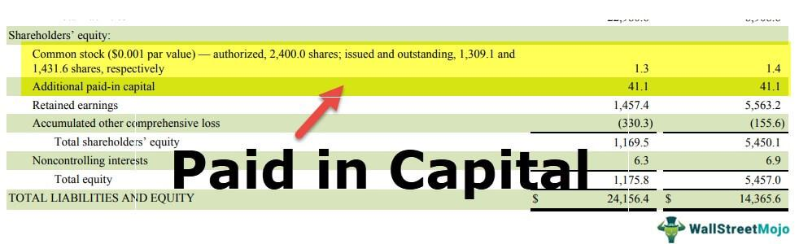

Nigeria's oil revenue is a cornerstone of its economy, contributing significantly to national income and fiscal stability. As Africa's largest oil producer, the country relies heavily on the petroleum sector, which accounts for approximately 90% of its export earnings and over 60% of government revenues. This reliance underscores its critical role in shaping economic policies and national development strategies.

The Excess Crude Account (ECA) was established in 2004 as a fiscal buffer to mitigate the volatility of oil prices and stabilize the economy. This account allows Nigeria to save excess oil revenues when market prices soar above budget benchmarks, providing a cushion for economic downturns and funding infrastructural development. However, managing the ECA has proven complex, with challenges in transparency, accountability, and fiscal policy execution.

This article examines how algorithmic trading might redefine resource management in Nigeria's oil sector. Algorithmic trading utilizes computer algorithms to execute trades at optimal conditions, potentially enhancing the transparency and efficiency of financial transactions. By incorporating sophisticated data analysis, this technology offers a promising avenue to address longstanding inefficiencies in the management of oil revenues.

We will explore the historical context and controversies surrounding the ECA to understand its impact on Nigeria's economy. Among these issues are allegations of mismanagement and political interference, which have significantly hindered the account's effectiveness as a fiscal tool. A comprehensive approach to these challenges could be the integration of algorithmic trading, optimizing resource allocation and strengthening governance within the sector.

Through examining the past and present intricacies of Nigeria's oil revenue management, this article aims to chart a path forward, leveraging technology to ensure sustainable economic prosperity and fiscal resilience. Algorithmic trading may hold the key to unlocking better governance and utilization of resources, supporting broader economic diversification and long-term stability.

## Table of Contents

## Understanding Nigeria's Oil Revenue and the ECA

Nigeria's economic landscape is profoundly shaped by its reliance on oil revenue, which constitutes a significant portion of its national income. As Africa's largest oil producer, the country's fiscal health is intricately tied to the fortunes of the global oil market. This dependency, however, poses substantial risks due to the inherent volatility of oil prices, which can lead to unpredictable economic swings.

In 2004, in response to these challenges, Nigeria established the Excess Crude Account (ECA). The creation of the ECA was intended to serve as a fiscal buffer, safeguarding the economy against the unpredictable nature of oil price fluctuations. The core objective of the ECA is to stabilize the national economy by setting aside surplus revenues achieved when oil prices exceed the benchmark price set in the annual budget. By saving these excess revenues, Nigeria aimed to cushion the economy during periods of low oil prices, ensuring the continuity of government projects and services despite market instability.

Despite its theoretical merits, the ECA faced several challenges, prompting discussions around its effectiveness. In 2011, Nigeria took a step further by transitioning to a Sovereign Wealth Fund (SWF), intending to provide a more structured approach to managing oil revenues. The Nigeria Sovereign Investment Authority (NSIA) was established to oversee the SWF, which has three main funds: the Stabilization Fund, the Future Generations Fund, and the Nigeria Infrastructure Fund. This transition aimed to enhance financial management and transparency, ensuring that future generations benefit from the country's oil wealth while addressing immediate infrastructural needs.

However, the ECA and its successor have not been immune to political, economic, and legal challenges. Political interference has often led to the opaque withdrawal and management of funds, undermining the ECA's efficiency. The frequent recourse to these funds for budget supplementation, without clear legislative processes, exemplifies the governance issues at play. Furthermore, legal contentions over the ownership and appropriation of the ECA savings have occasionally disrupted its intended purpose. The interplay of these factors has sometimes reduced the ECA's efficacy, limiting its ability to act as a stabilizing force within the Nigerian economy.

In summary, while the establishment and evolution of the Excess Crude Account were driven by a need to mitigate oil revenue [volatility](/wiki/volatility-trading-strategies), its operational challenges highlight the complexities of fiscal management in Nigeria's oil sector. Addressing these issues is crucial for ensuring the long-term sustainability and resilience of the nation's economy.

## Challenges Faced by the Excess Crude Account

The Excess Crude Account (ECA) of Nigeria, established as a fiscal buffer, has faced significant challenges since its inception. One key issue has been historical mismanagement and allegations of corruption. These problems have been characterized by a lack of transparency in the accounting and reporting processes, making it difficult to track the flow of funds effectively. This opacity has been compounded by controversies surrounding the nature of fund transactions, where withdrawals and allocations often occur without clear documentation or public oversight.

Political interference has greatly influenced decisions related to the ECA, affecting asset withdrawals and allocations. Political actors have sometimes prioritized short-term political gains over long-term economic stability, leading to decisions that may not align with the best interests of national fiscal health. This interference has often led to suboptimal utilization of resources, raising questions regarding the governance structures overseeing the ECA.

A comparative analysis with other sovereign wealth funds (SWFs) globally highlights these challenges. While successful SWFs, such as Norway’s Government Pension Fund Global, maintain transparency, strict rules, and robust governance structures, the ECA has struggled due to inadequate oversight and accountability mechanisms. This comparison suggests that rigid and transparent operational frameworks are crucial for the effectiveness of such funds.

Case studies focusing on the ECA reveal the consequences of policy and management failures. For instance, instances where funds have been rapidly depleted during periods of declining oil prices underscore the risks of poor fund management and the absence of strategic long-term planning. These cases illustrate the vital need for reformed fiscal policies that prioritize sustainability and efficiency.

Ultimately, the challenges faced by the ECA emphasize the need for rigorous reforms to improve transparency, governance, and operation. Addressing these issues is crucial for enhancing the fund’s role in stabilizing Nigeria’s economy, especially against the backdrop of volatile oil prices. Adopting best practices from other successful global SWFs could serve as a model for reforming the ECA.

## Algorithmic Trading in the Context of Oil Revenue Management

Algorithmic trading, an automated method employing pre-programmed instructions for trading decisions, has revolutionized financial markets by enhancing the speed and precision of transactions. Employing sophisticated mathematical models and AI algorithms, it processes vast datasets, executing trades based on market variables such as price, timing, and [volume](/wiki/volume-trading-strategy).

The application of [algorithmic trading](/wiki/algorithmic-trading) in managing Nigeria's oil revenue holds significant potential. By integrating this technology, Nigeria could optimize oil revenue management akin to how financial markets achieve enhanced efficiency and reduced transaction costs. Algorithms can be designed to predict oil price fluctuations, enabling proactive and strategic trading that maximizes returns. Such predictive capabilities could stabilize income flows, mitigating the adverse impacts of oil price volatility on the economy.

Advanced algorithms contribute to transparency and efficiency in fiscal management by ensuring consistent and traceable decision-making processes. Each transaction adheres to a predefined set of rules, minimizing human error and potential corruption. This transparency can bolster confidence among stakeholders, a critical [factor](/wiki/factor-investing) in resource management.

Success stories in other sectors underscore the viability of algorithmic trading. For instance, in the energy markets, algorithmic trading has improved the accuracy of supply and demand forecasts, reducing inefficiencies and enhancing market stability. Additionally, countries like Norway have leveraged advanced financial technologies to bolster the performance of their sovereign wealth funds, demonstrating the cross-sector applicability of algorithmic trading.

However, implementing algorithmic trading in Nigeria's oil sector involves unique challenges. The nascent technological infrastructure and a regulatory framework not fully aligned with advanced trading technologies create hurdles. Moreover, the complexity of global oil markets, intertwined with geopolitical dynamics, demands algorithms that are not only technically robust but also adaptive to non-quantitative factors.

To capitalize on the benefits of algorithmic trading, Nigeria must address these challenges through targeted investments in technology infrastructure, developing legal frameworks to support algorithmic trading, and fostering collaborations between governmental bodies, financial experts, and tech companies. Overcoming these hurdles can position Nigeria to effectively harness technology for optimal oil revenue management, ensuring long-term economic resilience.

## Prospects for the Future: Integrating Technology with Policy

Steps towards institutional and structural reform in oil revenue management in Nigeria emphasize the integration of technology with policy. By adopting advanced trading technologies, Nigeria stands to enhance the efficiency and transparency of its oil revenue management. This requires the establishment of robust legal frameworks that can support the seamless operation of these technologies. Such frameworks must address regulatory compliance, technology standards, and data security to create a conducive environment for algorithmic trading and related innovations.

Building trust and accountability is another crucial aspect of integrating technology with policy. Leveraging data-driven decisions can foster transparency in fiscal management. By utilizing technologies such as blockchain and AI-driven analytics, the Nigerian government can ensure that financial operations and transactions are traceable and verifiable. This transparency can help restore public confidence in the system, thereby securing broader support for reform initiatives.

The collaboration between government, private sector, and international bodies is essential for successful integration. Each stakeholder brings different strengths and resources to the table. The government can facilitate a conducive regulatory environment, the private sector can drive innovation and implementation, and international bodies can provide the necessary financial and technical support. Such partnerships can accelerate the pace of reform and innovation in oil revenue management.

Long-term benefits of integrating technology with policy also include the diversification of the economy and improved fiscal resilience. By reducing reliance on [crude oil](/wiki/crude-oil) through better management of resources and allocation, Nigeria can explore alternative revenue streams and strategic investments. This diversification is crucial given the volatility of global oil markets and the increasing global shift towards renewable energy sources. Improved fiscal resilience can position Nigeria to withstand economic shocks and maintain steady growth, facilitating sustainable development in the years to come.

## Conclusion

Reforming Nigeria's approach to managing its oil revenue is not just an economic necessity but a strategic imperative for sustainable growth. The introduction of algorithmic trading presents a promising avenue to enhance efficiency and transparency in the management of these revenues. By automating trading processes with sophisticated algorithms, Nigeria can minimize human error, reduce transaction costs, and respond more swiftly to market fluctuations. This not only helps optimize the allocation of oil revenues but also aligns with global best practices in fiscal management.

Algorithmic trading leverages data-driven decisions, fostering accountability and providing clear, traceable records of transactions. Such transparency is essential in addressing historical issues of mismanagement and corruption that have plagued Nigeria's oil sector. Engaging a wide range of stakeholders, including government bodies, private sector participants, and international organizations, is crucial to the successful implementation of algorithmic trading strategies. Collaboration across sectors ensures that diverse perspectives and expertise contribute to a holistic and sustainable revenue management system.

Learning from past experiences is vital to circumvent future challenges in resource management. Nigeria's economic landscape is characterized by its susceptibility to oil price volatility, political interference, and infrastructural inefficiencies. Applying lessons from these experiences within a technologically advanced framework can bolster resilience and adaptiveness in revenue allocation processes.

The intersection of technology and policy is pivotal in securing Nigeria's economic future. By integrating advanced technological solutions with robust policy frameworks, Nigeria can position itself as a leader in innovative resource management. This strategic fusion will not only stabilize its economy but also support the diversification goals that are essential for long-term fiscal sustainability and economic resilience.

## References & Further Reading

[1]: Shaxson, N. (2007). ["Poisoned Wells: The Dirty Politics of African Oil."](https://archive.org/details/poisonedwellsdir0000shax) Palgrave Macmillan.

[2]: Oluwatuyi, O. E., & Ogunleye, I. K. (2014). ["Management of Oil Funds as a Panacea for Economic Stability and Sustainability in Nigeria."](https://www.iosrjournals.org/iosr-jhss/papers/Vol19-issue8/Version-3/J019835965.pdf) IOSR Journal of Humanities and Social Science (IOSR-JHSS).

[3]: Basu, S., & Angelico, F. (2015). ["Nigeria’s Experience with Oil Revenue Management: Lessons for Other Countries."](https://www.nature.com/articles/s41599-024-04182-z) Natural Resource Governance Institute.

[4]: Etzioni, A. (2018). ["Algorithmic Trading and Its Implications on the Financial Sector."](https://ijrpr.com/uploads/V5ISSUE6/IJRPR30540.pdf) Challenge, 61(6), 597-616.

[5]: Norway Ministry of Finance. (2021). ["About the Government Pension Fund Global."](https://www.regjeringen.no/contentassets/524ad2307e424c3b9a9ff52b06569e24/en-gb/pdfs/stm202020210024000engpdfs.pdf) 

[6]: Fabrizio, D. U., & Michael, W. (2014). ["Beyond Transparency: Open Data and the Future of Civic Innovation."](https://archive.org/details/beyondtransparen0000unse) Code for America Press.

[7]: Lopez de Prado, M. (2018). ["Advances in Financial Machine Learning."](https://www.amazon.com/Advances-Financial-Machine-Learning-Marcos/dp/1119482089) Wiley.

[8]: Sovereign Wealth Fund Institute. ["Sovereign Wealth Fund Rankings."](https://dev.swfinstitute.org/fund-rankings/sovereign-wealth-fund) 

[9]: Daily Trust. (2018). ["Nigeria Must Change Oil Revenue Sharing Formula – Experts."](https://dailytrust.com/nigerias-oil-industry-still-in-poor-state-despite-reforms/)