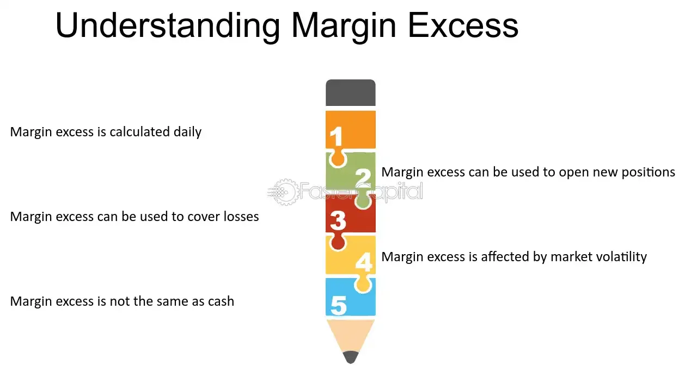

## Table of Contents

## What is excess margin and why is it important?

Excess margin is the extra money a business makes after paying all its costs. It's what's left over after you subtract the cost of making and selling your products or services from the money you earn from selling them. This extra money is important because it shows how well a business is doing financially. If a business has a high excess margin, it means they are good at making money and keeping costs low.

Having a good excess margin is important for several reasons. First, it gives a business the money it needs to grow and expand. They can use this extra money to buy new equipment, hire more people, or open new locations. Second, it helps a business survive tough times. If sales drop or costs go up, a business with a good excess margin can use this extra money to keep going until things get better. Overall, excess margin is a key sign of a healthy and successful business.

## How is excess margin calculated?

Excess margin is calculated by taking the total revenue a business makes and subtracting all the costs it takes to run the business. This includes the cost of making the product or providing the service, like materials and labor, as well as other expenses like rent, utilities, and marketing. What's left after you subtract all these costs from the revenue is the excess margin.

For example, if a business earns $100,000 in revenue and has total costs of $80,000, the excess margin would be $20,000. This $20,000 is the extra money the business has after covering all its expenses. It's important for businesses to keep track of their excess margin because it shows how much profit they are making and helps them plan for the future.

## Can you provide a simple example of excess margin in a business context?

Let's say Sarah runs a small bakery. She sells cupcakes for $2 each and she sells 1,000 cupcakes in a month. So, her total revenue is $2,000. To make these cupcakes, Sarah spends $1 on ingredients and labor for each cupcake. That means her total costs are $1,000. When Sarah subtracts her costs from her revenue, she gets an excess margin of $1,000.

This $1,000 is very important for Sarah's bakery. It's the extra money she has after paying for all her expenses. Sarah can use this money to buy new baking equipment, try out new cupcake flavors, or save it for times when her sales might be lower. Having a good excess margin helps Sarah keep her bakery running smoothly and plan for the future.

## What are the common uses of excess margin in financial management?

In financial management, one common use of excess margin is to reinvest in the business. This can mean buying new equipment, hiring more staff, or expanding to new locations. By using the extra money to grow the business, a company can increase its ability to make more money in the future. It's like planting seeds with the excess margin, hoping they will grow into bigger profits down the road.

Another important use of excess margin is to build up a safety net for the business. This extra money can be saved in a reserve fund to help the business get through tough times, like when sales drop or unexpected costs come up. Having this cushion can keep the business stable and help it survive when things don't go as planned. It's like having an emergency fund that can keep the business running smoothly even during rough patches.

## How does excess margin affect a company's financial strategy?

Excess margin plays a big role in shaping a company's financial strategy. When a company has a lot of excess margin, it means they have more money to work with. This extra money can be used to grow the business, like buying new equipment or opening new stores. It also gives the company the freedom to try new things, like launching new products or exploring new markets. Having a good excess margin means a company can be more aggressive and take more risks because they have the money to back up their plans.

On the other hand, a company with a low excess margin needs to be more careful with their financial strategy. They might need to focus on cutting costs or finding ways to increase their prices to boost their margin. Without much extra money, they can't afford to take big risks or invest heavily in growth. Instead, they might need to save the little excess margin they have to make sure they can keep the business running smoothly, especially during tough times. So, the amount of excess margin a company has can really shape how they plan and manage their finances.

## What are the potential risks associated with relying on excess margin?

Relying too much on excess margin can be risky. If a business uses all its extra money to grow or try new things, it might not have enough saved up for emergencies. If something unexpected happens, like a drop in sales or a big expense, the business might not have the money it needs to keep going. It's like spending all your savings on a big project without keeping any money for emergencies.

Another risk is that a business might think it's doing well just because it has a good excess margin right now. But if the market changes or costs go up, that extra money could disappear quickly. If a business doesn't plan for these changes and just spends its excess margin without thinking about the future, it could run into trouble when things get tough. It's important for a business to use its excess margin wisely and keep some in reserve, just in case.

## How can excess margin be optimized for better financial performance?

To optimize excess margin for better financial performance, a business should always look for ways to increase its revenue and decrease its costs. One way to boost revenue is by finding new customers or selling more to existing ones. This could mean trying out new marketing strategies, launching new products, or expanding into new markets. On the other hand, cutting costs can be done by finding cheaper suppliers, using resources more efficiently, or reducing unnecessary expenses. By focusing on both sides of the equation, a business can increase its excess margin and have more money to work with.

Another important part of optimizing excess margin is making smart decisions about how to use the extra money. Instead of spending it all right away, a business should consider saving some of it for emergencies or future growth. This means setting aside a portion of the excess margin in a reserve fund, which can help the business stay stable during tough times. By balancing the need to grow with the need to be prepared, a business can use its excess margin to improve its financial performance over the long term.

## What role does excess margin play in investment decisions?

Excess margin is really important when a business is thinking about where to invest its money. When a company has a lot of extra money after paying all its bills, it can use that money to make smart investments. For example, the business might decide to buy new equipment, open a new store, or start a new product line. These investments can help the business grow and make even more money in the future. Having a good excess margin gives the business the confidence to take these steps because they know they have the money to back up their plans.

But it's not just about spending the excess margin on new things. A business also needs to think about saving some of that extra money for the future. If the company keeps some of its excess margin in a reserve fund, it can use that money if things get tough, like if sales go down or if there's an unexpected expense. So, when making investment decisions, a business needs to balance using its excess margin to grow with keeping some of it safe for emergencies. This careful planning helps the business make the most of its extra money and stay strong over time.

## Can you explain how excess margin impacts pricing strategies?

Excess margin can help a business decide how to set its prices. If a business has a lot of extra money after paying for everything, it might feel okay about lowering its prices a little. This can help them sell more stuff and maybe get more customers. But if they don't have much extra money, they might need to keep their prices high to make sure they can cover all their costs and still have some money left over.

On the other hand, if a business sees that it has a really good excess margin, it might decide to raise its prices. They might think that their products or services are worth more, and they can still make a good profit even if they charge more. But they have to be careful because if they raise prices too much, they might lose customers. So, the amount of excess margin a business has can really affect how they think about their pricing and what they decide to do.

## How do different industries approach the management of excess margin?

Different industries handle excess margin in their own ways, depending on what they do and what they need. In the tech industry, companies often use their extra money to invest in new technology or research and development. They might spend their excess margin on creating new products or improving the ones they already have. This helps them stay ahead of their competition and keep growing. On the other hand, in the retail industry, businesses might use their excess margin to open new stores or to buy more products to sell. They need to keep their shelves full and attract more customers, so they use their extra money to make sure they can do that.

In industries like manufacturing, companies might focus on using their excess margin to buy new machines or to make their factories more efficient. They want to make their products faster and cheaper, so they invest their extra money in ways that help them do that. In the service industry, like restaurants or hotels, businesses might use their excess margin to improve their services or to train their staff better. They know that happy customers come back, so they spend their extra money on making their customers happy. Each industry has its own way of using excess margin to help the business grow and stay strong.

## What advanced techniques can be used to forecast excess margin?

To forecast excess margin, businesses can use something called regression analysis. This is a fancy way of looking at past numbers to guess what might happen in the future. They take data from things like how much they sold, how much they spent, and other stuff that affects their money. Then, they use a computer to find patterns in this data. By understanding these patterns, they can make a good guess about how much extra money they might have in the future. It's like looking at the weather in the past to predict if it will rain tomorrow.

Another technique is called scenario analysis. This is where a business makes up different stories about what might happen and sees how those stories affect their excess margin. For example, they might imagine what would happen if their costs went up, or if they sold more stuff, or if a new competitor came along. By playing out these different stories, they can see how their extra money might change. This helps them plan better and be ready for whatever might happen. It's like practicing for a game by imagining different ways it could go.

## How does excess margin relate to economic cycles and market conditions?

Excess margin can change a lot depending on what's happening in the economy and the market. When the economy is doing well and people are buying lots of things, businesses usually sell more stuff and make more money. This means they can have a bigger excess margin because they're bringing in more money than they're spending. But if the economy slows down and people start buying less, businesses might see their sales drop. This can make their excess margin smaller because they're not making as much money, even if their costs stay the same.

Market conditions also play a big role in how much excess margin a business has. If there's a lot of competition, businesses might have to lower their prices to keep their customers. This can make their excess margin smaller because they're not making as much money on each sale. On the other hand, if a business is selling something that's really popular and in demand, they might be able to charge more and have a bigger excess margin. So, businesses need to keep an eye on what's happening in the economy and the market to understand how it might affect their excess margin and plan accordingly.

## What is Excess Margin?

Excess margin is the amount of equity in a margin trading account that exceeds the brokerage's required minimum margin, serving as a buffer against potential margin calls. When traders engage in margin trading, the broker requires a minimum level of equity in the account, known as the maintenance margin. If the account equity falls below this threshold, the trader will face a margin call, necessitating the deposit of additional funds or the liquidation of positions to restore the minimum balance.

Excess margin becomes a critical [factor](/wiki/factor-investing) in maintaining trading positions during market downturns because it provides a financial cushion. The presence of excess margin implies that the trader has sufficient collateral to cover potential losses from adverse market movements without prompting immediate action from the broker. This safety net allows traders to weather fluctuations without the disruption of margin calls, maintaining their strategic positions and potentially avoiding forced liquidation at unfavorable prices.

Regulatory bodies like the Financial Industry Regulatory Authority (FINRA) set minimum margin requirements to ensure the overall stability of the financial markets and mitigate systemic risk. However, brokers have the discretion to impose stricter margin requirements based on their assessment of market conditions and the risk profile of individual traders. These stricter standards might require traders to maintain a higher level of excess margin to mitigate the broker's exposure to market [volatility](/wiki/volatility-trading-strategies) and the trader's default risk.

The calculation of excess margin is straightforward. If a trader's account equity is denoted as $E$ and the maintenance margin requirement as $M$, then the excess margin $EM$ is given by:

$$
EM = E - M
$$

Traders often strive to maintain a healthy level of excess margin, as it provides the flexibility to manage their positions effectively and absorb market fluctuations. By judiciously managing their trading accounts to retain sufficient excess margin, traders can reduce their risk exposure and enhance their capacity to capitalize on market opportunities without the immediate pressure of margin calls.

## How do you calculate excess margin?

To understand excess margin, consider a practical example involving a trader purchasing $20,000 worth of stock, with $10,000 contributed from their own funds and the remaining $10,000 borrowed from a broker. This scenario demonstrates the use of leverage, where the trader effectively doubles their market exposure.

In such a situation, the margin requirement determines the minimum equity the trader must maintain in their account to prevent a margin call. Suppose the broker's maintenance margin requirement is 25%. Initially, the trader's equity (the value of their own investment) is:

$$
\text{Trader's Equity} = \text{Total Stock Value} - \text{Loan Amount} = \$20,000 - \$10,000 = \$10,000
$$

Now, if the stock's market value decreases to $18,000, the trader's equity will be:

$$
\text{New Trader's Equity} = \$18,000 - \$10,000 = \$8,000
$$

At this new equity level, the percentage of the equity relative to the total value of the stock is:

$$
\text{Equity Percentage} = \left(\frac{\$8,000}{\$18,000}\right) \times 100 = 44.44\%
$$

This percentage is still above the broker's maintenance margin requirement of 25%, so no margin call occurs. However, if the stock value were to fall further:

To avoid reaching a critical point where a margin call is triggered, it's vital for the trader to maintain excess margin. Excess margin acts as a cushion. It is the additional amount available in the margin account above the required minimum. It helps cover potential deficits due to adverse market movements, and ensures the trader can continue holding the position without immediate liquidation.

Calculating excess margin can assist in anticipating and mitigating risks. Using Python, a trader can simulate various stock value scenarios to understand excess margin dynamics:

```python
# Define variables
initial_stock_value = 20000
borrowed_amount = 10000
current_stock_value = 18000
maintenance_margin_ratio = 0.25

# Calculate trader's equity
trader_equity = current_stock_value - borrowed_amount

# Calculate equity percentage
equity_percentage = (trader_equity / current_stock_value) * 100

# Check if margin call is needed
margin_call_needed = equity_percentage < (maintenance_margin_ratio * 100)

print(f"Trader's Equity: ${trader_equity}")
print(f"Equity Percentage: {equity_percentage}%")
print(f"Margin Call Needed: {margin_call_needed}")
```

This code illustrates how to determine if a trader's equity is sufficient to evade a margin call, considering the required maintenance margin. Proper management of excess margin is crucial in sustaining trade positions, particularly amidst financial market fluctuations.

## References & Further Reading

[1]: ["Advances in Financial Machine Learning"](https://www.amazon.com/Advances-Financial-Machine-Learning-Marcos/dp/1119482089) by Marcos Lopez de Prado

[2]: ["Evidence-Based Technical Analysis: Applying the Scientific Method and Statistical Inference to Trading Signals"](https://www.amazon.com/Evidence-Based-Technical-Analysis-Scientific-Statistical/dp/0470008741) by David Aronson

[3]: ["Machine Learning for Algorithmic Trading"](https://github.com/stefan-jansen/machine-learning-for-trading) by Stefan Jansen

[4]: ["Quantitative Trading: How to Build Your Own Algorithmic Trading Business"](https://books.google.com/books/about/Quantitative_Trading.html?id=j70yEAAAQBAJ) by Ernest P. Chan

[5]: FINRA. ["Margin: Borrowing Money to Pay for Stocks."](https://www.sec.gov/about/reports-publications/investorpubsmarginhtm) 

[6]: Hull, J. C. (2012). ["Options, Futures, and Other Derivatives."](https://www.semanticscholar.org/paper/Options%2C-Futures%2C-and-Other-Derivatives-Hull/89bdee500c8623864fc9eb7a471546aa713acc44) Pearson Education.