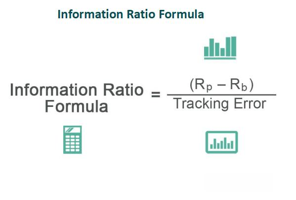

Algorithmic trading, often abbreviated as algo trading, utilizes computer programs to execute trades based on predefined criteria and strategies. These criteria incorporate a variety of factors such as historical data, market trends, and specific conditions set by the trader. The fundamental objectives of algo trading are twofold: to generate excess returns beyond a specified benchmark and to navigate market risks effectively. In the field of investment management, achieving returns above a benchmark, known as generating alpha, is a primary focus. It signifies an investment strategy's ability to outperform a market index or a standard measure.

Excess returns, derived from these sophisticated strategies, are quantified using various performance metrics, with the Information Ratio (IR) being one of the key indicators. The IR measures the consistency and magnitude of investment returns relative to a benchmark, adjusted for the volatility of those returns. It is calculated as follows:

$$

IR = \frac{{R_p - R_b}}{{\sigma}}
$$

where $R_p$ is the portfolio return, $R_b$ is the benchmark return, and $\sigma$ is the standard deviation of the return differences, often referred to as the tracking error. A higher IR indicates a more efficient strategy, achieving greater excess return per unit of risk assumed.

This article investigates the concept of excess returns and elucidates the function of the Information Ratio in assessing the performance of algorithmic trading strategies. By understanding these elements, traders and investors can better evaluate and refine their strategies to achieve superior risk-adjusted returns.

## Table of Contents

## Understanding Excess Returns

Excess returns, often referred to as alpha, signify the performance of an investment over and above a specified market index or benchmark. These returns are crucial in evaluating the effectiveness of trading strategies as they reflect a trader's ability to outperform average market expectations. The pursuit of alpha involves accurate forecasting of market movements and the implementation of optimized trading strategies based on such predictions.

Algorithmic trading plays a vital role in achieving excess returns through its use of vast datasets and sophisticated algorithms. By leveraging data and [machine learning](/wiki/machine-learning), [algorithmic trading](/wiki/algorithmic-trading) aims to enhance the precision and speed of trading decisions, thus potentially leading to higher excess returns. Machine learning models, for instance, can detect complex patterns in data that may not be visible through traditional analysis, providing a competitive edge in market forecasting.

To mathematically express excess returns, consider $R_p$ as the return on the portfolio and $R_b$ as the return on the benchmark. The excess return can then be calculated as:

$$
\text{Excess Return} = R_p - R_b
$$

This measure allows investors to evaluate the efficiency of a trading strategy. A positive excess return indicates that the strategy has succeeded in surpassing the benchmark's performance, while a negative value suggests underperformance.

Investors rely on excess returns as a key metric to assess the success of trading strategies relative to market expectations. As markets become more competitive and data-driven, the ability to achieve and sustain excess returns distinguishes successful algorithmic trading strategies from others. The consistent generation of alpha requires a combination of precise market predictions, risk management, and the ongoing refinement of trading models, emphasizing the importance of algorithmic trading methodologies in modern financial markets.

## The Role of the Information Ratio

The Information Ratio (IR) is a critical metric for assessing the efficiency of a portfolio's performance relative to a benchmark. It represents the ratio of the excess return of the portfolio over a benchmark to the risk taken, quantified by the tracking error. Mathematically, it is expressed as:

$$
\text{IR} = \frac{R_p - R_b}{\sigma_d}
$$

where $R_p$ is the return of the portfolio, $R_b$ is the return of the benchmark, and $\sigma_d$ is the tracking error, calculated as the standard deviation of the difference in returns between the portfolio and the benchmark.

A higher Information Ratio indicates that a portfolio is achieving greater excess returns for each unit of risk, thereby reflecting a more effective trading strategy. This is particularly relevant for active management strategies which aim to exceed benchmark performance. The ability to consistently generate a high IR suggests skillful management in identifying and capitalizing on trading opportunities while controlling risk.

The Information Ratio is distinct from other performance metrics, such as the Sharpe Ratio, because it focuses specifically on management's ability to exploit informational advantages over a benchmark. This distinction makes the IR especially valuable for comparing and evaluating the effectiveness of various active management strategies. By doing so, investors can better understand the value added by active management and make more informed decisions in strategy selection.

## Machine Learning in Algo Trading

Machine learning (ML) plays a critical role in enhancing algorithmic trading by enabling the analysis of vast datasets to identify patterns and generate trading signals. This capability is crucial in a field driven by the need for speed and precision. ML algorithms can swiftly process and analyze large volumes of historical and real-time data, enabling more informed trading decisions.

ML techniques refine predictions and optimize trading decisions, directly contributing to the generation of alpha—returns exceeding a benchmark index. These techniques include supervised learning, where models are trained on labeled historical data to predict future asset prices, and unsupervised learning, which identifies hidden patterns or intrinsic structures in data without pre-existing labels. Reinforcement learning is another advanced ML technique that allows algorithms to learn optimal trading strategies through trial and error interactions with the market environment.

Common applications of machine learning in trading include feature extraction, risk modeling, and the creation of predictive models for asset returns. Feature extraction involves selecting and transforming raw data into informative inputs for models, enhancing their predictive power. Risk modeling uses ML to assess and manage the portfolio's exposure to various market risks, while predictive models forecast asset prices based on historical patterns and real-time data.

ML improves the quality of forecasts by enhancing the Information Coefficient (IC), which measures the correlation between predicted and actual returns. A higher IC indicates more accurate predictions, contributing to a superior Information Ratio (IR). The IR is defined as:

$$
\text{IR} = \frac{\text{Excess Return}}{\text{Tracking Error}}
$$

where the excess return is the return of a portfolio above a benchmark, and the tracking error is the standard deviation of these excess returns.

The integration of ML in trading models allows for continuous adaptation to market conditions, providing an edge in performance sustainability. By employing ML, traders harness improved accuracy and efficiency in forecasting, leading to a more substantial accumulation of alpha over time.

## Strategies for Achieving High Information Ratios

Optimizing the Information Ratio (IR) in algorithmic trading involves a multifaceted approach that prioritizes the combination of alpha factors, rigorous [backtesting](/wiki/backtesting), and effective risk management strategies. Alpha factors represent independent sources of excess returns, and their effective combination is crucial in maximizing the IR. By employing a diverse set of predictive signals, traders can enhance their ability to outperform benchmarks while managing associated risks.

Backtesting plays a critical role in validating the performance of trading strategies. This process involves simulating a trading strategy using historical data to evaluate its effectiveness. By rigorously backtesting multiple alpha factors, traders can identify the most promising combinations that yield higher excess returns without incurring substantial risk.

The breadth of strategy refers to the number of independent bets or trades a strategy takes. Expanding the breadth increases the opportunity to capitalize on uncorrelated trading signals, thereby improving the overall IR. This concept is rooted in the law of active management, which suggests that the Information Ratio can be expressed as:

$$
IR = IC \times \sqrt{BR}
$$

where $IC$ represents the Information Coefficient, a measure of the predictive accuracy of the signals, and $BR$ denotes the breadth of the strategy. Higher breadth can lead to an improved IR, assuming the Information Coefficient is positively maintained.

Effective risk management is essential to maintaining a stable excess return. Diversification strategies, such as Hierarchical Risk Parity (HRP), help in optimally allocating risk across various assets. HRP partitions a portfolio into clusters of assets and allocates capital based on the hierarchical clustering of these assets, ensuring a balance of risk across different investments. This technique reduces the impact of any single asset on the portfolio's overall risk, enhancing stability and consistency in excess returns.

To sustain high Information Ratios, trading strategies must continuously adapt and incorporate [alternative data](/wiki/best-alternative-data) sources. This adaptation involves integrating unconventional datasets, such as social media sentiment, satellite imagery, or transactional data, into trading algorithms. These alternative data sources can provide fresh, uncorrelated signals that enhance forecasting accuracy and, consequently, improve the Information Coefficient. By maintaining a diverse and adaptive approach to data analysis, traders can better anticipate market movements and optimize their trading strategies to achieve consistent, superior performance.

In summary, achieving high Information Ratios in algorithmic trading requires a strategic combination of multiple alpha factors, extensive backtesting, increased strategy breadth, effective risk management through diversification, and continuous adaptation to incorporate alternative data sources. These components contribute to generating stable excess returns while managing risk efficiently, thereby optimizing the performance of trading strategies.

## Conclusion

Algorithmic trading aims to achieve excess returns, fundamentally assessed through the Information Ratio (IR). This performance metric evaluates not just the magnitude of returns compared to a benchmark, but also takes into account the risk undertaken to achieve those returns. The formula for the Information Ratio is:

$$

\text{IR} = \frac{R_p - R_b}{\sigma_d} 
$$

where $R_p$ is the portfolio return, $R_b$ is the benchmark return, and $\sigma_d$ is the standard deviation of the return differences between the portfolio and the benchmark (tracking error).

The adoption of machine learning (ML) techniques in algorithmic trading has substantially boosted the ability to both generate and maintain elevated IRs. By processing large datasets, ML can identify complex patterns and predict market movements more accurately, enhancing the Information Coefficient (IC), which measures the correlation between predicted and actual returns. Python libraries such as scikit-learn and TensorFlow are often employed to develop these predictive models, showcasing the applicability of ML in improving trading performance.

For traders to consistently achieve outperformance, they must incorporate a comprehensive approach that fuses machine learning with solid risk management practices and ongoing strategy assessment. This involves not only utilizing machine learning algorithms but also implementing thorough backtesting and validation techniques to ensure strategies are robust against various market conditions. Additionally, optimizing risk through diversification and adaptive strategies helps stabilize returns over time.

As financial markets continue to change and grow more complex, the use of innovative tools and methodologies becomes vital for maintaining a competitive advantage in algorithmic trading. The integration of alternative data sources and real-time analytics allows traders to adapt swiftly and efficiently, maintaining the quest for excess returns. The continued evolution of technology in trading necessitates ongoing learning and adaptation, ensuring that traders remain at the forefront of investment management.

## References & Further Reading

[1]: Bergstra, J., Bardenet, R., Bengio, Y., & Kégl, B. (2011). ["Algorithms for Hyper-Parameter Optimization."](https://dl.acm.org/doi/10.5555/2986459.2986743) Advances in Neural Information Processing Systems, 24.

[2]: ["Advances in Financial Machine Learning"](https://www.amazon.com/Advances-Financial-Machine-Learning-Marcos/dp/1119482089) by Marcos Lopez de Prado

[3]: ["Evidence-Based Technical Analysis: Applying the Scientific Method and Statistical Inference to Trading Signals"](https://www.amazon.com/Evidence-Based-Technical-Analysis-Scientific-Statistical/dp/0470008741) by David Aronson

[4]: ["Machine Learning for Algorithmic Trading"](https://github.com/stefan-jansen/machine-learning-for-trading) by Stefan Jansen

[5]: ["Quantitative Trading: How to Build Your Own Algorithmic Trading Business"](https://www.amazon.com/Quantitative-Trading-Build-Algorithmic-Business/dp/0470284889) by Ernest P. Chan

[6]: Grinold, R. C., & Kahn, R. N. (1999). ["Active Portfolio Management: A Quantitative Approach for Producing Superior Returns and Selecting Superior Returns."](https://www.amazon.com/Active-Portfolio-Management-Quantitative-Controlling/dp/0070248826) McGraw-Hill.

[7]: Sharpe, W. F. (1966). ["Mutual Fund Performance."](https://www.jstor.org/stable/2351448) Journal of Business, 39(1), 119-138.