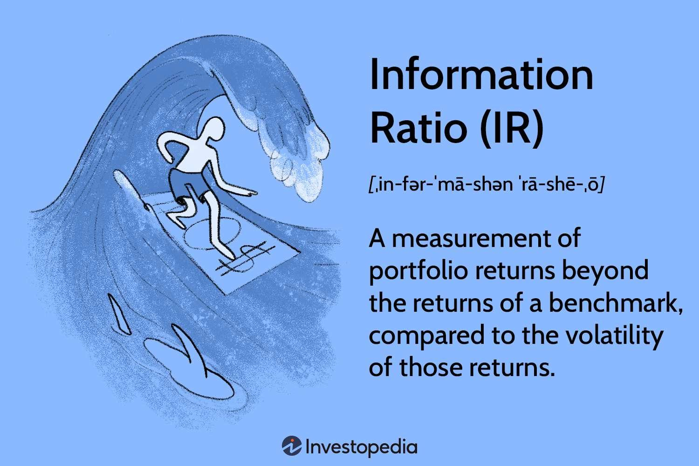

## Table of Contents

## What is the information ratio?

The information ratio is a way to measure how well a portfolio manager does their job. It compares the returns of a portfolio to a benchmark, like a stock market index, and then looks at the extra risk the manager took to get those returns. The formula for the information ratio is the difference between the portfolio's return and the benchmark's return, divided by the tracking error, which is a measure of how much the portfolio's returns differ from the benchmark's returns.

A higher information ratio means the portfolio manager did a better job. It shows they were able to get higher returns than the benchmark while taking on less extra risk. This makes the information ratio useful for investors who want to see if their portfolio manager is adding value. A lower or negative information ratio means the manager's strategy didn't work well, as they either didn't beat the benchmark or took on too much risk to do so.

## How is the information ratio calculated?

The information ratio is calculated by taking the difference between the return of a portfolio and the return of a benchmark, and then dividing that difference by the tracking error. The tracking error is a measure of how much the portfolio's returns vary from the benchmark's returns over time. It's like looking at how bumpy the ride is when you compare the portfolio to the benchmark.

To put it simply, if a portfolio earns 10% and the benchmark earns 8%, the difference is 2%. If the tracking error is 1%, the information ratio would be 2% divided by 1%, which equals 2. This number tells you that the portfolio manager did a good job, beating the benchmark by 2% with a relatively small amount of extra risk. A higher information ratio means the manager did well, while a lower or negative ratio means they didn't do as well.

## What are excess returns?

Excess returns are the extra money you make from an investment compared to what you would have made from a standard benchmark, like a stock market index. For example, if your investment grows by 10% and the benchmark grows by 8%, your excess return is 2%. This number shows how much better or worse your investment did compared to the benchmark.

Investors and portfolio managers care a lot about excess returns because they want to know if their choices are paying off. If a manager picks investments that do better than the benchmark, they're adding value. But if the investments do worse, it might be better to just stick with the benchmark. So, excess returns help people decide if their investment strategy is working or if they need to make changes.

## Why is the information ratio important in investment analysis?

The information ratio is important in investment analysis because it helps investors see how well a portfolio manager is doing their job. It compares the extra money, or excess returns, that the portfolio makes compared to a benchmark, like a stock market index. Then, it looks at how much extra risk the manager took to get those returns. This ratio tells investors if the manager is good at [picking](/wiki/asset-class-picking) investments that do better than the benchmark without taking too much risk.

Knowing the information ratio can help investors make smarter choices. If the ratio is high, it means the manager is doing a great job, adding value to the portfolio. But if the ratio is low or negative, it might mean the manager's strategy isn't working well, and investors might want to think about changing their investment approach or finding a different manager. So, the information ratio is a useful tool for figuring out if the extra effort and risk are worth it.

## How do excess returns contribute to the information ratio?

Excess returns are the extra money you make from your investments compared to a benchmark, like a stock market index. They're a big part of the information ratio because they show how well your portfolio is doing compared to what's expected. If your investments are doing better than the benchmark, you have positive excess returns, which is a good sign. The information ratio uses these excess returns to see if the portfolio manager is adding value.

The information ratio takes those excess returns and divides them by the tracking error, which is a measure of how much the portfolio's returns bounce around compared to the benchmark. This helps figure out if the extra returns are worth the extra risk. If the information ratio is high, it means the manager is doing a good job because they're getting high excess returns without taking on too much extra risk. If it's low or negative, it might mean the manager's strategy isn't working well, and the excess returns aren't making up for the risk taken.

## What is considered a good information ratio?

A good information ratio is usually considered to be above 0.5 or 0.6. This means the portfolio manager is doing a good job at getting extra returns compared to the benchmark while keeping the extra risk low. If the information ratio is around this number or higher, it shows that the manager's strategy is working well and adding value to the portfolio.

However, what's considered "good" can change depending on the type of investments and the market conditions. In some cases, an information ratio of 1 or more might be seen as really good, especially in markets where it's hard to beat the benchmark. But no matter what, a higher information ratio is always better because it means the manager is doing a better job at picking investments that do well without taking too much risk.

## Can you explain the relationship between risk and the information ratio?

The information ratio helps us understand how much extra risk a portfolio manager takes to get better returns than a benchmark. It looks at the difference between the portfolio's returns and the benchmark's returns, and then divides that by the tracking error. The tracking error is a measure of how much the portfolio's returns bounce around compared to the benchmark. So, if a manager gets high returns but also has a lot of extra risk, the information ratio might not be that great because the extra risk isn't worth it.

A good information ratio means the manager is doing a good job at getting high returns without taking on too much extra risk. If the ratio is high, it shows that the extra returns are worth the extra risk. But if the ratio is low or negative, it means the manager took on too much risk for the returns they got. So, the information ratio helps investors see if the risk they're taking is paying off, and if the portfolio manager is making smart choices.

## How does the information ratio differ from the Sharpe ratio?

The information ratio and the Sharpe ratio are both used to see how well an investment is doing, but they look at different things. The information ratio compares the returns of a portfolio to a specific benchmark, like a stock market index, and then looks at the extra risk taken to get those returns. It tells you if the portfolio manager is doing a good job at picking investments that do better than the benchmark without taking too much extra risk. 

On the other hand, the Sharpe ratio compares the returns of a portfolio to a risk-free rate, like the return you'd get from a government bond. It looks at how much extra return you're getting for the total risk you're taking. The Sharpe ratio is useful for seeing if your investments are doing better than just keeping your money in a safe place. Both ratios help investors make smart choices, but they focus on different kinds of risk and benchmarks.

## What are the limitations of using the information ratio?

The information ratio can be a useful tool, but it has some limits. One big limit is that it depends on picking the right benchmark. If you choose a benchmark that doesn't match your portfolio well, the information ratio might not give you a good picture of how well your portfolio is doing. For example, if you're comparing a tech stock portfolio to a broad market index, the ratio might not show the true performance because the two are very different.

Another limit is that the information ratio focuses on the past. It tells you how well the portfolio did compared to the benchmark in the past, but it can't predict the future. Just because a manager did well before doesn't mean they'll keep doing well. Also, the information ratio doesn't take into account all kinds of risk. It only looks at the tracking error, which is how much the portfolio's returns bounce around compared to the benchmark. But there might be other risks that the ratio doesn't show.

## How can an investor use the information ratio to improve their portfolio?

An investor can use the information ratio to see if their portfolio manager is doing a good job. The information ratio compares how much extra money the portfolio makes compared to a benchmark, like a stock market index, and then looks at how much extra risk the manager took to get those returns. If the information ratio is high, it means the manager is picking good investments that do better than the benchmark without taking too much risk. This can help the investor feel confident that their money is in good hands. If the ratio is low or negative, it might be a sign to look for a different manager or change the investment strategy.

By keeping an eye on the information ratio over time, an investor can see if their portfolio is getting better or worse. If the ratio starts going down, it could mean the manager's strategy isn't working as well anymore. The investor might then decide to talk to the manager about what's going on or think about moving their money to a different investment that has a better information ratio. This way, the investor can make smart choices to improve their portfolio and keep their money growing.

## What advanced statistical techniques can enhance the analysis of the information ratio?

To make the information ratio even better, investors can use something called regression analysis. This is a way to look at how different things, like the economy or interest rates, affect the portfolio's returns. By using regression, investors can see if the portfolio manager is doing a good job even when the market is going up and down. This helps them understand if the extra returns are because of the manager's smart choices or just because the market is doing well. Regression can also help find out if the tracking error, which is how much the portfolio's returns bounce around compared to the benchmark, is caused by the manager's decisions or by other things happening in the market.

Another advanced technique is using time-series analysis. This looks at how the information ratio changes over time. By studying these changes, investors can see if the portfolio manager is getting better or worse at picking investments. Time-series analysis can also help find patterns or trends that might not be easy to see just by looking at the numbers. For example, it might show that the information ratio goes up during certain times of the year or when the market is doing certain things. This can help investors make smarter choices about when to stick with their current strategy or when to try something new.

## How do different asset classes impact the information ratio and excess returns?

Different types of investments, or asset classes, can change how the information ratio and excess returns look. For example, if you're looking at stocks, the information ratio might be higher because stocks can go up and down a lot. This means a good stock picker can make a big difference in how the portfolio does compared to the benchmark. But with bonds, which are usually less risky, the information ratio might be lower because it's harder to beat the benchmark by a lot. So, the kind of investments in a portfolio can make the information ratio go up or down.

Also, the way different asset classes act can affect excess returns. If you have a portfolio full of stocks that do really well, your excess returns might be high because stocks can grow a lot. But if you're mostly in bonds, your excess returns might be lower because bonds don't usually grow as fast. So, when you're looking at the information ratio and excess returns, it's important to think about what kinds of investments are in the portfolio. This helps you understand if the portfolio manager is doing a good job with the types of investments they have.

## What is Understanding Excess Returns?

Excess returns, often referred to as alpha, signify the performance of an investment over and above a specified market index or benchmark. These returns are crucial in evaluating the effectiveness of trading strategies as they reflect a trader's ability to outperform average market expectations. The pursuit of alpha involves accurate forecasting of market movements and the implementation of optimized trading strategies based on such predictions.

Algorithmic trading plays a vital role in achieving excess returns through its use of vast datasets and sophisticated algorithms. By leveraging data and [machine learning](/wiki/machine-learning), [algorithmic trading](/wiki/algorithmic-trading) aims to enhance the precision and speed of trading decisions, thus potentially leading to higher excess returns. Machine learning models, for instance, can detect complex patterns in data that may not be visible through traditional analysis, providing a competitive edge in market forecasting.

To mathematically express excess returns, consider $R_p$ as the return on the portfolio and $R_b$ as the return on the benchmark. The excess return can then be calculated as:

$$
\text{Excess Return} = R_p - R_b
$$

This measure allows investors to evaluate the efficiency of a trading strategy. A positive excess return indicates that the strategy has succeeded in surpassing the benchmark's performance, while a negative value suggests underperformance.

Investors rely on excess returns as a key metric to assess the success of trading strategies relative to market expectations. As markets become more competitive and data-driven, the ability to achieve and sustain excess returns distinguishes successful algorithmic trading strategies from others. The consistent generation of alpha requires a combination of precise market predictions, risk management, and the ongoing refinement of trading models, emphasizing the importance of algorithmic trading methodologies in modern financial markets.

## What is the Role of the Information Ratio?

The Information Ratio (IR) is a critical metric for assessing the efficiency of a portfolio's performance relative to a benchmark. It represents the ratio of the excess return of the portfolio over a benchmark to the risk taken, quantified by the tracking error. Mathematically, it is expressed as:

$$
\text{IR} = \frac{R_p - R_b}{\sigma_d}
$$

where $R_p$ is the return of the portfolio, $R_b$ is the return of the benchmark, and $\sigma_d$ is the tracking error, calculated as the standard deviation of the difference in returns between the portfolio and the benchmark.

A higher Information Ratio indicates that a portfolio is achieving greater excess returns for each unit of risk, thereby reflecting a more effective trading strategy. This is particularly relevant for active management strategies which aim to exceed benchmark performance. The ability to consistently generate a high IR suggests skillful management in identifying and capitalizing on trading opportunities while controlling risk.

The Information Ratio is distinct from other performance metrics, such as the Sharpe Ratio, because it focuses specifically on management's ability to exploit informational advantages over a benchmark. This distinction makes the IR especially valuable for comparing and evaluating the effectiveness of various active management strategies. By doing so, investors can better understand the value added by active management and make more informed decisions in strategy selection.

## How is Machine Learning used in Algo Trading?

Machine learning (ML) plays a critical role in enhancing algorithmic trading by enabling the analysis of vast datasets to identify patterns and generate trading signals. This capability is crucial in a field driven by the need for speed and precision. ML algorithms can swiftly process and analyze large volumes of historical and real-time data, enabling more informed trading decisions.

ML techniques refine predictions and optimize trading decisions, directly contributing to the generation of alpha—returns exceeding a benchmark index. These techniques include supervised learning, where models are trained on labeled historical data to predict future asset prices, and unsupervised learning, which identifies hidden patterns or intrinsic structures in data without pre-existing labels. Reinforcement learning is another advanced ML technique that allows algorithms to learn optimal trading strategies through trial and error interactions with the market environment.

Common applications of machine learning in trading include feature extraction, risk modeling, and the creation of predictive models for asset returns. Feature extraction involves selecting and transforming raw data into informative inputs for models, enhancing their predictive power. Risk modeling uses ML to assess and manage the portfolio's exposure to various market risks, while predictive models forecast asset prices based on historical patterns and real-time data.

ML improves the quality of forecasts by enhancing the Information Coefficient (IC), which measures the correlation between predicted and actual returns. A higher IC indicates more accurate predictions, contributing to a superior Information Ratio (IR). The IR is defined as:

$$
\text{IR} = \frac{\text{Excess Return}}{\text{Tracking Error}}
$$

where the excess return is the return of a portfolio above a benchmark, and the tracking error is the standard deviation of these excess returns.

The integration of ML in trading models allows for continuous adaptation to market conditions, providing an edge in performance sustainability. By employing ML, traders harness improved accuracy and efficiency in forecasting, leading to a more substantial accumulation of alpha over time.

## What are the strategies for achieving high information ratios?

Optimizing the Information Ratio (IR) in algorithmic trading involves a multifaceted approach that prioritizes the combination of alpha factors, rigorous [backtesting](/wiki/backtesting), and effective risk management strategies. Alpha factors represent independent sources of excess returns, and their effective combination is crucial in maximizing the IR. By employing a diverse set of predictive signals, traders can enhance their ability to outperform benchmarks while managing associated risks.

Backtesting plays a critical role in validating the performance of trading strategies. This process involves simulating a trading strategy using historical data to evaluate its effectiveness. By rigorously backtesting multiple alpha factors, traders can identify the most promising combinations that yield higher excess returns without incurring substantial risk.

The breadth of strategy refers to the number of independent bets or trades a strategy takes. Expanding the breadth increases the opportunity to capitalize on uncorrelated trading signals, thereby improving the overall IR. This concept is rooted in the law of active management, which suggests that the Information Ratio can be expressed as:

$$
IR = IC \times \sqrt{BR}
$$

where $IC$ represents the Information Coefficient, a measure of the predictive accuracy of the signals, and $BR$ denotes the breadth of the strategy. Higher breadth can lead to an improved IR, assuming the Information Coefficient is positively maintained.

Effective risk management is essential to maintaining a stable excess return. Diversification strategies, such as Hierarchical Risk Parity (HRP), help in optimally allocating risk across various assets. HRP partitions a portfolio into clusters of assets and allocates capital based on the hierarchical clustering of these assets, ensuring a balance of risk across different investments. This technique reduces the impact of any single asset on the portfolio's overall risk, enhancing stability and consistency in excess returns.

To sustain high Information Ratios, trading strategies must continuously adapt and incorporate [alternative data](/wiki/best-alternative-data) sources. This adaptation involves integrating unconventional datasets, such as social media sentiment, satellite imagery, or transactional data, into trading algorithms. These alternative data sources can provide fresh, uncorrelated signals that enhance forecasting accuracy and, consequently, improve the Information Coefficient. By maintaining a diverse and adaptive approach to data analysis, traders can better anticipate market movements and optimize their trading strategies to achieve consistent, superior performance.

In summary, achieving high Information Ratios in algorithmic trading requires a strategic combination of multiple alpha factors, extensive backtesting, increased strategy breadth, effective risk management through diversification, and continuous adaptation to incorporate alternative data sources. These components contribute to generating stable excess returns while managing risk efficiently, thereby optimizing the performance of trading strategies.

## What is the conclusion?

Algorithmic trading aims to achieve excess returns, fundamentally assessed through the Information Ratio (IR). This performance metric evaluates not just the magnitude of returns compared to a benchmark, but also takes into account the risk undertaken to achieve those returns. The formula for the Information Ratio is:

$$

\text{IR} = \frac{R_p - R_b}{\sigma_d} 
$$

where $R_p$ is the portfolio return, $R_b$ is the benchmark return, and $\sigma_d$ is the standard deviation of the return differences between the portfolio and the benchmark (tracking error).

The adoption of machine learning (ML) techniques in algorithmic trading has substantially boosted the ability to both generate and maintain elevated IRs. By processing large datasets, ML can identify complex patterns and predict market movements more accurately, enhancing the Information Coefficient (IC), which measures the correlation between predicted and actual returns. Python libraries such as scikit-learn and TensorFlow are often employed to develop these predictive models, showcasing the applicability of ML in improving trading performance.

For traders to consistently achieve outperformance, they must incorporate a comprehensive approach that fuses machine learning with solid risk management practices and ongoing strategy assessment. This involves not only utilizing machine learning algorithms but also implementing thorough backtesting and validation techniques to ensure strategies are robust against various market conditions. Additionally, optimizing risk through diversification and adaptive strategies helps stabilize returns over time.

As financial markets continue to change and grow more complex, the use of innovative tools and methodologies becomes vital for maintaining a competitive advantage in algorithmic trading. The integration of alternative data sources and real-time analytics allows traders to adapt swiftly and efficiently, maintaining the quest for excess returns. The continued evolution of technology in trading necessitates ongoing learning and adaptation, ensuring that traders remain at the forefront of investment management.

## References & Further Reading

[1]: Bergstra, J., Bardenet, R., Bengio, Y., & Kégl, B. (2011). ["Algorithms for Hyper-Parameter Optimization."](https://dl.acm.org/doi/10.5555/2986459.2986743) Advances in Neural Information Processing Systems, 24.

[2]: ["Advances in Financial Machine Learning"](https://www.amazon.com/Advances-Financial-Machine-Learning-Marcos/dp/1119482089) by Marcos Lopez de Prado

[3]: ["Evidence-Based Technical Analysis: Applying the Scientific Method and Statistical Inference to Trading Signals"](https://www.amazon.com/Evidence-Based-Technical-Analysis-Scientific-Statistical/dp/0470008741) by David Aronson

[4]: ["Machine Learning for Algorithmic Trading"](https://github.com/stefan-jansen/machine-learning-for-trading) by Stefan Jansen

[5]: ["Quantitative Trading: How to Build Your Own Algorithmic Trading Business"](https://www.amazon.com/Quantitative-Trading-Build-Algorithmic-Business/dp/0470284889) by Ernest P. Chan

[6]: Grinold, R. C., & Kahn, R. N. (1999). ["Active Portfolio Management: A Quantitative Approach for Producing Superior Returns and Selecting Superior Returns."](https://www.amazon.com/Active-Portfolio-Management-Quantitative-Controlling/dp/0070248826) McGraw-Hill.

[7]: Sharpe, W. F. (1966). ["Mutual Fund Performance."](https://www.jstor.org/stable/2351448) Journal of Business, 39(1), 119-138.