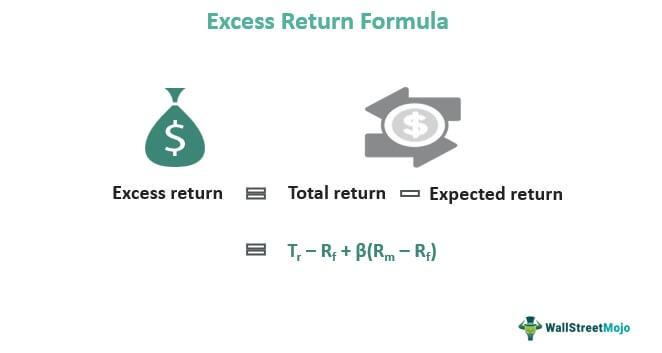

In finance, understanding key concepts such as investment risk, excess returns, and algorithmic trading is crucial for both novice and experienced investors. These elements form the backbone of modern investment strategies, influencing decisions on portfolio management and asset allocation.

This article aims to provide a comprehensive exploration of these topics, offering insights into essential financial formulas and strategies that underpin sound investment decisions. We begin by defining excess returns, which measure the performance of an investment relative to a benchmark or risk-free rate, and discuss their significance in evaluating portfolio management effectiveness. Excess returns are a vital tool for investors seeking to assess the ability of an investment strategy to outperform the market or a specific benchmark.



Investment risk, a key component in portfolio construction and performance metrics, is examined next. Understanding the various types of investment risk, including market risk, credit risk, and liquidity risk, allows investors to effectively diversify their portfolios and achieve optimal asset allocation. By quantifying these risks, investors can better anticipate potential losses and adjust their portfolios accordingly.

Finally, the role of algorithmic trading in modern investing is explored. Algorithmic trading, which utilizes computer programs to execute trades based on pre-defined criteria, has become an integral part of achieving excess returns. By improving trade efficiency and timing, algorithmic trading offers investors opportunities to capitalize on market dynamics that may be less accessible through traditional investment approaches.

By integrating knowledge of these key concepts, investors can enhance their portfolio performance, balancing the pursuit of excess returns with effective risk management strategies.

## Table of Contents

## What Are Financial Formulas?

Financial formulas are mathematical tools employed to evaluate investment opportunities and manage portfolios efficiently. They are essential in guiding investors to make informed decisions by quantifying risk, assessing returns, and optimizing investment strategies. These formulas not only aid in understanding the dynamics of market behavior but also support the development of strategic financial planning.

Key financial formulas include the Capital Asset Pricing Model (CAPM), the Sharpe Ratio, and the concept of the Efficient Frontier. These are integral to modern portfolio theory, which aims to maximize returns for a given level of risk.

### Capital Asset Pricing Model (CAPM)

The CAPM is a model that describes the relationship between expected return and risk. It is used to determine a theoretically appropriate required rate of return of an asset, given its risk relative to the market. The formula is expressed as:

$$

E(R_i) = R_f + \beta_i (E(R_m) - R_f) 
$$

where:
- $E(R_i)$ is the expected return on the capital asset.
- $R_f$ is the risk-free rate.
- $\beta_i$ is the beta of the security.
- $E(R_m)$ is the expected market return.

CAPM provides a critical framework for assessing whether an asset is fairly valued given its risk and expected performance in the market.

### Sharpe Ratio

The Sharpe Ratio is a measure used to evaluate the risk-adjusted return of an investment portfolio. It represents the average return earned in excess of the risk-free rate per unit of [volatility](/wiki/volatility-trading-strategies) or total risk. The formula is:

$$

\text{Sharpe Ratio} = \frac{E(R_p) - R_f}{\sigma_p} 
$$

where:
- $E(R_p)$ is the expected portfolio return.
- $R_f$ is the risk-free rate.
- $\sigma_p$ is the standard deviation of the portfolio return.

A higher Sharpe Ratio indicates better risk-adjusted performance, making it a popular metric for comparing the performance of different investments or portfolios.

### Efficient Frontier

The Efficient Frontier is a concept from modern portfolio theory, representing a set of optimal portfolios offering the highest expected return for a defined level of risk or the lowest risk for a given level of expected return. Portfolios on the efficient frontier are considered optimally diversified, while those below are inferior in terms of risk-return trade-off.

In Python, calculating the Efficient Frontier involves historical return data to determine expected returns, covariances, and then solving optimization problems to derive the optimal portfolios. Here is a simple illustration using Python code snippets:

```python
import numpy as np
import pandas as pd
import matplotlib.pyplot as plt
from scipy.optimize import minimize

# Example historical returns data (returns_df)
returns_df = pd.DataFrame({
    'Asset_A': np.random.normal(0.10, 0.15, 1000),
    'Asset_B': np.random.normal(0.12, 0.20, 1000),
    # Add more assets as needed
})

# Calculate expected returns and covariance
expected_returns = returns_df.mean()
cov_matrix = returns_df.cov()

# Portfolio optimization constraints and bounds
def portfolio_statistics(weights):
    portfolio_return = np.sum(expected_returns * weights)
    portfolio_volatility = np.sqrt(np.dot(weights.T, np.dot(cov_matrix, weights)))
    return portfolio_return, portfolio_volatility

# Function to minimize (negative returns)
def min_func_sharpe(weights):
    return -portfolio_statistics(weights)[0] / portfolio_statistics(weights)[1]

# Initial guess and constraints for weights
num_assets = len(expected_returns)
initial_weights = num_assets * [1. / num_assets,]
constraints = ({'type': 'eq', 'fun': lambda x: np.sum(x) - 1})
bounds = tuple((0, 1) for asset in range(num_assets))

# Optimization
optimized = minimize(min_func_sharpe, initial_weights, method='SLSQP', bounds=bounds, constraints=constraints)

# Plotting Efficient Frontier (simplified example)
plt.plot(portfolio_statistics(optimized.x)[1], portfolio_statistics(optimized.x)[0], 'ro')
plt.xlabel('Volatility')
plt.ylabel('Returns')
plt.title('Efficient Frontier')
plt.show()
```

Understanding and applying these financial formulas allow investors to better foresee potential outcomes and align their portfolios with desired risk-return profiles, facilitating informed investment decisions.

## Investment Risk: Understanding the Basics

Investment risk refers to the probability that an investment's actual returns will differ from the expected returns, possibly resulting in financial loss. This risk arises due to the inherent uncertainties present in financial markets, which can affect various asset classes differently. Risk assessment is a fundamental aspect of investment decision-making, aiding investors in structuring their portfolios to balance potential returns against risk exposure.

Market risk, also known as systematic risk, pertains to the broader economic factors that affect all investments across the board. This includes changes in interest rates, inflation, political instability, and natural disasters. Due to its pervasive nature, market risk cannot be eliminated through diversification but can be mitigated through strategies like hedging or asset allocation adjustments.

Credit risk, on the other hand, involves the possibility that a bond issuer or borrower may default on their obligations, leading to financial losses for investors. This type of risk is particularly significant in debt investments and can be managed by evaluating the creditworthiness of issuers, diversifying credit exposures, and focusing on higher-quality instruments.

Liquidity risk is the risk that an investment cannot be bought or sold quickly enough in the market to prevent or minimize a loss. This risk is more pronounced in assets that do not trade regularly, or during periods of market stress when the buyer interest diminishes. Investors might manage [liquidity](/wiki/liquidity-risk-premium) risk by maintaining a portion of their portfolio in highly liquid assets and monitoring market conditions closely.

Understanding these types of investment risk is crucial for developing an effective diversification strategy. Diversification, which involves holding a mix of various asset types, sectors, and geographic regions, seeks to reduce unsystematic risk — the portion of total risk that is unique to a particular investment. By spreading investments across different areas, the negative performance of some assets can potentially be offset by positive performance in others.

Effective asset allocation, tailored to the investor's risk tolerance, investment objectives, and time horizon, further enhances the potential for optimizing the risk-return balance. This strategic approach assigns specific proportions of the portfolio to different asset categories such as equities, bonds, and cash or cash equivalents, taking into consideration historical risk and return [statistics](/wiki/bayesian-statistics) of these asset classes.

In quantitative terms, risk is often measured by statistical tools like standard deviation, which indicates the variability of returns. Investors may use financial models and simulations to predict the potential outcomes of different investment strategies under varying market conditions. The understanding and management of investment risk allow investors to construct robust portfolios that align with their financial goals while minimizing unexpected losses.

## Excess Returns: Measuring Investment Success

Excess returns are a critical measure of investment success, defining the returns generated beyond a predefined benchmark or risk-free rate. They provide an essential metric for evaluating the effectiveness of an investment strategy or the skill of an active portfolio manager.

One of the primary metrics for assessing excess returns is Alpha (α). Alpha measures the performance of an investment relative to a benchmark index. It is calculated using the formula:

$$

\alpha = R_i - [R_f + \beta \times (R_m - R_f)] 
$$

Where:
- $R_i$ is the return of the investment.
- $R_f$ is the risk-free rate.
- $\beta$ is the beta of the investment, representing its sensitivity to market movements.
- $R_m$ is the market return.

A positive Alpha indicates that the investment has outperformed the benchmark after adjusting for risk, demonstrating the effectiveness of active management in generating superior returns. Conversely, a negative Alpha suggests underperformance, signifying that the strategy failed to add value beyond what could be achieved through passive indexing.

Calculating excess returns is not solely about evaluating performance but also understanding the context of investment risk. This involves distinguishing between absolute and relative returns. Absolute returns refer to the total gain or loss on an investment, while relative returns represent how an investment performs compared to a benchmark without considering absolute performance. 

To gain a comprehensive insight into investment success, one must account for both the magnitude and the risk-adjusted quality of excess returns. This dual appraisal ensures that investors understand not only the return potential but also the inherent risks taken to achieve those returns. By carefully analyzing excess returns, including Alpha, investors can gain valuable insights into the efficiency and capability of their investment decisions and strategies.

## Alpha, Beta, and Other Risk Metrics

Alpha and beta are two foundational metrics used to evaluate asset performance and determine the risk-return profile of investments. Alpha is a measure of an investment's performance relative to a benchmark index, typically reflecting the value that a portfolio manager adds or subtracts from a fund's return. A positive alpha indicates that the investment has outperformed the benchmark, while a negative alpha suggests underperformance. It is represented by the formula:

$$
\alpha = R_i - (R_f + \beta \times (R_m - R_f))
$$

where $R_i$ is the portfolio return, $R_f$ is the risk-free rate, $\beta$ is the beta of the portfolio, and $R_m$ is the market return.

Beta, on the other hand, measures the sensitivity of an investment's returns to market movements. A beta greater than 1 indicates that the asset is more volatile than the market, while a beta less than 1 suggests less volatility. For instance, if an asset has a beta of 1.2, it is expected to move 20% more than the overall market.

Apart from alpha and beta, investors frequently use other risk-adjusted performance metrics to capture a more comprehensive picture of investment risk and return dynamics. One such metric is Jensen's Alpha, which adjusts the standard alpha calculation by incorporating the Capital Asset Pricing Model (CAPM) and providing insights into whether a fund's returns are due to smart investment decisions or the willingness to take on more risk than the market.

The Sharpe Ratio is another widely recognized metric. It evaluates the extra return an investor receives for the additional volatility of holding a riskier asset. Calculated by dividing the difference between the portfolio return and the risk-free rate by the portfolio's standard deviation, it is expressed as:

$$
\text{Sharpe Ratio} = \frac{R_p - R_f}{\sigma_p}
$$

where $R_p$ is the portfolio return, $R_f$ is the risk-free rate, and $\sigma_p$ is the standard deviation of the portfolio's excess return.

These metrics are invaluable for investors as they help determine if the potential returns justify the risks undertaken with an investment. By analyzing these risk-adjusted metrics, investors can make informed decisions about adjusting their investment strategies in pursuit of optimized returns.

## Algorithmic Trading: Enhancing Returns and Managing Risk

Algorithmic trading refers to the use of complex algorithms and computer systems to execute financial market transactions. By processing vast amounts of data quickly, these algorithms make decisions based on pre-set criteria, allowing traders to benefit from small price deviations in the market. This form of trading has gained prominence due to its ability to enhance trade efficiency and optimize transaction timing, leading to potential outperformance over traditional strategies.

Algorithmic trading operates on the principle of executing trades at the fastest speed possible, taking advantage of momentary market inefficiencies. These algorithms can analyze various market variables like price movements, [volume](/wiki/volume-trading-strategy), and timing simultaneously, facilitating rapid decision-making. Depending on the complexity and goals of the algorithm, it may either follow simple rules or incorporate sophisticated models involving [machine learning](/wiki/machine-learning) and [artificial intelligence](/wiki/ai-artificial-intelligence) techniques.

A key advantage of [algorithmic trading](/wiki/algorithmic-trading) is its ability to reduce human errors. Human traders may be influenced by emotions and fatigue, potentially leading to inconsistent trading decisions. In contrast, algorithms can operate with high precision and consistency, adhering strictly to the defined parameters.

However, to effectively harness the potential of algorithmic trading, it is crucial to understand the underlying algorithms' decision-making processes and risk parameters. Developers and traders must ensure that the algorithms are well-optimized and can adapt to changing market conditions. This involves rigorous [backtesting](/wiki/backtesting) and simulation exercises to evaluate the performance of trading strategies under various scenarios.

Algorithms are often evaluated using different performance and risk metrics. For instance, the Sharpe Ratio can measure an algorithm's risk-adjusted returns, while the Maximum Drawdown provides insight into the potential losses an algorithm might experience. Understanding these metrics aids in assessing whether the algorithms are achieving the desired trade-offs between return and risk.

Furthermore, algorithmic trading strategies might include high-frequency trading ([HFT](/wiki/high-frequency-trading-strategies)), [arbitrage](/wiki/arbitrage), trend-following algorithms, and more, each with specific goals and methodologies. High-frequency trading involves a large number of trades executed in fractions of a second, capitalizing on very short-lived arbitrage opportunities. Meanwhile, trend-following algorithms may identify and exploit long-term market trends, involving complex models for predicting price movements.

A basic example of an algorithmic trading strategy implemented in Python might look as follows:

```python
import pandas as pd
import numpy as np

# Simulated trading data
data = pd.DataFrame({
    'price': [100, 102, 101, 105, 107, 106],
    'volume': [200, 220, 210, 215, 225, 240]
})

# Simple moving average strategy
window_size = 3  # Lookback period
data['SMA'] = data['price'].rolling(window=window_size).mean()

# Trading signal: 1 for buy, -1 for sell
data['signal'] = np.where(data['price'] > data['SMA'], 1, -1)

print(data)
```

This basic code snippet demonstrates a simple moving average (SMA) strategy, where buy and sell signals are generated based on the relationship between the current price and the SMA. While this example is rudimentary, it illustrates the core principle of algorithmic trading—using data-driven rules to automate trading decisions.

In conclusion, algorithmic trading represents a sophisticated approach to market participation, empowered by advanced computing and analytical methods. To maximize its potential, a comprehensive understanding of its mechanics and ongoing strategy evaluation is essential.

## Conclusion

Investment risk, excess returns, and algorithmic trading serve as interconnected pillars in modern portfolio management, each playing a critical role in shaping the investment landscape. Understanding and mastering the financial formulas and strategies that underpin these elements can significantly enhance an investor's ability to construct robust portfolios.

Investment risk is a multifaceted concept that includes various types of risk such as market, credit, and liquidity risk. Effectively managing these risks is crucial for portfolio diversification and achieving an optimal asset allocation. By using risk-adjusted metrics like the Sharpe Ratio, which measures the return of an investment compared to its risk, investors can make informed decisions:

$$
\text{Sharpe Ratio} = \frac{\text{Expected Portfolio Return} - \text{Risk-Free Rate}}{\text{Standard Deviation of Portfolio Return}}
$$

Excess returns are another critical focus, representing the returns surpassing a risk-free benchmark. Measuring excess returns through metrics such as Alpha provides insights into the effectiveness of active management strategies. Alpha assesses whether an investment has outperformed or underperformed a market index or other benchmarks:

$$
\alpha = \text{Observed Return} - (\text{Risk-Free Rate} + \beta \times \text{Market Return})
$$

Here, $\beta$ measures the asset's volatility or systemic risk relative to the broader market. Integrating these calculations helps in determining whether the level of risk taken corresponds to the return achieved.

Algorithmic trading emerges as a powerful tool that can enhance returns and manage risk through automation and precision in trade execution. By designing and deploying algorithms optimized for market conditions, investors can capitalize on sophisticated, data-driven strategies that traditional methods might overlook. Python programming is often employed to create such algorithms; for instance, employing libraries like `pandas` or `numpy` can streamline data analysis:

```python
import pandas as pd
import numpy as np

# Example code to calculate moving averages, a simple algorithmic trading strategy
def moving_average_strategy(data, short_window, long_window):
    signals = pd.DataFrame(index=data.index)
    signals['price'] = data['price']
    signals['short_mavg'] = data['price'].rolling(window=short_window, min_periods=1, center=False).mean()
    signals['long_mavg'] = data['price'].rolling(window=long_window, min_periods=1, center=False).mean()
    signals['signal'] = 0.0
    signals['signal'][short_window:] = np.where(signals['short_mavg'][short_window:] > signals['long_mavg'][short_window:], 1.0, 0.0)
    signals['positions'] = signals['signal'].diff()
    return signals

# Sample data to demonstrate strategy
data = pd.DataFrame({'price': [110, 112, 115, 113, 117, 119, 118, 120, 122, 125]})
strategy_signals = moving_average_strategy(data, short_window=3, long_window=5)
print(strategy_signals)
```

Harnessing the potential of algorithmic strategies in conjunction with risk management techniques allows investors to optimize returns while controlling for risk effectively. This confluence of knowledge and technology not only maximizes investment performance but also provides a sustainable competitive advantage in an ever-evolving financial ecosystem.

## Additional Resources

For those looking to deepen their knowledge of financial mathematics and portfolio management, numerous courses are available. Institutions like the Massachusetts Institute of Technology (MIT) and online platforms such as Coursera and edX offer specialized courses covering financial modeling, quantitative analysis, and risk management. These courses provide a solid foundation in key concepts like the Capital Asset Pricing Model (CAPM), Sharpe Ratio, and Efficient Frontier, equipping investors with tools to optimize their investment strategies.

Algorithmic trading enthusiasts can benefit from various online platforms that offer simulation environments for practical learning. Platforms like QuantConnect, AlgoTrader, and MetaTrader offer access to algorithm development tools and backtesting environments where users can practice developing their own trading algorithms. These platforms often support languages such as Python, enabling users to implement complex trading strategies. Below is a simple Python example demonstrating a backtest of a moving average crossover strategy using a popular library, Backtrader:

```python
import backtrader as bt

class MovingAverageStrategy(bt.SignalStrategy):
    def __init__(self):
        self.sma_short = bt.indicators.SimpleMovingAverage(
            self.data.close, period=20)
        self.sma_long = bt.indicators.SimpleMovingAverage(
            self.data.close, period=50)
        self.signal_add(bt.SIGNAL_LONG, self.sma_short > self.sma_long)
        self.signal_add(bt.SIGNAL_SHORT, self.sma_short < self.sma_long)

cerebro = bt.Cerebro()
cerebro.broker.setcash(10000)
data = bt.feeds.YahooFinanceData(dataname='AAPL', fromdate=datetime(2020, 1, 1), todate=datetime(2023, 1, 1))
cerebro.adddata(data)
cerebro.addstrategy(MovingAverageStrategy)
cerebro.run()
cerebro.plot()
```

Staying updated with market news and advancements in financial technology is essential for investors looking to capitalize on new strategies and opportunities. Leading financial news platforms such as Bloomberg, Reuters, and The Wall Street Journal provide up-to-date market analysis and insights. Furthermore, following financial technology conferences and publications can offer valuable information on emerging trends and tools, helping investors remain competitive in an evolving landscape. Subscribing to financial newsletters and engaging with online investor communities can also enhance one's understanding and application of new investment strategies.

## References & Further Reading

[1]: Bodie, Z., Kane, A., & Marcus, A. J. (2014). ["Investments"](https://books.google.com/books/about/EBOOK_Investments_Global_edition.html?id=BMsvEAAAQBAJ). McGraw-Hill Education.

[2]: Grinold, R., & Kahn, R. (1999). ["Active Portfolio Management: A Quantitative Approach for Producing Superior Returns and Controlling Risk"](https://archive.org/details/activeportfoliom0000grin). McGraw-Hill Education.

[3]: Fabozzi, F. J. (2004). ["Handbook of Portfolio Management"](https://www.amazon.com/Handbook-Portfolio-Management-Frank-Fabozzi/dp/1883249414). John Wiley & Sons.

[4]: Reilly, F. K., & Brown, K. C. (2011). ["Investment Analysis and Portfolio Management"](https://books.google.com/books/about/Investment_Analysis_and_Portfolio_Manage.html?id=CfB-qTXqRWEC). South-Western College Pub.

[5]: Sharpe, W. F. (1964). ["Capital Asset Prices: A Theory of Market Equilibrium under Conditions of Risk"](https://onlinelibrary.wiley.com/doi/full/10.1111/j.1540-6261.1964.tb02865.x). Journal of Finance, 19(3), 425-442.

[6]: Marcos Lopez de Prado (2018). ["Advances in Financial Machine Learning"](https://www.amazon.com/Advances-Financial-Machine-Learning-Marcos/dp/1119482089). Wiley.

[7]: Chan, E. (2009). ["Quantitative Trading: How to Build Your Own Algorithmic Trading Business"](https://github.com/ftvision/quant_trading_echan_book). Wiley.

[8]: Pardo, R. (2008). ["The Evaluation and Optimization of Trading Strategies"](https://onlinelibrary.wiley.com/doi/book/10.1002/9781119196969). Wiley.