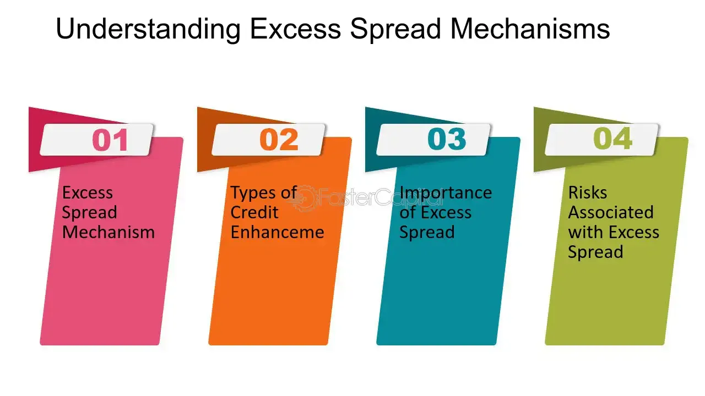

## Table of Contents

## What is excess spread?

Excess spread is the difference between the income a financial product earns and the costs it has to pay. Think of it like this: if you have a credit card that charges interest on balances, the money from that interest is the income. The costs might be things like paying the bank that issued the card or other fees. If the income is more than the costs, that extra amount is the excess spread.

This concept is really important in things like securitization, where different kinds of debts are bundled together and sold to investors. The excess spread acts like a cushion. It helps protect investors if some people don't pay back their debts. It's a way to make sure the financial product stays stable and can keep paying out to investors even when things go wrong.

## How is excess spread calculated?

Excess spread is figured out by taking the total income from a financial product and subtracting all the costs associated with it. The income might come from things like interest payments on loans or credit card balances. The costs could include fees paid to banks, servicing costs, and other expenses. If the income is more than the costs, the difference is the excess spread.

This calculation is important because it shows how much extra money is available to protect investors if some loans in a pool don't get paid back. For example, in a securitization deal, if some people default on their loans, the excess spread can help cover those losses. It's like a safety net that helps keep the financial product stable and able to keep paying out to investors.

## Why is excess spread important in financial markets?

Excess spread is really important in financial markets because it acts like a safety cushion. Imagine you have a bunch of loans or credit card balances all grouped together in something called a securitization. The money coming in from these loans is the income, and the costs are things like paying banks or other fees. If the income is more than the costs, that extra money is the excess spread. This extra money helps protect investors if some people can't pay back their loans. It's like having a backup plan to make sure everyone still gets paid even if things go wrong.

This safety cushion is super important because it keeps the financial product stable. When investors know there's extra money to cover possible losses, they feel more secure about putting their money into these products. This can make the financial markets work better because more people might want to invest. So, excess spread not only helps manage risk but also makes the whole system more trustworthy and attractive to investors.

## What role does excess spread play in securitization?

In securitization, excess spread is like a safety net. Imagine you have a bunch of loans or credit card balances grouped together into a pool. The money coming in from these loans is the income, and the costs are things like paying banks or other fees. If the income is more than the costs, that extra money is the excess spread. This extra money is really important because it helps cover any losses if some people can't pay back their loans. It's like having a backup plan to make sure everyone still gets paid even if things go wrong.

This safety cushion is super important for keeping the securitization stable. When investors know there's extra money to cover possible losses, they feel more secure about putting their money into these products. This can make the financial markets work better because more people might want to invest. So, excess spread not only helps manage risk but also makes the whole system more trustworthy and attractive to investors.

## How does excess spread affect the risk of an investment?

Excess spread makes an investment less risky. Think of it like this: when you have a bunch of loans grouped together, some people might not be able to pay back their loans. But if there's extra money coming in from the loans that are being paid back, that extra money can cover the losses from the loans that aren't paid back. This extra money is called excess spread. So, if there's a lot of excess spread, it's like having a big safety net that protects investors from losing money.

Having this safety net makes investors feel more secure. When they know there's extra money to cover possible losses, they are more likely to invest in these products. This can make the financial markets work better because more people might want to invest. So, excess spread not only helps manage risk but also makes the whole system more trustworthy and attractive to investors.

## Can you explain the mechanism of excess spread in asset-backed securities?

In asset-backed securities, excess spread works like a safety cushion. Imagine a bunch of loans, like car loans or credit card balances, all grouped together. The money coming in from these loans is the income, and the costs are things like paying banks or other fees. If the income is more than the costs, that extra money is the excess spread. This extra money is really important because it helps cover any losses if some people can't pay back their loans. It's like having a backup plan to make sure everyone still gets paid even if things go wrong.

This safety cushion is super important for keeping the asset-backed securities stable. When investors know there's extra money to cover possible losses, they feel more secure about putting their money into these products. This can make the financial markets work better because more people might want to invest. So, excess spread not only helps manage risk but also makes the whole system more trustworthy and attractive to investors.

## What are the typical uses of excess spread by issuers?

Issuers of asset-backed securities often use excess spread in a few key ways. One common use is to cover losses if some people can't pay back their loans. Imagine a pool of loans where some people stop making payments. The extra money from the excess spread can help make up for these losses, keeping the investment stable and protecting the investors.

Another typical use is to pay for the costs of running the securitization. These costs can include things like paying banks, servicing the loans, or other fees. If there's enough excess spread, it can cover these costs without taking money away from what's supposed to go to investors. This helps keep the whole system running smoothly and makes the investment more attractive to people looking to put their money into it.

## How does excess spread impact the credit enhancement of a security?

Excess spread helps make a security stronger by acting like a safety cushion. When you have a bunch of loans grouped together, some people might not be able to pay back their loans. But if there's extra money coming in from the loans that are being paid back, that extra money can cover the losses from the loans that aren't paid back. This extra money is called excess spread. So, having a lot of excess spread means there's a bigger safety net to protect investors from losing money. This makes the security more reliable and less risky.

Because excess spread helps cover losses, it makes the security more attractive to investors. When investors see that there's extra money to handle any problems, they feel more secure about putting their money into these securities. This extra layer of protection, or credit enhancement, can make the security seem safer and more valuable. So, excess spread not only helps manage risk but also makes the whole system more trustworthy and appealing to people looking to invest.

## What are the potential risks associated with relying on excess spread?

Relying too much on excess spread can be risky. Imagine you have a bunch of loans grouped together, and you're counting on the extra money from these loans to cover any losses. But what if more people than expected can't pay back their loans? If the excess spread isn't enough to cover all the losses, the whole investment could be in trouble. This means investors might not get all their money back, which can make them lose trust in the security.

Another risk is that the amount of excess spread can change over time. If the economy gets worse, people might struggle more to pay back their loans, which means less money coming in. This can shrink the excess spread, making it harder to cover costs and losses. So, even if things look good at first, relying too much on excess spread can be dangerous if the situation changes.

## How do changes in interest rates influence excess spread?

Changes in interest rates can really affect excess spread. Imagine you have a bunch of loans in a pool, and the money coming in from these loans is the income. If interest rates go up, the interest payments on new loans could be higher, which might mean more money coming in. This could make the excess spread bigger because there's more income to cover costs and losses. But if interest rates go down, the interest payments on new loans might be lower, which could mean less money coming in. This could make the excess spread smaller because there's less income to work with.

But it's not just about the income. Interest rates can also affect the costs. For example, if interest rates go up, it might cost more to borrow money to cover any losses or to pay for running the securitization. This could eat into the excess spread, making it smaller. On the other hand, if interest rates go down, it might cost less to borrow money, which could help keep the excess spread bigger. So, changes in interest rates can swing the excess spread both ways, making it bigger or smaller depending on how they affect both the income and the costs.

## What are the regulatory considerations regarding excess spread?

Regulators pay close attention to excess spread because it's important for keeping financial products stable. They make rules to make sure that the people who put together these products, like banks or other financial companies, are being honest about how much excess spread there is. This helps protect investors by making sure they know what they're getting into. If there's not enough excess spread, it could mean the investment is riskier than it looks, and regulators want to stop that from happening.

Regulators also look at how excess spread is used. They want to make sure it's being used the right way, like covering losses or paying for costs, and not being taken out for other reasons. If too much of the excess spread is taken out, it could make the investment less safe. So, regulators set up rules to keep an eye on this and make sure the excess spread is there to help protect investors, not to be used for other things.

## How can investors strategically use excess spread to optimize their portfolios?

Investors can use excess spread to make their portfolios safer and more profitable. Think of excess spread like extra money that comes from a bunch of loans grouped together. If there's a lot of excess spread, it means there's more money to cover losses if some people can't pay back their loans. So, investors might choose to put more of their money into securities that have a high excess spread because it makes the investment less risky. They can feel more secure knowing there's a big safety net in place.

Another way investors can use excess spread is by looking at how it changes over time. If they see that the excess spread is getting bigger, it might be a good time to invest more in that security because it's becoming safer. But if the excess spread is getting smaller, it might be a sign to be careful or even take some money out of that investment. By keeping an eye on the excess spread, investors can make smart choices about where to put their money to keep their portfolios strong and growing.

## What is the understanding of securitization and excess spread?

Securitization is a financial process where a variety of financial assets, such as loans or mortgages, are aggregated and transformed into tradable securities. This transformation involves pooling these assets into a single group and then selling the resulting securities to investors in the capital markets. This mechanism provides an opportunity for lenders to remove the loans from their balance sheets, thereby freeing up capital and reducing risk exposure. 

Excess spread is a key financial metric in the context of securitized assets. It represents the surplus difference between the interest income generated by the pool of securitized assets and the interest payments made to investors holding the securities. Mathematically, it can be represented as:

$$
\text{Excess Spread} = \text{Interest Income} - \text{Interest Expense}
$$

This excess spread functions as a financial buffer, serving as a cushion against potential credit losses that might arise from defaults or delinquencies within the asset pool. By providing additional revenue beyond what is required for servicing investor obligations, excess spread enhances the creditworthiness of the securitized assets.

The presence of excess spread also plays a significant role in boosting the credit ratings of these asset-backed securities (ABS). Ratings agencies often consider excess spread when evaluating the risk profile of securitized instruments. A higher excess spread indicates a greater ability to absorb losses, which can translate into better credit ratings. Enhanced credit ratings are crucial as they influence the attractiveness of the securities to institutional investors, who typically seek low-risk, high-quality investments. 

As a result, securitization with a substantial excess spread can lead to lower funding costs for the originators and provide an additional layer of security for investors. This mechanism not only fosters greater [liquidity](/wiki/liquidity-risk-premium) in the financial system but also helps in the efficient transfer and diversification of credit risk.

## What is the Role of Excess Spread as a Financial Mechanism?

Excess spread functions as a crucial financial mechanism within securitization by providing a built-in margin of safety for creditors. It represents the residual interest income collected on a securitization pool after fulfilling all the obligations, such as interest payments to investors, servicing fees, and other expenses related to the portfolio. This surplus acts as an additional layer of protection against potential defaults, enhancing the overall stability and creditworthiness of the securitized assets.

A primary advantage of excess spread is its ability to elevate the credit rating of securitized pools. High credit ratings are vital for attracting institutional investors, as they signify lower risk and potentially higher stability. By serving as a buffer against losses, excess spread can help achieve higher credit ratings, making the securities more marketable and appealing to a broad range of investors.

Furthermore, excess spread acts as a credit enhancement tool within securitization frameworks. It can be used in conjunction with other mechanisms like over-collateralization and cash reserve accounts to further safeguard the investment. Over-collateralization involves holding more assets than the nominal value of securities issued, whereas cash reserve accounts maintain a cash buffer to address shortfalls. Together with excess spread, these tools work synergistically to fortify the financial security of asset-backed securities (ABS).

Effective calculation and management of excess spread are vital to ensuring the financial stability of asset-backed securities. Proper assessment involves analyzing the spread ratio, defined as:

$$
\text{Spread Ratio} = \frac{\text{Interest Income - Interest Expenses - Fees}}{\text{Pool Balance}}
$$

A positive spread ratio indicates a strong financial position, while a negative ratio could signal potential risk. Monitoring this metric enables issuers to manage excess spread proactively, ensuring sufficient liquidity and protection levels.

In conclusion, excess spread plays a pivotal role in securitization, creating a margin of safety that not only enhances credit ratings but also secures financial stability through rigorous calculation and management practices. Its integration with other credit enhancement tools underscores its importance in maintaining the robustness of securitized financial instruments.

## References & Further Reading

[1]: Jobst, A. A. (2008). ["What is Securitization?"](https://www.imf.org/external/pubs/ft/fandd/2008/09/pdf/basics.pdf) Finance and Development, International Monetary Fund.

[2]: Schwarcz, S. L. (2000). ["Securitization Post-Enron."](https://papers.ssrn.com/sol3/papers.cfm?abstract_id=386601) Duke Law School Legal Studies Paper No. 59.

[3]: Nuti, G., Mirca, B., Treleaven, P., & Yingsaeree, C. (2011). ["Algorithmic Trading."](https://www.researchgate.net/publication/262239006_Algorithmic_Trading_Review) Multi-Agent Systems for Algorithmic Trading.

[4]: Gorton, G. B., & Souleles, N. S. (2005). ["Special Purpose Vehicles and Securitization."](https://www.nber.org/papers/w11190) National Bureau of Economic Research, Working Paper No. 11190.

[5]: O'Hara, M. (2015). ["High Frequency Market Microstructure."](https://www.sciencedirect.com/science/article/pii/S0304405X15000045) Journal of Financial Economics, 116(2), 257-270.