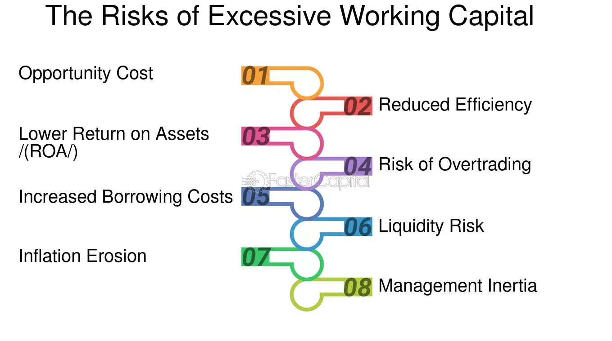

## Table of Contents

## What is working capital?

Working capital is the money a business has available to use for its day-to-day operations. It is calculated by subtracting a company's current liabilities from its current assets. Current assets include things like cash, inventory, and accounts receivable, while current liabilities are short-term debts and obligations that need to be paid within a year.

Having enough working capital is important because it helps a business run smoothly. If a company has too little working capital, it might struggle to pay its bills on time, buy inventory, or cover unexpected expenses. On the other hand, having too much working capital might mean the business is not using its money efficiently, as the extra funds could be invested to generate more profit.

## How is working capital calculated?

Working capital is calculated by taking a company's current assets and subtracting its current liabilities. Current assets are things the company owns that can be turned into cash within a year, like money in the bank, products they have in stock, and money that customers owe them. Current liabilities are what the company needs to pay within a year, like bills and short-term loans.

This calculation helps show if a company has enough money to keep running its day-to-day business. If the working capital is a positive number, it means the company has more assets than liabilities, which is good. If it's negative, it means the company might have trouble paying its bills on time.

## What does excessive working capital mean?

Excessive working capital means a business has too much money tied up in its daily operations. It's when a company has a lot more current assets than current liabilities, more than what is needed to run smoothly. This can happen if a business keeps too much cash, holds too much inventory, or gives too long a time for customers to pay their bills.

Having too much working capital isn't always a good thing. It means the business might not be using its money as well as it could. Instead of sitting in the bank or in extra stock, that money could be invested in growing the business or in other ways that could make more profit. So, while it's important to have enough working capital to cover daily needs, having too much can actually slow down the business's growth.

## What are the common causes of excessive working capital?

Excessive working capital often happens when a business holds onto too much cash. Instead of using the money to invest or grow, the business keeps it in the bank or uses it to buy more inventory than needed. This can happen if the company is too cautious and wants to have a big safety net, or if it's not sure how to best use the money for growth.

Another cause is when a business gives its customers too long to pay their bills. This means the company's money is tied up in accounts receivable for longer than necessary, which adds to the working capital. If the business isn't careful, this can lead to having more money sitting idle than is needed for daily operations.

Lastly, excessive working capital can also come from poor inventory management. If a business buys or makes more products than it can sell quickly, it ends up with too much stock. This extra inventory counts as a current asset and increases working capital, but it's not being used effectively to generate income.

## How can excessive working capital affect a company's liquidity?

Excessive working capital can actually make a company's liquidity worse, even though it might seem like having more money is a good thing. Liquidity is about how easily a company can turn its assets into cash to pay its bills. If a company has too much cash sitting in the bank or tied up in inventory, it might not be using that money to make more money. This means the company could miss out on opportunities to invest in things that could bring in more cash quickly.

For example, if a company keeps too much cash instead of investing it, it's not earning interest or other returns that could improve its liquidity. Also, if the company has too much inventory, it's not turning that inventory into sales and cash as quickly as it could. So, while having a lot of working capital might make it look like the company is financially healthy, it can actually make it harder for the company to be liquid and ready to handle its financial needs.

## What are the potential risks of holding too much working capital?

Holding too much working capital can lead to several problems for a business. One big risk is that the company might miss out on chances to grow. If a business keeps too much money in the bank or in inventory, it's not using that money to invest in new projects or expand. This can slow down the company's growth and stop it from making more profit.

Another risk is that having too much working capital can make a business less efficient. When a company has more money than it needs for daily operations, it might not be managing its resources well. For example, if a business gives customers too long to pay their bills, the money is tied up and not being used to make more money. Also, if the company holds too much inventory, it's not turning that inventory into sales and cash as quickly as it could. This can hurt the company's ability to respond to changes in the market or unexpected expenses.

## How does excessive working capital impact a company's profitability?

Excessive working capital can hurt a company's profitability because it means the business is not using its money in the best way. When a company holds onto too much cash, that money isn't being used to make more money through investments or growing the business. Instead of sitting in the bank, that cash could be used to buy new equipment, start new projects, or even pay down debts, all of which could help the company make more profit.

Also, if a business has too much working capital tied up in inventory, it's not turning that inventory into sales and cash quickly enough. This means the company might miss out on opportunities to sell more products and make more profit. Holding too much working capital can make a business less efficient and slow down its growth, which in the long run, can reduce the company's overall profitability.

## What are the implications of excessive working capital on investment opportunities?

Excessive working capital means a company has too much money sitting around instead of using it to make more money. When a company holds onto too much cash, it misses out on chances to invest that money in new projects or equipment that could help the business grow. If the company could have used that money to start a new product line or expand to new markets, it might have made more profit. But instead, the money just sits in the bank, not earning as much as it could.

Also, if a company has too much money tied up in things like inventory, it's not using that money to grab new investment opportunities. For example, if a business buys too much stock that doesn't sell quickly, it can't use that money to invest in something else that could bring in more cash. So, having too much working capital can make a company miss out on good chances to invest and grow, which in the long run can hurt its success.

## How can a company optimize its working capital to avoid excess?

A company can optimize its working capital by managing its cash flow better. This means making sure that money coming in from sales is used quickly and wisely. If a business gives customers a long time to pay, it might want to shorten that time so the money comes in faster. Also, the company can look at how much money it keeps in the bank and decide if some of it could be used to invest in new projects or equipment that could help the business grow.

Another way to avoid excess working capital is by managing inventory better. If a company has too much stock that isn't selling, it should try to sell it faster or buy less in the future. This way, the money tied up in inventory can be used for other things that could bring in more profit. By keeping just the right amount of inventory, a business can make sure it has enough to meet customer needs without holding onto too much.

Overall, optimizing working capital is about finding the right balance. A company needs enough money to run its day-to-day operations smoothly, but not so much that it misses out on chances to grow and make more profit. By keeping a close eye on cash flow and inventory, a business can use its working capital more effectively and avoid having too much money sitting idle.

## What strategies can be implemented to manage excessive working capital effectively?

One way to manage excessive working capital is by improving how a company handles its cash flow. This means making sure that money from sales is collected quickly and used wisely. If a business gives customers too long to pay, it can change its payment terms to get money faster. Also, the company should look at how much cash it keeps in the bank and see if some of it could be better used to invest in new projects or equipment that could help the business grow. By doing this, the company can make sure it has enough money for daily operations but not so much that it's missing out on chances to make more profit.

Another strategy is to manage inventory more effectively. If a company has too much stock that isn't selling, it should try to sell it faster or buy less in the future. This way, the money tied up in inventory can be used for other things that could bring in more profit. By keeping just the right amount of inventory, a business can make sure it has enough to meet customer needs without holding onto too much. This helps the company use its working capital better and avoid having too much money sitting idle.

Overall, managing excessive working capital effectively is about finding the right balance. A company needs enough money to run its day-to-day operations smoothly, but not so much that it misses out on chances to grow and make more profit. By keeping a close eye on cash flow and inventory, a business can use its working capital more effectively and make sure it's not holding onto more money than it needs.

## How does excessive working capital influence a company's financial ratios and performance metrics?

Excessive working capital can change a company's financial ratios and performance metrics in ways that might not seem good at first. For example, if a company has too much cash, its current ratio (which is current assets divided by current liabilities) will be very high. This might look like the company is in a strong financial position, but it could also mean the business is not using its money well. A high current ratio might make investors think the company is not growing or investing in new projects, which could affect the company's stock price and how investors see it.

Also, having too much working capital can make other performance metrics look off. For instance, the return on assets (ROA), which is net income divided by total assets, might be lower because the company has a lot of assets that aren't earning money. If a lot of money is tied up in inventory that isn't selling, the inventory turnover ratio (which shows how quickly inventory is sold and replaced) will be low. This can make the company look less efficient and might worry investors about how well the business is being run. So, while having a lot of working capital might seem good, it can actually make a company's financial health look worse in some ways.

## What are the long-term effects of excessive working capital on a company's growth and sustainability?

Having too much working capital can slow down a company's growth over time. When a business holds onto too much cash or has too much inventory, it's not using that money to invest in new projects or expand. This means the company might miss out on chances to start new product lines, enter new markets, or buy new equipment that could help it grow. If the company keeps too much money in the bank instead of using it to make more money, it might not be able to keep up with competitors who are using their money more wisely. This can make the company fall behind and lose out on long-term growth opportunities.

In the long run, excessive working capital can also affect a company's sustainability. If a business isn't efficient with its money, it might struggle to stay profitable. Holding onto too much cash or inventory can make the company less able to respond to changes in the market or handle unexpected expenses. Over time, this can make the business less stable and more at risk of financial trouble. To stay sustainable, a company needs to find the right balance of working capital so it can keep running smoothly but also invest in its future growth.

## What is Working Capital: Its Definition and Significance?

Working capital is a fundamental financial metric that indicates the short-term liquidity and operational efficiency of a business. It is calculated as the difference between a company's current assets and current liabilities:

$$
\text{Working Capital} = \text{Current Assets} - \text{Current Liabilities}
$$

Current assets typically include cash, accounts receivable, and inventory, whereas current liabilities consist of accounts payable and other short-term obligations. Effective management of working capital is essential for ensuring that a company can meet its short-term liabilities with short-term assets.

**Ensuring Liquidity**

Maintaining adequate liquidity is crucial for a company to continue its operations without interruption. Proper working capital management allows a business to meet its financial commitments on time, preventing operational disruptions. This involves ensuring sufficient cash reserves to handle unexpected expenses or fluctuations in revenue. Companies that excel in managing their working capital are better positioned to handle economic uncertainties and maintain operational stability.

**Optimizing Inventories**

Inventory management is a pivotal component of working capital management. By optimizing inventory levels, businesses can reduce holding costs and minimize the risk of obsolescence. This often involves employing techniques such as Just-In-Time (JIT) inventory systems, which aim to improve efficiency and reduce waste by receiving goods only as they are needed in the production process.

**Managing Accounts Receivables and Payables**

Efficient management of accounts receivables and payables is vital for maintaining liquidity. By minimizing the time it takes to collect payments from customers and strategically delaying payments to suppliers, companies can enhance their cash flow. Techniques such as offering incentives for early payment or renegotiating payment terms can be utilized to optimize these aspects of working capital.

**Cash Reserves and Investment in Growth**

Maintaining optimal cash reserves is crucial not only for liquidity but also for taking advantage of growth opportunities. Businesses must balance holding cash for emergencies and investing excess cash into projects that yield higher returns. A well-managed working capital strategy ensures that funds are readily available for both necessities and strategic investments that can drive growth.

In summary, effective working capital management enables businesses to maintain liquidity, optimize operational processes, and invest in growth opportunities, thereby ensuring financial health and strategic flexibility.

## References & Further Reading

Bergstra, J., Bardenet, R., Bengio, Y., & Kégl, B. (2011). "Algorithms for Hyper-Parameter Optimization" discusses methodologies for tuning hyper-parameters in machine learning models, which is crucial for optimizing algorithmic trading strategies.

Lopez de Prado, M. "Advances in Financial Machine Learning" provides a comprehensive exploration of mathematical and scientific approaches to financial data analysis and the development of automated trading systems. This work is instrumental for understanding the intricacies of implementing machine learning in trading.

Aronson, D. "Evidence-Based Technical Analysis" emphasizes a scientific approach to technical analysis using statistically valid methods. It provides a framework for evaluating the efficacy of trading strategies, including those used in algorithmic trading.

Jansen, S. "Machine Learning for Algorithmic Trading" offers practical insights into using machine learning techniques to design and deploy trading strategies. It covers a broad range of topics from predictive modeling to executing and managing risk in trading systems.

Chan, E. P. "Quantitative Trading" serves as a guide for developing systematic trading strategies from quantitative research methods. It is particularly useful for professionals aiming to develop strategies that are data-driven and rely on quantitative analysis.

