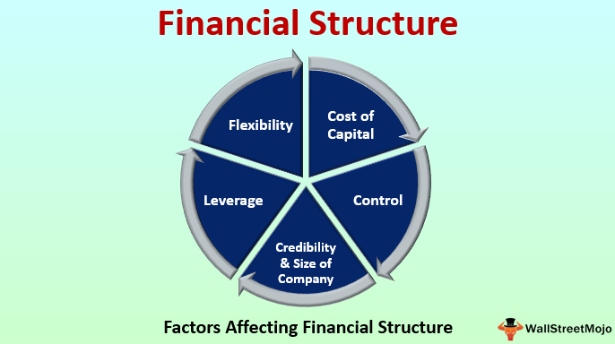

In today's rapidly evolving business landscape, effective financial management is essential for sustaining growth and ensuring stability. As businesses contend with dynamic market conditions, globalization, and technological advancement, maintaining sound financial strategies becomes increasingly critical. The integration of business finance, financial management, working capital, and algorithmic trading forms a comprehensive approach to achieving financial success.

Business finance provides the framework for acquiring and managing financial resources, aligning them with strategic objectives. It involves various activities such as capital investment, funding for operations, and asset management, which are critical for maintaining a company’s competitive position. Effective financial management involves the planning, organization, control, and monitoring of financial resources with the aim of achieving organizational goals. It encompasses budgeting, forecasting, monitoring financial performance, and aligning financial practices with company objectives to ensure long-term sustainability and adaptability in an ever-changing economic environment.



Working capital, representing the difference between a company's current assets and liabilities, is fundamental for supporting daily operational needs and sustaining business operations. Proper management of working capital ensures liquidity, enabling a business to meet short-term obligations and invest in opportunities for growth. This includes optimizing inventory levels, managing accounts receivables and payables, and maintaining adequate cash reserves to avert financial distress.

Algorithmic trading, a technological advance that utilizes computer programs to execute trades based on predefined criteria, revolutionizes financial markets by enhancing market liquidity and trading efficiency. It offers significant advantages such as emotion-free trading, faster execution, and the ability to process complex data through advanced algorithms and analytics. This systematic approach not only streamlines operations across financial markets but also introduces sophisticated strategies that improve decision-making based on empirical data.

The interconnection of these financial elements offers a robust framework for businesses looking to maintain a competitive edge. By leveraging the strengths of each component, companies can optimize resource allocation, enhance operational efficiency, and make informed decisions to sustain financial health. This holistic integration not only facilitates improved financial performance but also positions enterprises to capitalize on emerging market opportunities and technological advancements.

## Table of Contents

## Business Finance: An Overview

Business finance is centered around the acquisition and management of financial resources to meet a company's strategic objectives efficiently. It spans various activities, ensuring that a business maintains sufficient cash flow to fund its daily operations and invests strategically for future growth. Effective financial management within business finance is achieved through a comprehensive understanding and application of budgeting, forecasting, and performance analysis.

Budgeting serves as the backbone of financial planning, allowing businesses to allocate resources effectively. Through careful budget planning, companies can predict future financial conditions, thereby reducing risks and facilitating decision-making. Budgeting usually involves setting detailed financial goals and utilizing historical data to project future revenue and expenses. This proactive approach assists in eliminating inefficiencies and directing funds towards high-impact areas.

Forecasting complements budgeting by providing a forward-looking assessment of financial trends based on current and historical data. It involves analyzing market conditions, economic indicators, and internal metrics to predict future financial scenarios. Advanced computational tools and techniques, often supported by statistical software, are employed to create accurate financial forecasts. These forecasts enable businesses to adapt swiftly to market changes and make informed strategic decisions.

Performance analysis is another critical aspect, where financial data is evaluated to assess the efficiency and profitability of various business operations. Key performance indicators (KPIs) are established to measure critical success factors, and financial ratios such as the current ratio, debt-to-equity ratio, and return on equity (ROE) provide insights into a business's financial health. Regular performance analysis allows businesses to identify areas of improvement and apply corrective measures, ultimately enhancing operational efficiency.

Aligning financial strategies with company goals is essential for ensuring sustainability and adaptability in an ever-changing market. This involves not only managing current financial resources but also planning for long-term growth and stability. To achieve strategic alignment, businesses must assess their financial capacity against market opportunities and focus on investments that promise sustainable returns.

The management of business finance is therefore a dynamic process that requires a balanced approach to risk management and opportunity maximization. By systematically integrating budgeting, forecasting, and performance analysis, companies can create robust financial strategies that align with their overarching goals, ensuring both sustainability and adaptability in a competitive landscape.

## Financial Management: Objectives and Importance

Financial management plays a crucial role in guiding businesses to make strategic decisions that maximize their return on investment (ROI). At its core, financial management involves planning, organizing, directing, and controlling financial activities to efficiently and effectively manage an organization's financial resources. It aims to strike a balance between risk and profitability, ensuring financial stability while pursuing growth opportunities.

One primary focus of effective financial management is maintaining [liquidity](/wiki/liquidity-risk-premium). Liquidity management involves ensuring that a company has enough cash flow to meet its short-term obligations, thus avoiding insolvency. This requires careful cash flow analysis and forecasting, often using tools like cash flow statements and budget forecasts. Key liquidity ratios, such as the current ratio and quick ratio, are often used to measure and manage a company’s liquid assets relative to its liabilities.

Optimizing capital structure is another critical objective of financial management. The capital structure involves determining the optimal mix of debt and equity financing to minimize the cost of capital while maximizing firm value. The Modigliani-Miller theorem provides a framework, suggesting that in perfect markets without taxes, bankruptcy costs, and asymmetric information, the value of a firm is unaffected by its capital structure. However, real-world considerations such as tax advantages of debt (due to interest tax shields), bankruptcy costs, and agency costs must be accounted for in practice.

Enhancing profitability is essential for sustaining long-term business growth. Managers seek to improve profit margins and ROI through strategic pricing, cost control, and efficient resource allocation. Profitability ratios, such as net profit margin and return on assets (ROA), provide insights into operational efficiency and are integral to evaluating a company’s financial performance.

Effective financial management also empowers businesses to navigate market fluctuations and make informed investment decisions. In volatile markets, financial managers use risk management strategies including diversification, hedging, and insurance to mitigate financial risks. Investment appraisal techniques like Net Present Value (NPV), Internal Rate of Return (IRR), and payback period help in evaluating the profitability and risk of potential investments.

In summary, the objectives of financial management—maintaining liquidity, optimizing capital structure, and enhancing profitability—are pivotal for making strategic decisions that maximize a firm's ROI. By equipping businesses to navigate economic challenges and capitalize on opportunities, financial management drives organizational success and ensures long-term financial health.

## Working Capital: Definition and Significance

Working capital is a fundamental financial metric that indicates the short-term liquidity and operational efficiency of a business. It is calculated as the difference between a company's current assets and current liabilities:

$$
\text{Working Capital} = \text{Current Assets} - \text{Current Liabilities}
$$

Current assets typically include cash, accounts receivable, and inventory, whereas current liabilities consist of accounts payable and other short-term obligations. Effective management of working capital is essential for ensuring that a company can meet its short-term liabilities with short-term assets.

**Ensuring Liquidity**

Maintaining adequate liquidity is crucial for a company to continue its operations without interruption. Proper working capital management allows a business to meet its financial commitments on time, preventing operational disruptions. This involves ensuring sufficient cash reserves to handle unexpected expenses or fluctuations in revenue. Companies that excel in managing their working capital are better positioned to handle economic uncertainties and maintain operational stability.

**Optimizing Inventories**

Inventory management is a pivotal component of working capital management. By optimizing inventory levels, businesses can reduce holding costs and minimize the risk of obsolescence. This often involves employing techniques such as Just-In-Time (JIT) inventory systems, which aim to improve efficiency and reduce waste by receiving goods only as they are needed in the production process.

**Managing Accounts Receivables and Payables**

Efficient management of accounts receivables and payables is vital for maintaining liquidity. By minimizing the time it takes to collect payments from customers and strategically delaying payments to suppliers, companies can enhance their cash flow. Techniques such as offering incentives for early payment or renegotiating payment terms can be utilized to optimize these aspects of working capital.

**Cash Reserves and Investment in Growth**

Maintaining optimal cash reserves is crucial not only for liquidity but also for taking advantage of growth opportunities. Businesses must balance holding cash for emergencies and investing excess cash into projects that yield higher returns. A well-managed working capital strategy ensures that funds are readily available for both necessities and strategic investments that can drive growth.

In summary, effective working capital management enables businesses to maintain liquidity, optimize operational processes, and invest in growth opportunities, thereby ensuring financial health and strategic flexibility.

## Algorithmic Trading: Revolutionizing Financial Markets

Algorithmic trading, or algo trading, employs computer programs to execute trades based on specific, predetermined criteria. This method is notable for its ability to enhance market liquidity and enable efficient trading devoid of emotional interference. Through the use of complex algorithms and data analytics, [algorithmic trading](/wiki/algorithmic-trading) systems can process vast amounts of financial data at speeds unattainable by humans, thus facilitating swift and precise trading decisions.

One of the primary advantages of algorithmic trading is its contribution to market efficiency. This form of trading enables the rapid execution of orders, reducing the spread between the bid and ask prices, thereby lowering transaction costs for traders. Enhanced liquidity also means less price manipulation and fewer instances of substantial price jumps, contributing to a more stable marketplace.

Advanced algorithms are designed to identify patterns and opportunities in financial markets by analyzing historical data and market conditions. A simple example of an algorithm used in algo trading might be the Moving Average Crossover strategy, often employed in trading equities and futures. This strategy uses two moving averages: one calculated over a shorter time frame and the other over a longer period. In Python, such a strategy might look like this:

```python
import pandas as pd

# Assuming 'data' is a DataFrame with a 'Close' column
short_window = 40
long_window = 100

signals = pd.DataFrame(index=data.index)
signals['signal'] = 0.0

signals['short_mavg'] = data['Close'].rolling(window=short_window, min_periods=1, center=False).mean()
signals['long_mavg'] = data['Close'].rolling(window=long_window, min_periods=1, center=False).mean()

signals['signal'][short_window:] = np.where(signals['short_mavg'][short_window:] > signals['long_mavg'][short_window:], 1.0, 0.0)   
signals['positions'] = signals['signal'].diff()
```

The advantages of algorithmic trading extend beyond cost and speed. By eliminating emotional and cognitive biases from trading, algo trading promotes more rational decision-making based on data-driven insights rather than human instincts or emotions, which can often lead to poor trading decisions. Additionally, algorithmic systems operate continuously, scanning the market for trading opportunities and executing orders in milliseconds.

In summary, algorithmic trading is a pivotal innovation reshaping how transactions are conducted in financial markets. Its capacity to process data at high speeds and make accurate predictions gives traders a competitive edge, improving trading efficiency and contributing to the overall stability and liquidity of financial markets.

## Interconnection of Financial Elements

Understanding the interplay between business finance, financial management, working capital, and algorithmic trading is essential for optimizing a company's financial strategy. These components do not operate in isolation; rather, they interact in ways that can significantly enhance a firm's overall financial health and operational efficiency.

Algorithmic trading (algo trading) can greatly aid in managing working capital by ensuring efficient cash flow management. Through the use of complex algorithms and data analytics, algo trading allows companies to automate trading decisions based on market conditions, thus minimizing human error and emotional decision-making. This automation enables businesses to execute trades more efficiently, ensuring that cash flows are aligned with financial forecasts and working capital requirements. For instance, a company can set up algorithms to automatically reallocate funds between different investment opportunities based on real-time market data, optimizing both cash flow and investment returns.

Furthermore, algo trading enhances algorithmic decision-making capabilities, which can improve the accuracy and efficiency of financial operations. By integrating predictive analytics and [machine learning](/wiki/machine-learning) models, firms can forecast market trends and adjust their financial strategies accordingly. This predictive capability is crucial for aligning business finance strategies with anticipated market shifts, allowing for proactive rather than reactive financial management.

The integration of business finance, financial management, working capital, and algorithmic trading results in improved financial performance and trading accuracy. A cohesive system that uses real-time data and automated processes to manage financial operations can lead to more precise budgeting and forecasting. For instance, maintaining optimal levels of liquidity without over-committing resources becomes feasible with algorithms that predict cash needs based on historical data and market conditions.

By leveraging these interconnected elements, businesses are better equipped to allocate resources efficiently, manage risks, and ultimately maintain a competitive edge in financial markets. The synergy between traditional financial management practices and advanced algorithmic solutions offers a robust framework for sustaining growth and ensuring stability in a rapidly changing business environment.

## Benefits and Challenges

Integrating financial management and algorithmic trading yields substantial benefits, key among them being enhanced market execution accuracy and optimized cash flow management. Algorithmic trading leverages computer algorithms to make data-driven trading decisions rapidly and without the emotional biases inherent to human traders. This automation enhances the precision of market executions, ultimately leading to better investment outcomes. 

Moreover, the data-driven insights provided by algorithmic trading models can significantly improve a company's cash flow management. By analyzing historical data and real-time market trends, algorithms can forecast cash needs and allocate resources more efficiently, which optimizes working capital.

However, the integration of these financial strategies is not without its challenges. Market [volatility](/wiki/volatility-trading-strategies) represents a significant hurdle; rapid price swings can affect algorithmic strategies that rely on stable patterns. For example, an algorithm designed to predict stock trends might fail in a highly volatile market where prices fluctuate unpredictably.

Technological risks also pose a significant threat. Algorithmic trading systems are susceptible to glitches, cyber-attacks, and operational failures, which can result in substantial financial losses. In addition, developing and maintaining sophisticated algorithms requires a significant investment in technology and infrastructure.

Regulatory compliance adds another layer of complexity and challenge. As algorithmic trading grows, so does regulatory scrutiny. Firms must ensure that their practices adhere to stringent financial regulations, which can vary significantly across different jurisdictions. Meeting these regulatory requirements often requires continuous monitoring and adjustment of trading strategies.

To successfully integrate financial management with algorithmic trading, firms must engage in continuous refinement and strategic adaptation. This involves regularly updating algorithms to accommodate changing market conditions and regulatory environments. Incorporating machine learning techniques can also help algorithms adapt to new data patterns and improve their predictive accuracy over time.

A robust risk management framework is essential to address these challenges effectively. Firms should implement strategies to identify, assess, and mitigate risks, ensuring they can respond swiftly to market changes and technological threats. This might include simulated stress testing of algorithms or implementing real-time monitoring systems that alert traders to abnormal patterns.

By acknowledging and strategically addressing these challenges, firms can unlock the full potential of integrating financial management and algorithmic trading, positioning themselves to capitalize on emerging opportunities in the financial markets.

## Future Trends in Financial Management and Algorithmic Trading

AI and machine learning are playing pivotal roles in redefining financial management and algorithmic trading. These technologies enable the development of sophisticated algorithms that can learn from vast datasets, identify patterns, and make data-driven decisions in real-time. One of the prominent trends is the creation of personalized trading algorithms. These algorithms customize trading strategies to individual investor profiles by considering factors like risk tolerance, investment goals, and historical trading behavior. Personalized algorithms aim to enhance portfolio performance by adapting to specific investor needs and market conditions.

Predictive analytics is another emerging trend in financial management. This approach employs advanced statistical techniques and machine learning models to forecast market trends, asset prices, and economic indicators. By leveraging historical data and current market conditions, predictive analytics provides valuable insights that aid in strategic decision-making and risk management. Financial institutions are increasingly investing in technologies that enhance predictive capabilities to gain a competitive edge.

Enhanced transparency through explainable AI is also gaining traction. Explainable AI (XAI) ensures that AI and machine learning models are interpretable and understandable to human users. This transparency is crucial in financial sectors where regulatory compliance and accountability are priorities. With XAI, stakeholders can comprehend how algorithms reach decisions, fostering trust and ensuring that automated processes adhere to legal and ethical standards.

These advancements promise to revolutionize trading and financial operations by ensuring more efficient market transactions and informed decision-making processes. The integration of AI and machine learning into financial strategies not only enhances the accuracy of predictions and trades but also allows for greater adaptability to market changes. As these technologies continue to evolve, they are expected to further optimize resource allocation, minimize risks, and maximize returns on investment.

## Conclusion

Business finance, financial management, working capital, and algorithmic trading are foundational elements of contemporary business operations. These components collectively enable firms to achieve financial robustness and sustain a competitive edge. Business finance provides the necessary resources to implement strategic initiatives, while effective financial management ensures these resources are utilized optimally to maximize firm value.

Working capital management facilitates the smooth operation of daily activities, ensuring liquidity and the ability to meet short-term obligations, which is essential for operational continuity and growth. Algorithmic trading, meanwhile, offers a technological edge, allowing for precise, data-driven trading activities that enhance market efficiency and execution accuracy.

The integration of these elements allows businesses to optimize resource allocation, aligning financial practices with overarching strategic goals. This holistic approach enhances the adaptability and resilience of businesses in fluctuating market environments. By leveraging advancements in algorithmic trading, businesses can further refine decision-making processes, leading to more efficient capital deployment and risk management.

Ultimately, the strategic interplay between these components embeds agility within financial operations, fostering sustained competitive advantages in the ever-competitive financial landscape. This integration not only enhances operational efficiency but also positions businesses to better navigate the complexities of modern financial markets.

## References & Further Reading

Bergstra, J., Bardenet, R., Bengio, Y., & Kégl, B. (2011). "Algorithms for Hyper-Parameter Optimization" discusses methodologies for tuning hyper-parameters in machine learning models, which is crucial for optimizing algorithmic trading strategies.

Lopez de Prado, M. "Advances in Financial Machine Learning" provides a comprehensive exploration of mathematical and scientific approaches to financial data analysis and the development of automated trading systems. This work is instrumental for understanding the intricacies of implementing machine learning in trading.

Aronson, D. "Evidence-Based Technical Analysis" emphasizes a scientific approach to technical analysis using statistically valid methods. It provides a framework for evaluating the efficacy of trading strategies, including those used in algorithmic trading.

Jansen, S. "Machine Learning for Algorithmic Trading" offers practical insights into using machine learning techniques to design and deploy trading strategies. It covers a broad range of topics from predictive modeling to executing and managing risk in trading systems.

Chan, E. P. "Quantitative Trading" serves as a guide for developing systematic trading strategies from quantitative research methods. It is particularly useful for professionals aiming to develop strategies that are data-driven and rely on quantitative analysis.

