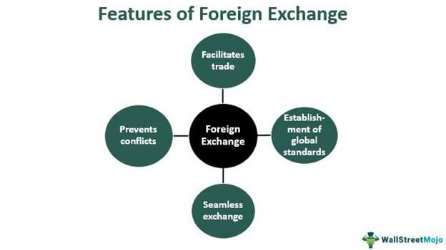

In recent years, the world of finance has undergone significant transformations, particularly within the realms of trade, commerce, and currency markets. These changes have largely been driven by technological advancements that have paved the way for more efficient, streamlined operations. A prominent development in this context is the rise of algorithmic trading, often referred to as algo trading. This method leverages computer algorithms to facilitate and execute trades based on predefined parameters. The primary advantages of algo trading include speed, precision, and the removal of human emotions from the trading process, which often lead to biases.

Algo trading marks a departure from traditional trading mechanisms, introducing a new era where decisions can be made faster and with a higher degree of accuracy. This transformation is particularly impactful in highly volatile markets such as currency trading, where seconds can significantly influence trading outcomes. By implementing precise algorithms, traders can optimize their strategies and exploit market inefficiencies with remarkable speed.



This article aims to unravel the complexities inherent in trade, commerce, and currency markets, with a focus on the emerging influence of algo trading. Throughout this exploration, we will highlight the numerous benefits offered by algorithmic systems in enhancing trading efficiency and accuracy. In addition, we will examine the various mechanisms through which algo trading is implemented and explore the challenges it presents, particularly those related to market stability and transparency.

Furthermore, we will address the significant regulatory considerations associated with algo trading. As the industry continues to evolve, regulatory frameworks strive to keep pace, ensuring that markets remain fair and investor interests are safeguarded. Understanding these regulations is crucial for traders to navigate the legal landscape effectively.

Lastly, we will explore the future trends anticipated in the domain of algo trading. With the continuous advancement of technology, including artificial intelligence and quantum computing, the potential for further innovation is vast. These developments promise to shape the future landscape of automated trading, enhancing capabilities and possibly redefining traditional market structures.

Through this comprehensive analysis, readers will gain insights into the profound influence and implications of algorithmic trading on the broader financial ecosystem.

## Table of Contents

## Trade and Commerce in the Digital Age

Trade and commerce have undergone profound transformations as they have moved from traditional face-to-face exchanges to sophisticated digital platforms and exchanges. This evolution has redefined how transactions are conducted across global markets. The notion of an "exchange" has transcended physical boundaries, giving rise to electronic trading environments where securities, futures, and currencies are traded with exceptional efficiency.

Electronic trading platforms facilitate real-time transactions, providing participants with immediate access to market data and trading capabilities. These platforms leverage advanced technology to match buyers and sellers, ensuring transparency and [liquidity](/wiki/liquidity-risk-premium) in the market. The rise of [algorithmic trading](/wiki/algorithmic-trading), supported by these digital infrastructures, further enhances the efficiency and speed of trade execution.

Digital marketplaces have proliferated with the advent of [cryptocurrency](/wiki/cryptocurrency) platforms, which have introduced new complexities and opportunities in the sphere of modern commerce. Cryptocurrencies, such as Bitcoin and Ethereum, have become prominent assets, attracting both institutional and retail investors. These digital assets are traded on specialized exchanges that operate globally, offering 24/7 market access.

The introduction of cryptocurrency exchanges has prompted significant regulatory responses, as traditional financial regulations are adapted to address the unique characteristics of digital assets. Regulatory frameworks are continually evolving to ensure consumer protection, market integrity, and prevention of illicit activities in cryptocurrency trading. Authorities worldwide, such as the U.S. Securities and Exchange Commission (SEC) and the European Securities and Markets Authority (ESMA), are active in shaping the regulatory landscape for these emerging markets.

The shift to

## Currency Markets and Algorithmic Trading

Forex and currency trading are integral to the global financial system, with the foreign exchange market being the largest and most liquid market globally, accounting for over $6 trillion in daily trading [volume](/wiki/volume-trading-strategy) as of 2021 [1]. This high liquidity and market size have fostered the emergence of algorithmic trading, which has transformed currency markets by enhancing the precision and speed of trade execution, reducing transaction costs, and minimizing human error.

The emergence of algorithmic trading in currency markets allows traders to exploit even minute price fluctuations swiftly and accurately. Automated systems can operate around the clock, reacting instantly to market changes based on predefined criteria, without the delays associated with manual trading. This capability becomes particularly advantageous in a market such as [forex](/wiki/forex-system), where the continuous global operation from Sunday evening to Friday night across different time zones necessitates real-time responsiveness.

Popular algorithmic trading strategies employed in currency markets include [arbitrage](/wiki/arbitrage), [trend following](/wiki/trend-following), and sentiment analysis:

1. **Arbitrage** involves exploiting price discrepancies between different markets or instruments. For instance, currency arbitrage could involve buying a currency cheaply in one market and selling it at a higher price in another. Algorithmic systems can detect and execute these opportunities at speeds not possible for human traders.

2. **Trend following** strategies are designed to capitalize on market movements by identifying and riding established trends. Algorithms can be programmed to recognize specific patterns or signals that indicate the start or continuation of a trend, entering or exiting trades based on these signals. This strategy often relies on technical indicators and historical price data to forecast future movements.

3. **Sentiment analysis** uses natural language processing and machine learning to assess market sentiment from news, social media, and other sources. By analyzing language patterns and frequency of certain keywords, trading algorithms can gauge the market's mood and predict possible price movements.

Technological advancements underpinning algorithmic trading have been pivotal in refining these strategies. High-speed data processing and low-latency networks enable the rapid execution of trades. Co-location services, where trading systems are physically located near exchange servers, further reduce latency, giving traders a competitive advantage in executing trades milliseconds faster than others. Python, a favored programming language in algorithmic trading, can be used to implement these strategies efficiently due to its robust libraries like NumPy, pandas, and scikit-learn, which facilitate data analysis and [machine learning](/wiki/machine-learning).

```python
import pandas as pd
from sklearn.linear_model import LinearRegression

# Example: A simple trend following strategy using Linear Regression for price prediction
# Load currency price data
data = pd.read_csv('currency_prices.csv')
X = data['time'].values.reshape(-1,1)  # Time as independent variable
y = data['price'].values  # Price as dependent variable

# Fit linear regression model
model = LinearRegression()
model.fit(X, y)

# Predict future price
future_time = [[timestamp]]  # replace with future timestamps
predicted_price = model.predict(future_time)
print(f"Predicted Future Price: {predicted_price}")
```

The widespread adoption of algorithmic trading in currency markets has introduced considerations regarding market stability and transparency. The rapid pace and high volume of computerized trades can sometimes exacerbate [volatility](/wiki/volatility-trading-strategies), as witnessed during the 2010 "Flash Crash" [2]. Additionally, the opacity of certain algorithmic strategies, such as those employing complex derivatives without adequate disclosure, has prompted calls for greater transparency and regulatory oversight. It becomes crucial for regulators to strike a balance by enhancing oversight without stifling innovation and efficiency brought about by algorithmic trading.

---

[1] Bank for International Settlements (BIS) - Triennial Central Bank Survey of FX and OTC derivatives markets
[2] SEC and CFTC Report on the Market Events of May 6, 2010

## The Mechanics of Algorithmic Trading

Algorithmic trading integrates complex mathematical models and computer algorithms to automate trading strategies, revolutionizing the efficiency and precision of executing trades. At its core, this method depends on several key components: pre-set trading criteria, high-speed data access, and minimal latency. These elements collectively ensure transactions occur swiftly and advantageously, capitalizing on minuscule market movements.

Pre-set trading criteria form the backbone of algorithmic strategies, dictating when and how trades are executed. These criteria often incorporate mathematical models, which can range from simple moving averages to more sophisticated statistical methods. For instance, a basic algorithm might execute a buy order when a short-term moving average surpasses a long-term moving average.

Access to high-speed data is another critical component, allowing algorithms to process vast amounts of information in real-time. This rapid data processing powers algorithms with the ability to respond to market fluctuations instantaneously. Latency, or the delay between when data is received and when a trade is executed, is minimized through cutting-edge technological infrastructure. Co-location of servers, where trading firms place their servers in close proximity to exchange servers, significantly reduces latency—often to millionths of a second—thereby enhancing trading efficiency.

Technological infrastructure underpins the effectiveness of algorithmic trading, emphasizing the importance of both software and hardware innovation. Efficient algo trading systems necessitate robust data processing capabilities and fast, reliable internet connections to ensure timely access to market data. Additionally, server co-location remains a strategic advantage, lowering the physical distance and thus the time it takes for data to travel between servers.

A distinct characteristic of algorithmic trading is its reliance on logic and pre-established rules, excluding emotional bias. Human emotion can often lead to irrational decision-making in trading, but algorithms eliminate this risk by following a strictly logical approach. This precision and consistency mean trades are executed under the same conditions every time, aligning with the algorithm's programmed rules without deviation.

Within algorithmic trading, various strategies are employed, including high-frequency trading ([HFT](/wiki/high-frequency-trading-strategies)), [market making](/wiki/market-making), and [statistical arbitrage](/wiki/statistical-arbitrage). High-frequency trading involves executing a high volume of trades at extremely fast speeds, leveraging the small price inefficiencies that may arise over brief periods. Market making provides liquidity to the markets by continuously offering buy and sell quotes, whereas statistical arbitrage involves taking advantage of price differentials between related securities, identifying patterns over time through statistical models.

To illustrate a simple algorithmic trading strategy, consider the following Python code implementing a moving average crossover:

```python
import numpy as np
import pandas as pd

def moving_average_crossover(data, short_window=40, long_window=100):
    signals = pd.DataFrame(index=data.index)
    signals['price'] = data['Adj Close']
    signals['short_mavg'] = data['Adj Close'].rolling(window=short_window, min_periods=1, center=False).mean()
    signals['long_mavg'] = data['Adj Close'].rolling(window=long_window, min_periods=1, center=False).mean()
    signals['signal'] = 0.0
    signals['signal'][short_window:] = np.where(signals['short_mavg'][short_window:] > signals['long_mavg'][short_window:], 1.0, 0.0)
    signals['positions'] = signals['signal'].diff()
    return signals
```

This script calculates short- and long-term moving averages of stock prices and generates buy signals when the short-term average crosses above the long-term average. Such algorithms are continuously improved by integrating more sophisticated statistical analyses and financial models, reflecting the ongoing evolution and complexity within algorithmic trading.

## Regulatory Considerations in Algorithmic Trading

The rapid rise of algorithmic trading has provoked significant interest and concern among regulatory bodies worldwide. The primary focus of these regulations is to ensure market stability, fairness, and the protection of investors in an environment dominated by high-speed and automated trading. Regulatory frameworks are essential to prevent issues such as market manipulation, systemic risk, and unethical use of algorithms from undermining the integrity of financial markets.

Various regulatory bodies, including the Securities and Exchange Commission (SEC) in the United States and the European Securities and Markets Authority (ESMA) in Europe, have established specific rules to address these concerns. For instance, they require trading firms to implement risk management procedures, maintain audit trails for algorithmic strategies, and ensure robust testing of algorithms before deployment. Such measures are designed to mitigate the risks associated with flash crashes and other unintended market disruptions that can occur due to automated trading errors.

One crucial aspect of these regulations is the emphasis on transparency and fair access. Regulators strive to create level playing fields by mandating disclosure of algorithmic trading activities and preventing any unfair advantages that could arise from co-location or high-frequency trading practices. Moreover, the ethical use of trading algorithms is under scrutiny, with guidelines stressing the need for algorithms to operate in ways that do not exploit market inefficiencies maliciously or harm other market participants.

As technology and trading practices continue to evolve, regulatory bodies are continually adapting their guidelines. They conduct regular consultations with industry stakeholders to keep the regulations relevant and effective. For example, the introduction of machine learning and [artificial intelligence](/wiki/ai-artificial-intelligence) in trading strategies presents new challenges that require ongoing evaluation and possibly revised regulatory measures to address potential biases or ethical concerns.

Traders engaging in algorithmic trading must ensure compliance with these evolving regulatory standards to avoid facing legal repercussions. Compliance involves not only adhering to existing rules but also staying informed about changes and updates in regulatory policies. It may also include investing in compliance technologies and resources to monitor trading activities and ensure they align with both legal requirements and ethical standards.

In summary, while algorithmic trading has transformed financial markets, it necessitates a robust regulatory framework to safeguard market integrity and protect the interests of all participants. These regulations are critical in maintaining a delicate balance between fostering innovation and preventing market abuses.

## Future Trends in Algo Trading

Algorithmic trading is on the brink of significant evolutionary leaps, driven by technological advancements, particularly in quantum computing, artificial intelligence (AI), and machine learning. These technologies promise to enhance the efficiency and sophistication of trading strategies.

AI and machine learning are increasingly central to developing complex trading algorithms. By leveraging large datasets and pattern recognition capabilities, machine learning can uncover insights that were previously inaccessible. This allows for the development of adaptive models that refine strategies in real-time, incorporating new data inputs dynamically. For instance, [reinforcement learning](/wiki/reinforcement-learning), a subset of machine learning, can be applied to optimize trading strategies by learning from the consequences of previous actions to make better-informed decisions. 

Quantum computing, although still in its nascent stage, holds the potential to revolutionize algorithmic trading. By processing an astronomical number of calculations simultaneously, quantum computers can solve complex optimization problems faster than classical computers. This capability is particularly valuable in derivative pricing, risk management, and portfolio optimization. As quantum computing becomes more accessible, its integration into trading systems could dramatically alter market dynamics.

Blockchain technology is creating opportunities for more transparent and decentralized trading platforms. The inherent security and immutability of blockchain can lead to more reliable and efficient trade settlements, reducing the potential for fraud and manipulation. Decentralized platforms could transform traditional market structures by providing equal access to market information and reducing reliance on centralized exchanges.

Enhanced data analytics will be critical for maintaining competitive advantages as algo trading proliferates. Traders will need to process vast amounts of data rapidly to identify trends and anomalies. Advanced analytics tools and platforms that support high-speed data processing will become invaluable assets for traders seeking real-time decision support systems.

The regulatory landscape will continue to evolve alongside these technological shifts, playing a crucial role in shaping the future of algorithmic trading. Regulatory bodies will aim to balance innovation with market integrity and investor protection. This will likely involve establishing guidelines for the ethical use of trading algorithms, ensuring transparency, and mitigating systemic risks. Traders must remain vigilant to comply with changing regulations, which will be essential for sustaining market participation and avoiding potential penalties.

In summary, the trajectory of algorithmic trading is intricately linked to technological progress and regulatory adaptation. The interplay between innovation and regulation will define the future of financial markets, highlighting the need for continuous learning and adaptation by market participants.

## Conclusion

Algorithmic trading has fundamentally transformed the landscape of trade, commerce, and currency markets by infusing them with unparalleled speed, precision, and efficiency. The deployment of computer algorithms for executing trades based on meticulously predefined criteria has enabled market participants to swiftly capitalize on fleeting opportunities that manual trading could scarcely capture. This automated approach reduces the potential for human error and emotional bias, ensuring that trades are driven by data and strategic logic.

The benefits of algorithmic trading are evident, yet they are counterbalanced by significant challenges that must not be underestimated. Market stability remains a paramount concern, as the rapid nature of algo trading can exacerbate volatility or engender systemic risks, evidenced by past market anomalies such as flash crashes. Additionally, the rapid evolution of technology continually tests regulators' ability to craft and enforce guidelines that ensure fairness, transparency, and investor protection in these fast-paced markets.

Looking ahead, staying abreast of technological trends and evolving regulatory frameworks will be essential for traders and market institutions. As machine learning and artificial intelligence further integrate into trading algorithms, they promise to enhance predictive capabilities and strategy development, albeit with new layers of complexity and ethical considerations. Concurrently, advancements in blockchain technology hint at the potential for reshaping traditional market dynamics by introducing decentralized trading platforms.

Algo trading thus embodies both promise and responsibility. It requires traders to not only innovate continuously but also maintain strict adherence to ethical and regulatory standards. This balance is crucial to sustaining investor confidence and ensuring a stable market environment. As such, the ongoing interplay between technological advancement and regulatory oversight will continue to shape the domain of trade, commerce, and currency markets. The dynamic evolution of algorithmic trading will persist as a defining force, demanding vigilance, and adaptation from all market stakeholders.

## References & Further Reading

[1]: Bartram, S. M., & Brown, G. W. (2007). ["Risk management in the foreign exchange market."](https://www.jstor.org/stable/23018425) Journal of International Money and Finance, 26(8), 1347-1380.

[2]: Aldridge, I. (2013). ["High-Frequency Trading: A Practical Guide to Algorithmic Strategies and Trading Systems"](https://books.google.com/books/about/High_Frequency_Trading.html?id=6l0DDQAAQBAJ). Wiley.

[3]: Chan, E. (2013). ["Algorithmic Trading: Winning Strategies and Their Rationale"](https://github.com/ftvision/quant_trading_echan_book). Wiley.

[4]: Bank for International Settlements (BIS) - ["Triennial Central Bank Survey of FX and OTC derivatives markets"](https://www.bis.org/statistics/rpfx22.htm).

[5]: Securities and Exchange Commission and Commodity Futures Trading Commission (2010). ["Preliminary Findings Regarding the Market Events of May 6, 2010."](https://www.sec.gov/news/studies/2010/marketevents-report.pdf)