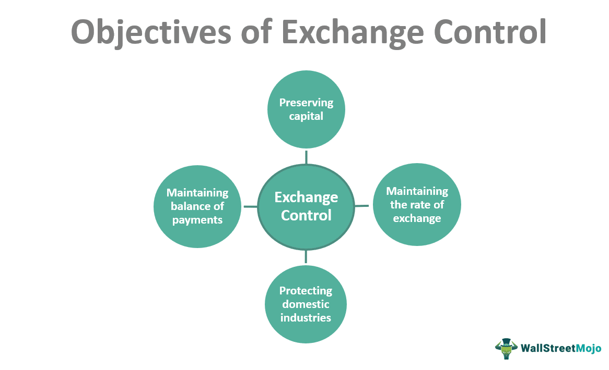

## Table of Contents

## What are exchange controls and why are they implemented by governments?

Exchange controls are rules that governments use to limit how much money can move in and out of their country. These rules can include limits on how much money people can take out of the country, restrictions on buying foreign currency, and controls on how much money businesses can send abroad. Governments use exchange controls to manage their economy and protect their currency from becoming too weak or too strong.

Governments implement exchange controls for several reasons. One main reason is to keep their currency stable. If too much money leaves the country, the value of the currency can drop quickly, which can cause economic problems. By controlling the flow of money, governments can prevent this from happening. Another reason is to protect their foreign reserves, which are important for paying for imports and managing the country's debts. Exchange controls help make sure that there is enough money in the country to cover these needs.

## How do exchange controls impact businesses operating internationally?

Exchange controls can make it harder for businesses that work in different countries. When a government sets limits on how much money can leave the country, it can slow down a business's ability to pay for things they need from other countries. For example, a company might have to wait longer to buy parts or materials from abroad, which can delay their work and make it more expensive. Also, if a business wants to send money back to its home country, exchange controls might stop them or make it take longer, which can mess up their plans and budgets.

On the other hand, exchange controls can also help businesses in some ways. If the controls keep the country's currency stable, it can make it easier for businesses to plan and predict costs. A stable currency means that the price of things doesn't change too much, which can be good for businesses that need to buy or sell things in different countries. However, even with these benefits, exchange controls often make international business more complicated and can lead to more rules and paperwork that businesses have to deal with.

## What are the basic strategies corporations use to evade exchange controls?

Corporations sometimes find ways to get around exchange controls because these rules can make it hard for them to do business across borders. One common way they do this is by using transfer pricing. This means they set prices for goods or services traded between different parts of their own company in different countries. By making these prices higher or lower than usual, they can move money out of a country without it looking like they are sending money abroad. Another way is by using leads and lags in payments. This means they can speed up or slow down payments to other countries to move money when it's easier or more helpful for them.

Another strategy is setting up shell companies in countries with fewer exchange controls. These shell companies can then handle transactions that would be restricted in the home country. This way, the money can move more freely. Corporations might also use over-invoicing or under-invoicing, where they change the price on invoices to move money in or out of a country. For example, if they want to get money out, they might over-invoice for goods they import, paying more than the goods are worth, and then get that extra money back later. These strategies help corporations manage their money better, but they can also be risky and sometimes illegal if not done carefully.

## Can you explain the difference between legal and illegal evasion strategies?

Legal evasion strategies are ways that businesses use to get around exchange controls without breaking any laws. For example, a company might use transfer pricing, which means they set prices for goods or services they trade between their own branches in different countries. As long as these prices are fair and follow the rules set by tax authorities, it's okay. Another legal way is to use leads and lags in payments, which means they can pay for things a bit earlier or later to move money when it's easier for them. These strategies help businesses manage their money better within the rules.

Illegal evasion strategies, on the other hand, break the law. For instance, setting up shell companies in countries with fewer rules to move money can be illegal if it's done to hide money or avoid taxes. Another illegal way is over-invoicing or under-invoicing, where a company changes the price on invoices to move money out of a country. If they over-invoice for goods they import, paying more than the goods are worth, and then get that extra money back later, that's against the law. These strategies can get businesses into big trouble if they're caught, so they need to be very careful.

## What are the common legal loopholes that corporations exploit to bypass exchange controls?

Corporations often use transfer pricing to get around exchange controls legally. This means they set prices for goods or services they trade between their own branches in different countries. If they do this carefully and follow the rules set by tax authorities, it's okay. For example, if a company in one country sells parts to its branch in another country, they can set the price in a way that helps move money where they need it. This helps them manage their money better without breaking any laws.

Another way corporations legally bypass exchange controls is by using leads and lags in payments. This means they can pay for things a bit earlier or later to move money when it's easier for them. If a company knows that exchange controls might get stricter soon, they might pay their bills in another country a bit earlier to get the money out before the rules change. This strategy helps them keep their cash flow smooth and avoid getting stuck with money in a country where they can't use it easily.

## How do multinational corporations structure their operations to minimize the impact of exchange controls?

Multinational corporations often set up their businesses in a way that helps them deal with exchange controls. They do this by making sure they have branches in different countries, especially in places where the rules about moving money are not so strict. This way, they can move money around more easily. For example, they might have a main office in a country with fewer controls, and this office can handle payments and transactions for other parts of the company. By doing this, they can keep their money flowing smoothly and avoid getting stuck with money in a country where they can't use it easily.

Another way they structure their operations is by using something called transfer pricing. This means they set prices for goods or services that they trade between their own branches in different countries. If they do this carefully and follow the rules, it's okay. They can set the price in a way that helps move money where they need it. This helps them manage their money better and avoid the problems that exchange controls can cause. By setting up their business this way, multinational corporations can keep their money moving and their operations running smoothly, even when there are strict rules about moving money.

## What role do offshore financial centers play in corporate evasion strategies?

Offshore financial centers are places where companies can move their money to avoid strict rules in their home countries. These centers have fewer rules about moving money, so businesses can set up offices there to handle their money. This helps them get around exchange controls because they can move money through these centers without many restrictions. For example, a company might send money to an offshore center and then use it to pay for things in other countries, making it easier to manage their money.

Using offshore financial centers can also help companies save on taxes. By moving money to these places, companies can pay less tax on their earnings. This is because offshore centers often have lower tax rates or special rules that let companies keep more of their money. However, companies need to be careful because using these centers can sometimes be seen as trying to avoid taxes or break the law. If they don't follow the rules carefully, they could get into trouble.

## How have technological advancements facilitated new methods of evading exchange controls?

Technological advancements have made it easier for companies to get around exchange controls. One way this happens is through the use of digital currencies like Bitcoin. These currencies can move across borders without being tracked by governments, which makes it harder for them to control the flow of money. Companies can use digital wallets to send and receive payments in cryptocurrencies, which can then be changed back into regular money in another country. This helps them move money out of countries with strict controls without anyone knowing.

Another way technology helps is through online banking and payment platforms. These platforms let companies make payments and move money quickly and easily, even across different countries. They can use these services to speed up or slow down payments, which can help them get around exchange controls. For example, a company might use an online payment service to pay a bill in another country before new rules come into effect. This way, they can keep their money flowing smoothly and avoid getting stuck with money in a country where they can't use it easily.

## What are the potential risks and penalties for corporations caught evading exchange controls?

When corporations get caught trying to get around exchange controls, they can face big problems. Governments might fine them a lot of money. These fines can be so big that they hurt the company's money a lot. Sometimes, the people in charge of the company can even go to jail. This can make it hard for the company to keep doing business because it loses trust and might have trouble finding people to work with them.

Another risk is that the company's reputation can get hurt. If people find out that a company was trying to break the rules, they might not want to do business with them anymore. This can make it hard for the company to sell things or get money from other companies. Also, if a company breaks the law in one country, other countries might start watching them more closely, which can make it even harder to do business around the world.

## How do governments and international bodies attempt to curb corporate evasion of exchange controls?

Governments and international bodies work hard to stop companies from getting around exchange controls. They make strict rules about how much money can move in and out of their country. They also watch companies closely to make sure they follow these rules. Governments might ask companies to report how much money they are moving and where it is going. If a company does something wrong, the government can fine them a lot of money or even put people in jail. This makes companies think twice before trying to break the rules.

International bodies like the International Monetary Fund (IMF) and the Organisation for Economic Co-operation and Development (OECD) help too. They make rules that many countries agree to follow. These rules can make it harder for companies to move money to places with fewer rules. The international bodies also share information about what companies are doing, so it's harder for them to hide money. By working together, governments and international bodies can make it tougher for companies to get around exchange controls.

## What case studies illustrate successful and failed attempts at evading exchange controls?

One successful case of evading exchange controls happened with a company called Glencore. They used to move money out of Argentina in the early 2000s. Argentina had strict rules about moving money out of the country. But Glencore found a way around it. They used a trick called over-invoicing. They would pay more for things they bought from other countries than they were really worth. This let them move money out of Argentina without anyone noticing. They did this for a long time and made a lot of money before they got caught. When they were found out, they had to pay a big fine, but they still made a lot of money from it.

A failed attempt to evade exchange controls happened with a company called Abacha. They tried to move money out of Nigeria in the 1990s. Nigeria had very strict rules about moving money out of the country. Abacha tried to use a shell company in a different country to move the money. But the Nigerian government found out and stopped them. The people in charge of Abacha got into big trouble. They were fined a lot of money and some even went to jail. This shows that trying to break the rules can lead to big problems.

These cases show that while some companies can get around exchange controls for a while, it's risky. Governments are always watching and can catch companies that break the rules. The fines and other punishments can be very bad for the companies and the people who run them.

## What are the future trends and potential reforms in the regulation of exchange controls and evasion strategies?

In the future, governments might make their rules about moving money even stricter. They might use new technology to watch companies more closely. For example, they could use computers to track money moving around the world and catch companies that try to break the rules. Countries might also work together more to share information about what companies are doing. This would make it harder for companies to hide money in other countries. Governments might also make the punishments for breaking the rules even tougher, like bigger fines or more jail time, to stop companies from trying to get around exchange controls.

There could also be changes in how companies move money. More companies might start using digital currencies like Bitcoin to get around the rules. But governments might make new rules about digital money to stop this. Another big change might be that companies start doing more business in countries with fewer rules about moving money. This way, they can move money more easily. But if too many companies do this, governments might make new rules to stop it. Overall, the future of exchange controls will be about a tug-of-war between governments trying to control money and companies trying to move it freely.

## References & Further Reading

[1]: [Bekaert, G., & Harvey, C. R. (1998). "Capital flows and the behavior of emerging market equity returns."](https://www.nber.org/papers/w6669) Journal of Applied Corporate Finance, 12(3), 285-310.

[2]: ["International Finance and Exchange Rates"](https://online.mason.wm.edu/blog/international-finance-exchange-rates-trade-balances-international-financial-markets) by Maurice Obstfeld and Kenneth Rogoff

[3]: ["Managing Currency Risk: Using Financial Derivatives"](https://www.wiley.com/en-us/Managing+Currency+Risk%3A+Using+Financial+Derivatives-p-9780470848081) by John J. Stephens

[4]: ["Algorithmic and High-Frequency Trading"](https://www.amazon.com/Algorithmic-High-Frequency-Trading-Mathematics-Finance/dp/1107091144) by Alvaro Cartea, Sebastian Jaimungal, and José Penalva

[5]: Basu, S., & Fernald, J. (2001). ["Why is Productivity Procyclical? Why Do We Care?"](https://www.nber.org/system/files/chapters/c10128/c10128.pdf) National Bureau of Economic Research Working Paper No. 7940.

[6]: ["Risk Management and Financial Institutions"](https://www.amazon.com/Management-Financial-Institutions-Wiley-Finance/dp/1119932483) by John C. Hull

[7]: Securities and Exchange Commission. (2010). ["Concept Release on Equity Market Structure."](https://www.sec.gov/rules-regulations/2010/01/concept-release-equity-market-structure)