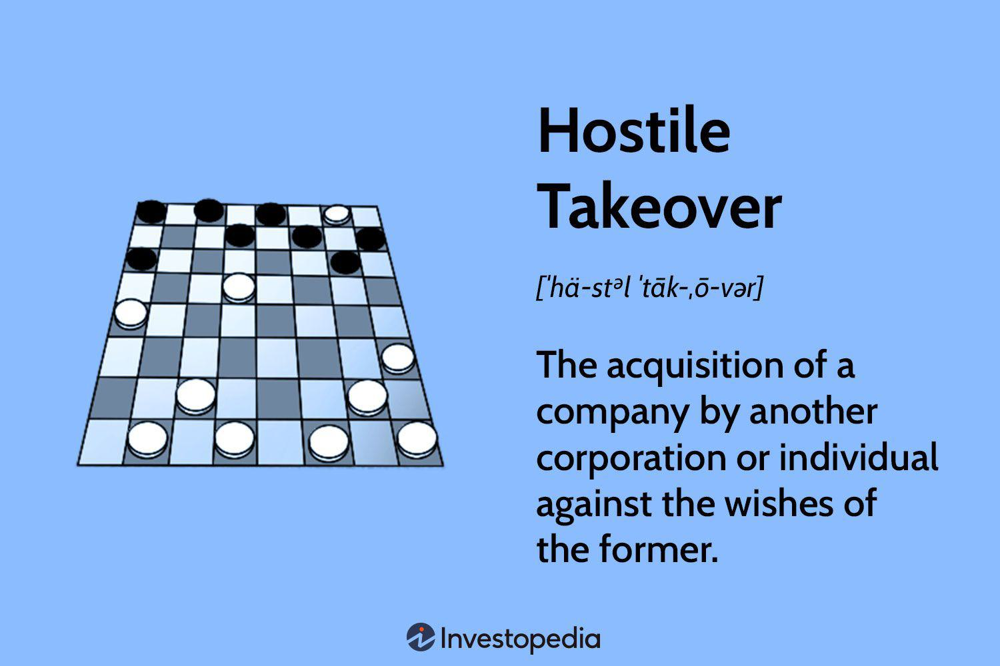

In today’s interconnected global economy, currency regulation, corporate finance exchange controls, and algorithmic trading are integral components that significantly impact the financial landscape. These elements collectively influence how nations, corporations, and investors conduct their financial activities, aiming to achieve stability, efficiency, and profitability.

Currency regulation is pivotal for maintaining a country's economic stability. By managing and stabilizing exchange rates, governments can prevent excessive currency fluctuations that might adversely affect international trade and economic growth. Exchange controls, a subset of currency regulation, serve as tools to manage the flow of foreign capital, ensuring that the nation's financial security remains intact. Such controls can restrict the amount of foreign currency that domestic businesses can access, impacting their ability to engage in international transactions and making it crucial for corporate finance strategies.



Corporate finance relies heavily on understanding and navigating exchange controls. These controls can dictate the feasibility and profitability of multinational operations and investments. By analyzing the influence of exchange regulations on cross-border business activities, corporate financial planners can develop strategies that optimize capital allocation and mitigate risks associated with currency volatility.

Algorithmic trading represents a modern advancement in financial markets, utilizing sophisticated computer algorithms to execute trades at unprecedented speeds and efficiency. This trading method leverages big data and machine learning to make informed decisions that were once reliant on human traders. However, the rapid pace and volume of transactions driven by algorithmic trading require robust regulatory frameworks to ensure market stability and fairness.

The interplay between these components shapes investment strategies and economic policies while managing financial risks. Successful navigation and integration of currency regulations, corporate finance exchange controls, and algorithmic trading are essential for stakeholders aiming to thrive in a competitive financial environment. Understanding these dynamics enables businesses and governments to implement policies that foster economic growth and resilience in the face of global financial challenges.

## Table of Contents

## Understanding Currency Regulation

Currency regulation encompasses governmental measures designed to manage and stabilize a nation's currency value. These regulations are pivotal in maintaining economic stability and reducing excessive currency volatility, which can negatively affect international trade. Governments implement various mechanisms to control currency fluctuations and protect their economies from the adverse impacts of volatile exchange rates.

Currency regulations often involve exchange controls, which limit the [volume](/wiki/volume-trading-strategy) of foreign currency that local entities can purchase or sell. Through such measures, countries can influence the demand and supply dynamics of their currency in the international markets, thereby affecting its value. For example, a government might impose limits on how much foreign currency individuals or businesses can transfer abroad, reducing the potential for large capital outflows that could devalue the domestic currency.

These exchange controls can take the form of quota systems, licensing requirements, or outright prohibitions on certain transactions. By managing the cross-border flow of capital, countries aim to prevent destabilizing capital flight and speculative attacks on their currency. This approach has been particularly significant for emerging economies, which are more susceptible to abrupt shifts in investor sentiment and speculative pressures.

The overarching goal of currency regulation is to achieve a stable economic environment that supports sustainable growth, balances trade, and ensures that necessary imports and exports can occur without undue disruption. A balanced and stable currency value helps bolster investor confidence and facilitate long-term planning for businesses engaged in international trade.

In summary, currency regulation serves as a tool for governments to maintain economic equilibrium and safeguard their financial systems against external and internal shocks. By controlling the conditions under which currency can be exchanged, countries strive to prevent harmful fluctuations and ensure a predictable economic climate that is conducive to growth and development.

## Corporate Finance and Exchange Controls

Exchange controls, as regulatory measures, are enacted by countries to manage foreign capital flows in and out of their economies. These regulations are pivotal for economic stabilization, particularly in times of economic turbulence or crisis. By exerting control over the volume and nature of foreign currencies traded, nations can shield their economies from volatile capital movements, mitigate risks associated with foreign exchange depreciation, and maintain balance of payments stability.

The impact of exchange controls on corporate finance is multifaceted. Primarily, these controls influence how companies formulate their financial strategies, particularly those with international operations. For instance, restrictions on the repatriation of profits can constrain a corporation's ability to transfer capital across borders, necessitating a strategic reevaluation of investment and operational decisions. Exchange controls may also lead companies to reconsider their financing options, as limitations on borrowing in foreign currencies could influence a firm’s capital structure and funding strategies.

In the context of international business operations, exchange controls can serve as both a barrier and a stimulus for investment. On one hand, stringent controls may deter foreign direct investment (FDI) due to anticipated difficulties in capital mobility and the increased financial risk of operating within a regulated currency environment. On the other hand, some emerging markets have implemented exchange controls to moderate currency [volatility](/wiki/volatility-trading-strategies), thereby providing a more predictable financial environment that could attract long-term investors.

Case studies from emerging markets illustrate the tangible effects of exchange controls on corporate finance. During the Argentine economic crisis of the early 2000s, the government imposed strict exchange controls to prevent capital flight. This had significant implications for both foreign and local companies, forcing them to adjust their financial operations and strategies. In contrast, China's managed exchange rate regime and capital control policies have allowed it to maintain macroeconomic stability, stimulating foreign investment while protecting its currency from speculative attacks.

By shaping the flow of foreign capital and influencing international financial transactions, exchange controls remain a critical regulatory tool. For corporations operating in multiple jurisdictions, understanding these controls is essential for effective financial management and strategic planning.

## Algorithmic Trading: A Modern Approach

Algorithmic trading, also known as algo-trading, refers to the use of computer algorithms to automate trading decisions and execute transactions at speeds often unavailable to human traders. This method relies on pre-determined strategies that can incorporate a variety of input data, including historical prices, market conditions, and other financial metrics, to make informed trading decisions. The primary advantages of [algorithmic trading](/wiki/algorithmic-trading) are its speed, precision, and ability to process large volumes of data efficiently. As a result, it has become an indispensable tool in today's financial markets.

The integration of algorithmic trading into the financial ecosystem brings significant advantages. Algorithms can execute trades in milliseconds, thereby exploiting fleeting market inefficiencies that human traders might miss. This capability enhances market efficiency and [liquidity](/wiki/liquidity-risk-premium) by narrowing spreads and reducing costs for all market participants. Additionally, the removal of human emotion mitigates the risks of rash decision-making that often characterizes manual trading.

Despite its benefits, algorithmic trading also presents risks that can impact market stability. Rapid execution can exacerbate market volatility, particularly during abnormal market conditions or when algorithms operate on flawed criteria. An infamous example is the "Flash Crash" of May 6, 2010, where high-frequency trading (a subset of algorithmic trading) contributed to a temporary yet drastic plunge in the U.S. stock market, highlighting the potential systemic risks algorithms can pose.

To address these risks, regulatory oversight by bodies such as the Securities and Exchange Commission (SEC) and the Commodity Futures Trading Commission (CFTC) plays a critical role. These agencies implement regulations to ensure algorithmic trading occurs within a structured framework. For example, risk controls, such as kill switches and circuit breakers, are mandated to prevent escalation of trading errors and curb potential flash crashes.

Moreover, the agencies require algorithmic trading firms to adhere to stringent compliance standards. This includes registration, regular audits, and reporting requirements to maintain transparency and fairness in the trading environment. The integration of technological advancements with financial regulations is essential to manage the dynamic interplay between innovation and risk, ultimately safeguarding market integrity and protecting investors from undue exposure to systemic threats.

## Regulatory Challenges in Algorithmic Trading

The rapid advancement of algorithmic trading technologies has presented significant regulatory challenges that require robust frameworks and oversight. Regulatory agencies like the U.S. Securities and Exchange Commission (SEC) and the Commodity Futures Trading Commission (CFTC) are key players in ensuring the orderly functioning of financial markets amid these technological advancements.

### Regulatory Frameworks and Systemic Risk

Algorithmic trading involves the use of complex algorithms and high-speed data networks to execute trades at fractions of a second. This automation increases market efficiency but also introduces risks such as market manipulation, flash crashes, and systemic instability. To address these challenges, the SEC and CFTC have implemented several regulatory measures. 

For instance, the SEC's Regulation National Market System (Reg NMS) aims to foster competition among trading venues and ensure fairness in order execution. It requires that trades be executed at the best available price, thereby protecting investors' interests. The CFTC, on the other hand, introduced the Regulation Automated Trading (Reg AT), which includes pre-trade risk controls, monitoring, and standardized policies for trading systems. These frameworks are designed to mitigate risks by enforcing transparency and accountability among market participants.

### Importance of Compliance and Registration

Compliance with regulatory requirements is crucial for entities engaged in algorithmic trading. All trading firms must register with the relevant regulatory bodies and meet specific compliance standards. This often involves demonstrating that their trading algorithms adhere to regulatory guidelines by incorporating sufficient risk management controls. As part of compliance, firms are usually required to maintain records of their trading activities. This transparency helps regulators monitor market activities and identify any fraudulent or manipulative trading behaviors.

### Risk Management in Algorithmic Trading

Effective risk management is integral to mitigating the inherent risks associated with algorithmic trading. This involves the implementation of real-time monitoring systems, stress testing of algorithms, and having safeguards against erroneous trades. For instance, firms are encouraged to employ circuit breakers, which temporarily halt trading if a particular threshold (e.g., a rapid price drop) is breached. This can prevent a flash crash and allow time for stabilization.

Furthermore, employing [machine learning](/wiki/machine-learning) techniques can enhance risk management by improving anomaly detection and predictive analytics in trading algorithms. Below is a simplified Python example illustrating how a basic anomaly detection model might be used in this context:

```python
import numpy as np
from sklearn.ensemble import IsolationForest

# Simulated returns data
trading_returns = np.random.normal(0, 0.01, 1000)  # Mean=0, Stddev=0.01

# Create an Isolation Forest model for anomaly detection
model = IsolationForest(contamination=0.01)
model.fit(trading_returns.reshape(-1, 1))

# Predict anomalies
anomalies = model.predict(trading_returns.reshape(-1, 1))
anomaly_indices = np.where(anomalies == -1)[0]

print("Detected Anomalies at Indices:", anomaly_indices)
```

This code uses an Isolation Forest to detect abnormal trade returns, which may indicate potential issues needing further investigation. 

In conclusion, while algorithmic trading presents numerous benefits, the associated risks necessitate comprehensive regulatory oversight. Balancing innovation with regulation is key to securing the integrity and stability of financial markets.

## Balancing Regulation and Innovation

Innovation in algorithmic trading has brought transformative changes to financial markets, enabling transactions to occur at unprecedented speeds and volumes. The dynamic nature of algorithmic trading presents significant opportunities, but also necessitates a comprehensive regulatory approach to ensure the integrity and stability of financial markets.

The primary challenge in balancing regulation and innovation lies in fostering an environment that encourages technological advancement while simultaneously safeguarding against potential market abuses and systemic risks. Regulatory bodies such as the U.S. Securities and Exchange Commission (SEC) and the Commodity Futures Trading Commission (CFTC) play critical roles in this balance. They are tasked with developing frameworks that address the rapid pace of technological changes without stifling innovation.

One approach to managing this balance involves implementing regulations that focus on transparency and accountability. For instance, algorithmic trading firms are often required to register and comply with detailed reporting standards. These standards are designed to ensure that trading algorithms operate within predefined parameters and do not disrupt market conditions. Additionally, certain jurisdictions mandate pre-trade risk controls and real-time monitoring systems to detect and mitigate potentially destabilizing trading activities.

Continuous oversight and adaptation of regulations are key to effective governance of algorithmic trading. As algorithms and technologies evolve, regulatory frameworks must also adapt to address new risks and challenges. This dynamic adaptation requires ongoing dialogue between regulators, industry participants, and technology developers to ensure that regulations keep pace with innovation.

Moreover, promoting fair and transparent markets involves not only regulatory measures but also industry best practices. Market participants are encouraged to adopt robust internal controls and ethical standards. These may include stress testing algorithms under varying market conditions, ensuring systems are resilient to failures, and implementing strong risk management frameworks.

In summary, the balance between regulation and innovation in algorithmic trading is essential for the health of financial markets. By fostering an environment that supports innovation while implementing robust regulatory safeguards, financial markets can benefit from technological advancements without compromising on stability and integrity. This balance requires a collaborative approach, continuous review, and a forward-looking perspective to effectively manage the interplay between technology and regulation.

## Conclusion

The intersection of currency regulation, corporate finance exchange controls, and algorithmic trading forms a cornerstone of today’s financial ecosystem. These elements collectively influence global finance by shaping economic policies, investment strategies, and risk management approaches. Understanding the regulatory environment, which encompasses exchange controls and trading protocols, is crucial for stakeholders in corporate finance and investment sectors. This knowledge enables them to navigate complex financial landscapes effectively.

Effective regulation and oversight are vital in mitigating risks such as currency devaluation, market manipulation, and systemic failures. For instance, currency regulations help maintain economic stability by reducing excessive currency fluctuations, which can adversely affect international trade. Similarly, corporate finance exchange controls, by regulating capital flows, ensure stable economic conditions and influence business operations and investment choices.

Algorithmic trading, with its high-speed transactions, underscores the need for robust regulatory oversight to ensure market stability. Bodies like the Securities and Exchange Commission (SEC) and the Commodity Futures Trading Commission (CFTC) play crucial roles in maintaining structured environments where algorithmic trading can function efficiently without destabilizing financial markets.

Balancing innovation with regulation is essential to maintain market integrity and protect investors. Continuous oversight and adaptive regulatory frameworks can promote transparency and fairness, thereby fostering a healthy financial market. Ultimately, a well-regulated financial ecosystem can adapt to evolving technologies while safeguarding economic stability and integrity, ensuring that markets remain efficient and transparent.

## References & Further Reading

[1]: [Bekaert, G., & Harvey, C. R. (1998). "Capital flows and the behavior of emerging market equity returns."](https://www.nber.org/papers/w6669) Journal of Applied Corporate Finance, 12(3), 285-310.

[2]: ["International Finance and Exchange Rates"](https://online.mason.wm.edu/blog/international-finance-exchange-rates-trade-balances-international-financial-markets) by Maurice Obstfeld and Kenneth Rogoff

[3]: ["Managing Currency Risk: Using Financial Derivatives"](https://www.wiley.com/en-us/Managing+Currency+Risk%3A+Using+Financial+Derivatives-p-9780470848081) by John J. Stephens

[4]: ["Algorithmic and High-Frequency Trading"](https://www.amazon.com/Algorithmic-High-Frequency-Trading-Mathematics-Finance/dp/1107091144) by Alvaro Cartea, Sebastian Jaimungal, and José Penalva

[5]: Basu, S., & Fernald, J. (2001). ["Why is Productivity Procyclical? Why Do We Care?"](https://www.nber.org/system/files/chapters/c10128/c10128.pdf) National Bureau of Economic Research Working Paper No. 7940.

[6]: ["Risk Management and Financial Institutions"](https://www.amazon.com/Management-Financial-Institutions-Wiley-Finance/dp/1119932483) by John C. Hull

[7]: Securities and Exchange Commission. (2010). ["Concept Release on Equity Market Structure."](https://www.sec.gov/rules-regulations/2010/01/concept-release-equity-market-structure)