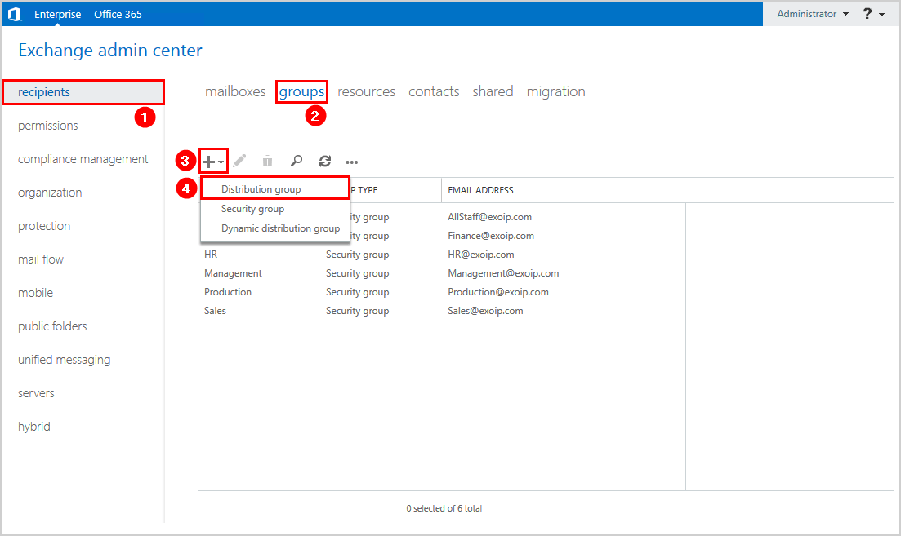

## Table of Contents

## What is exchange distribution?

Exchange distribution is when a company gives out its shares to the public for the first time. This usually happens through a stock exchange, like the New York Stock Exchange or the NASDAQ. When a company does this, it's called an Initial Public Offering, or IPO. The main goal is to raise money that the company can use to grow its business, pay off debts, or invest in new projects.

During an exchange distribution, the company works with investment banks to set a price for the shares. These banks help sell the shares to investors. The price can change based on how much people want to buy the shares. If a lot of people want to buy, the price might go up. If not many people are interested, the price might go down. This process helps the company figure out how much its business is worth to the public.

## Why is exchange distribution important in trading?

Exchange distribution is important in trading because it's how new companies can start selling their shares to the public. When a company does an Initial Public Offering (IPO), it lets people buy parts of the company for the first time. This is a big deal because it helps the company get money to grow bigger, pay off debts, or start new projects. Without exchange distribution, companies would have a harder time raising the money they need.

It also matters for traders and investors. When a company goes public, it gives people a new chance to invest in something they believe in. Traders can buy and sell these new shares, hoping to make a profit. The price of the shares can go up or down based on how much people want them. This makes the market more exciting and gives traders more options to choose from. So, exchange distribution is key for both companies and people who trade stocks.

## How does exchange distribution differ from other distribution methods?

Exchange distribution is when a company sells its shares to the public for the first time through a stock exchange. This is different from other ways of selling shares, like private placements or direct listings. In a private placement, a company sells its shares directly to a small group of investors, not to the public. This is usually done to raise money quickly and quietly, without all the rules that come with selling shares on a stock exchange. A direct listing is when a company lists its shares on a stock exchange but doesn't hire investment banks to help sell them. Instead, the company just makes its existing shares available for trading.

The main difference with exchange distribution is that it involves an Initial Public Offering (IPO), where the company works with investment banks to set a price for the shares and sell them to the public. This process is more public and regulated than private placements, which means the company has to follow strict rules to make sure everything is fair and clear. Direct listings are also different because they don't involve setting a new price for the shares; the market decides the price based on what people are willing to pay. So, exchange distribution is a more formal and structured way for a company to go public and raise money compared to other methods.

## What are the key components of an exchange distribution system?

An exchange distribution system has a few main parts that work together to help a company sell its shares to the public. The first part is the company itself, which decides to go public and raise money through an Initial Public Offering (IPO). The company works with investment banks, which are another key part of the system. These banks help the company set a price for the shares and find people who want to buy them. The banks also make sure everything follows the rules set by the stock exchange and the government.

The second part is the stock exchange, like the New York Stock Exchange or the NASDAQ. This is where the shares are actually sold to the public. The stock exchange has its own rules that the company and the investment banks have to follow. Another important part is the investors, who buy the shares. They can be regular people or big institutions like pension funds. The price of the shares can go up or down based on how much these investors want to buy them. All these parts work together to make sure the exchange distribution system runs smoothly and fairly.

## Can you explain the process of setting up an exchange distribution?

Setting up an exchange distribution starts with a company deciding to go public and sell its shares to the public. The company hires investment banks to help with this process. These banks do a lot of work, like figuring out how much the company is worth and setting a price for the shares. They also help the company follow all the rules set by the stock exchange and the government. The company and the banks work together to create a plan for selling the shares, which is called an Initial Public Offering (IPO).

Once the plan is ready, the company files paperwork with the stock exchange and the government to get approval. This paperwork tells everyone important information about the company, like how it makes money and what it plans to do with the money from selling shares. After the paperwork is approved, the company and the banks start talking to investors to see if they want to buy the shares. When enough people say yes, the shares are sold on the stock exchange, and the company gets the money it needs. This whole process can take a few months, but it helps the company raise money and lets people invest in it.

## What are the common challenges faced in managing exchange distribution?

Managing exchange distribution can be tough because there are a lot of rules to follow. When a company wants to go public, it has to make sure everything is done the right way. This means working with investment banks and following the rules set by the stock exchange and the government. It's hard to keep track of all these rules and make sure everything is done correctly. If the company makes a mistake, it could get in trouble or have to delay the IPO, which means they might not get the money they need on time.

Another challenge is figuring out the right price for the shares. The company and the investment banks have to guess how much people will want to buy the shares and set a price that makes sense. If the price is too high, not many people might want to buy the shares, and the company won't raise as much money as it hoped. If the price is too low, the company might not get as much money as it could have, and the people who buy the shares might make a lot of money right away, which can seem unfair. Getting the price just right is really hard and can make a big difference in how successful the IPO is.

## How does exchange distribution impact market liquidity?

Exchange distribution, when a company sells its shares to the public for the first time, can make the market more liquid. Liquidity means how easy it is to buy or sell something without changing its price too much. When a company does an IPO, it adds new shares to the market. More shares mean more people can buy and sell them, which makes the market more active. This can help traders and investors because they can buy and sell shares more easily.

But, the impact on [liquidity](/wiki/liquidity-risk-premium) can also depend on how popular the company's shares are. If a lot of people want to buy the shares, the market for those shares will be very active, and liquidity will go up a lot. But if not many people are interested, the shares might not trade as much, and the market might not become more liquid. So, exchange distribution can help make the market more liquid, but it depends on how much people want to buy and sell the new shares.

## What role does technology play in enhancing exchange distribution?

Technology plays a big role in making exchange distribution better. It helps companies and investment banks do things faster and easier. For example, computers and the internet let companies share information with investors all over the world in just a few seconds. This means more people can learn about the company and decide if they want to buy its shares. Also, special computer programs help set the right price for the shares by looking at a lot of data quickly. This makes it easier to figure out how much people might want to buy the shares and set a fair price.

Another way technology helps is by making the whole process of going public smoother and safer. Online systems let companies file all the paperwork they need with the stock exchange and the government without having to send papers through the mail. This saves time and makes sure everything gets to the right place on time. Plus, technology can help keep track of all the rules and make sure the company follows them. This reduces the chance of making mistakes that could cause problems. So, technology makes exchange distribution faster, easier, and more reliable for everyone involved.

## What are the regulatory considerations for exchange distribution?

When a company wants to sell its shares to the public for the first time, it has to follow a lot of rules set by the government and the stock exchange. These rules are there to make sure everything is done fairly and that people who want to buy the shares get all the information they need. The company has to file a lot of paperwork that tells everyone important things about the business, like how it makes money and what it plans to do with the money from selling shares. This paperwork needs to be approved before the company can go ahead with the IPO. If the company makes a mistake or doesn't follow these rules, it could get in trouble or have to delay the IPO.

The rules also make sure that the price of the shares is set fairly. The company works with investment banks to figure out how much the shares should cost. These banks have to follow rules too, like making sure they don't say anything that isn't true about the company. They also have to be careful not to set the price too high or too low, which could cause problems. The stock exchange has its own set of rules that the company and the banks have to follow, like how to advertise the shares and how to handle the money from the IPO. All these rules are there to protect everyone involved and make sure the exchange distribution goes smoothly.

## How can one optimize the performance of an exchange distribution system?

To make an exchange distribution system work better, it's important to use technology to help with the process. Computers and the internet can make things faster and easier. For example, special computer programs can look at a lot of data to help set the right price for the shares. This makes it easier to figure out how much people might want to buy the shares. Also, online systems let companies file all the paperwork they need with the stock exchange and the government without having to send papers through the mail. This saves time and makes sure everything gets to the right place on time.

Another way to optimize the performance of an exchange distribution system is to make sure the company follows all the rules set by the government and the stock exchange. These rules are there to make sure everything is done fairly and that people who want to buy the shares get all the information they need. By following these rules carefully, the company can avoid mistakes that could cause problems or delays. This helps the whole process go smoothly and lets the company raise the money it needs to grow its business.

## What advanced strategies can be employed to improve exchange distribution efficiency?

To make exchange distribution more efficient, companies can use smart computer programs called algorithms. These programs can look at a lot of data really fast to help set the right price for the shares. This means the company can figure out how much people might want to buy the shares and set a fair price that will help them raise the most money. Also, using the internet and online systems can make the process faster and easier. Companies can share information with investors all over the world in just a few seconds, and they can file all the paperwork they need with the stock exchange and the government without sending papers through the mail. This saves time and helps everything go smoothly.

Another way to improve exchange distribution is to work closely with investment banks and make sure everyone understands the rules set by the government and the stock exchange. These rules are there to make sure everything is done fairly and that people who want to buy the shares get all the information they need. By following these rules carefully, the company can avoid mistakes that could cause problems or delays. It's also important to talk to investors and find out what they think about the company and the price of the shares. This can help the company make changes to its plan if needed and make sure the IPO goes well.

## How does exchange distribution influence overall market dynamics and investor behavior?

Exchange distribution, when a company sells its shares to the public for the first time, can change how the whole market works. When a new company goes public, it adds more shares to the market. This means more people can buy and sell these shares, which can make the market more active. If a lot of people want to buy the new shares, the price might go up, and this can make other investors excited and want to buy more shares too. On the other hand, if not many people are interested in the new shares, the price might go down, and this can make investors worried and less likely to buy shares. So, exchange distribution can make the market more lively or more quiet, depending on how people feel about the new shares.

Exchange distribution also changes how investors act. When a company goes public, it gives investors a new chance to put their money into something they believe in. Some investors might want to buy the new shares right away, hoping to make a profit if the price goes up. Others might wait and see what happens, not wanting to take a risk on something new. The way investors react to a new IPO can show what they think about the company and the market in general. If a lot of people buy the new shares, it can make other investors feel more confident and want to buy more shares too. But if not many people are interested, it can make investors more careful and less likely to take risks. So, exchange distribution can make investors more excited or more cautious, depending on how they feel about the new shares.

## References & Further Reading

[1]: Bergstra, J., Bardenet, R., Bengio, Y., & Kégl, B. (2011). ["Algorithms for Hyper-Parameter Optimization."](https://dl.acm.org/doi/10.5555/2986459.2986743) Advances in Neural Information Processing Systems 24.

[2]: ["Advances in Financial Machine Learning"](https://www.amazon.com/Advances-Financial-Machine-Learning-Marcos/dp/1119482089) by Marcos Lopez de Prado

[3]: ["Evidence-Based Technical Analysis: Applying the Scientific Method and Statistical Inference to Trading Signals"](https://www.amazon.com/Evidence-Based-Technical-Analysis-Scientific-Statistical/dp/0470008741) by David Aronson

[4]: ["Machine Learning for Algorithmic Trading"](https://github.com/stefan-jansen/machine-learning-for-trading) by Stefan Jansen

[5]: ["Quantitative Trading: How to Build Your Own Algorithmic Trading Business"](https://www.amazon.com/Quantitative-Trading-Build-Algorithmic-Business/dp/1119800064) by Ernest P. Chan