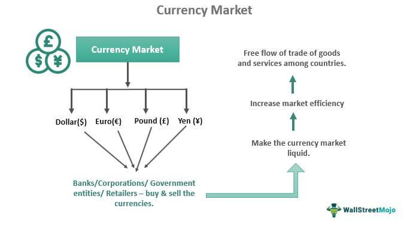

In the rapidly evolving world of finance, the integration of technology and trading has pioneered innovative approaches that redefine traditional methods. Among these advancements, finance distribution exchange and algorithmic trading are noteworthy forces driving substantial changes in market dynamics. Finance distribution exchanges involve the sale of large blocks of stocks or securities through orchestrated transactions managed by brokers, facilitating efficient execution and minimizing market impact. These exchanges are crucial for accommodating significant buy and sell orders from institutional investors, thereby stabilizing the market and providing accurate trading information.

Simultaneously, algorithmic trading leverages technology to automate trading decisions based on pre-programmed criteria such as price, timing, and volume. This approach has gained traction owing to its capacity for rapid execution, cost efficiency, and optimal risk management. Algorithms, designed to eliminate human biases, enable traders to adhere strictly to established strategies and capitalize on multiple market opportunities simultaneously.

The interplay between finance distribution exchanges and algorithmic trading is profound. The precision and speed afforded by algorithmic trading complement the large-volume transactions typical of finance distribution exchanges, enhancing the overall efficiency and effectiveness of trade execution. This synergy is indispensable in high-frequency trading environments where milliseconds can determine trading success.

Technological advancements are at the core of these evolving processes, with innovations in artificial intelligence (AI) and machine learning poised to further transform trading strategies. As these technologies continue to develop, their implications for investors, traders, and financial institutions are significant. Stakeholders must navigate the complexities of advanced trading systems while ensuring adherence to regulatory frameworks and ethical standards. The ongoing evolution of finance distribution exchanges and algorithmic trading underscores their pivotal role in modern financial markets, heralding a new era of adaptability and strategic innovation.

## Table of Contents

## Understanding Finance Distribution Exchange

A finance distribution exchange involves the sale and purchase of substantial blocks of stocks or securities, executed as singular transactions through the intermediation of brokers. This method allows for the efficient processing of extensive buy and sell orders, accommodating multiple buyers or sellers in a streamlined manner. The role of brokers is pivotal in this context, as they consolidate multiple buy or sell orders to execute a solitary transaction. This often involves major market players, such as hedge funds and institutional investors, who are active participants in these exchanges.

One of the principal advantages of finance distribution exchanges is the mitigation of market volatility. By amalgamating several trades into a single transaction, these exchanges offer a more accurate portrayal of trading data. This consolidation results in a smoother, more stabilized market environment, where large movements do not disproportionately affect market prices.

These transactions are generally earmarked for significant trades, characterized by either the trading of at least 10,000 shares or transaction values exceeding $200,000. Such thresholds ensure that only substantial trades benefit from this mechanism, thus facilitating improved [liquidity](/wiki/liquidity-risk-premium) and stability in the financial markets. The size and scale of these transactions also imply a reduced impact on stock prices, as the aggregated nature of these trades lessens the immediate supply and demand imbalance typically observed with conventional trading methods.

## The Role of Algorithmic Trading

Algorithmic trading, or algo trading, refers to the use of pre-programmed trading instructions defined by specific variables such as price, timing, and [volume](/wiki/volume-trading-strategy), to execute trades. This approach has transformed financial markets, leveraging computational power to perform transactions with speed and precision that humans cannot achieve manually. 

One of the primary advantages of [algorithmic trading](/wiki/algorithmic-trading) is its ability to significantly increase the speed at which trades are executed. Traditional trading methods, which depend on human decision-making, can be slow and susceptible to delays. In contrast, algorithmic trading systems can analyze vast datasets, identify opportunities, and execute trades within milliseconds. This speed not only improves the efficiency of trade execution but also reduces the likelihood of price slippage—the difference between the expected price of a trade and the actual price.

Cost efficiency is another substantial benefit of algorithmic trading. Automated trades reduce transaction costs by minimizing the need for human traders. Additionally, algorithms can capitalize on price discrepancies across different markets or platforms, known as [arbitrage](/wiki/arbitrage) opportunities, which can generate profits without significant risk exposure. Furthermore, by setting specific parameters for each trade, transaction costs associated with manual errors are reduced.

Risk management is enhanced through algorithmic trading by providing a disciplined approach to trading strategies. Since trades are executed based on pre-defined criteria, emotional biases that might affect human decision-making are eliminated. Algorithms can react to market conditions based on logic and data rather than emotion. This disciplined approach enables consistent adherence to trading strategies, thereby optimizing asset allocation and risk diversification.

In terms of diversification, algorithms enable traders to monitor multiple markets simultaneously. They can execute trades across different asset classes, currencies, and geographic locations without the challenges of managing these activities manually. This capability allows for a more balanced portfolio, mitigating risks associated with specific market conditions or events.

However, the adoption of algorithmic trading demands careful consideration of regulatory compliance, ethical concerns, and the need for robust technology. Regulatory bodies have started implementing rules to ensure fair practices, prevent market manipulation, and protect investors. Ethical concerns, such as the potential for algorithms to exacerbate market [volatility](/wiki/volatility-trading-strategies) or engage in unfair practices, must also be addressed.

The technological infrastructure supporting algorithmic trading is complex, requiring high-speed networks, advanced computing resources, and secure, reliable systems. Trading firms must invest in cutting-edge technology to remain competitive, adapt to market innovations, and prevent potential system failures or cyber threats.

In summary, algorithmic trading offers significant advantages in terms of speed, cost efficiency, risk management, and diversification. As technology continues to evolve, the role of algorithmic trading in financial markets will undoubtedly expand, driving further innovation and necessitating vigilant oversight to ensure a secure and equitable trading environment.

## Interlinking Finance Distribution Exchange and Algorithmic Trading

Finance distribution exchanges and algorithmic trading represent a sophisticated interplay in the financial markets, particularly through large block trades. These trades, typically executed by institutional investors, demand both precision and efficiency, which algorithmic trading naturally provides. Algorithmic trading systems can rapidly process vast datasets, evaluate market conditions, and execute trades based on pre-defined criteria. This capability is crucial in finance distribution exchanges, where quick decision-making can significantly impact trading outcomes.

Large block trades present unique opportunities and challenges as they can influence market dynamics due to their size. By employing algorithmic trading strategies, institutions can mitigate the potential adverse effects such trades might have on the market. Algorithms can dynamically adapt to market conditions, ensuring minimal market impact while maintaining the desired trading objectives. This adaptability is particularly beneficial in high-frequency trading ([HFT](/wiki/high-frequency-trading-strategies)), where speed is paramount. HFT strategies deploy algorithms capable of executing thousands of trades within milliseconds, underscoring the importance of precision and timing in finance distribution exchanges.

Furthermore, algorithmic strategies enhance the understanding of large block trade conditions and behaviors. They incorporate a variety of market signals and data inputs, allowing for a comprehensive analysis of timing and execution strategies. By optimizing these factors, algorithms contribute to better market opportunities and investment outcomes. For instance, algorithms can identify trends and market shifts that traditional trading methods might overlook, enabling traders to capitalize on these insights effectively.

In essence, the synergy between finance distribution exchanges and algorithmic trading fosters an environment where trades are not only executed with heightened efficiency but also with strategic insight. This integration helps maintain robust market liquidity, encourage fair trading practices, and improve overall market efficiency. As technology continues to evolve, this relationship will likely strengthen, with advancements in [artificial intelligence](/wiki/ai-artificial-intelligence) and [machine learning](/wiki/machine-learning) further enhancing algorithmic capabilities.

## Benefits and Challenges

The integration of finance distribution exchanges with algorithmic trading presents a substantial opportunity to optimize execution quality while minimizing the impact on the broader market. By efficiently processing large trades, this integration helps maintain market liquidity, which remains advantageous for all participants, from individual investors to large institutional bodies. Effective liquidity management ensures that trades can be executed quickly without causing significant price distortions, a crucial aspect of stable and efficient markets.

Algorithmic trading plays an integral role in achieving these efficiencies. The ability to rapidly execute trades based on pre-determined criteria allows for precise management of large block trades, reducing the probability of undesirable market impact. Algorithms are designed to slice large orders into smaller, strategically timed trades, thereby minimizing any immediate impact on stock prices and spreading the information content of such transactions over time.

However, this combination also presents a host of challenges. One notable challenge is the increased complexity inherent in developing and maintaining sophisticated algorithms capable of executing large orders efficiently. The sophistication required can elevate costs and demand specialized expertise to ensure the algorithms function correctly under varied market conditions.

There's also the potential for misuse, where the speed and efficiency of algorithmic trading could be leveraged for unfair advantages, such as front-running or other forms of market manipulation. Consequently, there's a pressing need for stringent regulatory oversight to prevent such practices and maintain fair market conditions. Regulatory frameworks need to evolve continuously, keeping pace with advancements in technology and trading strategies.

Furthermore, technological risks represent another significant concern. The heavy reliance on automated systems means that any technical failure, be it hardware malfunctions or software bugs, could lead to severe disruptions in trading activities. These outages could not only affect individual brokers or financial institutions but potentially ripple across the market, leading to significant volatility.

Market participants must balance innovation with regulatory compliance. Ensuring that technological advancements contribute positively to market dynamics requires a careful examination of the ethical and operational implications of new trading strategies. By collaboratively developing policies and guidelines, regulators and technologists can help foster an environment where innovation thrives without compromising the integrity of financial markets.

Overall, the integration of exchange distribution with algorithmic trading holds promise for the financial sector, provided participants can navigate the complexities responsibly and ensure robust safeguards are in place to protect market participants.

## Future Trends and Conclusion

The advancement of finance distribution exchanges and algorithmic trading is inherently tied to developments in technology, notably in artificial intelligence (AI) and machine learning (ML). These technologies are anticipated to significantly enhance the capabilities of trading algorithms, enabling them to more accurately predict market trends and swiftly adapt to market fluctuations. Such predictability is crucial for optimizing trading strategies and maintaining a competitive edge in the fast-paced financial landscape.

Artificial intelligence and machine learning can analyze vast amounts of market data to identify patterns and generate predictive insights, allowing traders to make informed decisions. For instance, [reinforcement learning](/wiki/reinforcement-learning), a branch of ML, can be employed to develop algorithms that learn and adapt based on market conditions, improving their performance over time. Furthermore, natural language processing (NLP) can be used to analyze news articles and social media sentiment, providing a more comprehensive view of market mood and potential impacts on prices.

However, as these technological capabilities grow, there is an increasing need for collaboration between regulatory bodies and market innovators to ensure a secure and ethical trading environment. Regulatory frameworks must evolve to address the complexities introduced by AI and ML, maintaining market integrity and transparency. This involves scrutinizing algorithmic strategies for fairness, preventing manipulative practices, and safeguarding data privacy.

The evolution of finance distribution exchange and algorithmic trading strategies exemplifies the dynamic and ever-changing nature of financial markets. It underscores the importance of adaptability, where market participants must remain vigilant and promptly implement strategic advancements to capitalize on emerging opportunities. The intersection of innovative technology and diligent regulatory oversight is critical to achieving a balanced ecosystem that fosters growth while protecting stakeholders' interests.

In conclusion, the integration of finance distribution exchanges with algorithmic trading marks a significant shift in the financial market's evolution. This fusion has transformed traditional trading methodologies, paving the way for enhanced efficiency and new opportunities. As we look forward, the synergy between technology and regulatory evolution will be essential in shaping the future of trading, ensuring it remains robust, ethical, and in tune with rapid technological advancements.

## References & Further Reading

[1]: Bergstra, J., Bardenet, R., Bengio, Y., & Kégl, B. (2011). ["Algorithms for Hyper-Parameter Optimization."](https://dl.acm.org/doi/10.5555/2986459.2986743) Advances in Neural Information Processing Systems 24.

[2]: ["Advances in Financial Machine Learning"](https://www.amazon.com/Advances-Financial-Machine-Learning-Marcos/dp/1119482089) by Marcos Lopez de Prado

[3]: ["Evidence-Based Technical Analysis: Applying the Scientific Method and Statistical Inference to Trading Signals"](https://www.amazon.com/Evidence-Based-Technical-Analysis-Scientific-Statistical/dp/0470008741) by David Aronson

[4]: ["Machine Learning for Algorithmic Trading"](https://github.com/stefan-jansen/machine-learning-for-trading) by Stefan Jansen

[5]: ["Quantitative Trading: How to Build Your Own Algorithmic Trading Business"](https://www.amazon.com/Quantitative-Trading-Build-Algorithmic-Business/dp/1119800064) by Ernest P. Chan