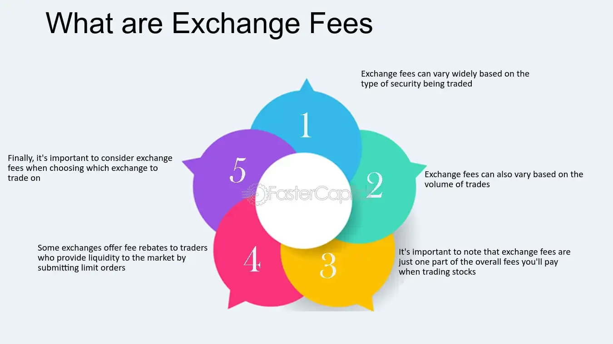

## Table of Contents

## What are exchange fees?

Exchange fees are charges that you pay when you change one type of money into another. For example, if you have US dollars and you want to get Euros, a bank or a money exchange service will charge you a fee to make that switch. This fee can be a fixed amount or a percentage of the money you are exchanging. The fee is how the bank or service makes money from helping you change your currency.

These fees can add up, especially if you are traveling or doing business in different countries. It's a good idea to check the exchange fee before you decide to change your money. Sometimes, different places will charge different amounts for the same service. By comparing fees, you can save money and make sure you are getting a good deal.

## Why do exchanges charge fees?

Exchanges charge fees to make money. Just like any business, they need to earn money to pay their workers, keep their lights on, and make a profit. When you change your money from one type to another, the exchange service is doing work for you. They take a small part of the money you are changing as their fee for doing this work.

These fees also help cover the risks that come with changing money. The value of money can go up and down a lot. If the exchange service buys a lot of one type of money and then its value goes down, they could lose money. The fees help them to not lose money when this happens. So, the fees are important for the exchange service to keep running and to handle the risks of their business.

## How are exchange fees calculated?

Exchange fees are calculated in different ways, but they usually fall into two main types: a flat fee or a percentage of the amount you are changing. A flat fee is a set amount of money that you have to pay every time you change money. For example, a bank might charge you $5 every time you change dollars to euros. A percentage fee is when the exchange service takes a small part of the total amount of money you are changing. If you are changing $100 and the fee is 1%, you will pay $1.

Sometimes, exchange services use both a flat fee and a percentage fee together. For example, they might charge you $5 plus 1% of the amount you are changing. This means if you are changing $100, you would pay the $5 flat fee plus $1 (which is 1% of $100), so your total fee would be $6. It's important to understand how the fee is calculated so you can figure out how much it will cost you to change your money.

## What is the difference between maker and taker fees?

Maker and taker fees are two types of fees that you might see when you use a trading platform to buy or sell things like stocks or cryptocurrencies. A maker fee is what you pay when you add a new order to the trading platform's [order book](/wiki/order-book-trading-strategies). This means you are making a new offer to buy or sell something at a certain price, and you are waiting for someone else to take your offer. Because you are helping to make the market more active and giving other people more choices, the maker fee is usually lower.

A taker fee is what you pay when you take an order that is already on the trading platform's order book. This means you are choosing to buy or sell something at a price that someone else has already offered. When you take an order, you are using up an offer that is already there, which can make the market less active. Because of this, the taker fee is usually higher than the maker fee. Knowing the difference between these fees can help you save money when you are trading.

## How do exchange fees impact trading strategies?

Exchange fees can have a big impact on trading strategies because they affect how much money you make or lose from trading. If you trade a lot, the fees can add up quickly. Traders often try to find ways to lower these fees because they want to keep as much of their profit as possible. For example, some traders might choose to use a trading platform that has lower fees, or they might try to use strategies that let them pay the lower maker fee instead of the higher taker fee.

Another way exchange fees can impact trading strategies is by making traders think about how often they should trade. If the fees are high, it might not be worth it to make a lot of small trades because the fees could eat up the profits. Instead, traders might decide to make fewer, bigger trades to try to save on fees. This means that understanding and planning for exchange fees is an important part of coming up with a good trading strategy.

## What are the typical fee structures in different types of exchanges?

Different types of exchanges have different fee structures, but most of them use a mix of flat fees and percentage fees. For traditional currency exchanges, like when you change dollars to euros at a bank or a money exchange service, you might see a flat fee, like $5 or $10, plus a percentage fee, like 1% or 2% of the total amount you are changing. Sometimes, if you use a credit or debit card to change money, the fee might be higher because the card company also charges a fee.

In [cryptocurrency](/wiki/cryptocurrency) exchanges, the fee structure can be a bit different. They often use maker and taker fees, where the maker fee is lower and the taker fee is higher. For example, a crypto exchange might charge 0.1% as a maker fee and 0.2% as a taker fee. Some crypto exchanges also have different fees for different types of cryptocurrencies or for different levels of trading activity. If you trade a lot, you might get a discount on your fees.

Stock exchanges also have their own fee structures. When you buy or sell stocks, you usually pay a brokerage fee, which can be a flat fee, like $5 per trade, or a percentage fee, like 0.5% of the total value of the trade. Some stock exchanges also have other fees, like fees for keeping your stocks in their system or fees for using their trading tools. The exact fees can vary a lot depending on the stock exchange and the brokerage firm you use.

## How can traders minimize exchange fees?

Traders can minimize exchange fees by choosing the right trading platform. Some platforms have lower fees than others. It's a good idea to look around and compare different platforms to find one with low fees. Also, some platforms offer discounts if you trade a lot or if you hold their special tokens. By using these platforms and taking advantage of discounts, traders can save money on fees.

Another way to minimize exchange fees is by using smart trading strategies. For example, traders can try to place orders that add to the market instead of taking from it. This means they would pay the lower maker fee instead of the higher taker fee. Traders can also think about how often they trade. If fees are high, it might be better to make fewer, bigger trades instead of a lot of small ones. By planning their trades carefully, traders can keep their fees as low as possible.

## What are the implications of high exchange fees on market liquidity?

High exchange fees can make the market less liquid. Liquidity means how easy it is to buy or sell something without the price changing a lot. When fees are high, traders might not want to trade as much because they have to pay more money every time they do. If fewer people are trading, it can be harder for other people to find someone to trade with. This can make the market less active and less liquid.

If the market is less liquid, it can be harder for people to buy or sell things quickly. This can make prices go up and down more because there are fewer trades happening. When the market is not as liquid, it can also make people less confident about trading. They might worry that they won't be able to sell their things when they need to, or that they will have to sell them for less money than they want. So, high exchange fees can have a big impact on how well the market works.

## How do exchange fees affect the profitability of high-frequency trading?

High-frequency trading ([HFT](/wiki/high-frequency-trading-strategies)) is a type of trading where computers make a lot of trades very quickly. Because HFT involves making many trades in a short time, exchange fees can have a big impact on how much money HFT traders make. If the fees are high, they can eat up a lot of the small profits that HFT traders are trying to make from each trade. So, high exchange fees can make HFT less profitable because the costs of trading go up.

To deal with high exchange fees, HFT traders often look for trading platforms that have lower fees. They might also use special strategies to try to pay the lower maker fee instead of the higher taker fee. By finding ways to lower their fees, HFT traders can keep more of their profits. But even with these strategies, high exchange fees can still make it harder for HFT traders to make money.

## What role do exchange fees play in the competition between different exchanges?

Exchange fees are important when different exchanges compete with each other. Exchanges want to attract more traders to use their platform, and one way they can do this is by offering lower fees. If an exchange has lower fees than others, more traders might choose to use that exchange because they can save money. This can make the exchange more popular and help it grow bigger. So, exchanges often try to have competitive fees to bring in more traders and stay ahead of other exchanges.

But it's not just about having the lowest fees. Exchanges also need to make sure they can still make money to keep their business running. Sometimes, an exchange might offer very low fees but make up for it by charging for other services or by having different fees for different types of trades. So, while low fees can help an exchange attract more traders, they have to balance this with making enough money to stay in business. This competition over fees can lead to better deals for traders, but it's a delicate balance for the exchanges themselves.

## How have exchange fee models evolved over time, and what future trends can we expect?

Exchange fee models have changed a lot over time. In the past, most exchanges used to charge a simple flat fee for each trade. But as trading got more complicated and technology improved, exchanges started using different kinds of fees. They began to charge percentage fees based on how much money you were trading, and they also introduced maker and taker fees. This made trading more flexible and allowed exchanges to make more money from different kinds of trades. Now, many exchanges have complex fee structures that can change depending on what you are trading, how often you trade, and even what kind of account you have.

In the future, we can expect exchange fee models to keep changing and getting more complicated. As more people start trading things like cryptocurrencies and other new types of assets, exchanges might come up with new kinds of fees to fit these new markets. Also, with more competition between exchanges, they might try to offer even lower fees or special discounts to attract more traders. Technology will play a big role too, with exchanges using smart algorithms to set their fees in a way that makes them more money while still keeping traders happy. So, while exchange fees will probably keep getting more complex, the goal will always be to balance making money for the exchange and giving good deals to traders.

## What are the regulatory considerations regarding exchange fees and their impact on market fairness?

Regulatory bodies keep a close eye on exchange fees because they want to make sure the market is fair for everyone. High fees can make it harder for some people to trade, especially if they don't have a lot of money. Regulators worry that if fees are too high, it might stop people from trading and make the market less active. They also want to make sure that exchanges are not charging different fees to different people for no good reason. This could be unfair and could give some traders an advantage over others. So, regulators often set rules about how much exchanges can charge and how they have to be clear about their fees.

In the future, as trading gets more complicated with things like cryptocurrencies, regulators will have to keep up with new kinds of fees. They will need to make sure that these new fees are fair and don't hurt the market. Regulators might also look at how fees affect different groups of traders, like small investors versus big investors. By keeping an eye on exchange fees, regulators can help make sure that everyone has a fair chance to trade and that the market stays healthy and active.

## References & Further Reading

[1]: Hasbrouck, J. (2007). ["Empirical Market Microstructure: The Institutions, Economics, and Econometrics of Securities Trading."](https://academic.oup.com/book/52241) Oxford University Press.

[2]: Kissell, R. (2013). ["The Science of Algorithmic Trading and Portfolio Management."](https://www.sciencedirect.com/book/9780124016897/the-science-of-algorithmic-trading-and-portfolio-management) Academic Press.

[3]: Ramaswamy, S. (2006). "Marketplace Competition in the NYSE and NASDAQ: Overview and Policy Implications." In Larry Harris, [Trading and Markets: The New Palgrave](https://www.amazon.com/Studies-Economics-Finance-Associates-New-Palgrave/dp/0230238403), Palgrave Macmillan.

[4]: Harris, L. (2003). ["Trading and Exchanges: Market Microstructure for Practitioners."](https://www.amazon.com/Trading-Exchanges-Market-Microstructure-Practitioners/dp/0195144708) Oxford University Press.

[5]: Aldridge, I. (2013). ["High-Frequency Trading: A Practical Guide to Algorithmic Strategies and Trading Systems."](https://www.amazon.com/High-Frequency-Trading-Practical-Algorithmic-Strategies/dp/1118343506) Wiley.