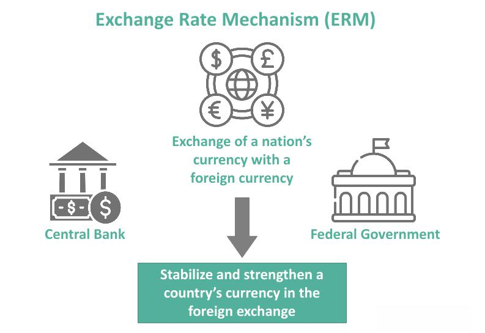

In the ever-evolving world of finance, understanding the nuances of financial transactions, transaction costs, and exchange fees is crucial. The financial landscape is continuously reshaped by technological advancements, market dynamics, and regulatory changes, which contribute to the complexity of managing these elements efficiently. With financial markets becoming increasingly interconnected, the speed and accuracy of transactions have become vital factors influencing trading outcomes.

This article explores the intricacies of financial transactions and their associated costs, as well as the strategic importance of minimizing these costs within the context of algorithmic trading. Algorithmic trading, characterized by its reliance on sophisticated algorithms for rapid execution, places substantial emphasis on transaction costs. These costs, if not managed properly, can erode profitability and affect the overall performance of trading strategies. Understanding the types of transaction costs, including explicit costs such as brokerage fees, and implicit costs like bid-ask spreads and slippage, is fundamental for traders aiming to optimize their trading operations.



Moreover, the role of exchange fees cannot be overlooked, as these are specific costs incurred for using trading platforms to buy or sell assets like stocks and commodities. The variation in exchange fees across platforms and markets influences the choice of trading venues and affects the profitability of trades.

By the end of this article, readers will gain valuable insights into how transaction costs influence algorithmic trading and how effective cost management can lead to better trading performance. The focus will be on strategies to optimize these costs, thereby supporting traders in the quest to enhance their competitive edge in a demanding market environment.

## Table of Contents

## Understanding Financial Transactions and Transaction Costs

Financial transactions involve the buying or selling of financial assets such as stocks, bonds, and cryptocurrencies. These transactions are fundamental to the operation of financial markets, facilitating the allocation of resources and enabling diversification of investment portfolios. However, each transaction is associated with certain costs, known as transaction costs, which consist of both explicit and implicit components that can significantly impact the profitability of the transactions.

Explicit transaction costs are straightforward and generally involve fees that are directly observable. These include brokerage fees, which are charges by brokers or trading platforms for executing buy and sell orders. Such fees vary depending on the broker and the volume of trade, and they are a clear and unavoidable cost associated with trading activities.

Implicit transaction costs, on the other hand, are less transparent and can be more challenging to quantify. They include bid-ask spreads, which represent the difference between the price a buyer is willing to pay for an asset (bid) and the price a seller is willing to accept (ask). This spread is a crucial component of transaction costs since it directly affects the net price the trader pays or receives. Traders often face the dilemma of whether to accept a wider spread for quicker execution or wait for tighter spreads, potentially delaying the transaction.

Slippage is another significant implicit transaction cost. It occurs when there is a difference between the expected price of a trade and the actual price at which the trade is executed. Slippage can happen due to market [volatility](/wiki/volatility-trading-strategies) or insufficient [liquidity](/wiki/liquidity-risk-premium), especially in high-frequency trading environments where quick execution times are critical. 

The impact of transaction costs extends across various financial instruments and trading environments. In equity markets, for instance, both institutional and retail investors need to consider these costs when designing their trading strategies. In bond markets, although spreads are generally tighter, large trades can still incur significant costs due to market impact. Cryptocurrencies, being relatively newer and less regulated, can exhibit high volatility and wider spreads, exacerbating transaction costs.

Therefore, understanding and managing transaction costs are essential for optimizing trading strategies. By identifying and minimizing these costs, traders can enhance their returns and achieve more efficient market participation.

## The Role of Exchange Fees

Exchange fees are specific costs imposed by trading platforms for the execution of trades involving various assets, such as stocks, bonds, and commodities. These fees are an essential component of the transaction costs that traders must account for when executing trades.

**Variation Across Platforms and Markets**

Exchange fees can vary widely across different platforms and markets. The differences arise from several factors, including the type of asset being traded, the [volume](/wiki/volume-trading-strategy) of trades executed, and the specific services offered by the exchange. For instance, traditional stock exchanges such as the New York Stock Exchange (NYSE) and NASDAQ have different fee structures compared to [cryptocurrency](/wiki/cryptocurrency) exchanges like Binance or Coinbase.

Traditional exchanges often employ a tiered fee structure primarily based on trading volume. The higher the trading volume a trader handles, the lower the fees they might incur. Conversely, cryptocurrency exchanges might use a maker-taker fee model, where makers (those who add liquidity to the market) are charged lower fees or even receive rebates compared to takers (those who remove liquidity from the market).

**Structure of Exchange Fees**

The structure of exchange fees typically comprises several components:

1. **Commission Fees**: This is a percentage of the trade value charged by the platform for facilitating the transaction. For example, a broker might charge a 0.1% commission fee per transaction.

2. **Transaction Fees**: Fixed charges applied per trade, which can either be a flat rate or vary with the trade size.

3. **Withdrawal and Deposit Fees**: Besides trading, exchanges often charge fees for withdrawing or depositing funds. These can be particularly significant in cryptocurrency markets due to varying network fees.

4. **Market Access and Data Fees**: Fees charged for access to real-time market data, trading platforms, or technical support services that enhance trading capabilities.

To better understand how these fees can be calculated, consider a Python function to estimate the total cost of a trade, including commission and fixed transaction fees:

```python
def calculate_trade_cost(trade_value, commission_rate, transaction_fee):
    commission_cost = trade_value * commission_rate
    total_cost = commission_cost + transaction_fee
    return total_cost

# Example usage
trade_value = 10000  # Value of the trade in dollars
commission_rate = 0.001  # Commission rate as a decimal (0.1%)
transaction_fee = 5  # Flat transaction fee in dollars

total_cost = calculate_trade_cost(trade_value, commission_rate, transaction_fee)
print(f"Total Trade Cost: ${total_cost:.2f}")
```

In this example, if a trader executes a $10,000 trade with a 0.1% commission rate and a $5 transaction fee, the total cost incurred would be $15.

**Impact on Trading Strategies**

Exchange fees can significantly affect trading strategies, especially for high-frequency traders who conduct a large number of transactions in a short period. These traders must meticulously account for fees, as they can quickly accumulate and erode potential profits. Lower exchange fees translate directly to reduced transaction costs, allowing for tighter margins and greater profit potential.

Moreover, exchange fees can influence the choice of trading platform. Traders might opt for platforms offering lower fees or preferential rebate programs that align with their specific trading volume and frequency. For instance, high-volume traders may benefit from exchanges with tiered pricing or maker rebates, enhancing overall trading efficiency and profitability. 

In conclusion, understanding the structure and impact of exchange fees is crucial for traders looking to optimize their trading strategies and manage costs effectively.

## Algorithmic Trading: Revolutionizing the Financial Ecosystem

Algorithmic trading, often termed "algo trading," represents a significant advancement in the financial ecosystem due to its capacity to execute trades with high precision at rapid speeds. By leveraging sophisticated algorithms, algo trading automates the buying and selling of financial instruments such as stocks, bonds, and currencies. These algorithms process vast amounts of data to make trading decisions within fractions of a second, a capability beyond human traders.

The fundamental objective of [algorithmic trading](/wiki/algorithmic-trading) is to enhance trade execution and reduce transaction costs, which directly impact profitability. Reducing these costs is vital because even small inefficiencies can accumulate significantly, given the sheer volume and frequency of trades. High-frequency trading ([HFT](/wiki/high-frequency-trading-strategies)), a subset of algorithmic trading, epitomizes this notion. HFT strategies execute a large number of trades within microseconds, necessitating an acute focus on minimizing transaction costs to maintain viability. Even a minor increase in transaction costs or slippage can render many high-frequency strategies unprofitable.

### Managing Transaction Costs Efficiently

Efficient management of transaction costs in algorithmic trading involves several strategies:

1. **Order Execution Algorithms**: Smart order execution algorithms are designed to execute trades at the most favorable prices while minimizing market impact. Examples of such algorithms include Volume-Weighted Average Price (VWAP) and Time-Weighted Average Price (TWAP). These algorithms divide large orders into smaller, strategically timed trades to reduce market impact and slippage.

2. **Liquidity Provision**: Providing liquidity, or acting as market makers, can help algorithmic traders benefit from bid-ask spreads. By placing limit orders rather than market orders, traders can earn the spread rather than pay it, effectively reducing transaction costs.

3. **Co-location Services**: By placing trading servers physically closer to exchange servers, traders can execute trades faster, reducing latency—a critical factor in achieving optimal execution prices in HFT.

4. **Transaction Cost Analysis (TCA)**: Using TCA tools to estimate and analyze transaction costs allows traders to refine their strategies by identifying inefficiencies and optimizing execution. Python code tools such as `ta` library can be utilized to perform basic transaction cost analyses.

5. **Adaptive Algorithms**: Algorithms that can dynamically adapt based on real-time market conditions can reduce costs. For instance, in volatile markets, some algorithms may execute trades as soon as favorable conditions arise, while in stable markets, they might wait for better price points.

```python
import numpy as np

# Example of a simple execution algorithm to calculate VWAP
def calculate_vwap(prices, volumes):
    volume_sum = np.sum(volumes)
    if volume_sum == 0:
        return 0
    vwap = np.sum(prices * volumes) / volume_sum
    return vwap

prices = np.array([100, 101, 102])
volumes = np.array([200, 150, 250])
vwap = calculate_vwap(prices, volumes)
print(f"VWAP: {vwap}")
```

In conclusion, algorithmic trading represents a transformative approach in financial markets, heavily relying on reducing transaction costs to boost efficiency and profitability. The extreme speed and volume intrinsic to algorithmic trading, especially in high-frequency scenarios, necessitate meticulous attention to every facet of transaction costs. Through continuous innovation in trading algorithms, execution strategies, and cost analysis techniques, traders aim to maintain a competitive edge in the rapidly evolving financial landscape.

## Key Factors Impacting Transaction Costs in Algo Trading

Market liquidity and order size significantly affect transaction costs in algorithmic trading. Liquidity refers to the ease with which an asset can be bought or sold in a market without affecting its price. High liquidity typically results in lower transaction costs, as there is a higher probability of matching buy and sell orders efficiently. Conversely, low liquidity can lead to higher costs due to wider bid-ask spreads and increased slippage. Order size also plays a crucial role; larger orders can impact market prices, leading to adverse price movements that increase costs. 

Trading frequency is another critical [factor](/wiki/factor-investing), particularly for high-frequency traders who execute numerous transactions within short time frames. These traders need to manage transaction costs meticulously to ensure profitability. Frequent trades amplify the effect of costs, such as slippage, which can accumulate rapidly and erode profit margins. Therefore, optimizing the timing and execution of trades is vital in high-frequency trading.

The selection of brokers and their fee structures is central to controlling transaction costs. Different brokers offer varying fee schedules, including fixed fees, per-percentage fees, or hybrid models that combine both. When choosing a broker, traders should consider not only the explicit fees but also the quality of execution, as poor execution can result in increased indirect costs like slippage.

Wider bid-ask spreads present another challenge, particularly in less liquid markets or during times of market instability. The bid-ask spread is the difference between the highest price a buyer is willing to pay and the lowest price a seller is willing to accept. Wider spreads increase the cost of entering and exiting trades. Additionally, market impact costs, which occur when the act of trading causes the market price to move, can further erode profits. These costs are particularly relevant for large orders that can shift prices unfavorably.

Managing these factors requires a careful and strategic approach. Traders must continuously analyze market conditions and adjust their strategies to maintain optimal cost efficiency. This involves employing algorithms that can dynamically adapt to varying levels of liquidity, order size, and trading frequency, ensuring minimal impact on the overall profitability of trades.

## Strategies to Reduce Transaction Costs

In the dynamic environment of algorithmic trading, reducing transaction costs is essential for maximizing profitability and maintaining competitive advantage. Several key strategies can be implemented to achieve cost-efficient trading outcomes.

### Smart Order Routing and Liquidity Utilization

Smart order routing (SOR) plays a crucial role in minimizing transaction costs. By leveraging SOR, traders can dynamically choose the most advantageous routes for their orders, thereby optimizing execution quality. SOR systems analyze multiple venues and identify optimal paths that reduce implicit costs, such as bid-ask spreads and slippage. Liquidity utilization further enhances this process by strategically accessing visible and hidden liquidity pools, ensuring that orders are executed at the best possible prices and market impact is minimized.

### Negotiating Broker Fees and Exploring Rebate Programs

Another effective approach to reducing costs involves negotiating broker fees. Traders can often secure lower commission rates by committing to a certain volume of trades or maintaining specific account balances. Coupled with this, exploring rebate programs offered by exchanges can further diminish overall expenses. These programs typically provide financial incentives for increasing trading volumes on particular platforms. By optimizing both broker and exchange fees, traders can achieve substantial cost savings.

### Advanced Algorithms and Transaction Cost Analysis (TCA)

The utilization of advanced algorithms and Transaction Cost Analysis (TCA) is pivotal for improving trade execution. TCA involves the detailed examination of the different components of transaction costs, enabling traders to identify inefficiencies and optimize strategies accordingly. By deploying sophisticated algorithms, traders can effectively minimize slippage—defined as the difference between expected and actual transaction prices—thereby enhancing execution precision and reducing costs.

### Balancing Cost Reduction and Strategy Performance

It is vital for traders to maintain a careful balance between cost reduction and strategy performance. While it is important to minimize transaction costs, an over-emphasis on cost-cutting measures can potentially undermine trading strategy effectiveness. Thus, traders must ensure their strategies remain aligned with market conditions and liquidity availability. Continuous evaluation and adjustment of trading algorithms help maintain this equilibrium, ensuring sustained profitability while controlling costs.

By employing these strategies, algorithmic traders can significantly reduce transaction expenses, thereby enhancing their overall trading performance and establishing a competitive edge in the financial markets.

## Conclusion

Transaction costs, while often overlooked, are pivotal in the financial markets, especially for algorithmic trading. These costs directly influence the net gains from trading activities and can be a significant barrier to achieving optimal trading performance. By gaining a comprehensive understanding and strategically managing these transaction costs, traders can enhance their trading efficiencies and profitability.

A fundamental strategy in managing transaction costs involves the strategic selection of brokers. Traders should evaluate brokers based on their fee structures, the quality of execution they provide, and any additional services such as transaction cost analysis (TCA) tools. Choosing the right broker can lead to substantial cost reductions, especially over a large volume of trades.

Moreover, the optimization of trading algorithms plays a crucial role. Advanced algorithms can be designed to minimize costs such as slippage and bid-ask spreads, which are common in algorithmic trading. These algorithms can incorporate real-time data analytics, allowing them to dynamically adjust their strategies to current market conditions to reduce trading costs. Implementing [machine learning](/wiki/machine-learning) techniques can further refine these algorithms, enabling predictive analysis that anticipates market movements and adjusts trade execution to minimize costs.

Regulatory environments also exert a considerable influence on transaction costs. Compliance with trading regulations may incur additional costs that need to be factored into the trading strategies. However, regulation can sometimes lead to lower transaction costs by fostering market transparency and competition among trading venues, which often results in lower fees.

In a highly competitive market environment, informed management of transaction costs is crucial for sustained success. Traders must remain agile and continuously adapt their strategies to evolving market conditions and regulatory changes. By strategically minimizing transaction costs, traders can achieve greater profit margins and ensure that their trading operations remain viable and competitive. An ongoing commitment to understanding and optimizing these costs is indispensable for any trader looking to succeed in the fast-paced world of algorithmic trading.

## References & Further Reading

[1]: Hasbrouck, J. (2007). ["Empirical Market Microstructure: The Institutions, Economics, and Econometrics of Securities Trading."](https://academic.oup.com/book/52241) Oxford University Press.

[2]: Kissell, R. (2013). ["The Science of Algorithmic Trading and Portfolio Management."](https://www.sciencedirect.com/book/9780124016897/the-science-of-algorithmic-trading-and-portfolio-management) Academic Press.

[3]: Ramaswamy, S. (2006). "Marketplace Competition in the NYSE and NASDAQ: Overview and Policy Implications." In Larry Harris, [Trading and Markets: The New Palgrave](https://www.amazon.com/Studies-Economics-Finance-Associates-New-Palgrave/dp/0230238403), Palgrave Macmillan.

[4]: Harris, L. (2003). ["Trading and Exchanges: Market Microstructure for Practitioners."](https://www.amazon.com/Trading-Exchanges-Market-Microstructure-Practitioners/dp/0195144708) Oxford University Press.

[5]: Aldridge, I. (2013). ["High-Frequency Trading: A Practical Guide to Algorithmic Strategies and Trading Systems."](https://www.amazon.com/High-Frequency-Trading-Practical-Algorithmic-Strategies/dp/1118343506) Wiley.