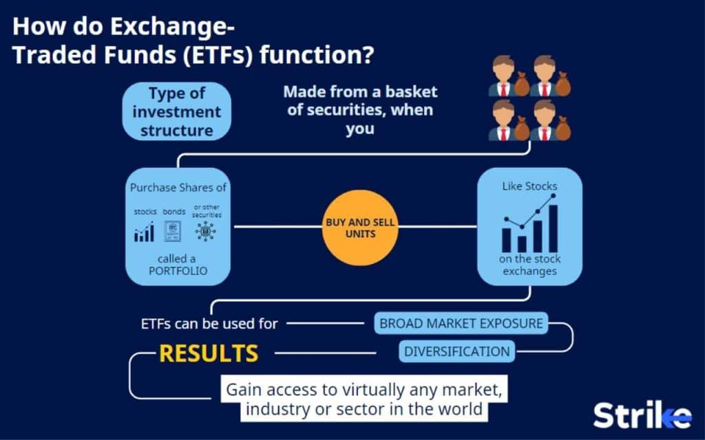

## Table of Contents

## What is an exchange fund?

An exchange fund is a type of investment vehicle where many investors pool their money and assets together. Instead of selling their individual stocks, investors put their stocks into the fund. In return, they get shares in the fund. This can help them diversify their investments without having to pay taxes right away on selling their stocks.

These funds are often used by people who have a lot of money tied up in one stock, like company founders or employees with lots of stock options. By joining an exchange fund, they can spread their risk across many different investments. However, exchange funds usually require a large minimum investment, so they are not for everyone. Also, the benefits of tax deferral can be complex, so it's important to understand the rules and possibly talk to a financial advisor.

## How does an exchange fund work?

An exchange fund works by letting investors swap their individual stocks for shares in a big pool of assets. Imagine you own a lot of stock in one company. Instead of selling those stocks and paying taxes right away, you can put them into the exchange fund. In return, you get shares in the fund, which owns many different types of investments. This helps you spread your money across different assets without triggering a big tax bill.

These funds are usually for people who have a lot of money tied up in one stock and want to diversify their investments. But there are some rules. You need to keep your shares in the fund for at least seven years to get the full tax benefits. Also, exchange funds often require a big minimum investment, like a million dollars or more. So, they're not for everyone. It's a good idea to talk to a financial advisor to make sure it's the right choice for you.

## What are the main benefits of investing in an exchange fund?

One big benefit of an exchange fund is that it lets you diversify your investments without selling your stocks right away. If you have a lot of money in one stock, putting it into an exchange fund can help spread your risk across many different investments. This is good because it can protect you if the value of one stock goes down. Plus, you don't have to pay taxes on your stocks right away, which can save you money.

Another benefit is that exchange funds can help you keep your wealth growing over time. By swapping your stocks for shares in the fund, you can still benefit from the growth of many different companies. However, you need to be patient because you usually have to keep your money in the fund for at least seven years to get the full tax benefits. So, if you're willing to wait, an exchange fund can be a smart way to manage your investments.

## Who can invest in an exchange fund?

Exchange funds are usually for people who have a lot of money tied up in one stock. This could be company founders or employees who got a lot of stock options. These funds let them swap their stock for shares in a big pool of different investments. But, they need to have a big amount of money to invest, usually at least a million dollars. So, exchange funds are not for everyone, but they can be a good choice for rich people who want to spread their risk without selling their stocks and paying taxes right away.

To join an exchange fund, you need to be ready to keep your money in the fund for a long time, usually at least seven years. This is important because you only get the full tax benefits if you wait that long. Exchange funds can be a smart way to keep your wealth growing, but they're a bit complicated. It's a good idea to talk to a financial advisor to make sure it's the right choice for you.

## What types of assets can be contributed to an exchange fund?

Exchange funds usually let you put in stocks that you already own. These can be shares of public companies, which means companies that anyone can buy stock in. The stocks you contribute should be worth a lot of money because exchange funds often have a high minimum investment. For example, you might need to put in stocks worth at least a million dollars.

Sometimes, exchange funds might also accept other types of assets, but this is less common. These could be things like real estate investment trusts (REITs) or other kinds of securities. But, the main thing exchange funds want is stocks in big, well-known companies. So, if you have a lot of stock in one company and want to diversify without selling it right away, an exchange fund could be a good choice for you.

## How is the tax treatment of exchange funds different from other investment vehicles?

Exchange funds offer a unique tax benefit because they let you swap your stocks for shares in the fund without selling them right away. This means you don't have to pay taxes on your stocks until later. If you sold your stocks, you would have to pay taxes on any profits right away. But with an exchange fund, you can wait up to seven years before you have to pay those taxes. This can save you a lot of money if you think the tax rates might go down or if you want to spread out when you pay taxes.

The tax treatment of exchange funds is different from other investment vehicles like mutual funds or ETFs. With mutual funds or ETFs, you usually have to pay taxes on any profits you make when you sell your shares. And sometimes, you might have to pay taxes on dividends or capital gains that the fund earns, even if you don't sell your shares. But with an exchange fund, you can delay paying those taxes for a long time. Just remember, you need to keep your money in the fund for at least seven years to get the full tax benefits.

## What are the potential tax benefits of using an exchange fund?

One big tax benefit of using an exchange fund is that it lets you delay paying taxes on your stocks. If you have a lot of stock in one company and you sell it, you have to pay taxes on any profit right away. But with an exchange fund, you can swap your stocks for shares in the fund without selling them. This means you don't have to pay taxes until later, usually after at least seven years. This can save you money if you think tax rates might go down or if you want to spread out when you pay taxes.

Another tax benefit is that you can keep growing your wealth without selling your stocks. By putting your stocks into an exchange fund, you get shares in a big pool of different investments. This can help your money grow over time. And because you don't have to pay taxes right away, more of your money can stay invested and keep growing. But remember, you need to keep your money in the fund for a long time to get these benefits, so it's a good idea to think about your long-term plans before you decide to use an exchange fund.

## What are the risks associated with exchange funds?

One risk of exchange funds is that they usually require a big minimum investment, often at least a million dollars. This means they're not for everyone, and if you don't have that much money to put in, you can't use them. Also, you have to keep your money in the fund for a long time, usually at least seven years, to get the full tax benefits. If you need your money back before then, you might have to pay taxes on your stocks right away, which could be a lot of money.

Another risk is that the value of the fund can go up and down. Even though exchange funds help you spread your money across many different investments, there's still a chance you could lose money. If the stocks in the fund don't do well, the value of your shares could go down. And because you can't take your money out for a long time, you have to be ready to wait and see how things turn out.

It's also important to know that exchange funds can be complicated. The rules about taxes and how the fund works can be hard to understand. If you don't follow the rules, you might not get the tax benefits you were hoping for. So, it's a good idea to talk to a financial advisor to make sure you understand everything and that an exchange fund is the right choice for you.

## How does diversification play a role in exchange funds?

Diversification is a big part of why people use exchange funds. If you have a lot of money in one stock, it can be risky because if that stock goes down, you could lose a lot. By putting your stock into an exchange fund, you get shares in a big pool of different investments. This means your money is spread out across many stocks and other assets. If one stock goes down, it won't hurt you as much because you have other investments that might go up.

This spreading out of your money is called diversification, and it helps lower your risk. Instead of having all your eggs in one basket, you have them in many baskets. Exchange funds make it easy to diversify without selling your stock and paying taxes right away. But remember, you need to keep your money in the fund for a long time, usually at least seven years, to get the full benefits. So, if you're okay with waiting, an exchange fund can help you manage your risk better.

## What are the management fees and other costs associated with exchange funds?

Exchange funds usually have management fees that you need to pay. These fees are for the people who run the fund and make sure everything is working right. The fees can be different for each fund, but they often cost around 1% to 2% of the money you have in the fund every year. This means if you put a million dollars into the fund, you might have to pay $10,000 to $20,000 in fees each year. It's a good idea to look at the fees before you decide to invest, because they can add up over time.

There can also be other costs with exchange funds. For example, when you want to take your money out of the fund, you might have to pay a fee for that too. And if you take your money out before the seven years are up, you might have to pay taxes on your stocks right away, which could be a lot of money. So, it's important to think about all the costs and fees before you decide to use an exchange fund. Talking to a financial advisor can help you understand everything and make a good choice.

## How do exchange funds compare to other tax-efficient investment strategies?

Exchange funds are a unique way to save on taxes because they let you swap your stocks for shares in a big pool of different investments without selling them right away. This means you don't have to pay taxes on your stocks until later, usually after at least seven years. This can be a big help if you have a lot of money in one stock and want to spread out your risk without a big tax bill. But, exchange funds need a lot of money to start, often a million dollars or more, and you have to keep your money in the fund for a long time to get the full tax benefits.

Other tax-efficient strategies, like tax-loss harvesting or investing in tax-advantaged accounts like IRAs or 401(k)s, work differently. Tax-loss harvesting lets you sell stocks that have gone down in value to lower your taxes on other gains. This can be a good way to save on taxes, but it doesn't help you diversify your investments like an exchange fund does. IRAs and 401(k)s let you put money into investments without paying taxes on the money you earn until you take it out later. These accounts can be good for everyone, not just people with a lot of money in one stock, and they don't need as much money to start. But, they have rules about when you can take your money out and how much you can put in each year. So, exchange funds are just one way to save on taxes, and the best choice depends on what you need and how much risk you're willing to take.

## What are the legal and regulatory considerations for investors in exchange funds?

When you invest in an exchange fund, there are some legal and regulatory things you need to know. Exchange funds are usually set up as partnerships or limited liability companies (LLCs). This means they have to follow certain rules about how they report their money and how they treat their investors. Also, the people who run the fund need to make sure they follow the rules set by the Securities and Exchange Commission (SEC) and other government groups. If they don't, they could get in trouble, and it could affect your investment.

Another thing to think about is that exchange funds have rules about when you can take your money out. You usually have to keep your money in the fund for at least seven years to get the full tax benefits. If you take your money out before then, you might have to pay taxes on your stocks right away, which could be a lot of money. So, it's important to understand these rules and maybe talk to a lawyer or a financial advisor to make sure you know what you're getting into.

## References & Further Reading

Abner, D. J., "The [ETF](/wiki/etf-trading-strategies) Handbook: How to Value and Trade Exchange Traded Funds" provides an in-depth exploration of Exchange Traded Funds (ETFs), covering valuation, trading mechanisms, and practical applications for portfolio management. This resource is valuable for investors looking to enhance their understanding of ETFs and their role in a diversified investment strategy.

Johnson, B., "Algorithmic Trading and DMA: An Introduction to Direct Access Trading Strategies" offers a comprehensive guide to [algorithmic trading](/wiki/algorithmic-trading), including the development and implementation of strategies that capitalize on market opportunities. This book is an essential reference for investors interested in leveraging technology for improved trading efficiency and execution.

Carrel, L., "ETFs for the Long Run: What They Are, How They Work, and Simple Strategies for Successful Long-Term Investing" discusses the fundamentals and long-term benefits of investing in ETFs. The author provides insights into how these financial instruments can be effectively integrated into investment portfolios to achieve diversification and risk management objectives.

Investopedia and other financial resources provide extensive information on the mechanisms and benefits of exchange funds and algorithmic trading. These resources offer valuable insights into the strategic integration of these elements within modern investment practices, enabling investors to optimize their portfolios and achieve tax efficiency.

