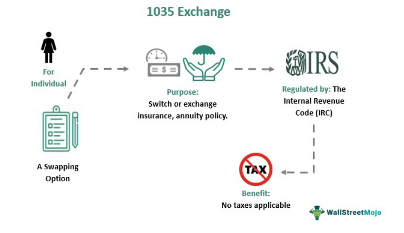

Investing in modern financial markets requires a diverse set of strategies to maximize returns and minimize risks. This article explores the intersection of investment strategies, tax advantages, exchange funds, and algorithmic trading. By understanding the synergy among these elements, investors can make informed decisions to enhance their portfolios. The focus is on how these strategies work together to offer tax efficiency, diversification, and optimized trading outcomes. Readers will gain insights into the potential benefits and considerations of integrating these strategies.

Investment strategies serve as the cornerstone for achieving financial goals while managing risk. A well-structured strategy involves diversifying investments across various asset classes and geographies to balance potential returns with the investor's risk tolerance. Investors can choose from a spectrum of approaches ranging from aggressive to conservative, depending on their financial objectives and risk appetite.



Tax efficiency plays a crucial role in enhancing investment profitability. Investors can leverage certain investment vehicles to defer taxes or reduce capital gains taxes, thereby optimizing net returns. Understanding the tax implications of different strategies is vital for structuring a portfolio that maximizes potential tax benefits, leading to considerable savings.

Exchange funds offer investors the ability to diversify holdings and defer taxes through the exchange of concentrated stock positions for diversified fund shares. This mechanism is particularly appealing to investors with substantial gains who aim to minimize their tax burden. These funds exist in both private and public forms, providing varying levels of investment diversification.

Algorithmic trading employs computer algorithms to execute trades with remarkable speed and precision, a necessity in today's volatile markets. Such automated strategies allow for the efficient handling of large volumes of orders, reducing the need for human intervention. The benefits encompass trading efficiencies and improved alignment with market conditions.

The integration of algorithmic trading with Exchange Traded Funds (ETFs) and exchange funds maximizes investment potential. ETFs offer diversified exposure, while algorithmic trading ensures efficient execution by capitalizing on price discrepancies and automating trades. This synergy allows for optimal portfolio management and risk optimization.

Understanding the roles and interactions of these strategies can considerably bolster investment returns. As financial markets evolve, the importance of these intertwined strategies will only grow. Investors are encouraged to continually educate themselves and adapt to emerging financial innovations.

## Table of Contents

## Understanding Investment Strategies

Investment strategies play a pivotal role in achieving financial objectives while effectively managing risk. These strategies are tailored to accommodate various investment profiles, ranging from aggressive to conservative, based on factors like risk tolerance, investment horizon, and financial goals.

Aggressive investment strategies typically seek higher returns by accepting greater risk. They often involve a higher allocation to equities or [growth stocks](/wiki/growth-stocks), which may offer substantial returns but also come with increased [volatility](/wiki/volatility-trading-strategies). On the other hand, conservative strategies prioritize capital preservation and stability, commonly involving investments in bonds, dividend-yielding stocks, and other lower-risk securities.

A cornerstone of successful investment strategy is diversification, which refers to the practice of spreading investments across different asset classes and geographical regions. The main purpose of diversification is to reduce risk by minimizing the impact of poor performance in a single investment or market sector. For example, by combining stocks, bonds, real estate, and international assets within a portfolio, an investor can potentially smooth out returns and lower overall volatility.

Mathematically, diversification can be understood through the concept of portfolio variance. By having a mix of assets that are not perfectly correlated, the overall variance (and thus risk) of the portfolio can be reduced. This principle is encapsulated in Modern Portfolio Theory, which suggests that an optimally diversified portfolio can achieve a lower level of risk for a given level of expected return.

Another key aspect of investment strategies is the balance between risk and return. Investors aim to achieve a return that compensates for the level of risk they assume. This balance is often visualized through the risk-return trade-off, where higher potential returns are associated with higher risk. To determine the appropriate balance, investors must consider their financial situation, investment objectives, and time horizon.

In essence, understanding and implementing well-crafted investment strategies allows investors to navigate the complexities of financial markets, striving to achieve desired returns while maintaining an acceptable level of risk.

## Tax Advantages of Investment Strategies

Tax efficiency is a critical component of successful investing, as it directly impacts the net returns on an investment portfolio. By understanding and leveraging the tax implications of various investment strategies, investors can enhance their financial outcomes significantly.

One key strategy to achieve tax efficiency is through investment vehicles that offer tax deferral and reduced capital gains taxes. Tax deferral allows investors to delay paying taxes on the earnings from investments until a later date, typically upon withdrawal. This is advantageous as it enables the capital within the investment to continue compounding without the immediate reduction due to taxes. For example, certain retirement accounts such as IRAs and 401(k)s provide tax-deferred growth, which can significantly enhance the eventual value of the portfolio.

Moreover, capital gains taxes can be minimized through specific investment strategies. Long-term investments are typically taxed at a lower rate compared to short-term gains, incentivizing investors to hold assets for longer periods. The U.S. tax code, for example, supports this with a lower tax rate on long-term capital gains compared to regular income tax rates, thus encouraging long-term investment horizons.

Structuring a portfolio to capitalize on such tax advantages can lead to substantial savings over time. A common method to achieve this is by placing highly taxed investments in tax-advantaged accounts, while keeping investments with preferential tax treatment, such as those eligible for long-term capital gains rates, in taxable accounts. This strategy effectively optimizes the overall tax burden on the portfolio.

Tax-loss harvesting is another technique employed to improve tax efficiency. This involves selling losing investments to offset the gains from winning investments, thereby reducing the overall tax liability. The realized losses can offset capital gains and, in some jurisdictions, be used to offset regular income up to a certain limit. This practice requires careful tracking and management, often supported by [algorithmic trading](/wiki/algorithmic-trading) systems to identify the best opportunities for tax-loss harvesting without compromising the overall investment strategy.

Investors should also be aware of the tax treatment of dividends, as qualified dividends are taxed at a lower rate compared to ordinary income. Thus, selecting dividend-paying stocks wisely can further enhance the tax efficiency of an investment portfolio.

The effective use of these strategies requires a comprehensive understanding of both current tax laws and future financial goals. As tax regulations can change, it’s crucial for investors to stay informed and possibly consult with financial advisors to tailor their strategies accordingly. Properly implemented, tax-efficient investment strategies can lead to substantial gains in a portfolio’s long-term performance.

## The Role of Exchange Funds

Exchange funds play a critical role in enabling investors to achieve diversification while deferring capital gains taxes, optimizing both portfolio composition and tax efficiency. An exchange fund, sometimes referred to as a swap fund, allows investors to trade directly held, concentrated equity positions for a diversified basket of securities. This approach is particularly advantageous for those with significant unrealized gains, as it mitigates the immediate capital gains tax liability that would arise from selling an appreciated asset.

Exchange funds operate under a mechanism that allows shareholders to convert their concentrated holdings into shares of a diversified mutual fund. This swap effectively delays capital gains taxes until the investor decides to eventually liquidate their position in the fund. As a result, investors can maintain [liquidity](/wiki/liquidity-risk-premium) and reduce their exposure to potential market volatility tied to a single asset or sector.

There are two primary forms of exchange funds: private and public. Private exchange funds are typically formed through partnerships and are accessible to accredited investors. These funds can offer tailored diversification solutions across a broad range of assets, including real estate, fixed income, and equities, while also providing custom management strategies to meet the specific investment criteria of high-net-worth individuals. Public exchange funds, on the other hand, are available to a wider investor base and are commonly structured as non-publicly traded entities. They provide a simplified and accessible approach to diversification for individual investors with concentrated portfolios.

Both private and public exchange funds share the common goal of supporting investors in their pursuit of diversification without triggering substantial tax events. The strategic use of these funds can lead to a more balanced risk exposure and preservation of wealth, aligning investment outcomes with long-term financial planning. Investors considering exchange funds should carefully assess the underlying assets of the funds, associated fees, and the terms of the exchange to ensure compatibility with their investment goals and risk tolerance.

## Algorithmic Trading in Modern Investment

Algorithmic trading employs sophisticated computer algorithms to conduct trades with high efficiency, utilizing pre-defined criteria to make decisions. This approach optimizes the trading process by leveraging computational resources to execute orders at speeds and accuracies beyond human capability, crucial in today's fast-paced and volatile financial markets. 

The foundation of algorithmic trading lies in its ability to analyze vast datasets and identify trading opportunities with minimal latency. By automating the trading process, it significantly reduces manual errors and ensures consistent application of trading strategies. Modern algorithms are designed to quickly adapt to changing market conditions and can be customized to implement highly complex trading strategies that account for various market indicators and signals.

One of the primary advantages of algorithmic trading is its capability to handle large volumes of transactions with minimal human oversight. This is particularly beneficial for institutional investors aiming to execute substantial trades without materially affecting the market price. By employing strategies such as statistical [arbitrage](/wiki/arbitrage), [momentum](/wiki/momentum) trading, and [market making](/wiki/market-making), algorithms can efficiently process trades that fulfill specific objectives, such as minimizing transaction costs or maximizing liquidity.

The efficiency of algorithmic trading is enhanced through sophisticated models and [machine learning](/wiki/machine-learning) techniques. Python, a favored language in the financial industry, provides numerous libraries like NumPy and pandas for data manipulation, while scikit-learn and TensorFlow facilitate machine learning applications. Here's a simple example demonstrating how one might use Python for a basic trading strategy:

```python
import pandas as pd
import numpy as np

# Simulated moving average crossover strategy
def moving_average_strategy(prices, short_window=40, long_window=100):
    signals = pd.DataFrame(index=prices.index)
    signals['price'] = prices
    signals['short_mavg'] = prices.rolling(window=short_window, min_periods=1, center=False).mean()
    signals['long_mavg'] = prices.rolling(window=long_window, min_periods=1, center=False).mean()
    signals['signal'] = 0.0
    signals['signal'][short_window:] = np.where(signals['short_mavg'][short_window:] > signals['long_mavg'][short_window:], 1.0, 0.0)
    signals['positions'] = signals['signal'].diff()

    return signals

# Example usage with hypothetical price data
prices = pd.Series([10, 11, 12, 13, 14, 13, 12, 11, 12, 13, 14, 15, 16])
signals = moving_average_strategy(prices)

print(signals)
```

Algorithmic trading aligns with market conditions through features such as [backtesting](/wiki/backtesting) and scenario analysis, allowing traders to refine their strategies by understanding their past performance and potential future outcomes. The integration of real-time data and advanced analytics ensures that the trading strategies remain aligned with current market dynamics, mitigating risks and enhancing decision-making efficacy.

While algorithmic trading offers numerous efficiencies, it also presents challenges, including the risk of over-optimization and the need for robust technological infrastructure. Continuous advancements in computing power and data analytics, however, promise to further augment its capabilities, making algorithmic trading an indispensable tool in modern investment strategies.

## Integrating Algo Trading with ETFs and Exchange Funds

ETFs (Exchange Traded Funds) offer investors broad diversification by allowing them to hold a diversified portfolio of assets such as stocks, bonds, or commodities, typically through a single investment vehicle. This diversification reduces the risk associated with investing in individual securities. Meanwhile, algorithmic trading leverages advanced algorithms and computational power to execute trades with remarkable speed and precision, often beyond human capability. This method optimizes the trading process, particularly in fast-moving and volatile markets, by automatically responding to price changes and market conditions.

The integration of algorithmic trading with ETFs and exchange funds serves to enhance investment potential through several means. Firstly, ETFs are inherently attractive for algorithmic trading due to their liquidity and transparency. Algorithmic traders can exploit price discrepancies between ETFs and their underlying assets or between similar ETFs across different markets. For instance, if an [ETF](/wiki/etf-trading-strategies) is trading at a price different from the net asset value (NAV) of its underlying securities, algorithms can execute arbitrage strategies to capitalize on this discrepancy.

Python Example: Identifying and executing on price discrepancies can be illustrated with a simple trading strategy using an algorithmic approach. Below is an example where Python might be used to automate such a strategy:

```python
import pandas as pd
import numpy as np

# Simulated data for illustration
nav_prices = pd.Series([100, 102, 98, 101, 105])
etf_prices = pd.Series([100, 101, 99, 102, 106])

# Calculate price discrepancies between ETF and NAV
discrepancies = etf_prices - nav_prices

# Trading strategy: Buy ETF when it's undervalued, sell when overvalued
buy_signals = discrepancies < -1
sell_signals = discrepancies > 1

# Display the buy and sell signals
print("Buy Signals:\n", buy_signals)
print("Sell Signals:\n", sell_signals)
```

This script illustrates the basic premise behind a reversion strategy, where significant deviations from NAV trigger a trading decision. In reality, algorithmic trading strategies are far more complex, involving elements like machine learning and real-time data analysis.

Moreover, exchange funds provide an additional layer of diversification by allowing investors to swap large, concentrated positions in individual stocks for shares in a diversified fund, ultimately helping manage risk and tax liabilities. Algorithmic trading can enhance this approach by ensuring trades are executed swiftly and at optimal prices, thus minimizing transaction costs and slippage.

Incorporating algorithmic strategies with ETFs and exchange funds allows investors to automate their portfolio management, thereby optimizing the risk-return profile of their investments. As financial markets become increasingly sophisticated and technology-driven, the confluence of these elements is set to play a pivotal role in how investors manage and enhance their portfolios.

## Conclusion

Investment strategies, tax advantages, exchange funds, and algorithmic trading represent interconnected tools vital for modern investors. By understanding and implementing these elements, investors can significantly enhance their portfolio returns and risk management capabilities.

Investment strategies offer a foundation for decision-making by balancing potential returns with acceptable levels of risk, thereby helping investors align their portfolios with their financial objectives. Tax advantages further optimize net returns by allowing investors to minimize their tax burden through structured investments and strategic asset allocations.

Exchange funds serve a dual purpose: they offer diversification for concentrated holdings and provide opportunities for tax deferment. This makes them particularly appealing for investors seeking to hedge against specific risks while minimizing potential tax liabilities. Investors can align these tools for more effective long-term wealth accumulation by integrating exchange funds into their broader investment strategies.

Algorithmic trading has revolutionized how trades are executed, ensuring greater speed and accuracy, crucial in today's volatile markets. By automating trading processes, algorithmic strategies allow investors to capitalize on market opportunities with minimal human intervention, aligning trades closely with market dynamics and efficiently processing large volumes of transactions.

As financial markets continue to evolve, the integration of these strategies will play an increasingly important role. Staying informed and adaptable is essential for investors looking to leverage new financial innovations effectively. A keen understanding of how these tools work together will empower investors to optimize their portfolios for maximum returns and controlled risk exposure, cementing their place in the rapidly changing landscape of modern finance.

## References & Further Reading

Abner, D. J., "The ETF Handbook: How to Value and Trade Exchange Traded Funds" provides an in-depth exploration of Exchange Traded Funds (ETFs), covering valuation, trading mechanisms, and practical applications for portfolio management. This resource is valuable for investors looking to enhance their understanding of ETFs and their role in a diversified investment strategy.

Johnson, B., "Algorithmic Trading and DMA: An Introduction to Direct Access Trading Strategies" offers a comprehensive guide to algorithmic trading, including the development and implementation of strategies that capitalize on market opportunities. This book is an essential reference for investors interested in leveraging technology for improved trading efficiency and execution.

Carrel, L., "ETFs for the Long Run: What They Are, How They Work, and Simple Strategies for Successful Long-Term Investing" discusses the fundamentals and long-term benefits of investing in ETFs. The author provides insights into how these financial instruments can be effectively integrated into investment portfolios to achieve diversification and risk management objectives.

Investopedia and other financial resources provide extensive information on the mechanisms and benefits of exchange funds and algorithmic trading. These resources offer valuable insights into the strategic integration of these elements within modern investment practices, enabling investors to optimize their portfolios and achieve tax efficiency.