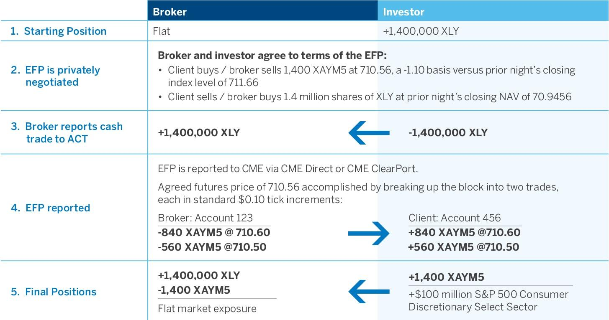

Futures trading represents a vital component of commodity exchange markets, providing participants with opportunities to generate profit and effectively manage risk. This dynamic sector involves various strategies, among which the Exchange of Futures for Physical (EFP) distinguishes itself as a unique transaction mechanism. EFP is a private agreement allowing the swap of futures positions for corresponding physical assets. This exchange can be instrumental for market participants seeking to open or close futures positions or transition them seamlessly to physical commodities.

The interplay between EFP transactions and algorithmic trading strategies amplifies the strategic value of this mechanism in contemporary markets. Algorithmic trading, through automation, enhances the efficiency of EFP by rapidly processing large transaction volumes, thereby optimizing price discovery and trade execution. This technological integration has broadened the scope for managing market impact and improving risk management.



This article explores EFP's strategic importance within commodity exchanges, highlighting its benefits and practical applications. By examining real-world examples and identifying emerging trends, we aim to provide a comprehensive understanding of EFP's role and its potential future evolution in conjunction with algorithmic trading advancements. Understanding these dynamics is crucial for participants seeking competitive advantages in the ever-evolving landscape of commodity trading.

## Table of Contents

## Understanding EFP Transactions

Exchange of Futures for Physical (EFP) is a pivotal mechanism in futures trading, characterized by a private arrangement between two parties to exchange futures contracts for the corresponding physical commodities. This transaction is distinct from regular futures contracts as it allows direct swapping, either to establish or terminate futures positions, thereby offering flexibility and alignment with market requirements.

EFP transactions typically occur in the over-the-counter (OTC) market, meaning they are negotiated directly between the parties involved rather than on a centralized exchange. This OTC nature grants participants the ability to tailor the terms of the trade to suit their specific needs, which can be particularly advantageous for commodity producers looking to hedge against price volatility or align their physical supply chain with futures market positions. Producers, traders, and other market participants regularly use EFPs to ensure a seamless transition between their physical inventories and financial market engagements, thus managing risks more efficiently.

In essence, EFP transactions act as a bridge between the financial and physical aspects of commodity markets, providing a mechanism for aligning financial futures positions with actual physical commitments. This alignment not only aids in optimizing inventory management but also in achieving strategic financial objectives in line with market conditions. By enabling the swap of futures for physical goods, EFPs provide valuable liquidity and risk mitigation opportunities, reinforcing their importance in the broader commodity trading landscape.

## The Role of EFP in Commodity Exchanges

Commodity exchanges play a pivotal role in facilitating Exchange of Futures for Physical (EFP) transactions by providing a structured marketplace for the seamless transition between futures contracts and physical commodities. These transactions offer a mechanism for market participants to efficiently manage their positions and inventory, contributing to overall market stability.

EFP transactions act as a bridge linking futures markets to the physical markets. They are integral in balancing supply and demand dynamics without causing abrupt disruptions. For instance, a participant holding a futures contract can opt to swap this for the actual physical commodity. This ability to directly exchange positions helps in maintaining market equilibrium. Large trades conducted through EFPs spread the impact across the market, thus avoiding the [volatility](/wiki/volatility-trading-strategies) that could arise from sudden large-scale buying or selling in the futures market.

Producers and refiners, among others, often leverage EFP transactions as strategic tools to align their physical supply needs with their futures market activities. For producers, EFPs provide a method to lock in prices for the commodities they produce, thus ensuring revenue certainty despite potential fluctuations in market prices. Refiners, on the other hand, can strategically secure supplies at known prices, which is critical for planning production schedules and managing costs.

By mitigating the price risk and offering a structured process for significant market positions, EFP transactions contribute positively to the [liquidity](/wiki/liquidity-risk-premium) and functioning of the commodities market. This efficiency not only supports individual market players but also enhances the robustness and resilience of the markets as a whole.

## Algorithmic Trading and EFP

Algorithmic trading significantly enhances the execution of Exchange of Futures for Physical (EFP) transactions by automating key processes such as price discovery and trade execution. These technological advancements have allowed for more efficient handling of large transaction volumes, which is critical in minimizing the market impact that can accompany substantial trades.

At the core of [algorithmic trading](/wiki/algorithmic-trading)'s integration with EFP is its capacity for swift data processing and decision-making. By leveraging algorithmic systems, trades can be executed at optimal prices, ensuring that market participants maximize gains while minimizing costs. The algorithms used in EFP transactions continuously analyze market data, adjusting positions in real time to align with pre-defined strategies. This approach facilitates the execution of large trades without causing significant price fluctuations.

Moreover, automated systems in algorithmic trading enhance EFP strategies by optimizing risk management and cost reduction. These systems can incorporate complex models that evaluate various market variables and predict potential outcomes, enabling traders to make informed decisions. The risk management frameworks built into these algorithms often include mechanisms to hedge against adverse price movements, further stabilizing the trading process.

Here's a simplified example of how algorithmic trading might be implemented in a Python-based environment for an EFP strategy:

```python
import numpy as np

def calculate_optimal_trade(price_data, volume_data, risk_tolerance):
    """
    Calculate the optimal trade size and timing based on price and [volume](/wiki/volume-trading-strategy) data.

    :param price_data: List or array of recent prices
    :param volume_data: List or array of recent volumes
    :param risk_tolerance: User-defined risk tolerance level
    :return: Optimal trade size and execution signal
    """
    prices = np.array(price_data)
    volumes = np.array(volume_data)

    average_price = np.mean(prices)
    optimal_volume = np.median(volumes) * risk_tolerance

    # Define a basic execution signal
    if average_price < np.max(prices) * 0.95:  # Buy if current average price is lower than 95% of recent high
        return optimal_volume, 'buy'
    else:
        return optimal_volume, 'hold'

# Example usage
price_data = [100, 102, 101, 104, 103]
volume_data = [200, 210, 190, 205, 200]
risk_tolerance = 0.5

trade_size, signal = calculate_optimal_trade(price_data, volume_data, risk_tolerance)
print(f"Trade size: {trade_size}, Signal: {signal}")
```

This code snippet represents a basic algorithm that could be part of a more comprehensive EFP trading system. It processes market data to decide whether to execute a trade based on recent price movements and trading volumes, adjusted by a user's risk tolerance. Such algorithms can be scaled up and modified to handle more complex market conditions and trading requirements.

As algorithmic trading continues to evolve, the integration with EFP transactions will likely become even more sophisticated, enabling traders to leverage advanced technologies like [artificial intelligence](/wiki/ai-artificial-intelligence) to refine their strategies and achieve better market outcomes.

## Case Studies and Examples

One of the prevalent examples of Exchange of Futures for Physical (EFP) transactions occurs within the oil sector, where companies strategically exchange futures contracts for physical oil. This approach aligns with their business objectives, particularly in managing supply chains and hedging against volatile oil prices. These transactions allow companies to secure actual oil supplies to meet their operational needs while mitigating the risks associated with fluctuating futures prices.

For instance, an oil refinery may engage in an EFP transaction to acquire physical barrels of [crude oil](/wiki/crude-oil) in exchange for futures contracts it holds. By doing so, the refinery can assure itself of a stable supply of crude oil to refine, thus securing its production line against price volatility and potential supply chain disruptions. This strategic move not only stabilizes inventory levels but also ensures consistent product availability for the refinery's sales commitments.

Beyond the oil industry, EFPs are prevalent in various other commodities sectors. In the agricultural domain, for example, grain producers might employ EFPs to manage their exposure to the futures market while securing physical grain supplies. A grain producer with a substantial position in wheat futures might exchange these for the actual wheat required for processing or distribution, optimizing inventory management and aligning with production schedules.

EFP transactions are beneficial for participants aiming to achieve specific strategic outcomes, such as liquidity enhancement, inventory alignment, or cost management. A metals trader, dealing in copper, might exchange futures for physical metal to meet immediate demand from industrial clients. This practical application ensures the trader can fulfill client orders without detrimentally affecting market prices through large, direct market transactions.

These real-world examples demonstrate how EFP transactions are not merely tools for hedging but also strategic instruments that facilitate operational goals across different sectors. As these trades take place over-the-counter (OTC), they offer the flexibility and confidentiality that many large market participants require. However, they also require careful coordination and a deep understanding of market dynamics to execute effectively.

In programming terms, implementing algorithms to optimize EFP transactions may involve processing large datasets and executing trades rapidly. Using Python libraries such as Pandas for data manipulation and NumPy for numerical operations, market participants can build models to predict price movements and decide the optimal timing and structure for EFP transactions.

```python
import pandas as pd
import numpy as np

# Example of data processing for EFP transactions
# Assume we have a DataFrame `futures_data` with futures prices and `physical_data` with current physical assets prices

# Sample function to calculate optimal EFP transaction points
def calculate_efp_opportunities(futures_data, physical_data):
    # Calculate price differentials
    price_differential = futures_data['Price'] - physical_data['Price']

    # Define a threshold for executing an EFP
    threshold = 5.0  # This is an arbitrary threshold for the example

    # Identify opportunities where the price differential exceeds the threshold
    efp_opportunities = price_differential[price_differential > threshold]

    return efp_opportunities

# Example data
futures_data = pd.DataFrame({'Price': np.random.uniform(150, 200, 100)})
physical_data = pd.DataFrame({'Price': np.random.uniform(145, 195, 100)})

# Calculate EFP opportunities
efp_opportunities = calculate_efp_opportunities(futures_data, physical_data)
print(efp_opportunities)
```
This code snippet illustrates a simplified method to identify potential EFP transaction points by evaluating the price differences between futures and physical prices, aiding in strategic decision-making for market participants.

## Benefits and Challenges of EFP

Exchange of Futures for Physical (EFP) transactions offer several advantages and challenges in the context of commodity trading. One significant benefit of EFP transactions is their ability to provide liquidity to markets. By facilitating the exchange of futures contracts for the corresponding physical commodities, EFPs help maintain market fluidity. This contributes to a more efficient allocation of resources and helps prevent market bottlenecks, allowing both producers and consumers to better manage their cash flow and inventory needs.

EFPs also play a crucial role in mitigating price risk. By allowing market participants to swap futures for physical commodities, EFPs enable them to lock in prices and safeguard against adverse price movements. This is particularly beneficial in volatile markets, where price fluctuations can significantly impact profitability. For instance, producers can secure a fixed price for their output, thereby stabilizing their revenue streams, while buyers can lock in costs, which is essential for budgeting and financial planning.

Additionally, EFP transactions offer flexible terms to participants. Unlike standard futures contracts that trade on exchanges with standardized terms, EFPs are negotiated privately, allowing the parties involved to tailor the transaction to their specific needs. This flexibility can lead to more favorable terms concerning delivery dates, quality specifications, or credit terms, providing a tailored solution that aligns with the strategic objectives of the trading partners.

Despite these benefits, EFP transactions also pose challenges, particularly in terms of regulatory compliance. EFPs are often conducted over-the-counter (OTC), which can complicate regulatory oversight due to the less standardized nature of these trades compared to traditional exchange-traded contracts. Market participants must ensure compliance with relevant regulations, such as those enforced by the Commodity Futures Trading Commission (CFTC) in the United States, which can vary significantly across different jurisdictions.

Moreover, EFP transactions can become complex in international markets. Navigating regulatory requirements across borders, dealing with currency exchange risks, and aligning logistical considerations for the physical delivery of commodities add layers of complexity. These issues require thorough due diligence and a deep understanding of both the legal and logistical frameworks involved in the international trade of commodities.

In conclusion, while EFP transactions serve as a vital mechanism in commodity trading by providing liquidity, mitigating price risks, and offering flexible terms, they also entail challenges, particularly concerning regulatory compliance and complexities in international markets. Market participants must weigh these factors carefully to maximize the benefits while minimizing the inherent challenges of EFP transactions.

## The Future of EFP in Algo Trading

The integration of artificial intelligence (AI) and [machine learning](/wiki/machine-learning) into algorithmic trading frameworks is revolutionizing the execution of Exchange of Futures for Physical (EFP) transactions. These advanced technologies facilitate enhanced data analysis capabilities, providing trading algorithms with the ability to process vast datasets at unprecedented speeds. This capability is crucial for EFP transactions, where timely and accurate market data is essential for effective decision-making.

Machine learning models, particularly those employing [deep learning](/wiki/deep-learning) techniques, can predict market trends and identify optimal transaction timings by analyzing historical market data and recognizing patterns. These predictive analytics improve the execution of EFPs, allowing market participants to anticipate price movements and execute trades more efficiently. For instance, a [neural network](/wiki/neural-network) model could be trained to detect shifts in commodity prices, thereby advising traders on the best moments to conduct EFPs, optimizing for cost and market impact reduction.

Moreover, AI-driven strategies can assess the correlation between futures prices and their associated physical commodities. By analyzing these relationships, algorithms can determine pricing discrepancies and opportunities for profitable trades. This aids in aligning futures positions with physical market strategies, enhancing the strategic utility of EFPs.

As technology progresses, the role of real-time analytics in algorithmic trading will expand, making EFPs more integrated into broader trading strategies. Automation will likely handle complex EFP mechanics, from transaction initiation to settlement, reducing human error and increasing efficiency. Additionally, advancements in blockchain technology might be leveraged to ensure greater transparency and security in EFP transactions, providing immutable records that simplify compliance and auditing processes.

In conclusion, the rise of AI and machine learning holds significant promise for the future of EFP transactions within algorithmic trading. These technologies not only enhance execution efficiency and strategic alignment but also offer a pathway towards more seamless integration within comprehensive trading strategies. As these tools continue to evolve, they will likely drive further innovations and efficiencies in the landscape of commodity trading.

## Conclusion

Exchange of Futures for Physical (EFP) remains a crucial element of the futures market landscape. By facilitating the exchange between futures contracts and physical assets, EFP offers traders the flexibility needed to manage funds efficiently and control physical inventory in alignment with market movements. 

The integration of algorithmic trading into EFP transactions offers notable advancements in market efficiency and strategic execution. Algorithmic trading can optimize EFP strategies by utilizing automated systems that streamline the execution processes, ensuring trades are executed with minimal market impact. This innovation aids in significant risk management and potentially reduces transaction costs by using complex algorithms that can quickly analyze market data to determine the most advantageous moments to execute trades.

Understanding the intricacies of EFPs and the ability to leverage these transactions can provide significant advantages in competitive commodity trading. Mastery of EFP strategies, when combined with algorithmic trading, enhances a trader's ability to respond to market volatility with greater agility and precision. Such capabilities can lead to increased liquidity and improved price risk mitigation while maintaining flexible transaction terms under dynamic market conditions.

As markets continue to evolve with technological advances, the potential for EFPs to play a larger role in comprehensive trading strategies is substantial. Fully harnessing this potential requires continuous innovation and adaptation to new tools and methodologies. The future of EFP transactions looks promising, as they are progressively integrated into trading strategies, driving efficiency and offering competitive advantages to those adept in their use.

## References & Further Reading

[1]: ["Trading Commodities and Financial Futures: A Step-by-Step Guide to Mastering the Markets"](https://www.amazon.com/Trading-Commodities-Financial-Futures-Step/dp/0134087186) by George Kleinman

[2]: Hull, J. C. (2017). ["Options, Futures, and Other Derivatives"](https://www.semanticscholar.org/paper/Options%2C-Futures%2C-and-Other-Derivatives-Hull/89bdee500c8623864fc9eb7a471546aa713acc44), Pearson.

[3]: Mathias, D. (2011). ["The Exchange of Futures for Physical (EFP)"](https://www.ice.com/publicdocs/futures/ICE_WTI_EFP_Explained.pdf), in: Dictionary of Financial Derivatives. Palgrave Macmillan, London.

[4]: ["Algorithmic Trading: Winning Strategies and Their Rationale"](https://www.wiley.com/en-us/Algorithmic+Trading%3A+Winning+Strategies+and+Their+Rationale-p-9781118460146) by Ernest P. Chan

[5]: Kissell, R. (2013). ["The Science of Algorithmic Trading and Portfolio Management"](https://www.sciencedirect.com/book/9780124016897/the-science-of-algorithmic-trading-and-portfolio-management), Academic Press.