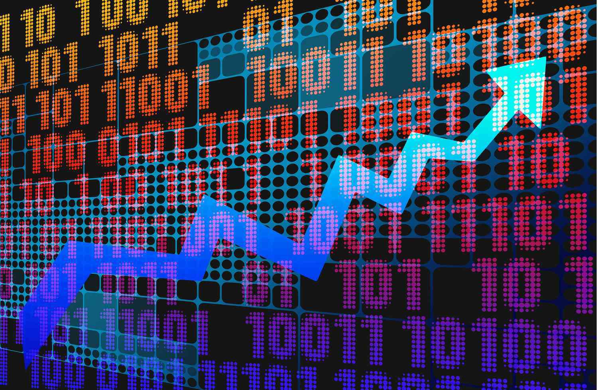

## Table of Contents

## What is exchange privilege and how does it work?

Exchange privilege is a feature that some mutual funds offer to their investors. It lets you move your money from one mutual fund to another within the same fund family without having to pay fees or taxes right away. This can be useful if you want to change your investment strategy or if you think another fund in the same family might perform better.

When you use the exchange privilege, you sell your shares in one fund and use the money to buy shares in another fund. This process is usually quick and easy, often done online or over the phone. However, it's important to remember that even though you don't pay taxes immediately, the exchange is considered a sale and a purchase for tax purposes, so you might have to pay taxes later when you sell the new shares. Also, some funds might limit how often you can use this privilege to prevent too much trading.

## What are the basic requirements to use exchange privilege?

To use exchange privilege, you need to have investments in a mutual fund that offers this feature. This means the fund company must allow you to move your money from one of their funds to another without charging you extra fees. You also need to follow the rules set by the fund company, like how often you can make exchanges.

Usually, you can make an exchange by contacting the fund company through their website, by phone, or sometimes by mail. You'll need to provide details about which fund you're moving money from and which fund you want to move it to. Remember, even though you don't pay taxes right away, the exchange counts as selling one investment and buying another, so you might have to pay taxes later when you sell the new shares.

## Can you explain the difference between exchange privilege and other investment strategies?

Exchange privilege is a specific feature offered by some mutual funds that lets you move your money from one fund to another within the same fund family without paying extra fees or taxes right away. This is different from other investment strategies because it's focused on making changes within a single fund family. For example, if you think one fund in the family might do better than the one you're currently invested in, you can switch without the usual costs.

Other investment strategies might include things like dollar-cost averaging, where you invest a fixed amount of money at regular intervals, or diversification, where you spread your investments across different types of assets to reduce risk. These strategies don't involve switching between funds within the same family. Instead, they focus on how you manage your investments over time or how you spread them out. Exchange privilege is more about making tactical changes within a specific set of funds.

## How does exchange privilege affect my investment portfolio?

Exchange privilege can help you change your investment portfolio easily. If you think another fund in the same family might do better, you can switch your money without paying extra fees or taxes right away. This means you can quickly adjust your investments if you see a better opportunity within the same fund family.

However, using exchange privilege a lot can affect your portfolio in other ways. Each time you switch, it's like selling one investment and buying another. This can lead to taxes later when you sell the new shares. Also, if you switch too often, some funds might limit how much you can do this. So, while it's a useful tool, you need to use it carefully to keep your portfolio balanced and avoid extra costs.

## What are the common fees associated with using exchange privilege?

When you use exchange privilege, you usually don't have to pay any fees to switch your money from one fund to another within the same fund family. This is the main benefit of using exchange privilege, as it lets you make changes without extra costs. However, some funds might charge a small fee if you switch too often, to stop people from trading too much.

Even though you don't pay fees right away, remember that each exchange is like selling one investment and buying another. This can lead to taxes later when you sell the new shares. So, while exchange privilege can help you change your investments easily, you need to think about the tax impact it might have on your portfolio in the future.

## What are the tax implications of using exchange privilege?

When you use exchange privilege, you move your money from one fund to another within the same family. This is seen as selling the shares of the first fund and buying shares in the second fund. Even though you don't pay taxes right away when you switch, the IRS sees it as a taxable event. This means you might have to pay taxes later when you sell the new shares, depending on how much they've grown in value.

If the shares you're selling have gone up in value since you bought them, you'll have a capital gain. If you've held them for more than a year, it's a long-term capital gain, which usually has a lower tax rate. If you've held them for less than a year, it's a short-term capital gain, which is taxed at your regular income tax rate. So, while exchange privilege lets you switch funds easily without fees, you need to think about the taxes you might owe later on.

## How can exchange privilege be used as part of a broader investment strategy?

Exchange privilege can be a helpful part of a bigger investment plan. It lets you move your money between different funds in the same family without paying extra fees or taxes right away. This means you can change your investments easily if you see a better opportunity in another fund. For example, if you think a different fund might do better because of changes in the market, you can switch your money quickly. This can help you keep your portfolio in line with your goals and the current market situation.

However, using exchange privilege should be done carefully. It's important to think about the taxes you might owe later. Each time you switch, it's like selling one investment and buying another. This can lead to taxes when you sell the new shares, especially if they've grown in value. So, while exchange privilege is a useful tool, it should be part of a well-thought-out strategy that also considers other ways to manage your investments, like diversification or dollar-cost averaging. This way, you can make the most of the flexibility exchange privilege offers without running into unexpected costs.

## What are the risks involved with using exchange privilege?

Using exchange privilege to switch your money between funds in the same family can be risky. One big risk is that you might make too many switches. If you do this a lot, the fund company might charge you a fee or limit how often you can switch. Also, every time you switch, it's like selling one investment and buying another. This can mess up your long-term investment plan if you're not careful.

Another risk is taxes. When you switch funds, you don't pay taxes right away, but the IRS sees it as a sale and a purchase. If the shares you're selling have gone up in value, you'll have to pay taxes on that gain later when you sell the new shares. This can be a surprise if you're not ready for it. So, while exchange privilege can help you change your investments easily, you need to think about these risks and use it wisely.

## How does market volatility impact the effectiveness of exchange privilege?

Market [volatility](/wiki/volatility-trading-strategies) can make exchange privilege more useful but also riskier. When the market is going up and down a lot, you might see a chance to switch your money to a fund that you think will do better in the current situation. This can help you take advantage of the market changes and possibly make more money. But, it's tricky because the market can be hard to predict. If you switch too often or at the wrong time, you might end up losing money instead of gaining.

Also, when the market is volatile, the value of your investments can change a lot in a short time. If you use exchange privilege to switch funds, you might end up selling shares that have gone down in value, which can lead to losses. And remember, each time you switch, it's like selling and buying, so you'll have to think about the taxes you might owe later. So, while exchange privilege can be a good tool during market ups and downs, you need to be careful and think about the risks before you make any moves.

## Can you provide examples of successful use of exchange privilege in various market conditions?

During a bull market, when stock prices are going up, exchange privilege can be used to move money from a fund that's not doing as well to one that's doing better. For example, if you see that tech stocks are doing really well, you might switch your money from a general stock fund to a tech-focused fund. This way, you can take advantage of the growing market and possibly make more money. But you need to be careful because if the market suddenly changes, you might lose some of your gains.

In a bear market, when prices are falling, exchange privilege can help you move to safer investments. For instance, if you think the market is going to keep going down, you might switch from a stock fund to a bond fund or a money market fund. This can help protect your money from big losses. However, you need to remember that each switch is like selling and buying, so you might have to pay taxes later on any gains you made before switching.

During times of high market volatility, when prices are swinging a lot, exchange privilege can be used to adjust your investments quickly. For example, if you see that a certain sector like healthcare is doing well even when the rest of the market is shaky, you might switch some of your money into a healthcare fund. This can help you make the most of the good parts of the market while trying to avoid the bad parts. But, it's important to not switch too often, as this can lead to fees and taxes that might eat into your returns.

## What advanced techniques can be employed to optimize the use of exchange privilege?

To make the most of exchange privilege, you can use a strategy called tactical asset allocation. This means you watch the market closely and switch your money to funds that you think will do well in the short term. For example, if you see that technology stocks are doing great, you might move your money from a general stock fund to a tech fund. But, you need to be careful not to switch too often. Doing this a lot can lead to fees from the fund company and taxes later when you sell the new shares. So, it's important to think about the costs and not just the potential gains.

Another advanced technique is using exchange privilege to rebalance your portfolio. This means you keep an eye on your investments and make sure they stay in line with your long-term goals. If one part of your portfolio grows a lot more than the others, you might switch some of that money to other funds to keep things balanced. This can help you manage risk and keep your investments on track. But, like with tactical asset allocation, you need to think about the tax impact. Each switch counts as a sale and a purchase, so you might owe taxes later on any gains you made before switching.

## How does regulatory environment affect the availability and operation of exchange privilege?

The rules set by government and financial groups can change how exchange privilege works and if it's even available. For example, the IRS says that switching funds is like selling one and buying another, so you might have to pay taxes later. Also, the SEC and other groups make rules to stop people from trading too much, which can affect how often you can use exchange privilege. If the rules change, fund companies might have to change their policies too, like adding fees for too many switches or limiting how often you can switch.

These rules are there to protect investors and keep the market fair. But they can make using exchange privilege trickier. You need to keep up with any changes in the rules and understand how they might affect your investments. This way, you can use exchange privilege wisely and avoid surprises like extra fees or taxes.

## References & Further Reading

[1]: Manganiello, Lou (2021). ["Algorithmic Trading: Investment Strategies for High Returns."](https://www.msn.com/en-us/movies/news/43-actors-you-may-not-realize-are-from-pennsylvania/ar-AA1wtWnS) Investopedia.

[2]: Aldridge, I. (2013). ["High-Frequency Trading: A Practical Guide to Algorithmic Strategies and Trading Systems."](https://www.amazon.com/High-Frequency-Trading-Practical-Algorithmic-Strategies/dp/1118343506) Wiley Finance.

[3]: Engel, Emil Lee and Ter Horst, Enrique and McConnell, John J., ["The Use of Exchange Privileges in the Mutual Fund Industry"](https://papers.ssrn.com/sol3/papers.cfm?abstract_id=470927), (July 30, 2001).

[4]: Narang, R. (2013). ["Inside the Black Box: A Simple Guide to Quantitative and High Frequency Trading."](https://onlinelibrary.wiley.com/doi/book/10.1002/9781118662717) Wiley.

[5]: Johnson, Barry E. and Lewis, Bruce, ["Mutual Fund Trading Abuses"](https://play.google.com/store/books/details/Promoting_Early_Career_Teacher_Resilience_A_socio_?id=sONzCgAAQBAJ&hl=en-US) (2004).

[6]: ["Algorithmic and High-Frequency Trading"](https://assets.cambridge.org/97811070/91146/frontmatter/9781107091146_frontmatter.pdf) by Álvaro Cartea, Sebastian Jaimungal, and José Penalva

[7]: ["The Quants: How a New Breed of Math Whizzes Conquered Wall Street and Nearly Destroyed It"](https://www.amazon.com/Quants-Whizzes-Conquered-Street-Destroyed/dp/0307453383) by Scott Patterson