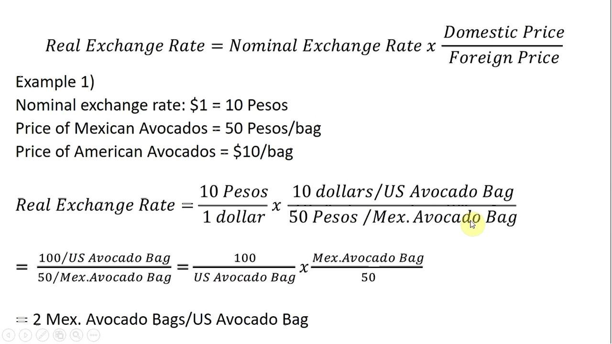

## Table of Contents

## What is an exchange rate?

An exchange rate is the value of one country's currency compared to another country's currency. It tells you how much of one currency you need to buy another currency. For example, if you want to buy US dollars with Euros, the exchange rate will tell you how many Euros you need for one US dollar.

Exchange rates are important because they affect international trade and travel. If the exchange rate between the US dollar and the Euro changes, it can make things more expensive or cheaper for people traveling between the US and Europe. Businesses that buy and sell goods across countries also need to pay attention to exchange rates because it impacts their costs and profits.

## Why do exchange rates fluctuate?

Exchange rates change because of many reasons. One big reason is how much people want to buy or sell a country's money. If more people want to buy a country's money, its value goes up. If more people want to sell it, its value goes down. This can happen because of things like how well a country's economy is doing, or if people think it will do well in the future.

Another reason is interest rates. If a country's interest rates go up, more people might want to put their money there to get a better return. This can make the country's money more valuable. Also, big events like elections or natural disasters can make people worried about a country's money, so they might sell it, which makes its value drop.

Sometimes, governments and big banks can also affect exchange rates. They might buy or sell their own money to try to keep its value stable. Other countries might do the same thing, which can lead to a kind of tug-of-war over exchange rates. All these things together make exchange rates go up and down every day.

## How do you calculate the exchange rate between two currencies?

To calculate the exchange rate between two currencies, you need to know how much one currency is worth in terms of the other. For example, if you want to know how many US dollars you can get for one Euro, you look at the current exchange rate. Let's say the exchange rate is 1 Euro = 1.10 US dollars. This means if you have 1 Euro, you can get 1.10 US dollars.

Exchange rates are usually shown as a ratio, like 1:1.10 in our example. To find out how many Euros you need to buy a certain amount of US dollars, you divide the amount of US dollars by the exchange rate. For instance, if you want to buy 110 US dollars, you divide 110 by 1.10, which equals 100 Euros. So, you need 100 Euros to get 110 US dollars. Exchange rates change all the time, so you need to use the most recent rate to get the right amount.

## What are the different methods used to quote exchange rates?

There are two main ways to quote exchange rates: the direct quote and the indirect quote. A direct quote tells you how much of the local currency you need to buy one unit of a foreign currency. For example, if you live in the US, a direct quote might tell you that 1 Euro costs 1.10 US dollars. This means you need 1.10 US dollars to get 1 Euro. Direct quotes are common in places like the US and Canada.

An indirect quote, on the other hand, tells you how much of a foreign currency you can get with one unit of the local currency. Using the same example, an indirect quote might say that 1 US dollar can buy 0.91 Euros. This means if you have 1 US dollar, you can get 0.91 Euros. Indirect quotes are often used in countries like the UK and Australia. Both methods give you the same information, just in different ways.

## What is the difference between a spot rate and a forward rate?

A spot rate is the exchange rate you get right now if you want to trade one currency for another. It's like the price you see today for buying or selling money. For example, if you want to buy US dollars with Euros today, the spot rate tells you how many Euros you need for one US dollar. Spot rates are used for immediate transactions and can change every day or even every minute because of things like news or economic changes.

A forward rate, on the other hand, is an exchange rate that you agree on today but use in the future. It's like making a deal now to buy or sell money at a certain price later. For example, you might agree today to buy US dollars with Euros in three months at a set rate. Forward rates help businesses and people plan for the future because they can lock in a price and avoid surprises if the spot rate changes a lot. The forward rate is often based on what people think the spot rate will be in the future, plus other factors like interest rates.

## How do central banks influence exchange rates?

Central banks can influence exchange rates in a few ways. One way is by changing interest rates. If a central bank raises interest rates, it can make the country's money more attractive to investors because they can earn more on their savings or investments. This can make the demand for the country's money go up, which usually makes its value go up compared to other currencies. On the other hand, if the central bank lowers interest rates, it might make the country's money less attractive, and its value might go down.

Another way central banks can affect exchange rates is by directly buying or selling their own currency in the foreign exchange market. If a central bank wants to make its currency weaker, it can sell a lot of it. This increases the supply of the currency, which can make its value go down. If the central bank wants to make its currency stronger, it can buy a lot of it, which can reduce the supply and make its value go up. Central banks might do this to try to keep their currency's value stable or to help their country's economy.

## What role do economic indicators play in exchange rate movements?

Economic indicators are important pieces of information that tell us how a country's economy is doing. Things like the unemployment rate, inflation rate, and how much a country is growing or shrinking can all affect exchange rates. If a country's economy is doing well, people might want to buy more of its money because they think it's a safe or good place to invest. This can make the country's currency stronger compared to others. On the other hand, if a country's economy is not doing well, people might sell its money, which can make its value go down.

For example, if a country's unemployment rate goes down a lot, it might mean more people are working and [earning](/wiki/earning-announcement) money. This can make people think the country's economy is getting stronger, so they might want to buy more of that country's money. This demand can push the exchange rate up. But if inflation is going up quickly, it might make people worried about the future value of the money, so they might sell it, which can push the exchange rate down. So, economic indicators give people clues about what might happen to exchange rates, and these clues can cause the rates to move up or down.

## How can one use a currency converter tool?

A currency converter tool is an easy way to find out how much one type of money is worth in another type of money. You can find these tools online or as apps on your phone. To use one, you first pick the two currencies you want to compare, like US dollars and Euros. Then, you type in the amount of money you want to convert. For example, if you want to know how many Euros you can get for 100 US dollars, you would type in "100" and choose US dollars as the starting currency and Euros as the ending currency.

After you enter the amount and choose the currencies, the tool will show you the exchange rate and how much money you will get. The exchange rate is how much one currency is worth compared to another, and it can change every day. So, if the tool says 100 US dollars equals 88 Euros, that means at that moment, you can get 88 Euros for 100 US dollars. Remember, the tool uses the most recent exchange rate, so if you use it again later, the numbers might be different.

## What are the effects of inflation on exchange rates?

Inflation can change how much a country's money is worth compared to other countries' money. When a country has high inflation, the prices of things go up a lot. This can make people think that the country's money will be worth less in the future. If people think this, they might want to sell the country's money and buy money from another country. When a lot of people do this, it can make the country's money weaker compared to other money. This means the exchange rate goes down, so you need more of the country's money to buy the same amount of another country's money.

On the other hand, if a country has low inflation, the prices of things don't go up as much. This can make people think that the country's money will keep its value or even become more valuable in the future. If people think this, they might want to buy more of the country's money. When a lot of people do this, it can make the country's money stronger compared to other money. This means the exchange rate goes up, so you need less of the country's money to buy the same amount of another country's money. So, inflation can really affect how much a country's money is worth when you compare it to other countries' money.

## How do geopolitical events impact currency values?

Geopolitical events, like wars, elections, or big changes in government, can change how much people want to buy or sell a country's money. If something happens that makes people think a country is not safe or stable, they might sell that country's money. This can make the money weaker compared to other countries' money. For example, if there is a war or a big protest, people might think the country's economy will get worse, so they sell the money to avoid losing money.

On the other hand, if a geopolitical event makes people think a country is becoming safer or more stable, they might want to buy more of that country's money. This can make the money stronger compared to other countries' money. For example, if a new leader is elected and people think they will do good things for the economy, they might buy more of the country's money, hoping it will be worth more in the future. So, big events in the world can really affect how much a country's money is worth.

## What are the advanced mathematical models used for predicting exchange rates?

Advanced mathematical models for predicting exchange rates often use something called time series analysis. This means they look at how exchange rates have changed in the past to guess how they might change in the future. One popular model is the Autoregressive Integrated Moving Average (ARIMA) model. It looks at past exchange rate data and tries to find patterns. By understanding these patterns, the model can make predictions about what might happen next. Another model is the Vector Autoregression (VAR) model, which looks at how different economic factors, like interest rates and inflation, affect each other and the exchange rate. These models help people make better guesses about future exchange rates, but they are not perfect because the future can be hard to predict.

Another type of model used for predicting exchange rates is based on [machine learning](/wiki/machine-learning). These models can learn from a lot of data, including not just past exchange rates but also things like news articles, social media posts, and economic reports. One example is the Random Forest model, which uses many small decision trees to make predictions. Another is the Neural Network model, which tries to mimic how the human brain works to find patterns in data. These machine learning models can be very good at finding hidden patterns that other models might miss, but they need a lot of data and can be hard to understand. Even with these advanced models, predicting exchange rates is still tricky because so many things can change quickly.

## How do traders use technical analysis in forex markets to anticipate exchange rate changes?

Traders use technical analysis in forex markets to try to predict how exchange rates will change by looking at past price movements and patterns on charts. They use tools like moving averages, which smooth out price data to show trends over time. For example, if a short-term moving average crosses above a long-term moving average, it might mean the exchange rate is going to go up. Traders also look at support and resistance levels, which are price points where the exchange rate has a hard time moving past. If the exchange rate keeps bouncing off a certain level, traders might think it will happen again and make their trading decisions based on that.

Another important part of technical analysis is using indicators like the Relative Strength Index (RSI) and the Moving Average Convergence Divergence (MACD). The RSI helps traders see if a currency is overbought or oversold, which can signal if the exchange rate might change direction soon. The MACD shows the relationship between two moving averages and can help traders spot when a trend might be starting or ending. By combining these tools and looking at different time frames, traders try to make better guesses about where exchange rates are headed. But, even with all these tools, predicting exchange rates is still not easy because the market can be unpredictable.

## How do you calculate exchange rates and perform currency conversion?

Calculating exchange rates and performing currency conversions are foundational skills for participating in global markets. Understanding these concepts enables businesses and individuals to make informed decisions related to international transactions.

### Exchange Rate Formula
The basic formula for currency conversion involves using the exchange rate to determine how much of one currency is equivalent to a set amount of another currency. This is expressed as:

$$
\text{Amount in Target Currency} = \text{Amount in Base Currency} \times \text{Exchange Rate}
$$

For instance, if a traveler needs to convert 100 USD to EUR and the exchange rate is 0.85 EUR/USD, the calculation would be:

$$
100 \, \text{USD} \times 0.85 \, \text{EUR/USD} = 85 \, \text{EUR}
$$

### Factors Influencing Exchange Rates
Banks and exchange houses set their rates based on several factors, including the current market rates, demand and supply, and geopolitical stability. They often include a markup, which is a percentage added to the base rate to cover costs and risk, ultimately generating profit.

For example, if the market exchange rate for USD to EUR is 0.85, a bank might offer a rate of 0.82 to a customer, capturing the difference as profit.

### Conversion Spreads and Tools
Understanding conversion spreads is essential for optimizing currency transfers. The spread is the difference between the buy (bid) and sell (ask) prices. A narrower spread often indicates a more favorable rate for the consumer.

There are numerous tools and platforms available that provide competitive conversion rates and lower spreads. These include online [forex](/wiki/forex-system) trading platforms, mobile apps, and financial services that allow currency transfers directly at market rates without additional fees. Examples of such platforms are TransferWise and Revolut, which offer real-time exchange rates often more favorable than traditional banks.

By leveraging these platforms and understanding how rates and markups work, users can make smarter decisions about currency exchanges. Matching your conversion needs with the most suitable tools can result in significant savings, especially in frequent or substantial international transactions.

## References & Further Reading

[1]: Bergstra, J., Bardenet, R., Bengio, Y., & Kégl, B. (2011). ["Algorithms for Hyper-Parameter Optimization."](https://papers.nips.cc/paper/4443-algorithms-for-hyper-parameter-optimization) Advances in Neural Information Processing Systems 24.

[2]: ["Advances in Financial Machine Learning"](https://www.amazon.com/Advances-Financial-Machine-Learning-Marcos/dp/1119482089) by Marcos Lopez de Prado

[3]: ["Evidence-Based Technical Analysis: Applying the Scientific Method and Statistical Inference to Trading Signals"](https://www.amazon.com/Evidence-Based-Technical-Analysis-Scientific-Statistical/dp/0470008741) by David Aronson

[4]: ["Machine Learning for Algorithmic Trading"](https://github.com/stefan-jansen/machine-learning-for-trading) by Stefan Jansen

[5]: ["Quantitative Trading: How to Build Your Own Algorithmic Trading Business"](https://www.amazon.com/Quantitative-Trading-Build-Algorithmic-Business/dp/1119800064) by Ernest P. Chan