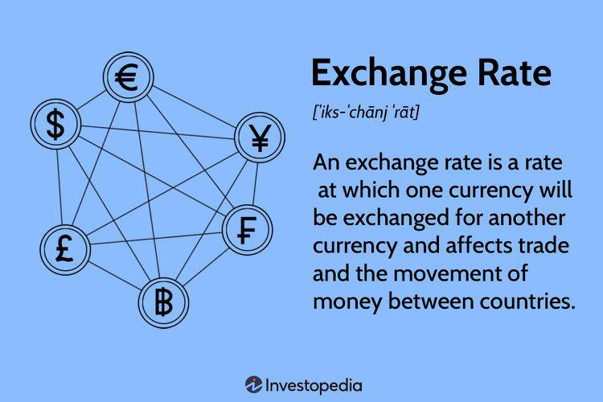

The global foreign exchange (forex) market stands as the largest and most liquid financial market worldwide, boasting daily trading volumes that exceed $6 trillion. This immense trading volume reflects the critical role that currency fluctuations and exchange rates play in international trade, investments, and economic stability. The forex market operates 24 hours a day, five days a week, facilitating transactions between a wide range of participants, including governments, financial institutions, corporations, and individual traders. 

A key aspect of the forex market is the notion of currency fluctuations, which refers to changes in a currency's value relative to another. These fluctuations are vital to market dynamics and are influenced by various factors, such as economic indicators, geopolitical events, and market sentiment. Consequently, currency fluctuations have a profound impact on pricing, affecting the cost of goods and services in international trade. As such, they are central to the decisions made by investors and policymakers alike.



Exchange rates serve as the mechanism through which one currency's value is expressed against another. They are crucial not only for determining the price of imports and exports but also for assessing the value of cross-border investments. There are two primary types of exchange rates: fixed, which are pegged to a major currency, and floating, which are determined by the forces of supply and demand in the open market. These rates are pivotal for economic stability as they influence inflation rates, trade balances, and overall economic growth. 

Modern advancements in technology have significantly transformed the forex market, particularly through the rise of algorithmic trading. Also known as algo trading, this approach leverages computer algorithms to analyze market data and execute trades with unprecedented speed and precision. By removing the emotional element of trading decisions, algorithmic trading enables investors to better navigate currency fluctuations and capitalize on exchange rate movements. This method has become increasingly prominent as traders seek to maximize profits in the competitive and volatile forex market landscape.

In this article, we will explore the intricacies of currency fluctuations, the importance of exchange rates, and the growing role of algorithmic trading in the forex market. Understanding these components is crucial for anyone interested in engaging in forex trading or comprehending the broader factors that influence global financial markets.

## Table of Contents

## Understanding Currency Fluctuations

Currency fluctuations are the variations in the value of one currency relative to another. These variations are primarily influenced by a combination of economic indicators, geopolitical events, and market sentiment. Economic indicators such as interest rates, inflation, government debt, and political stability play significant roles in determining currency values.

Interest rates, for instance, directly affect currency values; higher interest rates typically attract foreign capital, increasing the demand for a country's currency and subsequently raising its value. Conversely, lower interest rates can result in a reduction in currency value. Inflation rates also impact currency fluctuations; countries with lower inflation rates see an appreciation in their currency value due to increased purchasing power compared to their counterparts with higher inflation. Government debt levels can affect currency strength too, as high debt might discourage foreign investment due to concerns over inflation and potential default.

Political stability and geopolitical events are equally crucial, as political turmoil or conflicts might lead to a decrease in investor confidence, causing currency depreciation. Conversely, a stable and favorable political environment tends to attract investments, strengthening the currency.

These fluctuations significantly impact international trade by influencing the cost of goods for foreign buyers. When a currency appreciates, exported goods become more expensive for foreign buyers, potentially reducing demand. Conversely, a depreciated currency makes goods cheaper for foreign consumers, potentially boosting exports.

Investors in the foreign exchange market closely monitor these fluctuations to identify potential profit opportunities. Some may employ strategies to capitalize on anticipated changes in currency values, buying when they are low and selling when they rise—akin to the principle of "buy low, sell high."

Volatility in currency value, while posing certain risks, also offers prospects for substantial returns when managed effectively. It is crucial for [forex](/wiki/forex-system) traders to assess and mitigate potential risks while leveraging opportunities through informed strategic decisions. Understanding and predicting currency fluctuations remain fundamental skills for effective participation in the forex market.

## The Role of Exchange Rates

Exchange rates are pivotal in determining the value of one currency in terms of another, thereby playing a crucial role in facilitating international trade and investment. They act as a barometer of a country's economic health and influence cross-border financial transactions, making them a key focus for both governments and forex traders.

There are primarily two types of exchange rates that govern currency value: fixed and floating. A fixed exchange rate, also known as a pegged rate, is tied to another major currency or basket of currencies. This system offers stability, as it minimizes fluctuations in currency value, which can be advantageous for countries where economic stability is a priority. For instance, the Hong Kong dollar is pegged to the US dollar, ensuring predictability and reducing foreign exchange risk for businesses operating internationally.

Conversely, a floating exchange rate is determined by market forces—specifically, the law of supply and demand. In this system, a currency's value fluctuates based on economic indicators, global market dynamics, and speculative actions. Countries like the United States and Japan operate under a floating exchange rate, allowing their currencies to adjust in response to economic conditions.

Several factors influence exchange rates beyond the basic supply-demand equation. Economic indicators such as interest rates and inflation are significant; typically, higher interest rates attract foreign capital, increasing demand for a currency and potentially appreciating its value. Inflation rates can inversely affect currency value; currencies in countries with lower inflation rates tend to appreciate compared to those with higher rates. Government interventions can also influence exchange rates through policies such as adjusting interest rates or direct market intervention, where a government might buy or sell its own currency to influence its value.

Fluctuating exchange rates can significantly affect a nation's economic health. Changes in the exchange rate can impact inflation levels, as imported goods become more expensive or cheaper, influencing domestic price levels. Moreover, exchange rates impact trade balances—an appreciated currency makes exports more expensive and imports cheaper, potentially leading to a trade deficit, while a depreciated currency has the opposite effect. Consequently, exchange rates indirectly contribute to economic growth as they affect trade flows and investment decisions.

For forex traders, exchange rate fluctuations present opportunities to exploit price discrepancies. The fundamental strategy involves buying currencies at a low rate and selling at a higher rate to capitalize on the difference. This process, known as currency speculation, requires a deep understanding of economic indicators, geopolitical developments, and market sentiment to predict currency movements accurately. Traders use various tools and technologies, including [algorithmic trading](/wiki/algorithmic-trading) systems, to analyze market data and execute trades at optimal times, enhancing their ability to profit from exchange rate [volatility](/wiki/volatility-trading-strategies).

## Algorithmic Trading in the Forex Market

Algorithmic trading, commonly referred to as algo trading, is a method of executing orders using automated pre-programmed trading instructions accounting for variables such as time, price, and [volume](/wiki/volume-trading-strategy). This type of trading is widely used in the forex market due to its ability to process vast amounts of market data and execute trades at a speed and frequency that would be impossible for a human trader.

In the forex market, algo trading strategies can vary significantly. These strategies range from simple rule-based systems that automatically trigger buy or sell decisions based on specific conditions, to sophisticated models that use [artificial intelligence](/wiki/ai-artificial-intelligence) and [machine learning](/wiki/machine-learning) to predict market movements. The choice of algorithmic strategy depends largely on the trader's objectives, risk tolerance, and available technology.

Algo trading boasts a number of advantages. One primary benefit is the reduction in transaction costs. By automating the trading process, there is no need for a trader to manually monitor prices and execute trades, thus saving time and lowering costs associated with manual trading. Moreover, algorithms can swiftly analyze and react to market data, capitalizing on fleeting opportunities that human traders might miss. This is especially beneficial in the highly volatile forex market, where the ability to act quickly can have a significant impact on profitability.

Another advantage of algorithmic trading is the mitigation of emotional decision-making. Human traders can be susceptible to psychological biases, such as fear and greed, which may negatively influence trading decisions. Algo trading systems, however, operate based on logic and a set of predetermined rules, eliminating the emotions that often lead to poor trading outcomes.

Popular algo trading strategies in forex include [trend following](/wiki/trend-following), [arbitrage](/wiki/arbitrage), and market-making. Trend-following algorithms seek to profit by identifying and trading in the direction of a market trend. Arbitrage strategies attempt to exploit price discrepancies between different markets or financial instruments. Market-making involves providing [liquidity](/wiki/liquidity-risk-premium) to the market by simultaneously offering buy and sell quotes, profiting from the bid-ask spread.

As technology continues to evolve, the role of algorithmic trading in the forex market is expected to expand. Advances in computing power, artificial intelligence, and machine learning will likely lead to even more sophisticated algo trading models, capable of analyzing complex datasets and adapting to changing market conditions with remarkable precision.

In summary, algorithmic trading has become a cornerstone of the forex market, offering traders the tools to execute strategies with greater efficiency and accuracy. As the technological landscape progresses, its significance is anticipated to grow, shaping the future dynamics of currency trading.

## Benefits and Challenges of Algo Trading

Algorithmic trading, commonly referred to as algo trading, revolutionizes the way forex transactions are conducted by introducing a level of efficiency and precision previously unattainable through manual trading. One of its principal benefits lies in its enhanced execution speed, a crucial [factor](/wiki/factor-investing) in the fast-paced forex market where currency values can shift in fractions of a second. Leveraging computer algorithms, trades can be executed in milliseconds, faster than any human could achieve. This rapid execution minimizes the risk of price slippage, ensuring traders get the desired price.

Another significant advantage of algo trading is the ability to backtest trading strategies using historical data. Backtesting allows traders to simulate how a strategy would have performed in the past, providing valuable insights into its potential effectiveness before exposure to live market conditions. This process involves applying a trading strategy to past data and evaluating its success rate, risk, and return profile. An example of [backtesting](/wiki/backtesting) can be conducted using Python with libraries like `pandas` for data manipulation and `matplotlib` for visualization:

```python
import pandas as pd
import matplotlib.pyplot as plt

# Hypothetical historical data
data = pd.read_csv('historical_forex_data.csv')
data['Moving_Average'] = data['Close'].rolling(window=50).mean()

# Plotting for visualization
plt.figure(figsize=(10,5))
plt.plot(data['Close'], label='Close Price')
plt.plot(data['Moving_Average'], label='50-day Moving Average', linestyle='--')
plt.legend()
plt.show()
```

Despite its benefits, algo trading comes with notable challenges. The development of sophisticated algorithms can be costly, requiring substantial investments in technology and expertise. Creating an effective algorithm necessitates a deep understanding of both the market and programming, which can be a barrier to entry for many individual traders. Additionally, potential technological failures pose a threat to algorithmic trading systems. System crashes, connectivity issues, or even simple coding errors can lead to significant financial losses.

Moreover, algo trading systems require constant monitoring and adjustment. The forex market is dynamic, with conditions that can change rapidly due to geopolitical events, economic reports, and market sentiment shifts. Algorithms that performed well under certain conditions may become obsolete as market dynamics evolve, necessitating frequent evaluations and modifications to maintain effectiveness.

In conclusion, while the challenges of algorithmic trading, such as high development costs, technological risks, and the need for continual monitoring, are significant, the potential rewards are considerable. The ability to exploit minor market inefficiencies swiftly and precisely often outweighs these risks for many traders. Consequently, algo trading remains an attractive option for those who possess—or can access—the technical resources to effectively harness its advantages in the forex market.

## Conclusion

The forex market, distinguished by its enormous scale and liquidity, presents a complex landscape shaped by currency fluctuations and exchange rate dynamics. These variables pose both challenges and opportunities for traders seeking to capitalize on the rapid shifts within this volatile environment. Algorithmic trading has revolutionized forex trading by delivering enhanced precision, speed, and data analysis capabilities, which are crucial for managing the intricacies of currency fluctuations.

In recent years, the integration of algorithmic strategies has provided traders with the means to swiftly analyze massive datasets and execute trades with a level of efficiency that is unattainable for manual traders. As technology continues to progress, those who adeptly harness algorithmic trading will be better positioned to adapt to the unpredictable nature of currency markets. The deployment of algorithms offers a systematic approach to trading, utilizing technologies such as machine learning and statistical analysis to predict market trends and improve decision-making processes.

For individuals and institutions considering entry into the forex market or looking to refine their trading strategies, a solid understanding of currency fluctuations, exchange rate mechanics, and algorithmic trading technologies is paramount. Grasping these elements not only provides a competitive edge but is essential for mitigating risks and capitalizing on market opportunities.

As the forex market continues to evolve, staying informed about technological advancements and market trends is critical. Traders must remain adaptable, continuously refining their strategies to align with the dynamic nature of the forex environment. By and large, success in forex trading hinges on the ability to integrate knowledge with cutting-edge tools and techniques, ensuring resilience and profitability in this ever-changing financial landscape.

## References & Further Reading

[1]: Bergstra, J., Bardenet, R., Bengio, Y., & Kégl, B. (2011). ["Algorithms for Hyper-Parameter Optimization."](https://dl.acm.org/doi/10.5555/2986459.2986743) Advances in Neural Information Processing Systems 24.

[2]: ["Advances in Financial Machine Learning"](https://www.amazon.com/Advances-Financial-Machine-Learning-Marcos/dp/1119482089) by Marcos Lopez de Prado

[3]: ["Evidence-Based Technical Analysis: Applying the Scientific Method and Statistical Inference to Trading Signals"](https://www.amazon.com/Evidence-Based-Technical-Analysis-Scientific-Statistical/dp/0470008741) by David Aronson

[4]: ["Machine Learning for Algorithmic Trading"](https://github.com/stefan-jansen/machine-learning-for-trading) by Stefan Jansen

[5]: ["Quantitative Trading: How to Build Your Own Algorithmic Trading Business"](https://github.com/LucindaYa/quant-resources/blob/master/Quantitative%20Trading%20How%20to%20Build%20Your%20Own%20Algorithmic%20Trading%20Business.pdf) by Ernest P. Chan