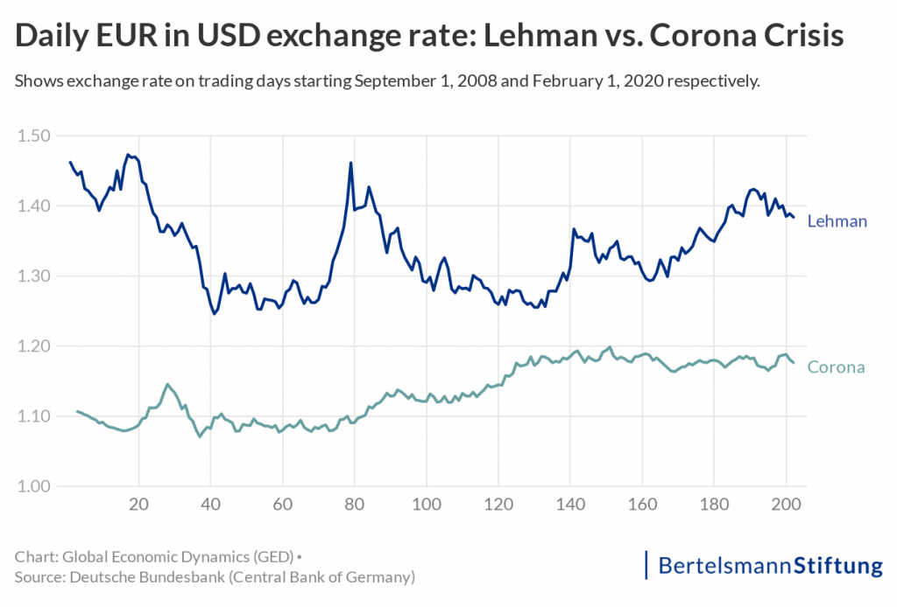

## Table of Contents

## What is an exchange rate?

An exchange rate is the value of one country's currency compared to another country's currency. It tells you how much of one currency you need to buy another currency. For example, if you want to buy US dollars with Euros, the exchange rate will tell you how many Euros you need to get one US dollar.

Exchange rates are important because they affect international trade and travel. If the exchange rate between the US dollar and the Euro changes, it can make things cheaper or more expensive for people traveling between the US and Europe. Businesses that buy and sell things in different countries also need to pay attention to exchange rates, because changes can affect their costs and profits.

## How are exchange rates determined?

Exchange rates are determined by what's called the foreign exchange market, where people and businesses trade different currencies. This market works a lot like any other market, where the price (or exchange rate) is set by how much people want to buy a currency and how much of it is available. If more people want to buy a currency than there is available, its value goes up. If fewer people want it, its value goes down.

Governments and central banks can also influence exchange rates. They might do things like buying or selling their own currency to try to change its value. For example, if a country wants its currency to be stronger, its central bank might buy it. Sometimes, countries agree with each other to keep their exchange rates stable. But most of the time, exchange rates move because of what people and businesses do in the market.

Overall, exchange rates are like a big puzzle with many pieces. They can change because of things like how well a country's economy is doing, what interest rates are, or even because of news and events around the world. It's a mix of what people think will happen in the future and what's happening right now.

## Why do exchange rates fluctuate?

Exchange rates go up and down because they are affected by many different things. One big reason is how much people want to buy or sell a currency. If lots of people want to buy a currency, its value goes up. If fewer people want it, its value goes down. This can happen because of changes in a country's economy, like if it's doing well or not so well. If a country's economy is strong, more people might want its currency, making it more valuable.

Governments and central banks can also make exchange rates change. They might buy or sell their own currency to try to make it stronger or weaker. For example, if a country wants its currency to be worth more, its central bank might buy it. Also, news and events around the world can affect exchange rates. If something big happens, like a political change or a natural disaster, it can make people think differently about a country's currency, causing its value to go up or down.

In the end, exchange rates are like a big puzzle with many pieces. They move because of what people think will happen in the future and what's happening right now. It's a mix of economic news, government actions, and world events that all play a part in making exchange rates go up and down.

## What are the main factors that influence exchange rate fluctuations?

Exchange rates change because of many different things. One big reason is how much people want to buy or sell a currency. If lots of people want to buy a currency, its value goes up. If fewer people want it, its value goes down. This can happen because of changes in a country's economy. If a country's economy is doing well, more people might want its currency, making it more valuable. But if the economy is not doing well, fewer people might want it, making it less valuable.

Governments and central banks can also affect exchange rates. They might buy or sell their own currency to try to make it stronger or weaker. For example, if a country wants its currency to be worth more, its central bank might buy it. Also, news and events around the world can change exchange rates. If something big happens, like a political change or a natural disaster, it can make people think differently about a country's currency, causing its value to go up or down.

In the end, exchange rates are influenced by a mix of things. It's not just about the economy or what governments do. World events, interest rates, and what people think will happen in the future all play a part. This makes exchange rates move up and down all the time.

## How can exchange rate fluctuations impact international trade?

Exchange rate changes can have a big effect on international trade. When a country's currency gets stronger, it means that country's goods and services become more expensive for other countries to buy. This can make it harder for that country to sell things to other places because they cost more. On the other hand, if a country's currency gets weaker, its goods and services become cheaper for other countries. This can help the country sell more things abroad because they are a better deal.

But it's not just about selling things. When a country's currency changes value, it also affects the cost of buying things from other countries. If a country's currency gets weaker, it costs more to buy things from abroad. This can make it harder for businesses in that country to get the things they need from other places. If the currency gets stronger, it becomes cheaper to buy things from other countries, which can help businesses save money. So, exchange rate changes can make international trade more complicated and affect how much countries buy and sell from each other.

## What is the difference between a fixed and a floating exchange rate system?

A fixed exchange rate system is when a country's government or central bank decides to keep its currency's value the same compared to another currency or a group of currencies. They do this by buying or selling their own currency to keep the exchange rate steady. For example, if the value of their currency starts to go down, they might buy it to bring the value back up. This can help make trade and business easier because people know what the exchange rate will be. But it can be hard for the government to keep the exchange rate fixed, especially if there are big changes in the economy.

A floating exchange rate system is different because the value of a country's currency can go up and down freely based on what people want to buy or sell in the market. No one is trying to keep the exchange rate the same. The value changes because of things like how well the country's economy is doing, what interest rates are, or even news and events around the world. This can make trade and business more unpredictable, but it also means the exchange rate can change to match what's happening in the economy.

In a fixed exchange rate system, the government has more control over the currency's value, which can be good for stability but hard to maintain. In a floating exchange rate system, the market decides the value, which can lead to more changes but also lets the currency adjust naturally to economic conditions.

## How do central banks intervene in the forex market to manage exchange rate fluctuations?

Central banks step into the [forex](/wiki/forex-system) market to control exchange rate changes by buying or selling their own currency. If they want their currency to be stronger, they might buy it. This makes the currency more valuable because there's less of it available in the market. On the other hand, if they want their currency to be weaker, they might sell it. This makes the currency less valuable because there's more of it available. By doing this, central banks try to keep the exchange rate stable or move it in a direction they want.

Sometimes, central banks work together with other countries to manage exchange rates. They might agree to keep their currencies at certain values to help with trade and economic stability. But it's not always easy. If the economy changes a lot or there are big events in the world, it can be hard for central banks to keep the exchange rate where they want it. So, they have to keep a close eye on the market and be ready to act when needed.

## What are the economic implications of exchange rate volatility for a country?

Exchange rate [volatility](/wiki/volatility-trading-strategies) can have big effects on a country's economy. When exchange rates change a lot, it can make things harder for businesses that buy and sell things with other countries. If a country's currency goes down in value, it can make their goods cheaper for other countries to buy, which might help them sell more. But it also makes it more expensive for them to buy things from other places. This can hurt businesses that need to import things to make their products. Also, if people and businesses are not sure what the exchange rate will be, they might be less willing to do business with other countries because it's too risky.

Another effect of exchange rate volatility is on the country's overall economy. If the currency is going up and down a lot, it can make it harder for the government to plan and make good decisions. It can also affect how much people want to invest in the country. If the currency is very unstable, investors might be scared to put their money there because they're not sure if they'll lose money when they try to take it out. This can slow down the economy and make it harder for the country to grow. So, keeping exchange rates stable can be important for a country's economic health.

## How can businesses hedge against exchange rate risk?

Businesses can use something called hedging to protect themselves from exchange rate changes. One way to do this is by using forward contracts. A forward contract is like a deal where a business agrees to buy or sell a certain amount of currency at a set price on a future date. This helps the business know exactly how much they will pay or get, even if the exchange rate changes later. Another way is by using options, which give a business the right, but not the obligation, to buy or sell currency at a set price. This can be helpful if the business thinks the exchange rate might change a lot.

Another way businesses can hedge is by using currency swaps. A currency swap is when two businesses agree to exchange currencies for a certain time and then swap back later. This can help a business if they need to pay for things in another country's currency. By using these methods, businesses can make their costs more predictable and avoid big losses from exchange rate changes. But hedging isn't perfect, and it can cost money, so businesses need to think carefully about whether it's worth it for them.

## What are some historical examples of significant exchange rate fluctuations and their impacts?

One big example of exchange rate changes happened in 1992, known as Black Wednesday. The UK had a fixed exchange rate system and was part of the European Exchange Rate Mechanism (ERM). The UK's currency, the pound, was supposed to stay within a certain range compared to other European currencies. But people started thinking the pound was too strong and started selling it. The UK government tried to keep the pound's value up by buying lots of pounds, but it didn't work. In the end, the UK had to leave the ERM, and the pound's value dropped a lot. This made things cheaper for other countries to buy from the UK, but it also made it more expensive for the UK to buy things from other places.

Another example is the Asian Financial Crisis in 1997. It started in Thailand when people lost trust in the Thai baht. The Thai government had been keeping the baht's value fixed, but when they couldn't keep it up anymore, they let it float. The baht's value dropped a lot, and this caused problems in other Asian countries too. Many countries had to borrow money to help their economies, and some businesses went bankrupt. It took years for these countries to recover. The crisis showed how important it is for countries to have strong economies and not rely too much on keeping their exchange rates fixed.

## How do exchange rate fluctuations affect multinational corporations' financial statements?

Exchange rate changes can really affect the money reports of big companies that do business in different countries. When a company has money in different currencies, the value of that money can change if exchange rates go up or down. For example, if a company in the US has money in Euros and the Euro gets weaker compared to the US dollar, the value of that money in US dollars goes down. This means the company's money reports might show less money than before, even if they didn't spend any of it. This can make the company look like it's not doing as well as it really is.

These changes can also affect how much a company makes and spends. If a company sells things in another country and that country's currency gets weaker, the company might get less money when they change it back to their own currency. On the other hand, if they need to buy things from another country and that country's currency gets stronger, it can cost them more. All these changes can make the company's money reports look different from what they expected. So, big companies have to be careful and think about exchange rates when they plan and make their money reports.

## What advanced statistical models are used to forecast exchange rate movements?

To guess how exchange rates will change, people use fancy math models. One popular model is called the ARIMA model, which stands for AutoRegressive Integrated Moving Average. This model looks at past exchange rates to find patterns and then uses those patterns to predict future rates. Another model is the GARCH model, which stands for Generalized Autoregressive Conditional Heteroskedasticity. This model is good at predicting how much exchange rates might go up or down, which is helpful because exchange rates can be very unpredictable.

There are also more complex models like neural networks, which are part of [artificial intelligence](/wiki/ai-artificial-intelligence). These models can learn from a lot of different information, not just past exchange rates. They can look at things like how well different countries' economies are doing, what interest rates are, and even news from around the world. By taking all this into account, neural networks can sometimes make better guesses about future exchange rates. But even with all these fancy models, it's still really hard to predict exchange rates perfectly because so many things can affect them.

## References & Further Reading

[1]: Bergstra, J., Bardenet, R., Bengio, Y., & Kégl, B. (2011). ["Algorithms for Hyper-Parameter Optimization."](https://dl.acm.org/doi/10.5555/2986459.2986743) Advances in Neural Information Processing Systems 24.

[2]: ["Advances in Financial Machine Learning"](https://www.amazon.com/Advances-Financial-Machine-Learning-Marcos/dp/1119482089) by Marcos Lopez de Prado

[3]: ["Evidence-Based Technical Analysis: Applying the Scientific Method and Statistical Inference to Trading Signals"](https://www.amazon.com/Evidence-Based-Technical-Analysis-Scientific-Statistical/dp/0470008741) by David Aronson

[4]: ["Machine Learning for Algorithmic Trading"](https://github.com/stefan-jansen/machine-learning-for-trading) by Stefan Jansen

[5]: ["Quantitative Trading: How to Build Your Own Algorithmic Trading Business"](https://github.com/LucindaYa/quant-resources/blob/master/Quantitative%20Trading%20How%20to%20Build%20Your%20Own%20Algorithmic%20Trading%20Business.pdf) by Ernest P. Chan