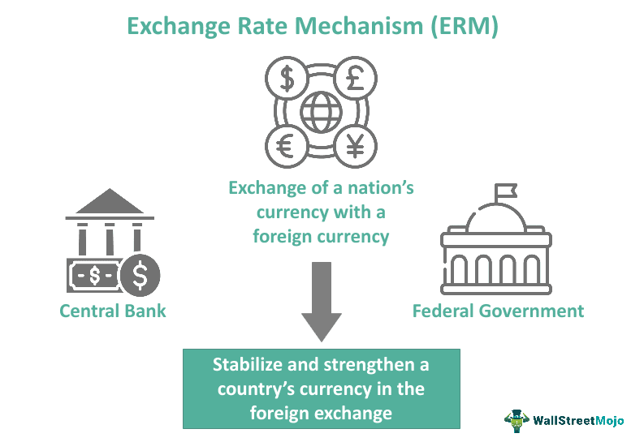

An Exchange Rate Mechanism (ERM) is an essential component of global finance, designed to regulate a country's currency exchange rate in relation to other currencies. By doing so, it plays a pivotal role in ensuring currency stability, mitigating volatility, and promoting economic predictability. ERM systems are often employed by central banks as part of broader monetary policies to maintain fixed or controlled floating exchange rates. This practice helps in normalizing trade dynamics and controlling inflation, which are critical for economic stability and growth.

The significance of ERM becomes apparent when considering its impact on international trade and investment. A stable currency environment fosters confidence among investors and traders, enabling smoother transactions and reducing the risks associated with currency fluctuations. Furthermore, ERM's influence extends to the arena of algorithmic trading, where predictable exchange rates are vital for the development and execution of trading algorithms. These algorithms are designed to anticipate market movements and central bank interventions, thus optimizing trading strategies.



In summary, ERMs are crucial in maintaining economic stability by controlling exchange rate volatility and ensuring predictability in international financial markets. These mechanisms not only aid in stabilizing currencies but also support advanced trading strategies, underscoring their importance in the interconnected world of global finance.

## Table of Contents

## Understanding the Exchange Rate Mechanism

An Exchange Rate Mechanism (ERM) is a critical component of a country's monetary policy, designed to manage and stabilize its currency exchange rate relative to other currencies. The primary objective of an ERM is to reduce exchange rate volatility, which can have significant implications for both domestic and international markets. By maintaining stable exchange rates, ERMs facilitate trade normalization and help control inflation, providing a predictable environment for economic transactions and financial planning.

Central banks implement ERMs by engaging in various monetary policy actions that either fix or guide the floating rate within a specified range. These actions may include direct interventions in the foreign exchange market, such as buying or selling currencies to influence exchange rates. Additionally, central banks may use interest rate policies or capital controls to indirectly affect exchange rate dynamics.

By minimizing exchange rate fluctuations, ERMs aim to create a stable economic climate. Such stability is crucial not only for local businesses engaging in international trade but also for foreign investors evaluating investment opportunities. A reliable ERM can play a key role in attracting foreign capital by reducing currency risk, thereby enhancing a country's economic growth potential.

An effective ERM takes into account various macroeconomic indicators, such as the balance of payments, fiscal policies, and economic growth projections. An ideal ERM framework seeks to strike a balance between maintaining external competitiveness and ensuring internal economic stability. Through continuous monitoring and adjustment, central banks strive to align currency exchange rates with underlying economic fundamentals, thus supporting a healthy economic environment conducive to sustainable growth.

## Historical Background and Evolution of the ERM

The concept of the Exchange Rate Mechanism (ERM) began to gain prominence in the late 1970s with the establishment of the European Monetary System (EMS). The EMS was initiated in March 1979 as a means to foster closer monetary cooperation among European countries. At its core, the EMS aimed to stabilize exchange rates and counter the adverse effects of inflation and currency fluctuations that had led to economic instability across Europe.

A central component of the EMS was the ERM, which required participating currencies to adhere to agreed-upon exchange rate margins against each other. The initial mechanism implemented a grid of bilateral exchange rates based on the European Currency Unit (ECU), a basket of European currencies. This structure sought to limit exchange rate variability and create a zone of monetary stability within Europe.

The ERM evolved significantly over the years, with various milestones punctuating its development. One such milestone was the crisis that erupted on September 16, 1992, known as Black Wednesday. This event saw the United Kingdom's withdrawal from the ERM due to its inability to maintain the pound sterling within the agreed exchange rate boundaries. The crisis underscored the challenges of sustaining fixed currency rates in the face of economic pressures and speculative attacks.

Despite these challenges, the ERM continued to play a critical role in European monetary policy. Its evolution led to the introduction of ERM II in 1999, an updated version of the mechanism designed to prepare European Union (EU) countries for eventual entry into the Eurozone. ERM II aimed to ensure currency stability between the euro and the currencies of other EU member states not yet adopting the euro as their official currency. Countries participating in ERM II were required to maintain their currency exchange rates within specific fluctuation bands relative to the euro.

The introduction of ERM II marked a significant advancement in the European Union's efforts to integrate monetary policy and enhance economic coherence among member states. It set the stage for the broader adoption of the euro, contributing to the stabilization of currency relations within the Eurozone and paving the way for greater economic integration across Europe.

## How ERM Impacts Algorithmic Trading

Algorithmic trading is an advanced method of executing orders using automated pre-programmed trading instructions that account for variables such as time, price, and [volume](/wiki/volume-trading-strategy). This technique significantly profits from currency stability and predictable market conditions, which are primary objectives of an efficient Exchange Rate Mechanism (ERM). 

ERM plays a vital role in stabilizing exchange rates by reducing fluctuations and providing a more predictable environment for [forex](/wiki/forex-system) trading. This stability is crucial because [algorithmic trading](/wiki/algorithmic-trading) systems utilize highly sensitive models that react to market changes in milliseconds. When currency values are stable, these algorithms can operate with greater accuracy, reducing the risk of significant losses due to unexpected rate changes.

Traders use ERM data as a key input in the development of their algorithms. By analyzing trends and the intended exchange rate boundaries set by central banks, these algorithms can anticipate potential market interventions. In this way, traders can adjust their strategies to align with predicted central bank activities, such as buying or selling currencies to maintain the specified exchange rate band. 

A basic Python script that simulates how an algorithm might use ERM data to anticipate a central bank's actions could look like this:

```python
import random

def forecast_central_bank_action(current_rate, target_rate, tolerance):
    """
    Forecast central bank intervention based on exchange rates.

    :param current_rate: Current exchange rate
    :param target_rate: Target exchange rate
    :param tolerance: Allowable deviation from the target rate
    :return: Intervention action
    """
    if current_rate < target_rate - tolerance:
        return "Buy currency to strengthen it."
    elif current_rate > target_rate + tolerance:
        return "Sell currency to weaken it."
    else:
        return "No immediate action required."

current_rate = random.uniform(1.0, 1.5)  # Simulated current exchange rate
target_rate = 1.25  # Hypothetical target set by central bank
tolerance = 0.05  # Acceptable deviation before intervention

action = forecast_central_bank_action(current_rate, target_rate, tolerance)
print(f"Current Rate: {current_rate:.2f}, Action: {action}")
```

In this example, the algorithm takes into account the current exchange rate, the target rate set by a central bank, and a tolerance level. Based on these parameters, it forecasts if an intervention is needed and executes a corresponding action.

Stable exchange rates facilitated by ERM significantly reduce the inherent risks and uncertainties of forex trading. With a lower risk of sudden currency fluctuations, algorithmic trading systems can execute trades with higher confidence, enhancing their profitability and performance. Overall, the integration of ERM data into algorithmic trading models fundamentally supports the structured and less volatile environment necessary for effective automated trading strategies.

## Challenges and Criticisms of ERM

The Exchange Rate Mechanism (ERM) has been instrumental in fostering currency stabilization; however, it is not without its challenges and criticisms. One of the most significant challenges ERM systems face is the susceptibility to speculative attacks, which occur when investors bet against a currency, anticipating a devaluation. These attacks were notably prevalent during the ERM I period, leading to significant strain on currency stability. A historical example includes the events of Black Wednesday in 1992, when Britain was forced to [exit](/wiki/exit-strategy) the ERM after failing to defend its currency against speculative pressures. This highlighted the vulnerability of fixed or semi-fixed exchange rate systems to market speculation.

Asymmetric economic shocks also pose a challenge to ERM systems. These shocks occur when different economies are affected differently by external or internal economic events, creating imbalances. For instance, a country facing an economic downturn might find it difficult to maintain its currency within the constraints set by the ERM without resorting to measures like [interest rate](/wiki/interest-rate-trading-strategies) adjustments that could be detrimental in other aspects. This poses a dilemma as the need for economic stabilization in one region can conflict with the ERM's constraints on currency fluctuations.

From a political and economic perspective, the ERM has faced criticisms primarily due to the loss of monetary autonomy. Countries participating in an ERM often find their ability to independently implement monetary policy restricted, as they must consider the exchange rate targets and the broader goals of the mechanism. This can lead to tensions, especially between countries experiencing disparate economic conditions. For example, high-growth countries may need different monetary policies compared to those in recession, creating conflicts in policy priorities.

Despite these challenges, ERMs continue to play a pivotal role in modern monetary policy. They are crucial for international economic stability, offering a structured approach to reducing exchange rate [volatility](/wiki/volatility-trading-strategies) and fostering predictable economic environments. The experience gained from past events, such as the speculative attacks during ERM I, has contributed to refining these systems, improving their resilience against similar future occurrences. Thus, while the ERM is not without its criticisms, its significance in the broader context of international finance and stability remains essential.

## The Future of ERM and Its Significance in Global Finance

As global financial systems continue to transform, Exchange Rate Mechanisms (ERM) face the imperative challenge of adapting to dynamic economic landscapes and technological advancements. With the proliferation of digital currencies, advancements in blockchain technology, and shifts in geopolitical dynamics, ERMs must evolve to retain their relevance in stabilizing exchange rates.

The ongoing importance of ERM in maintaining steady exchange rates is critical for facilitating smooth international trade and investment. Exchange rate stability mitigates uncertainties that could otherwise impede cross-border trade and capital flows. By providing a predictable environment, ERMs foster investor confidence and encourage economic cooperation. Such stability is essential, as it allows countries to plan their monetary policies and trade strategies without being severely affected by volatile currency fluctuations.

Moreover, the growing interconnectedness of global markets demands that the principles of ERM extend into emerging monetary strategies and algorithmic trading practices. Algorithmic trading, which relies on fast-paced data analytics and automated decision-making, greatly benefits from the predictability ensured by ERMs. Stable exchange rates decrease the risk associated with foreign exchange (forex) trading, enabling algorithmic systems to function more effectively and generate reliable outcomes.

As economic activities become increasingly automated, the integration of advanced [artificial intelligence](/wiki/ai-artificial-intelligence) and [machine learning](/wiki/machine-learning) algorithms in trading systems will likely amplify the need for steady exchange rate environments. Algorithms can simulate and predict central bank interventions when exchange rates deviate from the established bands or targets set by ERMs, thereby enhancing trading precision and efficiency.

Looking ahead, ERMs are anticipated to not only continue their stabilizing role but also become integral in shaping the future [course](/wiki/best-algorithmic-trading-courses) of global monetary policies. The adaptation to technological shifts and economic innovations will require ERMs to be more resilient and flexible. In this manner, ERMs hold the potential to influence prevalent economic doctrines and trading methodologies, ensuring sustained economic stability and harmonious international financial interactions.

## Conclusion

The Exchange Rate Mechanism (ERM) is a fundamental component of global financial systems, providing a reliable framework for maintaining currency stability and mitigating market volatility. By establishing parameters for currency exchange rates, ERM helps in normalizing trade relations and controlling inflation, thereby fostering an atmosphere conducive to economic predictability and stability. Despite facing challenges like speculative attacks and asymmetric economic shocks, ERM continues to play a critical role in international finance. Its ability to aid in monetary policy formulation cannot be overstated, as it reinforces economic stability and growth across nations.

Algorithmic trading, heavily reliant on precise financial data and stable market conditions, particularly benefits from the robust data provided by ERM. As financial markets become increasingly complex, the integration of ERM data into algorithmic trading strategies offers traders the ability to devise nuanced, efficient trading mechanisms. This symbiosis not only enhances the precision of market strategies but also enables traders to anticipate central bank interventions and adjust their approaches accordingly. With the trajectory of global markets leaning towards increased complexity, the principles of ERM will likely continue to shape future monetary strategies and trading algorithms, driving the expansion of algorithmic trading as traders strive for more exact and effective market decisions.

## References & Further Reading

[1]: James, H. (2012). ["Making the European Monetary Union."](https://www.hup.harvard.edu/books/9780674416802) Belknap Press of Harvard University Press.

[2]: Bernanke, B. S. (2000). ["Inflation Targeting: Lessons from the International Experience."](https://www.jstor.org/stable/j.ctv301gdr) Princeton University Press.

[3]: Obstfeld, M., & Rogoff, K. (1995). ["The Mirage of Fixed Exchange Rates."](https://pubs.aeaweb.org/doi/pdfplus/10.1257/jep.9.4.73) Journal of Economic Perspectives, 9(4), 73-96.

[4]: Sarno, L., & Taylor, M. P. (2002). ["The Economics of Exchange Rates."](https://assets.cambridge.org/97805214/81335/sample/9780521481335ws.pdf) Cambridge University Press.

[5]: Morris, J., & Vahey, S. P. (2004). ["An Empirical Evaluation of a Macroeconomic Model of Exchange Rate Interventions."](https://psycnet.apa.org/record/2004-21445-005) Canadian Journal of Economics, 37(4), 995-1012.