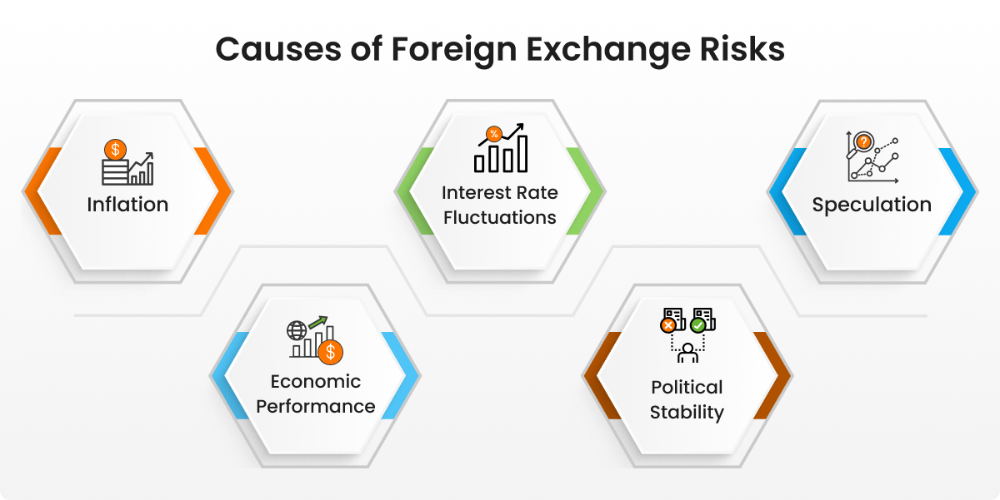

## Table of Contents

## What is exchange rate risk?

Exchange rate risk, also known as currency risk, is the possibility that changes in currency exchange rates will affect the value of your investments or transactions. If you have money in different currencies, the value of those currencies can go up or down compared to each other. This can make your investments worth more or less when you convert them back to your home currency.

For example, if you are an American and you invest in a European company, you will get paid in euros. If the value of the euro goes down compared to the US dollar, you will get fewer dollars when you convert your earnings back to dollars. This means your investment could lose value even if the company you invested in is doing well. Managing exchange rate risk is important for anyone who deals with money in different currencies.

## How does exchange rate risk affect businesses and individuals?

Exchange rate risk can have a big impact on businesses, especially if they buy or sell things in different countries. If a business sells products in another country, it might get paid in that country's currency. If the value of that currency goes down compared to the business's home currency, the business will get less money when it converts the earnings back home. This can make it harder for the business to make a profit. On the other hand, if a business buys things from another country, a stronger home currency can make those purchases cheaper, but a weaker home currency can make them more expensive.

For individuals, exchange rate risk can affect them when they travel or invest in other countries. If someone goes on a trip and needs to change their money into another currency, a weak home currency can make the trip more expensive. If they invest in a foreign company, changes in exchange rates can make their investment worth more or less when they convert it back to their home currency. This means that even if the investment does well, a drop in the foreign currency's value can still result in a loss when converted back.

## What are the main causes of exchange rate fluctuations?

Exchange rates go up and down because of many reasons. One big reason is how much people want to buy a country's currency. If lots of people want to buy a country's currency, its value goes up. This can happen because people think the country's economy is doing well, or because they want to invest in that country. On the other hand, if people don't want to buy a country's currency, its value goes down. This can happen if the country's economy is not doing well, or if people think it might have problems in the future.

Another reason for exchange rate changes is what a country's central bank does. Central banks can change interest rates, which affects how much people want to hold that country's currency. If a central bank raises interest rates, it can make the currency more attractive because people can earn more from saving in that currency. If the central bank lowers interest rates, it can make the currency less attractive. Also, central banks can buy or sell their own currency to try to control its value. This is called currency intervention.

Lastly, things like inflation rates and political stability can also move exchange rates. If a country has high inflation, its currency usually gets weaker because the money doesn't buy as much as before. If a country is politically unstable, people might not want to hold its currency because they worry about the future. All these factors together make exchange rates go up and down all the time.

## Can you explain the difference between transaction, translation, and economic exposure?

Transaction exposure is about the risk that comes when you're doing business in different currencies. Imagine you're a company that buys things from another country. You agree on a price today, but you won't pay until later. If the value of the other country's currency goes up before you pay, it will cost you more in your own currency. That's transaction exposure. It's all about the money you owe or are owed in the future, and how changes in exchange rates can affect that.

Translation exposure, on the other hand, is about how a company's financial statements look when they're converted from one currency to another. If a company has branches in different countries, it has to add up all its money in one currency for its reports. If the exchange rate changes, the value of the money from other countries can look different when it's converted. This doesn't affect the actual money the company has, but it can make the financial statements look better or worse. That's translation exposure.

Economic exposure is a bit bigger picture. It's about how changes in exchange rates can affect a company's overall value and future earnings. If a company sells a lot of its products in other countries, a weaker currency might make its products cheaper and easier to sell abroad, which could be good for business. But if the company buys a lot of things from other countries, a weaker currency could make those purchases more expensive, which could be bad for business. Economic exposure looks at all these things together to see how exchange rate changes might affect the company's future.

## What are some common strategies for managing exchange rate risk?

One common way to manage exchange rate risk is by using forward contracts. A forward contract is like a deal you make today to buy or sell a currency at a certain price in the future. This can help because it locks in the exchange rate, so you know exactly how much you'll pay or get, no matter what happens to the exchange rate later. For example, if you know you'll need to buy euros in three months, you can use a forward contract to make sure you'll get them at today's rate, even if the euro gets more expensive by then.

Another strategy is to use options. An option gives you the right, but not the obligation, to buy or sell a currency at a certain price before a certain date. This can be useful because it gives you flexibility. If the exchange rate moves in your favor, you can choose not to use the option and just go with the better rate. But if the rate moves against you, you can use the option to buy or sell at the rate you agreed on. This way, you're protected from bad changes in the exchange rate, but you can still benefit from good ones.

A third way to manage exchange rate risk is through natural hedging. This means trying to balance out your income and expenses in different currencies so that changes in exchange rates don't hurt you as much. For example, if you're a company that sells products in the US but buys materials from Europe, you can try to also sell some products in Europe. That way, if the euro gets stronger, your costs go up, but so do your earnings in Europe, which can help balance things out. Natural hedging can be a good way to manage risk without having to use financial instruments like forward contracts or options.

## How does hedging work to mitigate exchange rate risk?

Hedging is like a safety net for businesses and individuals who deal with different currencies. It's a way to protect against the ups and downs of exchange rates. Imagine you're a business that needs to buy things from another country. You know you'll need to pay in that country's currency in the future, but you're worried the exchange rate might change and make it more expensive. By using a hedging strategy, like a forward contract, you can lock in today's exchange rate for that future payment. This means you'll know exactly how much you'll need to pay in your own currency, no matter what happens to the exchange rate later.

Hedging can also help if you're expecting to get paid in a foreign currency. Let's say you're a company that sells products abroad and you'll get paid in euros in a few months. If the value of the euro drops against your home currency before you get paid, you'll end up with less money when you convert it back. To protect against this, you can use a hedging tool like an option. An option gives you the choice to convert the euros at a rate you set today, but you don't have to use it if the exchange rate moves in your favor. This way, you're protected if the euro weakens, but you can still benefit if it strengthens. Hedging helps take away some of the uncertainty that comes with dealing in different currencies.

## What are forward contracts and how do they help in managing exchange rate risk?

A forward contract is like a special agreement you make today to buy or sell a currency at a certain price in the future. It's a bit like reserving a seat on a plane for a trip you'll take later. You know exactly how much you'll pay, no matter what happens to the ticket prices between now and your trip. For businesses and people who deal with money in different countries, forward contracts are a way to lock in today's exchange rate for a future date. This means you can plan your money better because you know exactly how much you'll need to pay or how much you'll get back, even if the exchange rate changes.

Forward contracts are really helpful for managing exchange rate risk because they take away the worry about what might happen to exchange rates later. Let's say you're a company that needs to buy materials from another country in three months. You can use a forward contract to agree on today's exchange rate for that future purchase. If the other country's currency gets more expensive by the time you need to pay, you're protected because you'll still pay at the rate you agreed on. This can save you a lot of money and help you plan your budget better. Forward contracts are a simple but powerful tool for keeping your finances stable when you're dealing with different currencies.

## Can you discuss the role of options in managing exchange rate risk?

Options are a special kind of agreement that can help people and businesses deal with the ups and downs of exchange rates. An option gives you the right, but not the obligation, to buy or sell a currency at a set price before a certain date. This is different from a forward contract because you don't have to use the option if you don't want to. If the exchange rate moves in your favor, you can choose not to use the option and just go with the better rate. But if the rate moves against you, you can use the option to buy or sell at the rate you agreed on. This way, you're protected from bad changes in the exchange rate, but you can still benefit from good ones.

Options are really useful because they give you flexibility. Imagine you're a business that will get paid in euros in three months. You're worried that the value of the euro might drop, making your payment worth less in your home currency. You can buy an option to sell euros at today's rate. If the euro does drop, you can use the option and convert your euros at the better rate you locked in. But if the euro goes up in value, you don't have to use the option and can convert at the new, higher rate instead. This means you're protected if things go wrong, but you can still take advantage of good changes in the exchange rate.

## How do multinational corporations use natural hedging to manage exchange rate risk?

Multinational corporations use natural hedging to manage exchange rate risk by balancing their income and expenses in different currencies. If a company sells products in the US but buys materials from Europe, it might try to also sell some products in Europe. This way, if the euro gets stronger against the US dollar, the cost of materials from Europe goes up, but so do the earnings from sales in Europe. By matching where they earn and spend money, the company can reduce the impact of exchange rate changes. It's like trying to keep things even so that a change in one currency doesn't hurt the business too much.

For example, a company might set up manufacturing plants in different countries to produce goods locally where they are sold. This means the company earns money in the same currency it spends, reducing the need to convert currencies and the risk that comes with it. By doing business in multiple currencies, the company can offset losses in one area with gains in another. Natural hedging is a smart way for multinational corporations to manage exchange rate risk without using financial instruments like forward contracts or options. It helps them keep their finances stable and predictable.

## What are the advantages and disadvantages of using currency swaps for managing exchange rate risk?

Currency swaps are like agreements between two parties to exchange money in different currencies for a certain time. They can help manage exchange rate risk because they let companies lock in exchange rates for the future. This means a company can know exactly how much it will pay or get back in its own currency, even if the exchange rate changes later. For example, if a company needs to pay a loan in another currency, it can use a currency swap to make sure it pays at today's rate. This can make budgeting easier and protect the company from losing money if the other currency gets more expensive.

But currency swaps also have some downsides. They can be complicated to set up and might need a lot of paperwork. They also usually involve some costs, like fees or interest rate differences between the two currencies. If the exchange rate moves in a way the company didn't expect, it might end up losing out on potential gains. For example, if the other currency gets weaker, the company would have been better off not using the swap. So, while currency swaps can help manage risk, they're not perfect and need to be used carefully.

## How do macroeconomic indicators influence exchange rate risk management strategies?

Macroeconomic indicators, like inflation rates, interest rates, and GDP growth, can tell us a lot about how a country's currency might change in value. If a country has high inflation, its currency usually gets weaker because the money doesn't buy as much as before. On the other hand, if a country raises its interest rates, its currency might get stronger because people want to hold onto it to earn more from their savings. When businesses and people see these indicators, they can guess how exchange rates might change and plan their strategies accordingly. For example, if they think a currency will get weaker, they might use forward contracts or options to lock in a better rate before it happens.

These indicators also help businesses decide whether to use natural hedging. If a company sees that a country's economy is growing fast, it might want to do more business there to balance out its income and expenses in that currency. This can help protect the company if the currency gets weaker. On the other hand, if a country's economy looks like it might have problems, the company might try to do less business there or use financial instruments like currency swaps to manage the risk. By keeping an eye on these indicators, businesses and people can make smarter choices about how to handle exchange rate risk.

## What advanced quantitative models are used to predict and manage exchange rate risk?

Advanced quantitative models help people and businesses guess how exchange rates might change and plan their money moves. One common model is the ARIMA model, which stands for AutoRegressive Integrated Moving Average. It looks at past exchange rate data to find patterns and predict future rates. Another model is the GARCH model, which stands for Generalized Autoregressive Conditional Heteroskedasticity. This model is good at figuring out how much exchange rates might go up and down, which is important for managing risk. These models use math and statistics to make better guesses about the future, helping people decide when to use tools like forward contracts or options to protect their money.

Another useful model is the Vector Autoregression (VAR) model, which looks at how different economic factors, like interest rates and inflation, affect each other and exchange rates. This can help people see the big picture and make more informed decisions. Machine learning models are also becoming popular. These models can learn from lots of data and find patterns that other models might miss. They can be really good at predicting exchange rates, but they need a lot of data and can be hard to understand. By using these advanced models, businesses and people can better manage exchange rate risk and protect their finances from big surprises.

## What are the dynamics of the foreign exchange market and how can they be understood?

The foreign exchange (forex) market is a decentralized global platform where national currencies are traded. Operating continuously for 24 hours, the market links major financial centers worldwide, ensuring that currency exchange occurs at any given time. This uninterrupted nature provides immense liquidity as well as significant volatility, both of which are critical characteristics of the forex market.

Exchange rate fluctuations in the [forex](/wiki/forex-system) market are primarily driven by three key factors: economic indicators, geopolitical events, and market sentiment. Economic indicators, such as interest rates, inflation rates, and Gross Domestic Product (GDP) growth figures, offer insights into the economic health of a country, influencing its currency's value. For example, higher interest rates offer lenders in an economy a higher return relative to other countries. Therefore, higher interest rates attract foreign capital and cause the exchange rate to rise. A simple representation of the relationship between interest rates and exchange rates can be expressed through the Fisher equation:

$$
i = r + \pi
$$

where $i$ represents the nominal interest rate, $r$ is the real interest rate, and $\pi$ represents the inflation rate.

Geopolitical events, including political instability, elections, and international conflicts, can create uncertainty leading to fluctuations in currency values as investors seek safer investments. Market sentiment, often influenced by trader speculation and news releases, can rapidly shift, causing swift changes in currency valuations.

The participants in the forex market include a diverse range of entities. Banks and financial institutions are the primary actors, undertaking a significant proportion of trading [volume](/wiki/volume-trading-strategy), both for themselves and on behalf of their clients. Corporations engage in forex transactions to hedge risks associated with foreign investments, while individual investors participate in forex trading seeking short-term profits.

The [liquidity](/wiki/liquidity-risk-premium) of the forex market is unparalleled, enabling large trades with minimal impact on currency pricing. This liquidity is advantageous for participants looking to execute trades swiftly but also introduces challenges as the same liquidity can lead to rapid and substantial price movements, increasing exposure to risk. Therefore, while the forex market offers numerous opportunities for profit, the associated [volatility](/wiki/volatility-trading-strategies) necessitates implementing rigorous risk management strategies to mitigate potential losses.

## References & Further Reading

[1]: ["Managing Currency Risk: Using Financial Derivatives"](https://www.amazon.com/Managing-Currency-Risk-Financial-Derivatives/dp/0471498866) by John A. Griffiths

[2]: ["Foreign Exchange: A Practical Guide to the FX Markets"](https://www.amazon.com/Foreign-Exchange-Practical-Guide-Markets/dp/0471732036) by Tim Weithers

[3]: Darolles, S., Gourieroux, C., & Jasiak, J. (2013). ["Structural Models for Multivariate Time Series."](https://dauphine.psl.eu/en/research/resume-database/darolles-serge) Springer.

[4]: ["Risk Management in Trading"](https://www.investopedia.com/articles/trading/09/risk-management.asp) by Davis W. Edwards

[5]: Chincarini, L. B., & Kim, D. (2006). ["Quantitative Equity Portfolio Management: An Active Approach to Portfolio Construction and Management."](https://archive.org/details/quantitativeequi0000chin_c9d6) McGraw-Hill.