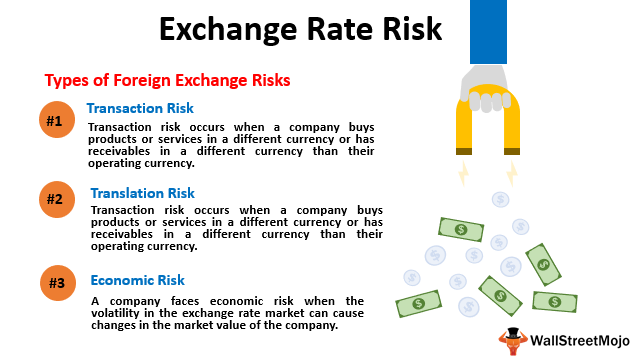

In the globalized economy, businesses and investors frequently engage in cross-border transactions, which expose them to various financial risks. Among these risks, exchange rate risk, also known as currency risk, and economic exposure are prominent concerns. Exchange rate risk arises from fluctuations in the value of one currency against another, impacting profit margins, cash flows, and the valuation of assets and liabilities. Economic exposure, on the other hand, encompasses the broader impact of currency value changes on a company's market value, affecting its competitive position and long-term profitability.

Understanding these risks is crucial for businesses and investors seeking to optimize their international financial strategy. Strategies to mitigate such risks, including algorithmic trading, have emerged as powerful tools. Algorithmic trading employs computer algorithms to execute trades based on pre-set conditions, offering speed and accuracy that can provide a protective mechanism against currency and economic exposure risks.



This article will explore these concepts further, highlighting the importance of identifying and managing exchange rate risk and economic exposure. We will discuss how algorithmic trading can be utilized as part of a comprehensive risk management strategy, allowing businesses to adapt effectively to dynamic market conditions and maintain stability amidst global financial uncertainties. Let's first clarify what exchange rate risk and economic exposure entail.

## Table of Contents

## Understanding Exchange Rate Risk

Exchange rate risk, also known as currency risk, arises from fluctuations in the value of one currency against another. These fluctuations can impact the profitability of international trade, investments, and business operations. This type of risk is prevalent in today's interconnected global economy, where exchange rates are subject to a variety of factors including economic indicators, geopolitical events, [interest rate](/wiki/interest-rate-trading-strategies) differentials, and market speculation.

For businesses operating globally, accounting for exchange rate risk is crucial when making financial decisions. If a company is involved in foreign trade, unforeseen changes in exchange rates can either erode profits or create unexpected losses. For example, a U.S. company exporting goods priced in euros will see its revenue diminish if the euro weakens against the dollar after a transaction has been agreed upon but before payment is received.

To manage exchange rate risk, companies commonly employ hedging strategies. These include the use of financial instruments such as forward contracts and options. A forward contract allows businesses to lock in an exchange rate for a future transaction, thereby immunizing against unfavorable currency movements. For instance, if a U.S. exporter anticipates receiving payments in euros in three months, they could use a forward contract to sell euros forward, securing a desirable exchange rate today.

Options, on the other hand, provide the right, but not the obligation, to exchange currency at a set rate on a future date. This flexibility acts as insurance, allowing companies to benefit from favorable rate movements while minimizing losses from adverse ones. Although hedging strategies incur costs, the mitigation of potential losses often justifies these expenses.

Effective management of exchange rate risk can significantly enhance a firm's financial stability. By implementing sound hedging strategies, businesses can stabilize cash flows and improve financial predictability, supporting strategic planning and investment decisions. Moreover, reducing currency risk helps safeguard profit margins and ensures competitive positioning in the international marketplace.

In summary, understanding and mitigating exchange rate risk is essential for the financial health of companies engaged in cross-border transactions. By integrating appropriate hedging techniques, firms can protect themselves from the [volatility](/wiki/volatility-trading-strategies) inherent in foreign exchange markets, thereby safeguarding their international operations.

## Defining Economic Exposure

Economic exposure, also known as operating exposure, encompasses the broader implications of exchange rate fluctuations on a company's market value. Unlike transaction exposure, which pertains to specific financial commitments affected by currency changes, economic exposure reflects the potential for these fluctuations to alter a company’s competitive position and affect its long-term profitability. This type of exposure can have a multifaceted impact on a business's operations.

Primarily, economic exposure can alter a company's cash flows. For instance, if a company's domestic currency strengthens, its products may become more expensive for foreign consumers, potentially reducing sales volumes and, consequently, cash flows. Conversely, a weaker domestic currency can enhance international competitiveness by making products more affordable abroad, potentially boosting sales volumes.

Moreover, currency value fluctuations can compel businesses to modify their pricing strategies. Companies may adopt hedging or price adjustment tactics to manage potential impacts on profit margins. For example, firms might increase prices in foreign markets to offset adverse exchange rate movements or engage in cost-cutting measures to maintain profitability.

Economic exposure can also affect a company's overall market share. Exchange rate changes can alter competitive dynamics; if a competitor's local currency depreciates significantly, they might gain a pricing advantage in international markets, prompting shifts in market share.

Managing economic exposure requires a proactive strategy. Companies often adjust their operational practices, such as diversifying supply chains or repositioning assets geographically, to mitigate adverse effects. Firms may also employ financial instruments or develop flexible production processes to adapt to changing market conditions.

Because economic exposure is multifaceted and difficult to quantify, it poses significant challenges for measurement and management. Nonetheless, addressing this form of risk is crucial for sustaining a company's financial health and competitive standing in a global market.

## Algorithmic Trading: A Modern Solution

Algorithmic trading, commonly referred to as algo trading, involves the use of computer algorithms to automatically execute trades when certain predefined conditions are met. This contemporary technology offers significant advantages in terms of speed and precision, enabling traders to swiftly react to fluctuations in currency values. In the fast-paced environment of the [forex](/wiki/forex-system) market, where exchange rates can change rapidly, the ability to execute trades at optimal times can be the difference between profit and loss.

One of the primary benefits of [algorithmic trading](/wiki/algorithmic-trading) lies in its capacity to analyze vast datasets to make informed trading decisions. By leveraging advanced data analytics and [machine learning](/wiki/machine-learning) techniques, algo trading systems can identify subtle patterns and trends that may not be immediately apparent to human traders. This analytical prowess provides a hedge against currency and economic exposure risks, allowing traders to mitigate potential losses due to adverse market movements.

Moreover, the complex strategies that algorithmic trading systems can implement are often beyond the capabilities of manual trading. These strategies can include statistical [arbitrage](/wiki/arbitrage), [trend following](/wiki/trend-following), and [market making](/wiki/market-making), among others. For instance, [statistical arbitrage](/wiki/statistical-arbitrage) uses quantitative models to identify price inefficiencies between related financial instruments, executing trades to capitalize on these discrepancies. Such strategies require rapid and precise execution, which is where algorithmic trading excels.

In addition to its role in risk management, algorithmic trading contributes to enhancing [liquidity](/wiki/liquidity-risk-premium) in the forex market. By executing a large number of small transactions continuously, algo trading increases the availability of currency pairs, facilitating smoother and more stable market conditions. Furthermore, the automated nature of these systems helps in reducing transaction costs. By eliminating the need for manual intervention, algorithmic trading minimizes human error and decreases the spread between buying and selling prices, thus lowering the overall cost of trading.

Overall, algorithmic trading represents a modern solution for managing the intricate risks associated with currency fluctuations and economic exposure. It combines technological sophistication with strategic trading methodologies to offer enhanced decision-making capabilities, liquidity, and cost efficiency in the forex market. As such, it is a critical tool for traders and investors aiming to navigate the complexities of global financial markets effectively.

## Integrating Algo Trading with Risk Management Strategies

Combining traditional risk management techniques with algorithmic trading presents a powerful strategy for mitigating exchange rate and economic exposure risks. By automating hedging strategies, businesses can ensure timely and cost-effective execution of trades, adjusting their exposure dynamically as market conditions evolve. Algorithmic trading leverages computational algorithms to scan markets for the best opportunities, executing transactions based on pre-determined criteria.

Python, widely used in the financial industry, offers libraries such as NumPy and pandas for data analysis, TensorFlow for developing machine learning models, and APIs for accessing market data. An algorithmic strategy may include triggers set to initiate trades when certain market conditions are met, such as a fluctuation in exchange rates reaching a predefined threshold. Below is an example of a simple moving average crossover algorithm implemented in Python, which could be used as part of a broader strategy:

```python
import pandas as pd

def moving_average_crossover(data, short_window=40, long_window=100):
    signals = pd.DataFrame(index=data.index)
    signals['price'] = data['Close']
    signals['short_mavg'] = data['Close'].rolling(window=short_window, min_periods=1, center=False).mean()
    signals['long_mavg'] = data['Close'].rolling(window=long_window, min_periods=1, center=False).mean()
    signals['signal'] = 0.0
    signals['signal'][short_window:] = np.where(signals['short_mavg'][short_window:] > signals['long_mavg'][short_window:], 1.0, 0.0)
    signals['positions'] = signals['signal'].diff()

    return signals

# Assuming `data` is a DataFrame containing historical price data with a 'Close' column
signals = moving_average_crossover(data)
```

This approach provides the dual benefits of efficiency and precision, essential in the fast-paced forex market. Combining it with traditional methods like forward contracts, options, and swaps enhances financial resilience by offering comprehensive risk control. Additionally, algorithmic trading reduces human error and emotional bias, ensuring a consistent and disciplined approach to managing exposures.

Adopting algorithmic trading as part of a comprehensive risk management framework allows firms to better withstand volatility, thereby enhancing their financial stability and competitiveness. By integrating technology into their risk management strategies, businesses remain agile and prepared for rapid shifts in the economic landscape. This strategic edge is particularly critical in today's interconnected and fast-moving financial environment, where the ability to swiftly adapt to new information and conditions can determine a firm's competitive position.

## Conclusion

Exchange rate risk and economic exposure represent substantial challenges for global businesses and investors. These risks can significantly impact profitability and strategic planning, requiring sophisticated approaches to management. Algorithmic trading offers a promising solution by enhancing a firm's ability to navigate these complexities with increased efficiency and precision.

Algorithmic trading serves as a robust tool for managing exchange rate risk and economic exposure. By automating trades based on pre-defined criteria, algo trading systems can react quickly and accurately to currency fluctuations, thereby mitigating potential financial impacts. The ability to process extensive data sets and execute trades almost instantaneously provides a powerful hedge against currency volatility.

Beyond risk mitigation, algorithmic trading significantly boosts decision-making efficiency. It leverages data-driven insights, enabling firms to make informed strategic choices that account for potential currency movements and market conditions. This capacity to act proactively rather than reactively is essential for sustaining a competitive advantage in today’s fast-paced economic environment.

Incorporating advanced technologies like algorithmic trading into conventional risk management strategies is not merely advantageous but necessary. The dynamic nature of international markets demands agility and foresight, which technology can effectively deliver. By integrating these technological solutions, businesses enhance their resilience against currency-related risks and bolster overall financial strategy.

As the global economy continues to evolve, the importance of embracing innovation becomes increasingly evident. Those who adopt cutting-edge technologies and innovative methods for managing currency risks will be better equipped to navigate the complexities of international business. Embracing such advancements will be a determinant of success in the ever-changing landscape of global trade and investment.

## References & Further Reading

[1]: Hull, J. C. (2018). ["Options, Futures, and Other Derivatives"](https://www.semanticscholar.org/paper/Options%2C-Futures%2C-and-Other-Derivatives-Hull/89bdee500c8623864fc9eb7a471546aa713acc44). Prentice Hall.

[2]: ["Risk Management and Financial Institutions"](https://www.simonfoucher.com/MBA/FINA%20695%20-%20Risk%20Management/riskmanagementandfinancialinstitutions4theditionjohnhull-150518225205-lva1-app6892.pdf) by John C. Hull

[3]: Chance, D. M., & Brooks, R. (2013). ["An Introduction to Derivatives and Risk Management"](https://books.google.com/books/about/Introduction_to_Derivatives_and_Risk_Man.html?id=b8PgBQAAQBAJ). Cengage Learning.

[4]: ["Algorithmic and High-Frequency Trading"](https://www.cambridge.org/us/universitypress/subjects/mathematics/mathematical-finance/algorithmic-and-high-frequency-trading) by Álvaro Cartea, Sebastian Jaimungal, and José Penalva

[5]: ["The Science of Algorithmic Trading and Portfolio Management"](https://www.sciencedirect.com/book/9780124016897/the-science-of-algorithmic-trading-and-portfolio-management) by Robert Kissell

[6]: ["Machine Trading: Deploying Computer Algorithms to Conquer the Markets"](https://github.com/gudbrandtandberg/CPSC540Project/blob/master/Machine%20Trading:%20Deploying%20Computer%20Algorithms%20to%20Conquer%20The%20Markets%20(Ernest%20Chan%202017).pdf) by Ernest P. Chan

[7]: King, M. R., & Rime, D. (2010). ["The $4 trillion question: What explains FX growth since the 2007 survey?"](https://papers.ssrn.com/sol3/papers.cfm?abstract_id=1727410) BIS Quarterly Review.