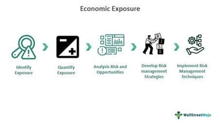

## Table of Contents

## What is exchange rate risk?

Exchange rate risk, also known as currency risk, is the possibility that changes in exchange rates between two currencies will affect the value of an investment or a business transaction. When a company or an investor deals with different currencies, they face the risk that the currency they are holding or expecting to receive might lose value compared to another currency. This can lead to financial losses if the exchange rate moves unfavorably.

For example, if a U.S. company buys goods from Europe and pays in euros, it faces exchange rate risk because the value of the euro might change against the dollar by the time the payment is due. If the euro strengthens against the dollar, the U.S. company will have to pay more dollars to get the same amount of euros, increasing their costs. To manage this risk, businesses and investors often use financial tools like forward contracts or options to lock in exchange rates or hedge against potential losses.

## How does exchange rate risk affect businesses?

Exchange rate risk can make things harder for businesses that deal with other countries. When a business buys or sells things in a different currency, the price can change because of exchange rates. If the currency they need to pay gets more expensive, it costs them more money. If the currency they are going to get becomes less valuable, they earn less money. This can make it tough for businesses to plan and budget because they don't know exactly how much money they will spend or earn.

To handle this risk, businesses might use special financial tools. They can use something called a forward contract to agree on a price for the currency now, even if they will pay or get the money later. This helps them know exactly how much they will need to spend or earn. Another way is to use options, which give them the choice to buy or sell currency at a set price. By using these tools, businesses can protect themselves from losing too much money if the exchange rates change a lot.

## What is economic exposure?

Economic exposure is when a company's future earnings might change because of shifts in exchange rates. It's not just about the money they have right now, but how much money they might make or lose in the future. For example, if a company in the U.S. sells products in Europe, and the euro gets weaker against the dollar, the company could earn less money when they convert their euros back to dollars.

To deal with economic exposure, companies can try different things. They might decide to make their products in different countries to balance out the risk. Or, they could use financial tools like forward contracts to lock in exchange rates for the future. By doing these things, companies can protect themselves better and have a more stable idea of how much money they will make, even if exchange rates keep changing.

## How can exchange rate fluctuations impact a company's financial statements?

Exchange rate fluctuations can mess up a company's financial statements in a big way. When a company does business in different countries, it has to change the money it earns or spends into its home currency to report it. If the exchange rate changes a lot, the numbers on the financial statements can look very different. For example, if the dollar gets stronger against the euro, the value of the money a U.S. company earns in Europe will be less when it's changed back to dollars. This can make the company's revenue look smaller than it really is.

These changes can also affect other parts of the financial statements. The value of things the company owns in other countries, like factories or machines, can go up or down because of exchange rates. If the local currency gets weaker, those assets will be worth less in the company's home currency. This can make the company's total value seem to drop, even if nothing else has changed. Companies have to be careful and use special methods to show these changes correctly on their financial statements.

## What are the differences between transaction, translation, and economic exposure?

Transaction exposure happens when a company is about to pay or get money in a different currency. If the exchange rate changes before the payment is made, it can cost the company more or less money than they expected. For example, if a U.S. company is going to pay a supplier in Japan in yen, and the yen gets stronger against the dollar before the payment, the U.S. company will have to pay more dollars to get the same amount of yen. This kind of exposure is about the money the company is about to move from one currency to another.

Translation exposure is about how a company reports its money in its financial statements. When a company has assets or earnings in other countries, it has to change those numbers into its home currency. If the exchange rate changes, the value of those assets or earnings can look different on the financial statements. For instance, if a U.S. company owns a factory in Europe, and the euro gets weaker against the dollar, the value of that factory in dollars will go down on the company's financial statements. This exposure is about how the numbers look on paper, not about the actual money moving around.

Economic exposure is about how exchange rate changes can affect a company's future earnings. It's not just about the money the company has right now, but how much money it might make or lose in the future. For example, if a U.S. company sells products in Europe, and the euro gets weaker against the dollar, the company could earn less money when it changes its euros back to dollars. This kind of exposure is about the bigger picture and how well the company can do business in the long run.

## What strategies can companies use to manage exchange rate risk?

Companies can use different ways to manage exchange rate risk. One way is to use forward contracts. This is like making a deal to buy or sell a currency at a set price in the future. So, even if the exchange rate changes a lot, the company knows exactly how much it will cost or how much it will get. Another way is to use options, which give the company the choice to buy or sell a currency at a set price. This can be helpful because the company can choose to use the option if the exchange rate goes against them, but they don't have to if it's better to just use the current rate.

Another strategy is called natural hedging. This means the company tries to balance its money coming in and going out in different currencies. For example, if a company earns money in euros and also has to pay for things in euros, the exchange rate risk is less because the money they earn and spend is in the same currency. Companies can also change where they make their products or where they sell them to spread out the risk. By doing these things, companies can protect themselves better from losing money because of changes in exchange rates.

## How does economic exposure influence long-term strategic planning?

Economic exposure can really change how a company thinks about its future plans. When a company knows that changes in exchange rates could affect how much money it will make, it has to be smart about where it does business and how it does it. For example, if a company sells things in a country where the currency might get weaker, it might decide to start selling in other countries too, so it's not too dependent on just one place. It might also choose to make its products in different countries to balance out the risk. By thinking about economic exposure, a company can make plans that help it stay strong even if exchange rates change a lot.

To deal with economic exposure in the long run, companies can also use financial tools like forward contracts or options. These tools help the company lock in exchange rates for the future, so they know how much money they will make or spend. This makes it easier to plan because the company can predict its costs and earnings better. By using these strategies, a company can focus on growing and doing well, instead of worrying too much about sudden changes in exchange rates.

## What are the key economic indicators that businesses should monitor to assess exchange rate risk?

Businesses should keep an eye on several key economic indicators to understand exchange rate risk better. One important thing to watch is inflation rates in different countries. If one country's inflation is much higher than another's, its currency might lose value compared to the other currency. Another thing to look at is interest rates set by central banks. When a country raises its interest rates, it can make its currency stronger because more people want to invest there. Also, businesses should pay attention to the balance of trade, which is the difference between what a country exports and imports. If a country imports a lot more than it exports, its currency might get weaker.

Another set of indicators to monitor includes economic growth rates and political stability. If a country's economy is growing fast, its currency might get stronger because people see it as a good place to invest. But if there's a lot of political trouble, the currency might lose value because people are worried about the future. Businesses should also look at foreign exchange reserves, which is the amount of foreign currency a country's central bank holds. If these reserves are low, it might mean the country can't support its currency as well, making it weaker. By watching these indicators, businesses can get a better idea of how exchange rates might change and plan accordingly.

## How do multinational corporations handle economic exposure across different countries?

Multinational corporations deal with economic exposure by spreading out their business across different countries. They do this by making and selling things in various places. This way, if the currency in one country gets weaker, they can still earn money from other countries where the currency might be stronger. They also try to match where they earn and spend money in the same currency, which is called natural hedging. By doing these things, they can protect themselves from losing too much money because of changes in exchange rates.

Another way multinational corporations handle economic exposure is by using financial tools like forward contracts and options. Forward contracts let them agree on a price for a currency now, even if they will use it later. This helps them know exactly how much they will spend or earn. Options give them the choice to buy or sell currency at a set price, which can be useful if the exchange rate moves against them. By using these tools, multinational corporations can plan better and make sure they don't lose too much money because of exchange rate changes.

## What role do financial instruments like forwards, futures, and options play in mitigating exchange rate risk?

Financial instruments like forwards, futures, and options help companies deal with exchange rate risk by letting them lock in prices for currencies ahead of time. A forward contract is like making a deal now to buy or sell a currency later at a set price. This means a company knows exactly how much it will cost or how much it will get, even if the exchange rate changes a lot before the payment is due. Futures are similar to forwards but are traded on an exchange, making them a bit more standardized and easier to buy and sell. By using these tools, companies can protect themselves from losing money if the exchange rate goes against them.

Options give companies even more flexibility. An option gives a company the right, but not the obligation, to buy or sell a currency at a set price. This means they can choose to use the option if the exchange rate moves against them, but they don't have to if the current rate is better. This can be really helpful because it lets companies plan their costs and earnings better without being stuck with a bad deal if the exchange rate changes in their favor. By using forwards, futures, and options, companies can manage exchange rate risk and focus on growing their business instead of worrying about sudden changes in currency values.

## How can a company assess its level of economic exposure to exchange rate movements?

A company can figure out how much its future earnings might change because of exchange rates by looking at where it makes and sells its products. If a company sells a lot of things in a country with a currency that might get weaker, it could earn less money when it changes that money back to its home currency. To understand this better, the company needs to think about how much of its business is in different countries and how those countries' currencies might change compared to its home currency. By doing this, the company can see how big of a risk it faces from exchange rate changes.

To get a clearer picture, the company can also use financial tools like forward contracts or options. These tools help the company lock in exchange rates for the future, so they can predict how much money they will make or spend. By using these tools, the company can see how much protection it needs and how much it might lose or gain if exchange rates move a lot. This helps the company plan better and make decisions that keep its business strong, even if exchange rates keep changing.

## What are the advanced models used for predicting and managing exchange rate risk and economic exposure?

Advanced models for predicting and managing exchange rate risk and economic exposure include things like Value at Risk (VaR) models and econometric models. VaR models help companies figure out how much money they might lose because of exchange rate changes over a certain time. These models look at how exchange rates have moved in the past and use that information to guess how much risk a company faces. Econometric models use math to predict how exchange rates might change based on things like inflation, interest rates, and how much a country is buying and selling stuff with other countries. By using these models, companies can get a better idea of what might happen and plan accordingly.

Another type of model is the scenario analysis, which helps companies think about different things that could happen with exchange rates. They can imagine different situations, like if a currency gets a lot stronger or weaker, and see how that would affect their business. This helps them prepare for different possibilities and make plans to protect themselves. Some companies also use simulation models, which use computers to run lots of different scenarios quickly. These models can show how exchange rate changes might affect a company's future earnings and help them find the best ways to manage their risk. By using these advanced models, companies can make smarter decisions and protect themselves better from exchange rate changes.

## References & Further Reading

[1]: Hull, J. C. (2018). ["Options, Futures, and Other Derivatives"](https://www.semanticscholar.org/paper/Options%2C-Futures%2C-and-Other-Derivatives-Hull/89bdee500c8623864fc9eb7a471546aa713acc44). Prentice Hall.

[2]: ["Risk Management and Financial Institutions"](https://www.simonfoucher.com/MBA/FINA%20695%20-%20Risk%20Management/riskmanagementandfinancialinstitutions4theditionjohnhull-150518225205-lva1-app6892.pdf) by John C. Hull

[3]: Chance, D. M., & Brooks, R. (2013). ["An Introduction to Derivatives and Risk Management"](https://books.google.com/books/about/Introduction_to_Derivatives_and_Risk_Man.html?id=b8PgBQAAQBAJ). Cengage Learning.

[4]: ["Algorithmic and High-Frequency Trading"](https://www.cambridge.org/us/universitypress/subjects/mathematics/mathematical-finance/algorithmic-and-high-frequency-trading) by Álvaro Cartea, Sebastian Jaimungal, and José Penalva

[5]: ["The Science of Algorithmic Trading and Portfolio Management"](https://www.sciencedirect.com/book/9780124016897/the-science-of-algorithmic-trading-and-portfolio-management) by Robert Kissell

[6]: ["Machine Trading: Deploying Computer Algorithms to Conquer the Markets"](https://github.com/gudbrandtandberg/CPSC540Project/blob/master/Machine%20Trading:%20Deploying%20Computer%20Algorithms%20to%20Conquer%20The%20Markets%20(Ernest%20Chan%202017).pdf) by Ernest P. Chan

[7]: King, M. R., & Rime, D. (2010). ["The $4 trillion question: What explains FX growth since the 2007 survey?"](https://papers.ssrn.com/sol3/papers.cfm?abstract_id=1727410) BIS Quarterly Review.