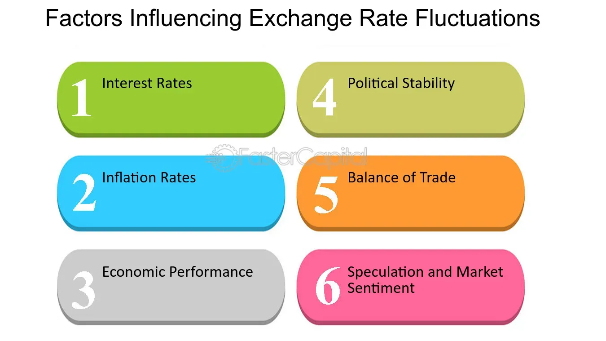

## Table of Contents

## What is an exchange rate?

An exchange rate is the value of one country's money compared to another country's money. For example, if you want to buy something from Japan but you have American dollars, you need to know how many dollars it takes to get one Japanese yen. This rate tells you how much your money is worth in another country's currency.

Exchange rates change all the time because they are influenced by many things, like how well a country's economy is doing, interest rates, and even big news events. If a country's economy is strong, its currency usually becomes more valuable. This means you would need fewer of your dollars to buy their currency. On the other hand, if a country's economy is weak, its currency might become less valuable, and you would need more of your dollars to buy their currency.

## How are exchange rates determined?

Exchange rates are determined by what's called the foreign exchange market, where people and businesses from different countries trade currencies. The main thing that decides these rates is supply and demand. If lots of people want to buy a country's currency, its value goes up. If fewer people want it, its value goes down. This can happen because of many reasons, like how well a country's economy is doing, or if there's news that makes people think the economy will do better or worse in the future.

Governments and central banks also play a big role in setting exchange rates. They can do things like changing interest rates or buying and selling their own currency to make it stronger or weaker. For example, if a country wants its currency to be worth more, its central bank might raise interest rates. This makes people want to hold onto that country's money more, so its value goes up. But if they want the currency to be worth less, maybe to help their exports be cheaper for other countries, they might do the opposite.

Sometimes, countries agree to keep their currencies at a certain value compared to each other. This is called a fixed exchange rate. But most of the time, exchange rates are floating, meaning they change based on what's happening in the market. This can make things a bit unpredictable, but it also lets the market decide what currencies are worth.

## What is the difference between fixed and floating exchange rates?

A fixed exchange rate is when a country's government decides to keep its currency's value the same compared to another currency, like the US dollar. They do this by buying or selling their own currency to keep the rate steady. This can make things more predictable for businesses and people who trade between countries. But, it can be hard for the government to keep the rate fixed, especially if the economy changes a lot.

A floating exchange rate is when a country lets the value of its currency change based on what people in the market want. If more people want to buy the currency, its value goes up. If fewer people want it, its value goes down. This can make things less predictable, but it lets the market decide what the currency is worth. Most big economies use floating exchange rates because they think it's a better way to let their economies grow and change.

Both fixed and floating exchange rates have good and bad points. Fixed rates can help keep things steady, but they need a lot of work from the government. Floating rates can be more flexible and let the economy adjust to changes, but they can also make things more uncertain.

## What are the main factors that cause exchange rates to fluctuate?

Exchange rates go up and down because of many things. The biggest reason is how much people want to buy or sell a currency. If more people want to buy a country's currency, its value goes up. If fewer people want it, its value goes down. This can happen because of news about the economy, like if a country's businesses are doing well or if there are big changes in the government. Also, if people think a country's economy will do better in the future, they might want to buy its currency now, which makes its value go up.

Another big [factor](/wiki/factor-investing) is what governments and central banks do. They can change interest rates, which is how much it costs to borrow money. If a country raises its interest rates, people might want to keep their money there to get a better return, so the currency's value goes up. Central banks can also buy or sell their own currency to make it stronger or weaker. For example, if they want to make their exports cheaper for other countries, they might sell their currency to make its value go down.

Other things can also affect exchange rates, like big events around the world or changes in how much people trust a country's money. If there's a war or a natural disaster, it can make people less sure about a country's economy, which can make its currency's value go down. Also, if people start to think a country's money isn't safe to keep, they might sell it, which makes its value drop. All these things together make exchange rates change all the time.

## How do interest rates affect exchange rates?

Interest rates can have a big effect on exchange rates. When a country raises its interest rates, it makes its currency more attractive to people who want to save money. They can get a better return on their savings, so they might want to buy that country's currency. This means more people want to buy the currency, which makes its value go up compared to other currencies. On the other hand, if a country lowers its interest rates, it makes its currency less attractive to savers. They might move their money to another country where they can get a better return, which means fewer people want to buy the currency, and its value goes down.

Central banks play a big role in this because they are the ones who set interest rates. If a central bank thinks the economy is growing too fast and might cause inflation, it might raise interest rates to slow things down. This can make the country's currency stronger. But if the economy is doing badly and needs a boost, the central bank might lower interest rates to encourage borrowing and spending. This can make the currency weaker. So, changes in interest rates can cause exchange rates to go up and down, depending on what the central bank decides to do.

## What role do inflation rates play in exchange rate movements?

Inflation rates can affect how much one country's money is worth compared to another country's money. If a country has high inflation, it means things there are getting more expensive faster than in other places. This can make people think the country's money is not as good, so they might want to sell it. When more people want to sell a currency, its value goes down. On the other hand, if a country has low inflation, its money might seem more stable and valuable, so more people might want to buy it, which makes its value go up.

Central banks watch inflation closely because it can affect their country's money. If inflation is too high, the central bank might raise interest rates to slow down the economy and make things less expensive. This can make the country's money stronger because higher interest rates make the currency more attractive to people who want to save money. But if inflation is too low, the central bank might lower interest rates to help the economy grow and make things more expensive. This can make the country's money weaker because lower interest rates make the currency less attractive to savers. So, inflation can cause big changes in exchange rates by influencing what central banks do with interest rates.

## How do political events influence exchange rates?

Political events can make exchange rates go up and down because they can change how people feel about a country's money. If something big happens in a country, like an election or a new law, it can make people think the country's economy will do better or worse. If people think the economy will do better, they might want to buy more of that country's money, which makes its value go up. But if they think the economy will do worse, they might want to sell the country's money, which makes its value go down.

Wars, protests, and other big events can also shake up exchange rates. If there's a war or a lot of protests, it can make people less sure about a country's future. When people are unsure, they might want to move their money to a safer country, which means they sell the country's money and its value goes down. Governments can also change exchange rates on purpose by doing things like controlling how much money can leave the country or changing rules about foreign money. All these political events can make exchange rates move a lot.

## What is the impact of trade balances on exchange rates?

Trade balances can affect how much one country's money is worth compared to another country's money. When a country sells more things to other countries than it buys, it has a trade surplus. This means more money is coming into the country than going out. People in other countries need to buy the country's money to pay for the things they're buying, which can make the country's money more valuable. On the other hand, if a country buys more things from other countries than it sells, it has a trade deficit. This means more money is leaving the country than coming in. People in the country need to buy other countries' money to pay for the things they're buying, which can make the country's money less valuable.

Governments and central banks pay attention to trade balances because they can influence what they do with interest rates and other policies. If a country has a big trade surplus, its central bank might want to keep the country's money from getting too strong, because that could make the country's exports more expensive for other countries. They might do things like lowering interest rates or buying other countries' money to keep their own money's value from going up too much. If a country has a big trade deficit, the central bank might want to make the country's money weaker to help its exports be cheaper for other countries. They might raise interest rates or sell their own money to make its value go down. So, trade balances can have a big impact on exchange rates by changing what governments and central banks do.

## How do speculators affect currency exchange rates?

Speculators are people who buy and sell currencies hoping to make money from changes in exchange rates. They can have a big effect on how much one country's money is worth compared to another country's money. If speculators think a country's money will become more valuable soon, they will buy a lot of it now. This makes more people want to buy the currency, which can make its value go up. But if speculators think a country's money will become less valuable soon, they will sell a lot of it now. This makes more people want to sell the currency, which can make its value go down.

Sometimes, speculators can cause big changes in exchange rates even if the country's economy isn't doing anything different. For example, if a lot of speculators start buying a country's money because they think it will go up in value, this can make the currency's value go up a lot, even if nothing else has changed. On the other hand, if a lot of speculators start selling a country's money because they think it will go down in value, this can make the currency's value go down a lot. So, what speculators do can make exchange rates move around a lot, even if the real economy stays the same.

## What are currency interventions and how do they impact exchange rates?

Currency interventions happen when a country's government or central bank steps in to change how much its money is worth compared to other countries' money. They do this by buying or selling their own currency in the foreign exchange market. If they want their money to be worth more, they might buy a lot of it. This makes more people want to buy the currency, which can make its value go up. If they want their money to be worth less, they might sell a lot of it. This makes more people want to sell the currency, which can make its value go down.

These interventions can have a big effect on exchange rates. When a government or central bank buys or sells a lot of its own money, it can change what people think about the currency's future value. For example, if a central bank buys a lot of its own money, people might think the government wants the currency to be worth more, so they might buy it too. This can make the currency's value go up even more. But if a central bank sells a lot of its own money, people might think the government wants the currency to be worth less, so they might sell it too. This can make the currency's value go down even more. So, currency interventions can make exchange rates move a lot, depending on what the government or central bank decides to do.

## How can advanced economic indicators be used to predict exchange rate movements?

Advanced economic indicators can help people guess how exchange rates might change in the future. These indicators are like clues that show how a country's economy is doing. For example, if the unemployment rate goes down, it might mean more people are working and making money, which can make the country's currency more valuable. Other important indicators include inflation rates, interest rates, and how much a country is buying and selling with other countries. By looking at these indicators, people can get a good idea of whether a country's money will go up or down in value compared to other countries' money.

Sometimes, these indicators can also show big changes coming in the economy. For instance, if a country's central bank says it will raise interest rates, this can make people think the country's money will become more valuable because higher interest rates can attract more people to save money in that country. Also, if a country's trade balance shows it is selling more things to other countries than it is buying, this can make its currency stronger. By keeping an eye on these advanced economic indicators, people can make better guesses about what will happen to exchange rates and plan their money moves accordingly.

## What are the long-term trends and cycles in exchange rates and their underlying causes?

Exchange rates can change a lot over the long term, and these changes often follow big trends and cycles. One of the main reasons for these long-term trends is how well a country's economy is doing compared to other countries. If a country's economy is growing faster than others, its money might become more valuable over time. This can happen because more people want to buy the country's money to invest in its growing economy. On the other hand, if a country's economy is not doing well, its money might become less valuable over time. Big changes in things like interest rates, inflation, and how much a country is buying and selling with other countries can also cause these long-term trends.

Another reason for long-term trends and cycles in exchange rates is what governments and central banks do. They can change interest rates or buy and sell their own money to make it more or less valuable. For example, if a country wants its money to be worth more over the long term, its central bank might keep interest rates high to attract more people to save money there. But if a country wants its money to be worth less to help its exports, it might keep interest rates low. These actions can lead to long cycles where a country's money goes up and down in value over many years. Understanding these trends and cycles can help people make better guesses about what will happen to exchange rates in the future.

## What is the understanding of currency exchange rates?

Exchange rates specify the amount at which one currency can be exchanged for another, central to global economic activities. These rates arise from the demand and supply dynamics in the [forex](/wiki/forex-system) market, which cater to international trade, investments, and tourism. Exchange rates are primarily classified into two types: free-floating rates and fixed rates. Each has its unique set of characteristics and implications on economic stability.

Free-floating rates are determined by market forces without direct government or central bank intervention. Since they fluctuate based on changes in supply and demand, these rates can be volatile, reflecting real-time economic conditions, investor sentiment, and market speculation. 

Fixed rates, on the other hand, are pegged to another currency or a basket of currencies. This system requires a country to maintain an official exchange rate through active involvement in the forex market by buying or selling its currency. Fixed rates aim to provide stability by reducing exchange rate risk and fostering predictable trade environments. However, maintaining such a system can be challenging and costly, especially when domestic and global economic conditions diverge.

Several key factors influence exchange rates:

1. **Interest Rates**: Variations in interest rates between countries impact currency values by affecting the flow of capital across borders. Higher interest rates offer lenders a higher return, attracting foreign capital and causing the currency to appreciate. Conversely, lower interest rates may lead to depreciation as investors seek higher returns elsewhere. 
$$
   \text{Exchange Rate Movement} = f(\text{Interest Rate Differential})

$$

2. **Economic Performance**: Indicators such as GDP growth, employment rates, and industrial production signify a country's economic health, affecting currency value. Strong economic performance tends to attract investments and boosts a currency's strength. 

3. **Political Stability**: Political events and a stable governance framework ripen a fertile ground for investment, instilling confidence in a country’s currency. Conversely, political instability or geopolitical tensions may deter investors, leading to a currency's depreciation.

By understanding these dynamics, businesses and investors can better navigate the forex market, making informed decisions to hedge against potential risks associated with currency fluctuations.

## What are the causes of currency fluctuations?

Exchange rate fluctuations are a complex phenomenon influenced by a multitude of factors, each contributing to the dynamic nature of currency valuations. One of the most significant causes of these fluctuations is the difference in interest rates between countries, known as [interest rate](/wiki/interest-rate-trading-strategies) differentials. When a country offers higher interest rates compared to others, it tends to attract foreign capital, increasing the demand for its currency and subsequently its value. Conversely, lower interest rates can lead to capital outflow, depreciating the currency. The formula to represent this relationship can be captured through the interest rate parity theory, which implies that the difference in interest rates between two countries is equal to the expected change in exchange rates between the two countries' currencies:

$$
(1 + i_{dom}) = \frac{E(S)}{S} \times (1 + i_{for})
$$

where:
- $i_{dom}$ is the domestic interest rate
- $i_{for}$ is the foreign interest rate
- $E(S)$ is the expected future spot exchange rate
- $S$ is the current spot exchange rate

Inflation rates are another crucial determinant, as currencies from countries with consistently lower inflation rates tend to appreciate in value. This is because lower inflation typically correlates with higher purchasing power and maintaining currency value. Political stability and events also exert substantial influence, as countries with stable political environments are perceived as lower-risk investments, fostering currency appreciation. Conversely, political turmoil can trigger uncertainty, leading to depreciative pressures on the currency.

Moreover, global economic events, whether they involve geopolitical tensions, trade agreements, or natural disasters, can significantly impact currencies by altering investor confidence and market dynamics. These events often shift market sentiment abruptly, causing sudden changes in currency valuations as participants reassess risk and opportunities.

Market sentiment itself, shaped by investor perceptions and psychological factors, is pivotal in both short-term and long-term currency value fluctuations. Positive sentiment about a country’s economic outlook can boost its currency, while negative sentiment can have the opposite effect. Market participants often react quickly to news and data releases, leading to immediate, albeit sometimes temporary, currency movements.

In summary, changes in interest rates, inflation, political events, and global economic circumstances, along with the collective perceptions of these factors by market participants, all contribute to the fluctuations in currency values that can have far-reaching effects on international financial markets.

## What is the impact of exchange rates on international trade?

Exchange rate fluctuations have significant implications for international trade by directly affecting the pricing of imported and exported goods. When the value of a nation's currency changes relative to other currencies, it alters the cost competitiveness of its goods and services on the global stage, thereby influencing trade balances.

A depreciating currency can offer a competitive advantage to exporters by making their goods cheaper for foreign buyers. For instance, if a U.S. exporter sells goods priced in dollars and the dollar weakens against the euro, European buyers find U.S. goods less expensive. This can lead to an increase in demand for U.S. exports, potentially improving the trade balance. Conversely, imports become more costly, as foreign goods priced in stronger currencies require more of the depreciated currency to purchase. For example, if the euro strengthens against the dollar, U.S. importers must spend more dollars to acquire goods from the Eurozone, which could lead to a decrease in imports.

Different sectors experience varying sensitivity to currency changes. Commodities sectors, such as agriculture and mining, often exhibit high sensitivity because their goods are priced globally in major currencies like the U.S. dollar. A volatile exchange rate can drastically alter commodity prices, influencing both importing and exporting countries' economic conditions.

Manufacturing and technology sectors also feel the impact of currency fluctuations, although sometimes to a lesser extent. A strong domestic currency can make their exports less competitive internationally, potentially reducing market share. However, it may also lower the cost of importing components and materials crucial for production, which can benefit industries relying heavily on international supply chains.

Services, particularly those exported digitally, may demonstrate slightly less sensitivity to exchange rates compared to goods. However, significant fluctuations still impact the affordability of services for international clients and can affect the overall competitiveness of service providers in a global market.

The impact on trade balances can be summarized by the trade-weighted exchange rate (TWXR), which measures a currency's value relative to a basket of other currencies, adjusted for the amount of trade with each of those countries. Changes in the TWXR influence the balance of trade (exports minus imports), affecting the overall economic performance:

$$
\text{Balance of Trade} = \text{Exports} - \text{Imports}
$$

Understanding the interplay between exchange rates and international trade is crucial for policymakers and businesses seeking to navigate and strategize within the global economic landscape. As such, managing exchange rate risks is essential for maintaining competitiveness and stability in international trade.

## References & Further Reading

[1]: Bank for International Settlements. (2021). [Triennial Central Bank Survey: Foreign exchange turnover in April 2021.](https://www.bis.org/statistics/rpfx22.htm)

[2]: Aldridge, Irene. (2013). ["High-Frequency Trading: A Practical Guide to Algorithmic Strategies and Trading Systems."](https://www.amazon.com/High-Frequency-Trading-Practical-Algorithmic-Strategies/dp/1118343506) Wiley.

[3]: Bodie, Z., Kane, A., & Marcus, A. J. (2014). ["Investments."](https://www.mheducation.com/highered/product/investments-bodie-kane/M9781264412662.html) McGraw-Hill Education.

[4]: Krugman, P., Obstfeld, M., & Melitz, M. (2018). ["International Economics: Theory and Policy."](https://www.pearson.com/se/Nordics-Higher-Education/subject-catalogue/economics/International-Economics-Theory-and-Policy-Krugman.html) Pearson.

[5]: Lopez de Prado, M. (2018). ["Advances in Financial Machine Learning."](https://www.amazon.com/Advances-Financial-Machine-Learning-Marcos/dp/1119482089) Wiley.

[6]: Hull, J. C. (2012). ["Options, Futures, and Other Derivatives."](https://www.semanticscholar.org/paper/Options%2C-Futures%2C-and-Other-Derivatives-Hull/89bdee500c8623864fc9eb7a471546aa713acc44) Pearson.

[7]: Geman, H. (2005). ["Commodities and Commodity Derivatives: Modelling and Pricing for Agriculturals, Metals and Energy."](https://www.semanticscholar.org/paper/Commodities-and-Commodity-Derivatives%3A-Modelling-Geman/e20e4e93b7ef47399f0faf7a4a0c9d660763b850) Wiley.