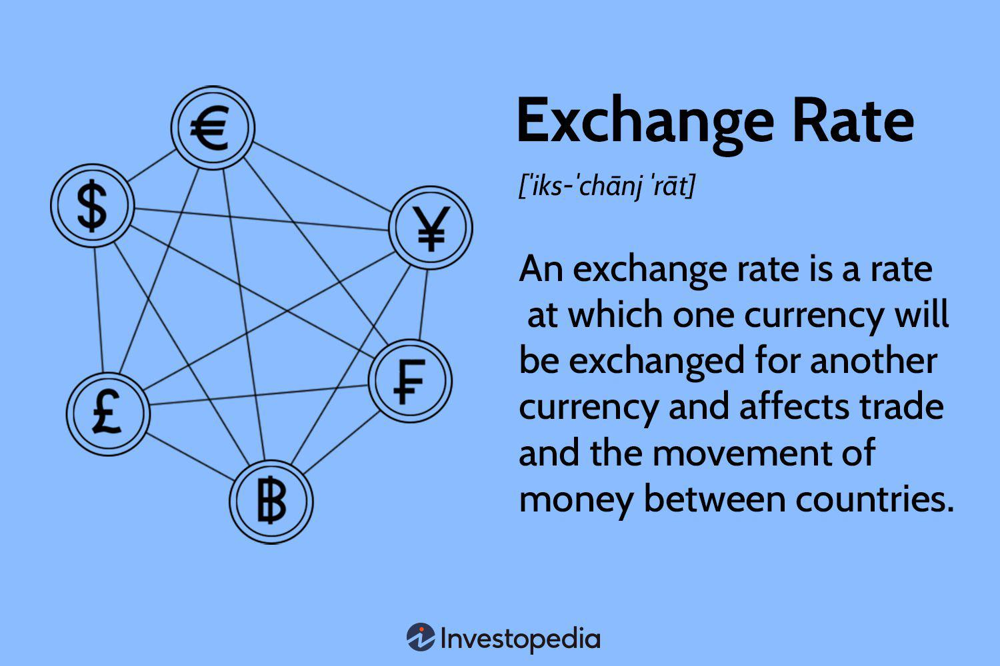

Exchange rates and currency fluctuations are integral elements of the global economy with impactful consequences on trade, tourism, and investments. These fluctuations are driven by a complex interplay of factors, including economic indicators such as interest and inflation rates, geopolitical developments, and market sentiment. Exchange rates essentially represent the relative value of one currency against another and can either be free-floating or pegged to another currency or a basket of currencies. The foreign exchange (forex) market, where these currencies are traded, is the largest and most liquid financial market in the world, with daily trading volumes exceeding $6 trillion as of 2021[^1^].

For businesses and investors, understanding the intricacies of exchange rates is crucial. Exchange rate fluctuations can affect pricing strategies, profit margins, and competitiveness in international markets. A robust comprehension of these elements enables market participants to make informed decisions and hedge against potential adverse movements, thus ensuring stability in financial planning and operations. Businesses engaging in cross-border transactions often encounter currency risks, and mitigating these risks is vital for maintaining profitability.



Amid the rise of digital technology, algorithmic trading is revolutionizing the way traders engage with currency markets. Unlike traditional trading, which involves manual decision-making, algorithmic trading uses pre-set automated instructions to execute trades based on real-time market data. These algorithms can process vast amounts of information at speeds far beyond human capability, identifying potential trading opportunities and optimizing trading efficiency. Through techniques such as statistical arbitrage, machine learning, and artificial intelligence, algorithmic trading offers enhanced risk management tools, enabling traders to respond swiftly to market movements and capitalize on arbitrage opportunities[^2^].

This article explores the dynamics of currency fluctuations, exchange rates, and the role of algo trading in forex trading. It aims to provide a comprehensive overview of the factors influencing exchange rates, the impact on international trade, the integration of algorithmic trading strategies, and the future trends shaping the forex landscape. Understanding these elements is essential for market participants seeking to navigate the complexities of global currency interactions and leverage technological advancements for competitive advantage.

[^1^]: Bank for International Settlements (BIS) 2021 Triennial Central Bank Survey. 
[^2^]: Aldridge, Irene. (2013). "High-Frequency Trading: A Practical Guide to Algorithmic Strategies and Trading Systems."

## Table of Contents

## Understanding Currency Exchange Rates

Exchange rates specify the amount at which one currency can be exchanged for another, central to global economic activities. These rates arise from the demand and supply dynamics in the [forex](/wiki/forex-system) market, which cater to international trade, investments, and tourism. Exchange rates are primarily classified into two types: free-floating rates and fixed rates. Each has its unique set of characteristics and implications on economic stability.

Free-floating rates are determined by market forces without direct government or central bank intervention. Since they fluctuate based on changes in supply and demand, these rates can be volatile, reflecting real-time economic conditions, investor sentiment, and market speculation. 

Fixed rates, on the other hand, are pegged to another currency or a basket of currencies. This system requires a country to maintain an official exchange rate through active involvement in the forex market by buying or selling its currency. Fixed rates aim to provide stability by reducing exchange rate risk and fostering predictable trade environments. However, maintaining such a system can be challenging and costly, especially when domestic and global economic conditions diverge.

Several key factors influence exchange rates:

1. **Interest Rates**: Variations in interest rates between countries impact currency values by affecting the flow of capital across borders. Higher interest rates offer lenders a higher return, attracting foreign capital and causing the currency to appreciate. Conversely, lower interest rates may lead to depreciation as investors seek higher returns elsewhere. 
$$
   \text{Exchange Rate Movement} = f(\text{Interest Rate Differential})

$$

2. **Economic Performance**: Indicators such as GDP growth, employment rates, and industrial production signify a country's economic health, affecting currency value. Strong economic performance tends to attract investments and boosts a currency's strength. 

3. **Political Stability**: Political events and a stable governance framework ripen a fertile ground for investment, instilling confidence in a country’s currency. Conversely, political instability or geopolitical tensions may deter investors, leading to a currency's depreciation.

By understanding these dynamics, businesses and investors can better navigate the forex market, making informed decisions to hedge against potential risks associated with currency fluctuations.

## Causes of Currency Fluctuations

Exchange rate fluctuations are a complex phenomenon influenced by a multitude of factors, each contributing to the dynamic nature of currency valuations. One of the most significant causes of these fluctuations is the difference in interest rates between countries, known as [interest rate](/wiki/interest-rate-trading-strategies) differentials. When a country offers higher interest rates compared to others, it tends to attract foreign capital, increasing the demand for its currency and subsequently its value. Conversely, lower interest rates can lead to capital outflow, depreciating the currency. The formula to represent this relationship can be captured through the interest rate parity theory, which implies that the difference in interest rates between two countries is equal to the expected change in exchange rates between the two countries' currencies:

$$
(1 + i_{dom}) = \frac{E(S)}{S} \times (1 + i_{for})
$$

where:
- $i_{dom}$ is the domestic interest rate
- $i_{for}$ is the foreign interest rate
- $E(S)$ is the expected future spot exchange rate
- $S$ is the current spot exchange rate

Inflation rates are another crucial determinant, as currencies from countries with consistently lower inflation rates tend to appreciate in value. This is because lower inflation typically correlates with higher purchasing power and maintaining currency value. Political stability and events also exert substantial influence, as countries with stable political environments are perceived as lower-risk investments, fostering currency appreciation. Conversely, political turmoil can trigger uncertainty, leading to depreciative pressures on the currency.

Moreover, global economic events, whether they involve geopolitical tensions, trade agreements, or natural disasters, can significantly impact currencies by altering investor confidence and market dynamics. These events often shift market sentiment abruptly, causing sudden changes in currency valuations as participants reassess risk and opportunities.

Market sentiment itself, shaped by investor perceptions and psychological factors, is pivotal in both short-term and long-term currency value fluctuations. Positive sentiment about a country’s economic outlook can boost its currency, while negative sentiment can have the opposite effect. Market participants often react quickly to news and data releases, leading to immediate, albeit sometimes temporary, currency movements.

In summary, changes in interest rates, inflation, political events, and global economic circumstances, along with the collective perceptions of these factors by market participants, all contribute to the fluctuations in currency values that can have far-reaching effects on international financial markets.

## Impact of Exchange Rates on International Trade

Exchange rate fluctuations have significant implications for international trade by directly affecting the pricing of imported and exported goods. When the value of a nation's currency changes relative to other currencies, it alters the cost competitiveness of its goods and services on the global stage, thereby influencing trade balances.

A depreciating currency can offer a competitive advantage to exporters by making their goods cheaper for foreign buyers. For instance, if a U.S. exporter sells goods priced in dollars and the dollar weakens against the euro, European buyers find U.S. goods less expensive. This can lead to an increase in demand for U.S. exports, potentially improving the trade balance. Conversely, imports become more costly, as foreign goods priced in stronger currencies require more of the depreciated currency to purchase. For example, if the euro strengthens against the dollar, U.S. importers must spend more dollars to acquire goods from the Eurozone, which could lead to a decrease in imports.

Different sectors experience varying sensitivity to currency changes. Commodities sectors, such as agriculture and mining, often exhibit high sensitivity because their goods are priced globally in major currencies like the U.S. dollar. A volatile exchange rate can drastically alter commodity prices, influencing both importing and exporting countries' economic conditions.

Manufacturing and technology sectors also feel the impact of currency fluctuations, although sometimes to a lesser extent. A strong domestic currency can make their exports less competitive internationally, potentially reducing market share. However, it may also lower the cost of importing components and materials crucial for production, which can benefit industries relying heavily on international supply chains.

Services, particularly those exported digitally, may demonstrate slightly less sensitivity to exchange rates compared to goods. However, significant fluctuations still impact the affordability of services for international clients and can affect the overall competitiveness of service providers in a global market.

The impact on trade balances can be summarized by the trade-weighted exchange rate (TWXR), which measures a currency's value relative to a basket of other currencies, adjusted for the amount of trade with each of those countries. Changes in the TWXR influence the balance of trade (exports minus imports), affecting the overall economic performance:

$$
\text{Balance of Trade} = \text{Exports} - \text{Imports}
$$

Understanding the interplay between exchange rates and international trade is crucial for policymakers and businesses seeking to navigate and strategize within the global economic landscape. As such, managing exchange rate risks is essential for maintaining competitiveness and stability in international trade.

## Algorithmic Trading in Forex

Algorithmic trading in the foreign exchange (forex) market involves the use of advanced algorithms to automate trading processes, thereby increasing the efficiency and precision of currency transactions. This approach leverages computational algorithms to automate the decision-making process related to buying and selling activities, eliminating human errors and emotional biases that can influence trading decisions.

These algorithms are capable of analyzing market data in real-time, enabling the identification of trading opportunities that might otherwise be difficult for human traders to detect. The algorithms scan large volumes of data, including historical prices, market trends, and economic news, to predict future price movements and execute trades accordingly. This is often done at speeds and frequencies that are unattainable by human traders.

The integration of [artificial intelligence](/wiki/ai-artificial-intelligence) (AI) and [machine learning](/wiki/machine-learning) (ML) into [algorithmic trading](/wiki/algorithmic-trading) systems further enhances their capabilities. AI and ML technologies allow algorithms to learn from historical data and adapt to new market conditions, improving their predictive accuracy and decision-making capabilities over time. For instance, machine learning models like neural networks can process vast amounts of data to identify complex patterns and relationships that influence currency prices.

Algorithmic trading provides a competitive edge by enabling the execution of trades at the optimal price and time, reducing transaction costs, and increasing the [liquidity](/wiki/liquidity-risk-premium) of the markets. Additionally, it incorporates risk management features that protect traders from excessive losses. These systems use predefined criteria to assess risk levels continuously, allowing traders to react swiftly to market changes.

Here is an example of a simple algorithmic trading strategy in Python using historical price data to decide on buy/sell signals:

```python
import pandas as pd

# Load historical price data
data = pd.read_csv('forex_data.csv')
data['SMA_50'] = data['Close'].rolling(window=50).mean()
data['SMA_200'] = data['Close'].rolling(window=200).mean()

# Generate buy/sell signals
data['Signal'] = 0
data.loc[data['SMA_50'] > data['SMA_200'], 'Signal'] = 1  # Buy signal
data.loc[data['SMA_50'] <= data['SMA_200'], 'Signal'] = -1  # Sell signal

# Simulate trading
data['Position'] = data['Signal'].shift()

# Calculate returns
data['Returns'] = data['Close'].pct_change()
data['Strategy_Returns'] = data['Returns'] * data['Position']

# Evaluate performance
total_return = (data['Strategy_Returns'] + 1).prod()
print(f"Total Strategy Return: {total_return:.2f}")
```

This code employs a simple moving average crossover strategy, signaling to buy when the short-term moving average crosses above the long-term moving average and to sell when it crosses below. While basic, such strategies can be expanded and refined with AI and ML models for better performance.

In summary, algorithmic trading in forex markets has transformed traditional trading methods by harnessing the power of modern computational technologies. This evolution continues to offer traders and investors significant opportunities to improve trading outcomes by leveraging cutting-edge technological advancements.

## Managing Forex Risks

Effective risk management is paramount in the forex market due to its inherently volatile nature. Exchange rate fluctuations can have significant financial impacts, necessitating strategies to mitigate potential risks. One of the fundamental approaches to managing these risks is through hedging strategies, which involve various financial instruments such as forwards, options, and swaps.

**Hedging Strategies**

1. **Forwards**: A forward contract is an agreement between two parties to exchange a specific amount of currency at a predetermined rate on a set future date. This allows businesses and investors to lock in exchange rates, thereby reducing the uncertainty associated with currency fluctuations. Forward contracts are particularly useful for companies with receivables or payables denominated in foreign currencies, as they provide a safeguard against adverse currency movements.

2. **Options**: Currency options give the holder the right, but not the obligation, to exchange money at a specified exchange rate on or before a specified date. Options offer the flexibility to benefit from favorable currency movements while providing protection against unfavorable ones. This makes them a versatile tool in risk management, allowing traders to speculate on future movements or hedge open positions.

3. **Swaps**: A currency swap involves the exchange of principal and interest in one currency for the same in another currency. Swaps are often used by companies that need to manage cash flows in different currencies, providing a mechanism to secure a more favorable currency rate over time. They are typically employed in longer-term strategies for interest rate and currency risk management.

**Role of Technology**

Technology significantly enhances risk management capabilities for traders and investors in the forex market. Advanced analytics and real-time data processing enable more accurate forecasting and timely decision-making. For instance, algorithmic trading systems can analyze vast amounts of market data to identify patterns and trends, allowing traders to execute hedging strategies with precision.

Furthermore, the integration of machine learning and artificial intelligence in trading platforms provides sophisticated tools for predicting market movements and optimizing risk management strategies. For example, machine learning models can be trained to recognize complex patterns in exchange rate movements, offering insights that extend beyond traditional analytical methods.

```python
# Sample Python Code to Simulate a Basic Hedging Strategy

import numpy as np

def simulate_hedging_strategy(exchange_rate, volatility, expiration_time, num_simulations):
    np.random.seed(0)
    dt = expiration_time / num_simulations
    prices = np.zeros(num_simulations)
    prices[0] = exchange_rate
    for i in range(1, num_simulations):
        prices[i] = prices[i-1] * np.exp((volatility - 0.5 * volatility**2) * dt + 
                                         volatility * np.sqrt(dt) * np.random.normal())
    return prices

# Example Simulation
exchange_rate = 1.20  # current exchange rate
volatility = 0.02  # assumed volatility
expiration_time = 1.0  # 1 year
num_simulations = 1000  # number of simulations

hedge_prices = simulate_hedging_strategy(exchange_rate, volatility, expiration_time, num_simulations)

print(f"Simulated Hedge Price: {hedge_prices[-1]:.4f}")
```

The advancement of cloud computing and the proliferation of APIs also provide traders with scalable solutions for integrating real-time data feeds and executing trades swiftly. Through these technological advancements, forex market participants can develop resilient strategies that not only mitigate risks but also capitalize on market opportunities.

Overall, the combination of strategic hedging and technological innovations forms the foundation for managing risks in the forex market, promoting financial stability and reducing potential negative impacts from currency [volatility](/wiki/volatility-trading-strategies).

## The Role of Central Banks and Policy Interventions

Central banks play a pivotal role in the economic landscape by influencing exchange rates through the implementation of monetary policies. These institutions utilize tools such as interest rate adjustments, open market operations, and foreign exchange interventions to manage currency valuations and promote economic stability. For instance, by raising interest rates, a central bank can attract foreign capital, leading to an appreciation of the domestic currency. Conversely, lowering interest rates may lead to a depreciation, potentially boosting exports by making them cheaper on the international market.

Government interventions become crucial in scenarios where market disruptions threaten economic stability. These interventions can take various forms, such as direct currency purchases or sales, to prevent excessive volatility. In extreme cases, capital controls may be implemented to regulate the flow of foreign exchange and stabilize the currency. Such measures help maintain public confidence in the economic system, preventing panic and ensuring smooth functioning.

International cooperation and agreements have a longstanding history in shaping global trade dynamics. Institutions such as the International Monetary Fund (IMF) facilitate collaboration among countries to stabilize exchange rates and provide financial assistance during times of need. Historical agreements, like the Bretton Woods system, established fixed exchange rates to foster global economic stability post-World War II. While the system eventually evolved to a regime of floating rates, the precedents set have underscored the importance of multilateral cooperation in managing currency markets.

The influence of central banks and their policy decisions on exchange rates is profound, affecting global trade, investment flows, and overall economic health. By carefully balancing policy measures, central banks strive to maintain an equilibrium that supports economic growth while minimizing the risk of inflation or recession.

## Future Trends and Technological Advancements

Emerging markets are increasingly sensitive to exchange rate fluctuations, providing both risks and opportunities for investors and policymakers. These markets often lack the economic stability found in developed countries, making their currencies more volatile. Factors such as political instability, inflation variability, and sizable fiscal deficits can amplify currency sensitivity in these regions. As a result, investors are required to adapt quickly to changing conditions.

Technological advancements are playing a crucial role in transforming how currencies are managed and traded. Blockchain technology offers increased transparency and security in currency transactions. It holds the potential to streamline foreign exchange processes by reducing the time and cost associated with currency trades. Smart contracts, a feature of blockchain technology, can facilitate automated and reliable currency transactions without the need for intermediaries.

Data analytics is another significant advancement influencing forex markets. The capacity to process and analyze vast amounts of data in real-time allows traders and investors to make informed decisions swiftly. Techniques such as machine learning and artificial intelligence are being employed to predict market movements and assess risk more accurately. For example, machine learning algorithms can be used to model historical currency behavior and forecast future trends, guiding investment strategies.

Continuous research and innovation are expected to reshape forex market landscapes. The ongoing development of quantum computing promises to radically enhance the ability to process complex datasets, potentially leading to unprecedented levels of accuracy in predicting currency movements. Additionally, the integration of 5G technology may improve the speed and reliability of data transmission, further enabling real-time trading and analysis.

The integration of these technologies is expected to increase market efficiency and reduce transaction costs. However, it also raises challenges, such as the need for robust cybersecurity measures to protect against fraud and hacking, and regulatory adaptations to address the unique nature of blockchain-based transactions. As these technologies continue to evolve, they will likely play a pivotal role in the future of forex markets, offering both enhanced opportunities and challenges for all market participants.

## Conclusion

Currency fluctuations and exchange rates have profound implications for both global trade and financial markets. They influence the price competitiveness of goods and services, determine the flow of capital, and affect international investment decisions. As a result, understanding these dynamics is essential for stakeholders in the forex market, which remains the largest and most liquid financial market globally.

The integration of economics, policy, and technology is pivotal in navigating the complexities of forex trading. Market participants must comprehend how economic indicators—such as interest rates and inflation—interact with political events to impact currency values. Simultaneously, the role of central banks and governments in setting monetary policy and intervening in currency markets cannot be overstated. These entities hold considerable sway in influencing exchange rates and ensuring economic stability.

The evolution of forex markets is characterized by the increasing presence of algorithmic trading. This advancement provides traders with powerful tools to enhance market efficiency and improve investment outcomes. Algorithms can process vast amounts of data at speeds unattainable by human traders, identifying patterns and opportunities that would otherwise go unnoticed. Python, for example, is widely used in developing trading algorithms due to its rich ecosystem of libraries such as NumPy for numerical computations and pandas for data manipulation.

```python
import numpy as np
import pandas as pd

# Example algorithmic strategy using moving averages
def moving_average_strategy(prices, short_window=40, long_window=100):
    signals = pd.DataFrame(index=prices.index)
    signals['price'] = prices
    signals['short_mavg'] = prices.rolling(window=short_window, min_periods=1, center=False).mean()
    signals['long_mavg'] = prices.rolling(window=long_window, min_periods=1, center=False).mean()
    signals['signal'] = 0.0
    signals['signal'][short_window:] = np.where(signals['short_mavg'][short_window:] > signals['long_mavg'][short_window:], 1.0, 0.0)   
    signals['positions'] = signals['signal'].diff()
    return signals
```

Technological innovations such as machine learning and blockchain are set to further transform the forex landscape. Machine learning techniques can enhance predictive accuracy, while blockchain technology holds promise for increased transparency and security in transactions. These advancements offer competitive advantages and contribute to the ongoing shift towards automated and data-driven trading strategies.

In conclusion, the intertwined nature of economics, policy, and technology in forex trading underscores the importance of an integrated approach for investors and businesses. As markets continue to evolve, the adoption of algorithmic trading and technological innovations will be key drivers in fostering greater market efficiency and success in forex investments.

## References & Further Reading

[1]: Bank for International Settlements. (2021). [Triennial Central Bank Survey: Foreign exchange turnover in April 2021.](https://www.bis.org/statistics/rpfx22.htm)

[2]: Aldridge, Irene. (2013). ["High-Frequency Trading: A Practical Guide to Algorithmic Strategies and Trading Systems."](https://www.amazon.com/High-Frequency-Trading-Practical-Algorithmic-Strategies/dp/1118343506) Wiley.

[3]: Bodie, Z., Kane, A., & Marcus, A. J. (2014). ["Investments."](https://www.mheducation.com/highered/product/investments-bodie-kane/M9781264412662.html) McGraw-Hill Education.

[4]: Krugman, P., Obstfeld, M., & Melitz, M. (2018). ["International Economics: Theory and Policy."](https://www.pearson.com/se/Nordics-Higher-Education/subject-catalogue/economics/International-Economics-Theory-and-Policy-Krugman.html) Pearson.

[5]: Lopez de Prado, M. (2018). ["Advances in Financial Machine Learning."](https://www.amazon.com/Advances-Financial-Machine-Learning-Marcos/dp/1119482089) Wiley.

[6]: Hull, J. C. (2012). ["Options, Futures, and Other Derivatives."](https://www.semanticscholar.org/paper/Options%2C-Futures%2C-and-Other-Derivatives-Hull/89bdee500c8623864fc9eb7a471546aa713acc44) Pearson.

[7]: Geman, H. (2005). ["Commodities and Commodity Derivatives: Modelling and Pricing for Agriculturals, Metals and Energy."](https://www.semanticscholar.org/paper/Commodities-and-Commodity-Derivatives%3A-Modelling-Geman/e20e4e93b7ef47399f0faf7a4a0c9d660763b850) Wiley.