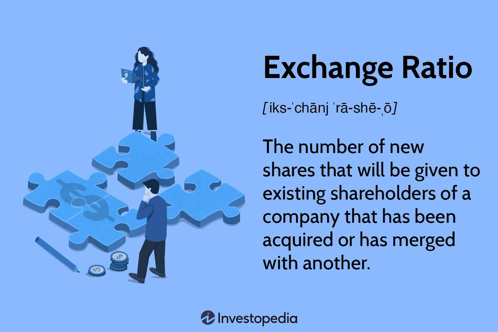

Mergers and acquisitions (M&A) are prominent activities in the financial landscape, representing significant changes in business ownership and control across various industries. These transactions are pivotal for companies aiming to enhance market share, achieve synergies, or gain competitive advantages. M&A deals can transform industry dynamics, reshape companies, and create substantial shareholder value, making them a focal point for investors, analysts, and corporate strategists globally.

In the context of M&A, the concept of exchange ratios plays a critical role. An exchange ratio determines the proportion of shares that will be exchanged between the acquiring company and the target company’s shareholders. This ratio is essential in ensuring that the intrinsic value of shares is equitably distributed among the merging entities. Specifically, the exchange ratio is calculated as the Target Share Price divided by the Acquirer Share Price. This calculation informs how many shares of the acquiring company will be exchanged for each share of the target firm. A well-balanced exchange ratio is vital to preserving shareholder value and maintaining a stable ownership structure after the merger is finalized.

Exchange ratios possess the power to influence shareholder value considerably. They dictate the distribution of future earnings and control between former company shareholders, impacting their investment portfolios and potential returns. Moreover, they are pivotal in defining the post-merger ownership structures, subsequently influencing the managerial decisions and strategic directions of the newly formed entity. Accurate and fair exchange ratios can boost investor confidence and ensure a smoother transition during mergers, while incorrect valuations might lead to discontent and potential losses among shareholders.

The integration of algorithmic trading in M&A processes has further contributed to the precision and optimization of these transactions. Algo trading uses advanced mathematical models and computing power to analyze large datasets and execute trades rapidly and efficiently. Its application in M&A can enhance deal evaluations, streamline negotiations, and optimize exchange ratios by reducing errors and human biases. As the financial world increasingly relies on technology, algorithmic trading continues to offer vital insights and facilitate more effective M&A transactions.

The objective of this article is to examine the methods used in calculating exchange ratios and highlight their critical importance in M&A transactions. We will explore various calculation techniques, the impact of exchange ratios on shareholder value and ownership structures, and the emerging role of algorithmic trading in optimizing these financial strategies. Through detailed analysis and real-world examples, this article aims to shed light on the evolving methodologies and technological advancements reshaping the landscape of M&A transactions.

## Table of Contents

## Understanding Exchange Ratios

An exchange ratio in mergers and acquisitions (M&A) is a financial metric used to determine the proportion of shares that shareholders of a target company will receive for each of their shares when the company is acquired by another. The exchange ratio is pivotal in establishing a fair and equitable distribution of value between the acquiring and target firms. It directly affects the ownership proportions post-merger and is a crucial element in negotiating and closing M&A deals.

### Calculation Formula

The basic formula for calculating an exchange ratio is:

$$

\text{Exchange Ratio} = \frac{\text{Target Share Price}}{\text{Acquirer Share Price}} 
$$

This ratio reflects the relative value of the target company's shares compared to the acquiring company's shares and dictates how many shares of the acquirer will be given for each share of the target firm.

### Importance for Equitable Value Distribution

The exchange ratio is essential in ensuring that shareholders of both the acquiring and target companies receive equitable value from the transaction. A well-calculated exchange ratio ensures that the offered deal reflects the intrinsic value of both companies, safeguarding against either party receiving disproportionately less value. This balance is critical, as any perceived inequity can lead to shareholder opposition or even derail the merger altogether.

### Types of Exchange Ratios

Exchange ratios can be categorized into two main types: fixed exchange ratios and floating exchange ratios.

- **Fixed Exchange Ratios**: With this approach, the number of shares exchanged is predetermined, irrespective of fluctuations in the market prices of either company's shares. The advantage of a fixed ratio is its simplicity and predictability. However, it can expose parties to the risks of value disparity due to market volatility.

- **Floating Exchange Ratios**: This type adjusts the number of shares exchanged to ensure a consistent value transfer, based on changes in the acquirer's share price. The floating ratio can protect the interests of the target company's shareholders in volatile markets by maintaining the economic value of their shares. However, it may introduce complexity and uncertainty into the negotiation process.

### Role in Maintaining Investor Confidence

The selection and communication of the exchange ratio play a significant role in maintaining investor confidence during mergers. Investors need assurance that the transaction is equitable, and the chosen exchange ratio is a key signal of this fairness. A transparent and justified exchange ratio can alleviate concerns about potential dilution or loss of value, fostering a smoother integration process. Conversely, any perceived manipulation or disparity in the exchange ratio can lead to skepticism and resistance from investors, jeopardizing the merger's success.

Overall, the exchange ratio is more than just a technical metric; it is a fundamental component of M&A strategy, reflecting the financial health and future prospects of the involved companies. Properly understanding and structuring the exchange ratio is vital for achieving a successful and mutually beneficial merger.

## Financial Analysis and Calculation Methods

In mergers and acquisitions (M&A), the exchange ratio is a critical metric used to ensure that the value exchanged between the acquiring and target firms is equitable. A variety of financial analysis methods underpin the determination of this ratio. Understanding these methods is essential for comprehending how the exchange ratio influences the success of M&A transactions.

### Financial Analysis Methods

1. **Asset-Based Approaches**

Asset-based calculation methods focus on the target company's net asset value. This approach considers the company's total assets minus its total liabilities, providing a tangible book value per share. The asset-based method is most effective when the target firm's assets, such as real estate or inventory, are well-defined and marketable. While this approach offers a grounded valuation, it might overlook intangible assets or potential growth opportunities, which could lead to undervaluation.

2. **Market-Based Approaches**

Market-based valuation methods rely on the current market price of the companies' shares. This approach determines the exchange ratio by evaluating both the acquirer's and the target's market capitalizations. Often, comparisons are made to similar M&A transactions to gauge appropriate multiples. This method is valuable for reflecting real-time market sentiments but can be skewed by market [volatility](/wiki/volatility-trading-strategies) or speculative trading, introducing potential inaccuracies in the valuation.

3. **Earnings-Based Approaches**

Earnings-based approaches, such as the Price-to-Earnings (P/E) ratio, assess the target's value based on its current or projected earnings. The exchange ratio is derived by comparing the P/E ratios of the involved companies. This method is particularly useful when earnings projections are stable and reliable. However, it may not accurately capture the full value of companies with irregular earnings or those investing heavily in growth.

### Financial Modeling in Exchange Ratio Calculations

Financial modeling plays a crucial role in calculating exchange ratios. By creating detailed spreadsheets and simulations, analysts can incorporate various assumptions and scenarios, including revenue growth rates, cost synergies, and tax implications. These models enable a dynamic view of potential outcomes, enhancing decision-making accuracy. Advanced models may also integrate Monte Carlo simulations or discounted cash flow (DCF) analyses to assess likely future states.

### Impact of Share Price Volatility

Share price volatility significantly affects the determination of exchange ratios, especially in market-based approaches. High volatility can lead to large swings in the calculated exchange ratio, affecting the perceived value during negotiations. Stabilizing mechanisms, such as collars or earnout agreements, are often employed to mitigate these effects, providing a buffer against market fluctuations.

### Challenges and Pitfalls

Several challenges can arise in exchange ratio calculations:

- **Data Accuracy**: Incorrect or outdated financial data can lead to erroneous valuations, skewing the exchange ratio.
- **Subjectivity**: Valuations often incorporate subjective judgments, such as growth prospects or market conditions, which can introduce bias.
- **Regulatory Constraints**: Regulatory frameworks may impose restrictions or additional considerations that influence the final exchange ratio.
- **Integration Risks**: Overlooking integration challenges post-merger may lead to optimistic exchange ratios that do not reflect future operational realities.

In summary, the selection and application of the appropriate financial analysis method is contingent upon the context of the M&A transaction. A holistic approach, often integrating multiple methods, is necessary to derive an equitable exchange ratio that satisfies all stakeholders involved.

## Algorithmic Trading in Exchange Ratio Optimization

Algorithmic trading, commonly known as algo trading, refers to the use of computer algorithms to automate trading decisions based on predefined criteria. Initially popularized in stock markets, its application has now expanded into various facets of financial transactions, including mergers and acquisitions (M&A). The emergence of algo trading has significantly transformed financial markets by enabling faster and more precise decision-making processes based on real-time data analysis.

Algo trading enhances the efficiency of M&A transactions by streamlining the process of exchange ratio optimization. In M&A deals, exchange ratios determine the proportion of shares that shareholders of merging firms will receive. During negotiations, determining fair exchange ratios is crucial for achieving equitable distribution of value among stakeholders. Algorithms can process vast amounts of market data rapidly, providing insights that help refine exchange ratios. This optimization is particularly beneficial in scenarios where share prices fluctuate, affecting the valuation dynamics of the firms involved.

Several algorithmic strategies are employed to optimize exchange ratios. One common approach is the implementation of [machine learning](/wiki/machine-learning) algorithms that analyze historical market data and predict future price movements, enhancing the accuracy of exchange ratio calculations. For example, regression analysis can estimate the relationship between the prices of the target and acquiring companies, facilitating precise ratio adjustments.

Another strategy involves the use of Monte Carlo simulations, which generate numerous scenarios of market conditions to evaluate possible outcomes. This method helps in assessing the risk associated with different exchange ratios by considering various potential futures, thus allowing for better-informed decisions.

Algorithm-driven decisions contribute substantially to reducing human biases and errors during negotiations. By automating calculations and analyses, algorithms provide objective insights based on data, minimizing the influence of personal judgments and emotional biases. This objective approach not only improves the accuracy of the final exchange ratios but also expedites the negotiation process, leading to faster closure of deals.

Several case studies highlight the successful application of algo trading in M&A scenarios. For instance, the merger between Company A and Company B utilized a machine learning algorithm to derive an optimal exchange ratio that aligned closely with market conditions. This approach not only resulted in an equitable value distribution but also increased the confidence of investors, leading to a positive market response.

These examples illustrate the transformative potential of algo trading in optimizing exchange ratios during mergers and acquisitions. As technology and financial analytics continue to advance, the integration of algorithmic strategies in M&A dealings is expected to become more prevalent, setting new standards for precision and efficiency in financial transactions.

## Real-World Applications and Case Studies

Mergers and acquisitions (M&A) often hinge on the precise determination of exchange ratios, which significantly affect the balance and equity in exchanged ownerships. Understanding the application of exchange ratios in historical M&A deals offers valuable insights into effective financial strategies and common pitfalls.

### Analysis of Historical M&A Deals

In historical M&A transactions, the exchange ratio plays a critical role in achieving an equitable distribution of ownership among the combining companies' shareholders. A notable example involves the merger between Disney and 21st Century Fox, which highlighted complex exchange ratio calculations to facilitate the process.

#### Case Study: Disney and 21st Century Fox Merger

The Disney and 21st Century Fox merger, completed in 2019, stands as a prominent case where exchange ratios were pivotal. Disney agreed to purchase Fox in a deal valued at approximately $71.3 billion. The exchange ratio was structured such that for every share of Fox, shareholders could elect to receive a fixed amount in cash or a certain number of Disney shares. This ratio intended to provide equivalent value, accounting for the differing market valuations of both companies. Financial experts involved meticulously calculated these exchange ratios to ensure a fair transaction, considering factors such as projected earnings and market conditions.

### Lessons Learned from Previous Mergers

Several M&A deals reveal the significance of accurate exchange ratios. Inaccuracies can lead to imbalanced ownership distribution, shareholder dissatisfaction, and potential financial loss. An effective exchange ratio is crucial for maintaining shareholder confidence and ensuring a smooth post-merger integration. Historical cases demonstrate that flawed exchange ratio determinations can result in protracted merger processes and potential litigation, ultimately destabilizing the merger's intended benefits.

### Regulatory Considerations and Compliance

Regulatory frameworks significantly influence exchange ratio settings in M&A transactions. Compliance with these regulatory environments ensures that the exchange ratios are not only fair but also in accordance with antitrust laws and other market regulations. Regulators might require adjustments to exchange ratios to maintain competitive balance, affecting the original intentions of the involved parties.

### Future Trends and Predictions

The future of exchange ratios in M&A transactions involves increased reliance on technological advancements. As [algorithmic trading](/wiki/algorithmic-trading) becomes more sophisticated, it is expected to further optimize exchange ratio calculations. This involves utilizing extensive data analysis and predictive models to craft more precise and dynamically adjustable ratios that respond to real-time market conditions. Additionally, blockchain technology may introduce new transparency and compliance mechanisms, potentially reshaping the structural frameworks within which exchange ratios are determined and applied.

Overall, the historical and emergent applications of exchange ratios in M&A underscore their fundamental role in equity distribution among stakeholders. A contextual understanding of past mergers and technological advancements paves the way for evolving exchange ratio practices that are expected to enhance the efficiency and fairness of future M&A transactions.

## Conclusion

In the intricate world of mergers and acquisitions (M&A), exchange ratios serve as a pivotal element in ensuring a fair and balanced value distribution between the involved parties. At their core, exchange ratios determine the proportion of shares that each shareholder will hold in the newly formed entity post-merger. By accurately reflecting the relative valuations of the merging companies, exchange ratios can significantly influence shareholder value and ownership structures.

The precision in calculating exchange ratios is of paramount importance. Errors or miscalculations can lead to significant shareholder dissatisfaction and potential value loss. Methods such as asset-based, market-based, and earnings-based approaches are commonly employed to establish these ratios, each with its own set of merits and challenges. The variability in share prices adds complexity, necessitating robust financial modeling to ensure accuracy.

Algorithmic trading, or algo trading, plays an increasingly vital role in optimizing exchange ratios. By leveraging advanced algorithms, firms can enhance the efficiency of M&A transactions, decreasing the likelihood of human errors and biases. Algorithmic strategies can quickly process vast amounts of data, offering more precise exchange ratio calculations that align with real-time market conditions. This technological integration not only streamlines decision-making but also aids in maintaining investor confidence throughout the M&A process.

Looking to the future, there is immense potential for further research and development at the intersection of finance and technology. By embracing technological advancements, particularly in algorithmic trading, the M&A landscape could be significantly transformed. Such innovations promise to refine the calculation of exchange ratios, potentially revolutionizing how M&A practices are conducted.

In conclusion, the continued evolution of financial analysis tools and technologies offers a promising horizon for exchange ratios in M&A. Accurate exchange ratio calculations are essential for successful mergers, and the integration of algorithmic trading stands poised to enhance these calculations profoundly. As the financial sector advances, so too must our approaches to merging enterprises, creating a fertile ground for innovation and growth.

## References & Further Reading

[1]: DePamphilis, D. (2019). [Mergers, Acquisitions, and Other Restructuring Activities](https://www.sciencedirect.com/book/9780128016091/mergers-acquisitions-and-other-restructuring-activities). Academic Press.

[2]: Ross, S. A., Westerfield, R. W., & Jaffe, J. (2016). [Corporate Finance](https://www.amazon.com/Corporate-Modigliani-Professor-Financial-Economics/dp/1259918947). McGraw-Hill Education.

[3]: Lopez de Prado, M. (2018). [Advances in Financial Machine Learning](https://www.amazon.com/Advances-Financial-Machine-Learning-Marcos/dp/1119482089). Wiley.

[4]: Berk, J., and DeMarzo, P. (2020). [Corporate Finance](https://www.pearson.com/en-us/subject-catalog/p/corporate-finance/P200000005829/9780135635926). Pearson.

[5]: Hull, J. C. (2018). [Options, Futures, and Other Derivatives](https://www.semanticscholar.org/paper/Options%2C-Futures%2C-and-Other-Derivatives-Hull/89bdee500c8623864fc9eb7a471546aa713acc44). Pearson.

[6]: Chan, E. (2021). [Quantitative Trading: How to Build Your Own Algorithmic Trading Business](https://github.com/ftvision/quant_trading_echan_book). Wiley.

[7]: Jansen, S. (2020). [Machine Learning for Algorithmic Trading](https://github.com/stefan-jansen/machine-learning-for-trading). Packt Publishing.